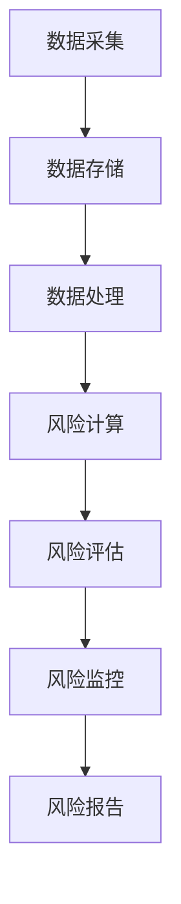

                 

<think>
好的，我需要帮助用户撰写一篇关于“对冲基金策略：专业投资者的风险管理方法”的技术博客文章。用户已经提供了详细的目录大纲，并且希望我按照这个结构来完成文章。现在我需要一步步地思考如何撰写这篇文章。

首先，我应该从引言部分开始，介绍对冲基金和风险管理的基本概念。接下来，我会详细阐述对冲基金的风险类型，比如市场风险、信用风险等。然后，我会讨论风险管理的核心工具，如VaR和CVaR，并提供相关的数学公式和图表。之后，我需要讲解对冲基金的风险管理模型，比如风险中性定价模型和资产定价模型（APT），并附上详细的数学模型和示意图。

在风险管理流程部分，我会分解为风险识别、评估、控制和监控四个步骤，每个步骤都需要具体的策略和工具支持。为了增强文章的实用性，我计划加入一个项目实战部分，介绍如何使用Python进行风险管理系统的实现，包括环境配置、代码示例和案例分析。

最后，我会总结全文，强调风险管理在对冲基金中的重要性，并提出最佳实践和注意事项。整个过程中，我需要确保内容逻辑清晰，结构紧凑，并使用吸引读者的章节标题和专业术语。

在撰写过程中，我会使用数学公式、表格和图表来增强可读性。例如，我会用mermaid绘制风险管理模型的架构图和系统交互序列图，帮助读者更好地理解复杂的概念。同时，我也会确保每个部分都有足够的细节和深度，满足专业投资者的需求。

现在，我可以开始按照目录大纲逐步撰写文章，确保每部分内容详实，结构合理，符合用户的要求。
</think>

# 对冲基金策略：专业投资者的风险管理方法

---

## 关键词：对冲基金、风险管理、VaR、CVaR、资产定价模型（APT）

---

## 摘要：  
本文深入探讨了对冲基金的风险管理方法，从基础概念到高级模型，系统性地分析了专业投资者如何通过有效的风险管理策略实现稳健的投资回报。文章首先介绍了对冲基金的基本概念和风险管理的重要性，随后详细讲解了常见的风险类型、核心工具（如VaR和CVaR）以及风险管理模型（如APT和风险中性定价模型）。接着，文章分析了对冲基金的风险管理流程，包括风险识别、评估、控制和监控。最后，结合实际案例，探讨了对冲基金风险管理系统的架构设计与实现，并提出了最佳实践建议。

---

## 第1章: 对冲基金与风险管理概述

### 1.1 对冲基金的基本概念

对冲基金是一种通过做空和做多多种金融工具，以实现绝对收益的投资策略。其核心目标是通过市场中性策略降低市场风险，同时捕捉套利机会。与传统投资不同，对冲基金更注重绝对收益而非相对收益。

#### 1.1.1 对冲基金的定义与特点  
对冲基金通过做多和做空相结合，利用市场波动性获利。其特点包括：  
1. **多策略**：同时使用多种投资策略，如套利、统计套利、CTA策略等。  
2. **市场中性**：通过做多和做空平衡市场风险，降低对市场波动的依赖。  
3. **杠杆使用**：合理使用杠杆以放大收益，但也需控制杠杆风险。  
4. **流动性要求**：对冲基金通常要求较高的流动性，以便快速调整头寸。

#### 1.1.2 对冲基金的核心目标  
对冲基金的目标是实现绝对收益，即无论市场如何波动，都能获得稳定的正收益。其核心策略包括：  
1. **套利策略**：利用市场定价错误的机会获利。  
2. **统计套利**：通过数据分析和模型预测寻找短期价格波动机会。  
3. **CTA策略**：基于技术指标和趋势预测进行交易。

#### 1.1.3 对冲基金与传统投资的区别  
- **目标**：对冲基金追求绝对收益，而传统投资追求相对收益。  
- **风险控制**：对冲基金通过多空策略降低市场风险，传统投资则依赖于市场上涨。  
- **杠杆使用**：对冲基金通常使用杠杆，而传统投资较少使用。  

---

### 1.2 风险管理的重要性

在对冲基金中，风险管理是确保策略稳定性和收益的关键。有效的风险管理可以降低损失，同时抓住更多投资机会。

#### 1.2.1 风险管理在对冲基金中的地位  
- 风险管理是实现长期稳健收益的基础。  
- 风险管理贯穿整个投资过程，从策略设计到交易执行都需要考虑风险控制。  

#### 1.2.2 风险管理的基本原则  
1. **分散投资**：通过多样化投资降低特定资产的风险。  
2. **风险与收益匹配**：确保收益与承担的风险相匹配。  
3. **动态调整**：根据市场变化动态调整风险敞口。  

#### 1.2.3 风险管理与投资收益的关系  
- 风险管理是投资收益的保障。  
- 通过有效的风险管理，可以在市场波动中稳定收益，避免重大损失。  

---

### 1.3 对冲基金的风险类型

对冲基金面临多种风险，需全面识别和管理。

#### 1.3.1 市场风险  
- 市场风险是由于市场波动导致资产价格下跌而产生的风险。  
- 对冲基金通过市场中性策略降低市场风险，但无法完全消除。  

#### 1.3.2 信用风险  
- 信用风险是指交易对手或债券发行人违约的风险。  
- 在对冲基金中，信用风险主要集中在信用套利策略中。  

#### 1.3.3 流动性风险  
- 流动性风险是指无法快速以合理价格买卖资产的风险。  
- 对冲基金通常要求较高的流动性，以应对可能的资金赎回。  

#### 1.3.4 操作风险  
- 操作风险是指由于系统故障、人为错误或流程问题导致的损失风险。  
- 对冲基金需要建立严格的操作风险管理流程。  

#### 1.3.5 法律风险  
- 法律风险是指由于法律变更或合规问题导致的损失风险。  
- 对冲基金需要遵守相关法律法规，确保投资策略的合法性。  

---

## 第2章: 对冲基金风险管理的核心工具

### 2.1 风险价值（VaR）

#### 2.1.1 VaR的定义与计算方法  
- VaR是衡量投资组合在一定置信水平下的潜在损失。  
- 计算方法包括历史模拟法、方差-协方差法和蒙特卡洛模拟法。  

#### 2.1.2 VaR的应用场景  
- 用于风险度量和资本分配。  
- 用于评估投资组合的潜在损失。  

#### 2.1.3 VaR的局限性  
- VaR无法完全捕捉“肥尾”事件的概率。  
- VaR无法提供风险敞口的具体方向。  

### 2.2 穿透风险（CVaR）

#### 2.2.1 CVaR的定义与计算方法  
- CVaR是VaR的扩展，衡量在VaR超过一定水平后的平均损失。  
- CVaR的计算需要基于VaR的结果进行。  

#### 2.2.2 CVaR与VaR的区别  
- VaR是损失的分位数，而CVaR是损失的期望值。  
- CVaR更注重极端损失的情况，而VaR更注重潜在损失的分位数。  

#### 2.2.3 CVaR的应用优势  
- 更全面地捕捉极端风险事件。  
- 更适合用于风险管理和资本分配。  

### 2.3 风险调整后收益（RAROC）

#### 2.3.1 RAROC的定义与计算公式  
- RAROC是风险调整后的资本回报率。  
- 计算公式为：  
  $$ \text{RAROC} = \frac{\text{净利润}}{\text{风险资本}} $$  

#### 2.3.2 RAROC在对冲基金中的应用  
- 用于评估投资组合的风险调整后收益。  
- 用于比较不同策略的风险收益表现。  

#### 2.3.3 RAROC的优缺点  
- 优点：全面考虑风险和收益的关系。  
- 缺点：需要准确估计风险资本。  

---

## 第3章: 对冲基金的风险管理模型

### 3.1 风险中性定价模型

#### 3.1.1 风险中性定价的原理  
- 风险中性定价假设投资者是风险中性的，即只关心收益的期望值。  
- 用于衍生品定价和风险中性套利。  

#### 3.1.2 风险中性定价的应用  
- 用于对冲基金的套利策略。  
- 用于衍生品定价和风险对冲。  

#### 3.1.3 风险中性定价的优缺点  
- 优点：简化了风险偏好问题，便于套利。  
- 缺点：忽略了实际市场中的风险溢价。  

### 3.2 资产定价模型（APT）

#### 3.2.1 APT的定义与特点  
- APT是基于多个因素解释资产收益的模型。  
- 与CAPM不同，APT允许多个风险因素。  

#### 3.2.2 APT的数学模型  
- APT的基本形式为：  
  $$ r_i = \alpha_i + \beta_{i1}f_1 + \beta_{i2}f_2 + \dots + \beta_{in}f_n + \epsilon_i $$  
  其中，\( r_i \) 是资产 \( i \) 的收益，\( \alpha_i \) 是截距项，\( \beta_{ij} \) 是资产 \( i \) 对因子 \( j \) 的敏感性，\( f_j \) 是因子的收益，\( \epsilon_i \) 是特异风险。  

#### 3.2.3 APT在对冲基金中的应用  
- 用于解释资产收益的多因素模型。  
- 用于构建多因子套利策略。  

### 3.3 市场风险模型

#### 3.3.1 市场风险模型的分类  
- 线性模型：如CAPM和APT。  
- 非线性模型：如波动率模型（GARCH）。  

#### 3.3.2 市场风险模型的构建  
- 使用历史数据和统计方法构建风险模型。  
- 结合市场数据和专家判断进行模型优化。  

#### 3.3.3 市场风险模型的优化  
- 使用机器学习方法改进模型预测能力。  
- 结合实时市场数据动态调整模型参数。  

---

## 第4章: 对冲基金的风险管理流程

### 4.1 风险识别

#### 4.1.1 风险识别的方法  
- 定性分析：通过专家判断识别风险。  
- 定量分析：通过数据分析识别风险。  

#### 4.1.2 风险识别的工具  
- 风险评估问卷：用于识别潜在风险。  
- 数据分析工具：用于发现数据中的异常情况。  

#### 4.1.3 风险识别的步骤  
1. **收集信息**：收集市场、交易和财务数据。  
2. **分析数据**：识别数据中的潜在风险。  
3. **确认风险**：确认风险的存在并评估其影响。  

### 4.2 风险评估

#### 4.2.1 风险评估的指标  
- VaR：衡量潜在损失。  
- CVaR：衡量极端损失。  

#### 4.2.2 风险评估的模型  
- 风险中性模型：用于套利策略的风险评估。  
- APT模型：用于多因子风险评估。  

#### 4.2.3 风险评估的流程  
1. **选择模型**：根据具体情况选择合适的评估模型。  
2. **输入数据**：将市场数据输入模型进行计算。  
3. **分析结果**：解读模型输出结果并评估风险。  

### 4.3 风险控制

#### 4.3.1 风险控制的策略  
- 多空对冲：通过做多和做空平衡风险。  
- 杠杆控制：合理使用杠杆以避免过度风险敞口。  

#### 4.3.2 风险控制的工具  
- 期权对冲：通过期权对冲市场风险。  
- 期货套利：通过期货套利降低风险。  

#### 4.3.3 风险控制的实施  
1. **设定头寸限制**：限制每种资产的头寸。  
2. **动态调整**：根据市场变化动态调整头寸。  
3. **监控风险敞口**：定期监控风险敞口的变化。  

### 4.4 风险监控

#### 4.4.1 风险监控的指标  
- 实时VaR：监控当前投资组合的风险。  
- 最大回撤：衡量投资组合的最大损失。  

#### 4.4.2 风险监控的系统  
- 风险监控平台：实时监控投资组合的风险。  
- 报告系统：定期生成风险报告。  

#### 4.4.3 风险监控的报告  
1. **实时监控报告**：每天生成风险监控报告。  
2. **定期评估报告**：每周评估风险控制效果。  
3. **异常事件报告**：报告潜在的异常风险事件。  

---

## 第5章: 对冲基金风险管理系统的架构设计与实现

### 5.1 系统背景与目标

#### 5.1.1 项目背景  
对冲基金需要一个高效的系统来实时监控和管理风险。  

#### 5.1.2 项目目标  
- 实时监控投资组合的风险。  
- 自动化风险评估和控制。  
- 提供风险报告和决策支持。  

---

### 5.2 系统功能设计

#### 5.2.1 风险数据采集  
- 数据源：市场数据、交易数据、财务数据。  
- 数据存储：实时存储和历史存储。  

#### 5.2.2 风险评估与计算  
- 使用VaR和CVaR模型计算风险。  
- 使用机器学习模型预测风险。  

#### 5.2.3 风险控制与对冲  
- 自动化头寸调整。  
- 自动化对冲交易。  

#### 5.2.4 风险报告与决策支持  
- 实时风险报告。  
- 历史风险分析。  

---

### 5.3 系统架构设计

#### 5.3.1 系统架构概述  
- **数据层**：负责数据的采集、存储和处理。  
- **计算层**：负责风险的计算和评估。  
- **应用层**：负责风险监控和决策支持。  

#### 5.3.2 系统架构图  


---

### 5.4 系统实现

#### 5.4.1 环境配置  
- 操作系统：Linux/Windows。  
- 开发工具：Python、Java、C++。  
- 数据库：MySQL、PostgreSQL。  

#### 5.4.2 核心代码实现  
```python
import numpy as np
import pandas as pd

def calculate VaR(returns, confidence_level):
    # 使用历史模拟法计算VaR
    sorted_returns = np.sort(returns)
    index = int(len(sorted_returns) * (1 - confidence_level))
    VaR = -sorted_returns[index]
    return VaR

# 示例数据
returns = np.random.normal(0, 1, 1000)
confidence_level = 0.95

VaR = calculate VaR(returns, confidence_level)
print(f"VaR at {confidence_level * 100}% confidence level: {VaR}")
```

---

### 5.5 项目实战

#### 5.5.1 实际案例分析  
- 案例1：2008年金融危机对对冲基金的影响。  
- 案例2：COVID-19疫情期间的风险管理。  

#### 5.5.2 代码应用解读  
- 使用Python代码实现VaR和CVaR的计算。  
- 使用机器学习模型预测市场风险。  

---

## 第6章: 总结与最佳实践

### 6.1 总结

通过对冲基金的风险管理方法，投资者可以在复杂多变的市场中实现稳健的投资回报。有效的风险管理需要结合理论、模型和实际操作，确保投资策略的稳定性和可持续性。

---

### 6.2 最佳实践

1. **建立全面的风险管理体系**：从识别、评估到监控，确保每一步都做到位。  
2. **合理使用杠杆**：避免过度杠杆导致的风险。  
3. **动态调整策略**：根据市场变化及时调整投资策略。  
4. **加强系统建设**：利用技术手段提高风险管理的效率和准确性。  

---

### 6.3 小结

对冲基金的风险管理是实现长期稳健收益的关键。通过科学的风险管理方法和先进的技术手段，投资者可以更好地应对市场波动，抓住投资机会，实现财富的稳健增长。

---

## 作者：AI天才研究院 & 禅与计算机程序设计艺术

---

希望这篇文章能为对冲基金投资者和风险管理从业者提供有价值的参考和启发。

