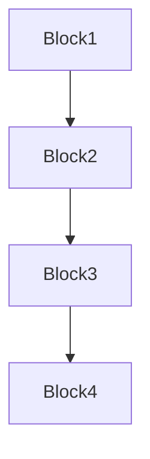
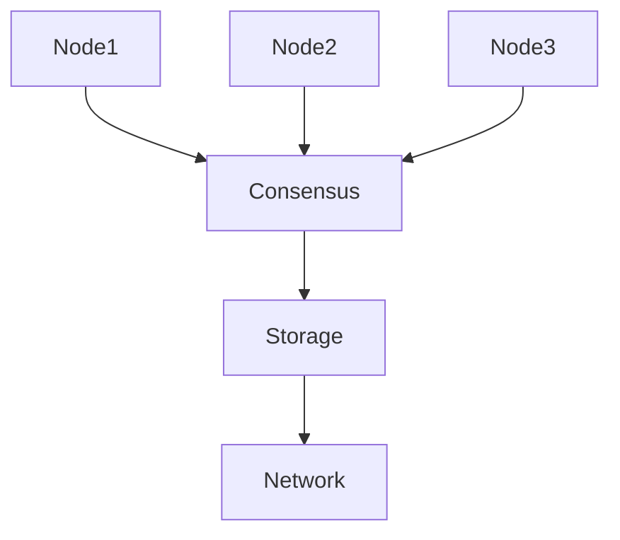
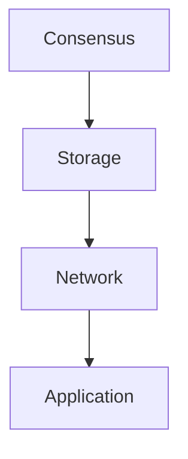
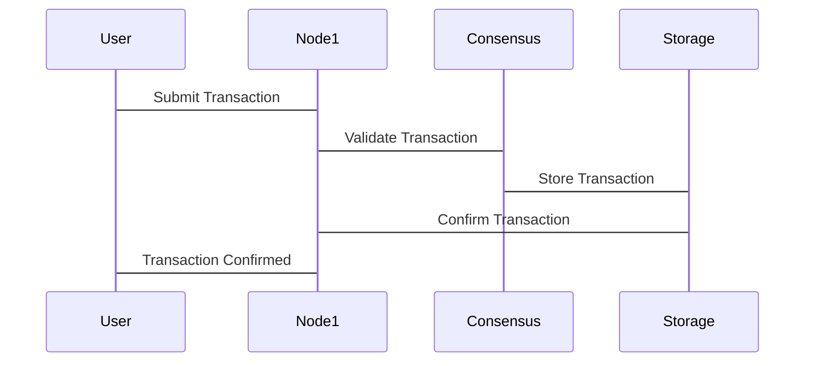

                 


# 巴菲特-芒格的区块链技术看法：潜在的颠覆性影响

## 关键词：
- 巴菲特
- 芒格
- 区块链技术
- 投资哲学
- 颠覆性影响

## 摘要：
本文探讨了巴菲特和芒格对区块链技术的看法，分析了区块链技术的颠覆性影响，结合投资哲学，深入分析了区块链技术在金融、支付、供应链等领域的应用，以及对传统金融体系的挑战。文章从技术原理、行业影响、投资策略等多个角度，系统性地分析了区块链技术的潜力与风险，为投资者提供了全面的视角和深度的思考。

---

# 第一部分：区块链技术概述

## 第1章：区块链的基本概念

### 1.1 区块链的定义与核心原理

区块链是一种分布式账本技术，通过去中心化的方式记录交易信息，并通过密码学保证数据的安全性和不可篡改性。其核心原理包括：

- **去中心化**：区块链不依赖于单一的中心机构，而是通过分布式节点共同维护数据一致性。
- **共识机制**：通过特定算法（如工作量证明、权益证明等）实现节点间的共识，确保数据的有效性。
- **加密技术**：利用哈希函数和数字签名等技术，保障数据的完整性和交易的安全性。

### 1.2 区块链的主要特点

- **去中心化**：避免了单点故障，提高了系统的抗攻击能力。
- **不可篡改性**：数据一旦写入区块链，难以被修改或删除。
- **透明性**：区块链上的交易对所有参与者公开，增强了信任。
- **可追溯性**：每笔交易都可以被追踪，便于审计和监管。

### 1.3 区块链的技术架构与实现

区块链的典型架构包括以下几个部分：

- **数据结构**：区块由交易记录、哈希指针和时间戳组成，通过链式结构连接形成区块链。
- **网络协议**：P2P网络协议用于节点之间的通信和数据同步。
- **共识机制**：确保所有节点达成一致的算法，如PoW、PoS等。

---

## 第2章：巴菲特与芒格的投资哲学

### 2.1 巴菲特的价值投资理念

巴菲特的价值投资理念强调长期持有优质资产，关注企业的内在价值，而非短期市场波动。他认为，投资的核心在于找到那些具有持续竞争优势和良好治理的企业。

#### 巴菲特对技术颠覆性的看法

巴菲特对新兴技术持谨慎态度，他认为技术的颠覆性潜力需要经过长期验证。他更关注企业的商业模式和财务状况，而非技术创新本身。

### 2.2 芒格的多元思维模型

芒格提出“多元思维模型”，强调从多个学科的角度分析问题，寻找系统性解决方案。他认为，技术的颠覆性影响需要从整体系统中分析，而非孤立看待。

#### 芒格对区块链技术的系统性分析

芒格认为，区块链技术可能对金融体系产生深远影响，尤其是在支付和结算领域。他关注区块链如何通过降低信任成本和提高效率，重构行业生态。

---

## 第3章：区块链技术的颠覆性影响

### 3.1 区块链对金融行业的颠覆

#### 3.1.1 区块链在支付领域的应用

区块链技术可以实现跨境支付的实时清算，降低交易成本和时间。例如，比特币和以太坊等区块链项目已经在支付领域展现了巨大潜力。

#### 3.1.2 区块链对传统银行体系的挑战

区块链技术可能颠覆传统银行体系的清算和结算功能。通过去中心化的方式，区块链可以减少对中间机构的依赖，提高效率。

#### 3.1.3 区块链在金融监管中的作用

区块链的透明性和可追溯性为金融监管提供了新的工具。监管机构可以通过区块链技术实时监控交易，提高监管效率。

### 3.2 区块链对其他行业的潜在影响

#### 3.2.1 区块链在供应链管理中的应用

区块链可以实现供应链的透明化管理，确保每个环节的信息真实可靠。例如， IBM 的区块链解决方案已经在供应链领域得到了广泛应用。

#### 3.2.2 区块链在知识产权保护中的作用

区块链技术可以为知识产权提供不可篡改的记录，保护创作者的权益。例如，通过智能合约自动执行版权许可和支付。

#### 3.2.3 区块链在医疗健康领域的应用

区块链可以用于医疗数据的共享和隐私保护。患者的数据可以在区块链上存储，确保数据的安全性和隐私性。

---

## 第4章：巴菲特与芒格对区块链技术的看法

### 4.1 巴菲特对区块链技术的评价

#### 巴菲特对区块链技术的谨慎态度

巴菲特对区块链技术持谨慎态度，他认为区块链的潜力尚未得到充分验证。他更关注企业的基本面，而非技术本身。

#### 巴菲特对区块链技术的潜在价值

尽管谨慎，巴菲特也承认区块链技术可能对某些行业产生深远影响，尤其是在支付和结算领域。

#### 巴菲特对区块链技术的未来展望

巴菲特认为，区块链技术的普及需要时间，只有那些能够真正降低成本、提高效率的应用才能成功。

### 4.2 芒格对区块链技术的系统性分析

#### 芒格对区块链技术的多维度思考

芒格从系统性角度分析区块链技术，认为其潜力在于通过降低信任成本重构行业生态。

#### 芒格对区块链技术的长期价值

芒格认为，区块链技术可能成为未来金融体系的核心基础设施，尤其是在去中心化金融（DeFi）领域。

#### 芒格对区块链技术的风险与机遇

芒格强调，区块链技术的潜力巨大，但也面临技术瓶颈和监管风险。投资者需要从系统性角度评估其风险与机遇。

---

## 第5章：区块链技术的数学模型与算法原理

### 5.1 区块链的共识机制

#### 5.1.1 工作量证明机制（PoW）

工作量证明机制通过计算哈希值来确保区块的有效性。矿工需要通过计算找到特定的哈希值，以获得记账权。

##### 算法流程：

1. 矿工收到新区块请求。
2. 矿工开始计算哈希值，寻找满足条件的随机数。
3. 找到有效哈希值后，矿工广播区块。
4. 其他节点验证哈希值的有效性，确认区块。
5. 区块被添加到区块链中。

#### 5.1.2 权益证明机制（PoS）

权益证明机制通过持有代币的数量来决定记账权。与PoW相比，PoS更加节能。

##### 算法流程：

1. 矿工持有一定数量的代币。
2. 根据持有代币的数量，分配记账权。
3. 矿工根据分配的权重参与区块验证。
4. 区块验证通过后，代币持有者获得奖励。

#### 5.1.3 其他共识机制的对比与分析

- **PoS vs. PoW**：PoS更节能，但存在“富者愈富”的问题。
- **Delegated Proof of Stake (DPoS)**：通过选举代表进行区块验证，效率更高。

### 5.2 区块链的加密算法

#### 5.2.1 椭圆曲线加密（ECC）

椭圆曲线加密是一种公钥加密技术，常用于数字签名。其安全性基于椭圆曲线上的点操作。

##### 公钥生成过程：

1. 随机选择一个椭圆曲线上的点作为私钥。
2. 通过椭圆曲线点乘法，生成公钥。

#### 5.2.2 哈希函数（Hash）

哈希函数将任意长度的输入映射为固定长度的输出，常用于数据完整性验证。

##### 示例代码：

```python
import hashlib

def compute_hash(input_string):
    return hashlib.sha256(input_string.encode()).hexdigest()

print(compute_hash("Hello, Blockchain!"))
```

#### 5.2.3 数字签名机制

数字签名通过公钥加密技术，验证数据的完整性和真实性。

##### 数字签名流程：

1. 数据哈希化。
2. 用私钥对哈希值进行签名。
3. 公钥验证签名的有效性。

---

## 第6章：区块链技术的系统架构与设计

### 6.1 区块链系统的组成

#### 6.1.1 节点与网络架构

区块链系统由多个节点组成，节点之间通过P2P网络通信。

##### 节点类型：

- **全节点**：存储完整区块链副本，参与共识。
- **轻节点**：仅存储部分数据，依赖全节点验证。

#### 6.1.2 数据存储结构

区块链数据通过区块链式连接，每个区块包含交易记录和哈希指针。

##### 区块结构示意图：



#### 6.1.3 系统接口设计

区块链系统需要设计API接口，供外部应用调用。

##### 示例API接口：

- `get_block(block_hash)`：获取指定区块信息。
- `send_transaction(transaction)`：提交交易到区块链。

### 6.2 区块链系统的架构图

#### 6.2.1 分布式架构设计

区块链系统的分布式架构确保了数据的安全性和可用性。

##### 分布式架构示意图：



#### 6.2.2 系统模块划分

区块链系统通常分为共识模块、存储模块和网络模块。

##### 系统模块划分示意图：



#### 6.2.3 系统交互流程

区块链系统的交互流程包括交易提交、共识验证和区块确认。

##### 交互流程示意图：



---

## 第7章：区块链技术的项目实战

### 7.1 项目环境安装

#### 7.1.1 开发环境搭建

安装必要的开发工具，如Python、Node.js、Golang等。

##### 示例安装命令：

```bash
python --version
node --version
go version
```

#### 7.1.2 区块链框架选择

选择适合的区块链框架，如Ethereum、Hyperledger、Solana等。

#### 7.1.3 工具链安装与配置

安装必要的区块链开发工具，如Geth、Truffle、Web3.js等。

##### 示例安装命令：

```bash
npm install -g truffle
pip install web3
```

### 7.2 核心代码实现

#### 7.2.1 区块链核心算法实现

实现区块链的核心算法，如共识机制和加密算法。

##### 示例代码：

```python
import hashlib

def compute_hash(input_string):
    return hashlib.sha256(input_string.encode()).hexdigest()

def verify_signature(public_key, signature, message):
    # 验证数字签名
    pass
```

#### 7.2.2 智能合约开发

编写智能合约，实现特定的业务逻辑。

##### 示例代码：

```solidity
contract MyContract {
    function multiply(uint256 a) external returns (uint256) {
        return a * 2;
    }
}
```

#### 7.2.3 系统测试与调试

编写测试用例，验证区块链系统的功能和性能。

##### 示例测试代码：

```python
def test_blockchain():
    blockchain = Blockchain()
    transaction = {"from": "A", "to": "B", "amount": 100}
    blockchain.add_transaction(transaction)
    blockchain.mine_block()
    assert blockchain.get_balance("A") == 0
    assert blockchain.get_balance("B") == 100

test_blockchain()
```

---

## 第8章：总结与展望

### 8.1 总结

区块链技术作为一种颠覆性技术，正在改变多个行业的运作方式。尽管面临技术瓶颈和监管挑战，但其潜力不可忽视。

### 8.2 未来展望

随着技术的进步和应用的拓展，区块链将在更多领域展现其价值。投资者需要从系统性角度评估其风险与机遇。

---

## 作者：AI天才研究院/AI Genius Institute & 禅与计算机程序设计艺术 /Zen And The Art of Computer Programming

