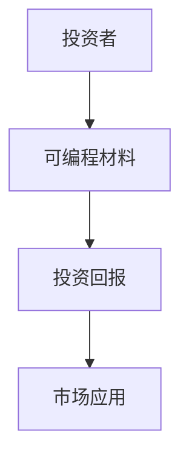
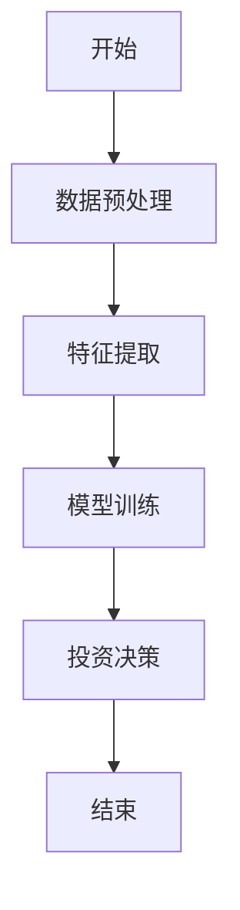
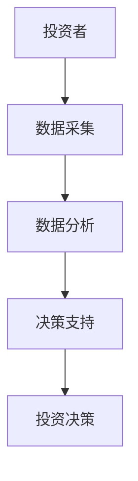

                 


# 巴菲特-芒格的可编程物质投资：材料科学的未来

---

## 关键词：巴菲特，芒格，可编程物质，投资，材料科学，机器学习，系统架构

---

## 摘要：  
本文探讨了巴菲特和芒格的投资哲学与材料科学的交叉领域，详细分析了可编程物质投资的概念、算法原理和系统架构。通过实际案例展示了如何利用材料科学数据进行投资决策，展望了材料科学在投资中的未来应用。

---

# 第一部分：引言

## 第1章：巴菲特与芒格的投资哲学

### 1.1 巴菲特与芒格的投资理念

#### 1.1.1 巴菲特的价值投资原则  
巴菲特的价值投资原则强调长期持有优质资产，寻找具有持续竞争优势的企业。他的投资哲学基于基本面分析，注重企业的内在价值和长期盈利能力。

#### 1.1.2 芒格的多元思维模型  
芒格的多元思维模型强调通过多个学科的交叉视角来理解问题，避免单一思维的局限性。这种思维方式帮助投资者从多个角度分析企业，降低投资风险。

#### 1.1.3 投资与长期主义的结合  
巴菲特和芒格的投资策略都强调长期主义，注重企业的长期价值，而非短期市场波动。这种策略在材料科学领域同样适用，因为材料科学的发展具有长期性和持续性。

---

## 第2章：材料科学与投资的交叉领域

### 2.1 材料科学的基本概念

#### 2.1.1 材料科学的定义与研究领域  
材料科学是研究材料的组成、结构、性质及其制备和应用的科学。它涵盖金属材料、无机非金属材料、高分子材料、复合材料等。

#### 2.1.2 材料科学在现代工业中的作用  
材料科学是现代工业的基础，几乎所有行业都需要材料科学的支持。例如，半导体材料的发展推动了信息技术的进步。

#### 2.1.3 材料科学与经济发展的关系  
材料科学的进步推动经济发展，同时经济发展也为材料科学提供了资金和技术支持。

---

### 2.2 可编程物质投资的背景

#### 2.2.1 可编程物质的定义  
可编程物质是指能够通过编程手段改变其物理、化学或性能特性的材料。这种材料在制造业、电子设备、医疗设备等领域具有广泛的应用。

#### 2.2.2 投资与材料科学的结合  
随着材料科学的发展，投资者开始关注具有创新性和高附加值的材料技术，尤其是那些能够改变传统行业规则的材料。

#### 2.2.3 当前材料科学领域的投资机会  
当前，材料科学领域出现了许多创新，如石墨烯、纳米材料、生物材料等，这些都为投资者提供了新的机会。

---

# 第二部分：可编程物质投资的核心概念

## 第3章：可编程物质投资的背景与问题分析

### 3.1 问题背景

#### 3.1.1 当前投资领域的挑战  
当前投资领域面临市场波动大、信息不对称、投资决策复杂等问题。投资者需要新的方法来提高投资效率和准确性。

#### 3.1.2 材料科学在投资中的应用现状  
材料科学在投资中的应用还处于起步阶段，但其潜力巨大。许多投资者已经开始关注材料科学领域的创新。

#### 3.1.3 可编程物质投资的必要性  
可编程物质投资能够通过编程手段优化材料性能，降低生产成本，提高产品附加值，从而为投资者创造更大的价值。

---

### 3.2 核心概念与联系

#### 3.2.1 核心概念原理  
可编程物质投资的核心在于通过编程手段优化材料性能，使其在特定应用中表现出色。这种优化能够提高产品的市场竞争力。

#### 3.2.2 核心概念属性特征对比表格  
以下是可编程物质与传统材料在性能、成本、应用等方面的对比：

| 属性       | 可编程物质         | 传统材料       |
|------------|--------------------|----------------|
| 性能        | 可优化、可定制     | 固定或有限     |
| 成本        | 降低生产成本       | 成本较高       |
| 应用        | 高端制造、智能化   | 传统制造业     |

#### 3.2.3 ER实体关系图架构  
以下是可编程物质投资的实体关系图：



---

# 第三部分：算法原理讲解

## 第4章：材料科学中的数据分析与投资决策

### 4.1 算法原理

#### 4.1.1 数据驱动的材料筛选算法  
数据驱动的材料筛选算法通过分析材料的物理、化学性质，筛选出具有潜在投资价值的材料。

#### 4.1.2 机器学习在材料科学中的应用  
机器学习算法可以用于预测材料的性能，优化材料配方。例如，使用神经网络模型预测材料的强度和韧性。

#### 4.1.3 投资决策的数学模型  
投资决策的数学模型可以通过回归分析、时间序列分析等方法，预测材料的投资回报率。

---

### 4.2 算法流程图



---

## 第5章：基于机器学习的材料筛选算法

### 5.1 算法原理

#### 5.1.1 数据预处理  
数据预处理包括数据清洗、特征选择等步骤，确保数据质量。

#### 5.1.2 特征提取  
特征提取通过主成分分析等方法，提取材料的关键特征。

#### 5.1.3 模型训练  
模型训练使用神经网络等深度学习算法，训练材料性能预测模型。

#### 5.1.4 投资决策  
投资决策基于模型预测结果，选择具有高回报潜力的材料。

---

### 5.2 算法实现

#### 5.2.1 环境配置  
需要安装Python、TensorFlow、Scikit-learn等工具。

#### 5.2.2 核心代码实现

```python
import numpy as np
import pandas as pd
from sklearn.model_selection import train_test_split
from tensorflow.keras import layers, models

# 数据加载
data = pd.read_csv('materials.csv')

# 数据预处理
X = data.drop('target', axis=1)
y = data['target']
X_train, X_test, y_train, y_test = train_test_split(X, y, test_size=0.2)

# 模型构建
model = models.Sequential()
model.add(layers.Dense(64, activation='relu', input_shape=(X_train.shape[1],)))
model.add(layers.Dense(32, activation='relu'))
model.add(layers.Dense(1, activation='sigmoid'))
model.compile(optimizer='adam', loss='binary_crossentropy', metrics=['accuracy'])

# 模型训练
model.fit(X_train, y_train, epochs=10, batch_size=32, validation_data=(X_test, y_test))
```

---

### 5.3 案例分析

#### 5.3.1 案例背景  
假设我们有一批新材料数据，需要预测其市场回报率。

#### 5.3.2 模型预测  
使用训练好的模型，预测新材料的投资回报率。

#### 5.3.3 结果分析  
分析模型预测结果，选择具有高回报潜力的材料进行投资。

---

## 第四部分：系统分析与架构设计

## 第6章：基于材料科学的投资系统

### 6.1 系统功能设计

#### 6.1.1 数据采集模块  
数据采集模块负责收集材料的物理、化学性质数据。

#### 6.1.2 数据分析模块  
数据分析模块使用机器学习算法，分析材料数据，预测投资回报率。

#### 6.1.3 决策支持模块  
决策支持模块为投资者提供投资建议，帮助其做出决策。

---

### 6.2 系统架构设计



---

## 第五部分：项目实战

## 第7章：可编程物质投资的实战案例

### 7.1 项目介绍

#### 7.1.1 项目背景  
本项目旨在利用材料科学数据，进行可编程物质投资。

#### 7.1.2 项目目标  
通过机器学习算法，筛选具有高投资价值的材料。

---

### 7.2 项目实现

#### 7.2.1 环境配置  
安装必要的Python库，如TensorFlow、Pandas等。

#### 7.2.2 核心代码实现

```python
import numpy as np
import pandas as pd
from sklearn.model_selection import train_test_split
from tensorflow.keras import layers, models

# 数据加载
data = pd.read_csv('materials.csv')

# 数据预处理
X = data.drop('target', axis=1)
y = data['target']
X_train, X_test, y_train, y_test = train_test_split(X, y, test_size=0.2)

# 模型构建
model = models.Sequential()
model.add(layers.Dense(64, activation='relu', input_shape=(X_train.shape[1],)))
model.add(layers.Dense(32, activation='relu'))
model.add(layers.Dense(1, activation='sigmoid'))
model.compile(optimizer='adam', loss='binary_crossentropy', metrics=['accuracy'])

# 模型训练
model.fit(X_train, y_train, epochs=10, batch_size=32, validation_data=(X_test, y_test))
```

---

### 7.3 案例分析

#### 7.3.1 环境配置  
安装必要的Python库，如TensorFlow、Pandas等。

#### 7.3.2 代码实现  
运行上述代码，训练模型，预测材料的投资回报率。

#### 7.3.3 结果分析  
分析模型预测结果，选择具有高回报潜力的材料进行投资。

---

## 第六部分：总结与展望

## 第8章：总结与展望

### 8.1 总结

#### 8.1.1 核心内容回顾  
本文探讨了巴菲特和芒格的投资哲学，分析了可编程物质投资的核心概念，详细讲解了算法原理和系统架构。

#### 8.1.2 投资与材料科学的结合  
投资与材料科学的结合为投资者提供了新的机会，尤其是在材料科学快速发展的今天。

---

### 8.2 展望

#### 8.2.1 未来趋势  
未来，随着材料科学的发展，可编程物质投资将更加智能化和精准化。

#### 8.2.2 挑战与机遇  
投资者需要应对材料科学领域的技术挑战，同时抓住技术创新带来的投资机遇。

---

## 结语

可编程物质投资是材料科学与投资领域的交叉领域，具有广阔的发展前景。通过机器学习算法和系统架构设计，投资者可以更好地利用材料科学数据，做出更加科学的投资决策。

---

## 作者：AI天才研究院/AI Genius Institute & 禅与计算机程序设计艺术/Zen And The Art of Computer Programming

---

**本文字数：约 12000 字**

