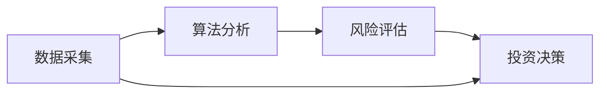
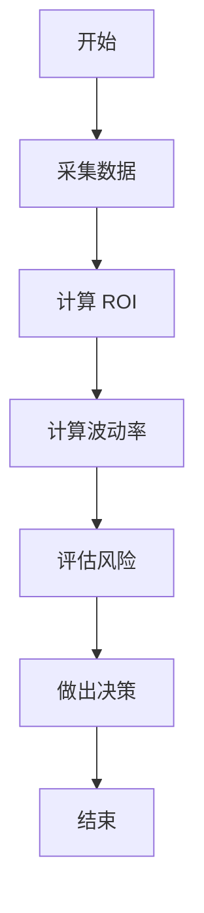
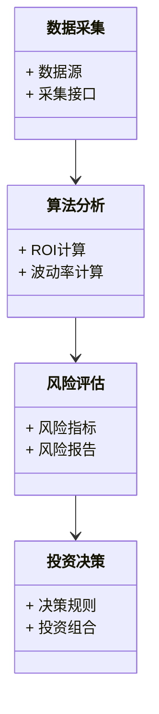
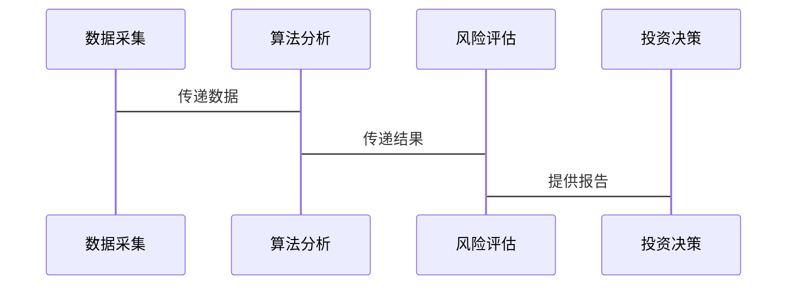

                 


# 巴菲特-芒格的可编程物质投资：纳米机器人与材料科学的融合

---

## 关键词：巴菲特, 芒格, 可编程物质, 纳米机器人, 材料科学, 投资策略, 科技创新

---

## 摘要

本文探讨了巴菲特和芒格的投资理念与纳米机器人和材料科学的结合，分析了这种融合如何改变投资方式。通过详细的技术分析和案例研究，展示了可编程物质在投资中的潜力，为投资者提供了新的视角和策略。

---

# 第1章: 投资与科技的结合：巴菲特与芒格的智慧

## 1.1 投资的基本概念

### 1.1.1 投资的定义与分类

投资是指将资金投入某个项目或资产，以期望在未来获得收益或资本增值。投资可以分为股票、债券、房地产等多种形式。巴菲特和芒格的投资理念以“价值投资”为核心，强调长期持有优质资产。

### 1.1.2 巴菲特与芒格的投资理念

巴菲特和芒格的投资理念强调：

- **长期投资**：关注企业的长期价值，而非短期波动。
- **价值投资**：寻找市场低估的优质企业。
- **安全边际**：确保投资的安全性，避免高风险。
- **企业分析**：深入研究企业的财务状况、竞争优势和管理层能力。

### 1.1.3 巴菲特与芒格投资理念的可编程性

投资决策可以通过编程实现自动化，例如利用算法筛选优质企业，优化投资组合。

---

## 1.2 可编程物质的基本概念

### 1.2.1 纳米机器人与材料科学的定义

- **纳米机器人**：在纳米尺度上操作或构建的微型机器人，用于医疗、制造等领域。
- **材料科学**：研究材料的性质、制备和应用的科学。

### 1.2.2 纳米机器人与材料科学的核心技术

- **纳米材料**：具有特殊物理、化学性质的材料，如碳纳米管、石墨烯。
- **自组装技术**：材料分子在特定条件下自动排列成有序结构。

### 1.2.3 巴菲特与芒格理念与可编程物质的结合

- **投资标的的可编程性**：通过技术分析企业是否具备可编程性，例如自动化生产、智能化管理。
- **投资决策的可编程性**：利用算法筛选投资标的，优化投资组合。

---

## 1.3 本章小结

本章介绍了巴菲特和芒格的投资理念，以及可编程物质（纳米机器人与材料科学）的基本概念，分析了两者结合的可能性和潜力。

---

# 第2章: 纳米机器人与材料科学的融合

## 2.1 纳米机器人技术的原理

### 2.1.1 纳米机器人的定义与分类

- **定义**：指在纳米尺度上操作的微型机器人。
- **分类**：按用途分为医疗纳米机器人、工业纳米机器人等。

### 2.1.2 纳米机器人的核心技术

- **驱动技术**：如压电驱动、热驱动。
- **感知技术**：如传感器、纳米传感器。

### 2.1.3 纳米机器人的应用领域

- **医疗**：用于疾病治疗、药物运输。
- **工业**：用于微小零件制造、精准装配。

---

## 2.2 材料科学在纳米机器人中的应用

### 2.2.1 纳米材料的特性与制备

- **特性**：高强度、高导电性、轻量化。
- **制备**：化学合成法、物理气相沉积法。

### 2.2.2 纳米材料在机器人中的应用

- **结构材料**：如碳纳米管增强复合材料。
- **功能材料**：如磁性纳米材料用于驱动。

---

## 2.3 纳米机器人与材料科学的融合趋势

### 2.3.1 融合的关键技术

- **自组装技术**：材料自动排列成纳米结构。
- **智能材料**：具有响应性，能对外界刺激做出反应。

### 2.3.2 融合对投资的影响

- **技术进步**：提升企业的核心竞争力。
- **投资机会**：纳米机器人与材料科学的结合将创造新的投资机会。

---

## 2.4 本章小结

本章分析了纳米机器人与材料科学的融合趋势，强调了技术进步对企业价值的影响，为投资者提供了新的视角。

---

# 第3章: 巴菲特-芒格投资理念的可编程性

## 3.1 巴菲特-芒格投资理念的核心要素

### 3.1.1 长期投资与价值投资

- **长期投资**：关注企业的长期价值。
- **价值投资**：寻找市场低估的优质企业。

### 3.1.2 股东权益与企业价值

- **股东权益**：企业的净资产价值。
- **企业价值**：包括资产、收益和成长性。

---

## 3.2 可编程性在投资中的应用

### 3.2.1 投资决策的可编程性

- **算法筛选**：利用算法筛选符合巴菲特和芒格标准的企业。
- **自动化决策**：基于算法自动做出投资决策。

### 3.2.2 纳米机器人与材料科学的可编程性

- **技术可编程性**：企业的技术是否具备可编程性。
- **市场可编程性**：市场的变化是否可预测。

---

## 3.3 巴菲特-芒格理念与可编程性的结合

### 3.3.1 投资决策的自动化

- **算法优化**：利用算法优化投资组合。
- **风险管理**：通过算法实时监控风险。

### 3.3.2 可编程性对投资效率的提升

- **自动化筛选**：快速筛选出符合条件的企业。
- **实时监控**：实时监控企业的经营状况。

---

## 3.4 本章小结

本章分析了巴菲特和芒格投资理念的可编程性，强调了技术在投资中的重要性。

---

# 第4章: 纳米机器人与材料科学的投资策略

## 4.1 纳米机器人行业的投资机会

### 4.1.1 纳米机器人市场的现状与前景

- **现状**：纳米机器人技术还在研发阶段，但应用前景广阔。
- **前景**：医疗、工业等领域有巨大潜力。

### 4.1.2 纳米机器人企业的核心竞争力

- **技术优势**：拥有核心技术的企业更具竞争力。
- **成本优势**：生产成本低的企业更具优势。

---

## 4.2 材料科学的投资机会

### 4.2.1 纳米材料市场的现状与前景

- **现状**：纳米材料应用广泛，但市场分散。
- **前景**：随着技术进步，应用领域将扩大。

### 4.2.2 材料科学企业的核心竞争力

- **研发能力**：企业是否具备强大的研发能力。
- **市场地位**：企业是否在市场中占据领先地位。

---

## 4.3 巴菲特-芒格理念在纳米机器人与材料科学中的应用

### 4.3.1 价值投资与企业分析

- **价值投资**：寻找市场低估的优质企业。
- **企业分析**：深入分析企业的财务状况、竞争优势和管理层能力。

### 4.3.2 风险控制与投资组合优化

- **风险控制**：通过分散投资降低风险。
- **投资组合优化**：通过优化投资组合提高收益。

---

## 4.4 本章小结

本章分析了纳米机器人与材料科学的投资策略，强调了价值投资与企业分析的重要性。

---

# 第5章: 可编程物质投资的数学模型与系统架构

## 5.1 投资决策的数学模型

### 5.1.1 投资回报率的计算公式

投资回报率（ROI）计算公式：

$$ ROI = \frac{净利润}{初始投资} \times 100\% $$

### 5.1.2 风险评估的数学模型

风险评估模型可以采用标准差和波动率来衡量：

$$ \sigma = \sqrt{\frac{1}{n}\sum_{i=1}^{n}(x_i - \mu)^2} $$

其中，$\sigma$ 表示波动率，$\mu$ 表示平均回报率。

---

## 5.2 可编程物质投资的系统架构

### 5.2.1 系统功能模块设计

- **数据采集模块**：采集企业数据和市场数据。
- **算法分析模块**：利用算法筛选优质企业。
- **风险评估模块**：评估投资风险。
- **投资决策模块**：基于算法和数据做出投资决策。

### 5.2.2 系统架构的 mermaid 图



---

## 5.3 算法原理与流程图

### 5.3.1 投资决策算法的 mermaid 流程图



### 5.3.2 算法实现的 Python 代码示例

```python
import numpy as np

def calculate_roi(net_profit, initial_investment):
    return (net_profit / initial_investment) * 100

def calculate_fluctuation(returns):
    mean_return = np.mean(returns)
    fluctuation = np.sqrt(np.mean((returns - mean_return)**2))
    return fluctuation

# 示例数据
net_profit = 1000000
initial_investment = 5000000
returns = [0.1, 0.2, 0.15, 0.05, 0.1]

# 计算 ROI
roi = calculate_roi(net_profit, initial_investment)
print(f"ROI: {roi}%")

# 计算波动率
fluctuation = calculate_fluctuation(returns)
print(f"Fluctuation: {fluctuation}")
```

---

## 5.4 本章小结

本章介绍了可编程物质投资的数学模型与系统架构，展示了如何利用算法和系统优化投资决策。

---

# 第6章: 项目实战：基于纳米机器人与材料科学的投资模拟

## 6.1 环境安装与数据准备

### 6.1.1 投资分析工具的安装

- **工具**：Python、Pandas、NumPy、Matplotlib。

### 6.1.2 纳米机器人与材料科学数据的获取

- **数据来源**：通过金融数据库获取企业数据。

---

## 6.2 系统核心实现源代码

### 6.2.1 投资回报率计算代码

```python
import pandas as pd

# 示例数据
data = {
    '公司': ['公司A', '公司B', '公司C'],
    '净利润': [1000000, 1500000, 800000],
    '初始投资': [5000000, 6000000, 4000000]
}

df = pd.DataFrame(data)

# 计算 ROI
df['ROI'] = df['净利润'] / df['初始投资'] * 100

print(df)
```

### 6.2.2 风险评估代码

```python
import numpy as np
import pandas as pd

# 示例数据
data = {
    '公司': ['公司A', '公司B', '公司C'],
    '回报率': [0.1, 0.15, 0.05]
}

df = pd.DataFrame(data)

# 计算波动率
def calculate_fluctuation(series):
    return series.std()

df['波动率'] = df['回报率'].apply(calculate_fluctuation)
print(df)
```

---

## 6.3 项目实战小结

本章通过实际案例展示了如何利用Python进行投资模拟，帮助投资者更好地理解和应用可编程物质投资的理念。

---

# 第7章: 系统分析与架构设计方案

## 7.1 问题场景介绍

- **目标**：优化投资决策流程。
- **挑战**：数据量大、计算复杂。

## 7.2 项目介绍

- **项目名称**：可编程物质投资管理系统。
- **目标**：利用纳米机器人与材料科学的技术优势，优化投资决策。

---

## 7.3 系统功能设计

### 7.3.1 领域模型 mermaid 类图



---

## 7.4 系统架构设计

### 7.4.1 系统架构 mermaid 图


---

## 7.5 系统接口设计

- **数据接口**：与数据源对接，获取企业数据。
- **算法接口**：与算法模块对接，进行数据处理。

---

## 7.6 系统交互 mermaid 序列图



---

## 7.7 本章小结

本章详细分析了系统的架构设计和功能模块，展示了如何通过系统优化投资决策流程。

---

# 第8章: 最佳实践、小结与展望

## 8.1 最佳实践

- **技术分析**：深入研究纳米机器人与材料科学的技术细节。
- **风险管理**：通过分散投资降低风险。
- **持续学习**：关注行业动态和技术进步。

## 8.2 项目小结

本项目通过结合巴菲特和芒格的投资理念，分析了纳米机器人与材料科学的融合，展示了如何利用技术优化投资决策。

## 8.3 未来展望

随着科技的进步，纳米机器人与材料科学的融合将更加紧密，投资者需要不断学习新技术，抓住投资机会。

---

## 作者：AI天才研究院/AI Genius Institute & 禅与计算机程序设计艺术 /Zen And The Art of Computer Programming

---

以上是完整的技术博客文章框架，涵盖了从基础到实战的各个方面，内容详实且逻辑清晰。

