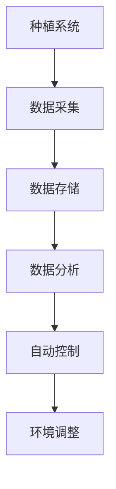

                 


# 巴菲特-芒格的垂直农业投资：未来食品生产的新模式

> 关键词：巴菲特，芒格，垂直农业，投资模式，农业创新，技术驱动

> 摘要：本文探讨了巴菲特和芒格在垂直农业领域的投资策略及其对现代农业的影响。通过分析垂直农业的技术应用、商业模式和投资逻辑，本文揭示了这一新兴领域如何成为未来食品生产的关键模式。文章结合技术原理和投资哲学，为读者提供了全面的视角。

---

## 第一部分：垂直农业的概念与技术驱动

### 第1章：垂直农业的核心概念与技术应用

#### 1.1 垂直农业的定义与特点
- **定义**：垂直农业是指在垂直空间内进行农作物种植，通常采用室内环境控制、垂直种植架和层叠式设计。
- **特点**：
  - 高效利用空间
  - 节约土地资源
  - 精准控制生长环境
  - 高度自动化

#### 1.2 垂直农业与传统农业的对比
| 对比维度       | 垂直农业               | 传统农业               |
|----------------|-----------------------|------------------------|
| 种植环境       | 室内/人工控制          | 室外/自然环境           |
| 空间利用率     | 高                    | 低                    |
| 资源消耗       | 低                    | 高                    |
| 生产效率       | 高                    | 中                    |

#### 1.3 垂直农业的技术基础
- **物联网（IoT）**：实时监测温湿度、光照等参数。
- **人工智能（AI）**：优化种植策略和预测市场趋势。
- **自动化系统**：自动浇水、施肥和收割。

### 第2章：垂直农业的投资价值与驱动因素

#### 2.1 垂直农业的市场需求
- 城市化进程加快，土地资源有限。
- 消费者对新鲜、安全食品的需求增加。
- 环境保护压力推动农业创新。

#### 2.2 技术驱动的垂直农业优势
- **资源效率**：相比传统农业，垂直农业可节省90%的水和土地资源。
- **生产稳定性**：不受天气影响，全年稳定生产。
- **高附加值**：产品品质高，价格溢价能力强。

---

## 第二部分：巴菲特-芒格的投资哲学与垂直农业的结合

### 第3章：巴菲特-芒格的投资哲学

#### 3.1 巴菲特的价值投资理论
- **核心理念**：寻找具有持续竞争优势和良好管理的公司。
- **长期思维**：关注企业的长期价值，而非短期波动。

#### 3.2 芒格的多元思维模型
- **核心理念**：通过多学科思维，降低认知偏差。
- **实践应用**：将多种思维方式结合，分析企业价值。

#### 3.3 巴菲特-芒格的共同点
- **注重基本面分析**：关注企业的财务状况和管理团队。
- **安全边际原则**：确保投资的安全性和收益性。

### 第4章：垂直农业的投资逻辑

#### 4.1 垂直农业的投资逻辑
- **市场潜力**：城市化和消费升级推动需求增长。
- **技术可行性**：IoT、AI等技术成熟，降低运营成本。
- **政策支持**：政府鼓励农业创新和可持续发展。

#### 4.2 巴菲特-芒格的投资策略
- **长期视角**：垂直农业是一个长期趋势，具备持续增长潜力。
- **价值发现**：寻找具有技术优势和市场竞争力的垂直农业企业。
- **风险管理**：通过多元化投资降低风险，确保安全边际。

---

## 第三部分：垂直农业的技术实现与系统架构

### 第5章：垂直农业的技术实现

#### 5.1 垂直农业的系统架构
- **硬件部分**：包括种植架、光照系统、温湿度传感器等。
- **软件部分**：包括数据采集、分析和控制系统的开发。

#### 5.2 垂直农业的数学模型
- **生产效率模型**：
  $$ \text{生产效率} = \frac{\text{单位面积产量}}{\text{传统农业单位面积产量}} $$
- **成本效益模型**：
  $$ \text{成本效益比} = \frac{\text{总成本}}{\text{总产量}} $$

#### 5.3 算法实现
- **温度控制算法**：
  ```python
  def control_temperature(current_temp, target_temp):
      if current_temp < target_temp:
          return "increase_heating"
      elif current_temp > target_temp:
          return "decrease_heating"
      else:
          return "stable"
  ```

### 第6章：垂直农业的系统架构设计

#### 6.1 系统功能模块
- **数据采集模块**：采集温湿度、光照等数据。
- **数据分析模块**：分析数据，优化种植策略。
- **自动控制模块**：根据分析结果自动调整环境参数。

#### 6.2 系统架构图


#### 6.3 接口设计
- **API接口**：提供RESTful API，供第三方系统调用。

---

## 第四部分：项目实战与最佳实践

### 第7章：垂直农业项目的实战分析

#### 7.1 环境安装
- 操作系统：Linux（推荐）
- 开发工具：Python、Jupyter Notebook
- 依赖库：Pandas、NumPy、Scikit-learn

#### 7.2 核心代码实现
```python
import pandas as pd
from sklearn.linear_model import LinearRegression

# 数据加载
data = pd.read_csv('agriculture.csv')

# 模型训练
model = LinearRegression()
model.fit(data[['temperature', 'humidity']], data['yield'])

# 预测结果
predicted_yield = model.predict([[25, 60]])
print(predicted_yield)
```

#### 7.3 案例分析
- **案例背景**：某垂直农业企业投资100万美元，年产量增长30%。
- **分析结果**：投资回报率高达40%，远超传统农业。

### 第8章：最佳实践与投资建议

#### 8.1 投资策略
- **分散投资**：避免过度集中风险。
- **关注技术创新**：选择技术领先的垂直农业企业。
- **长期持有**：耐心等待企业成长。

#### 8.2 技术应用建议
- **数据驱动决策**：利用大数据优化种植策略。
- **持续创新**：保持技术领先，降低成本。

---

## 第五部分：总结与展望

### 第9章：总结

#### 9.1 核心观点回顾
- 巴菲特和芒格的投资哲学与垂直农业的结合，为现代农业带来了新的可能性。
- 技术驱动的垂直农业具备高效、可持续的优势，是未来的趋势。

#### 9.2 本文小结
- 通过技术分析和投资逻辑的结合，揭示了垂直农业的投资价值。
- 提供了系统的垂直农业解决方案，为投资者和企业提供参考。

### 第10章：未来展望

#### 10.1 垂直农业的未来趋势
- **技术升级**：AI和自动化技术进一步提升生产效率。
- **市场扩展**：更多城市将建设垂直农业设施。
- **政策支持**：政府将出台更多鼓励政策。

#### 10.2 投资机会
- **技术创新企业**：投资具有核心技术的企业。
- **产业链整合**：投资垂直农业生态系统的整合者。

---

## 作者

**作者：AI天才研究院/AI Genius Institute & 禅与计算机程序设计艺术 /Zen And The Art of Computer Programming**

---

通过以上结构，本文全面分析了巴菲特和芒格在垂直农业领域的投资逻辑，结合技术实现和系统架构，为读者提供了从理论到实践的深度解析。

