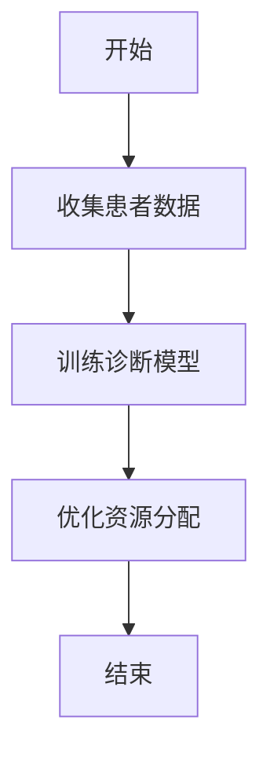
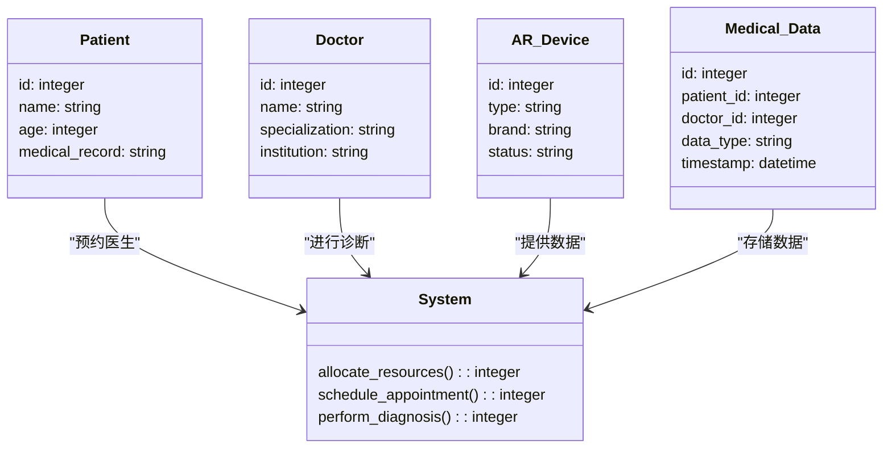
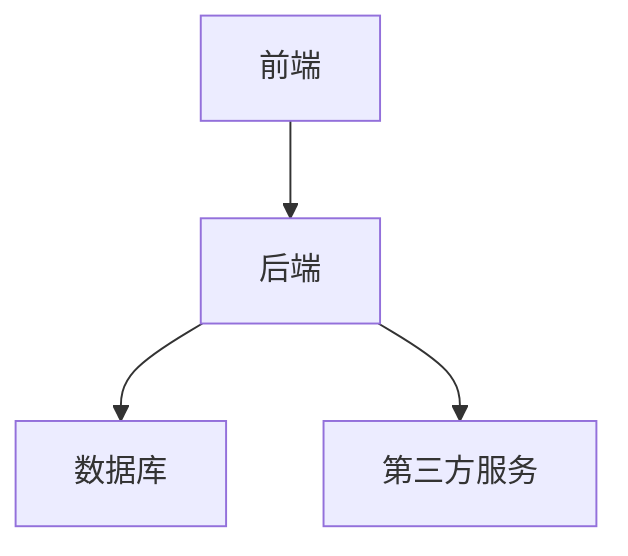
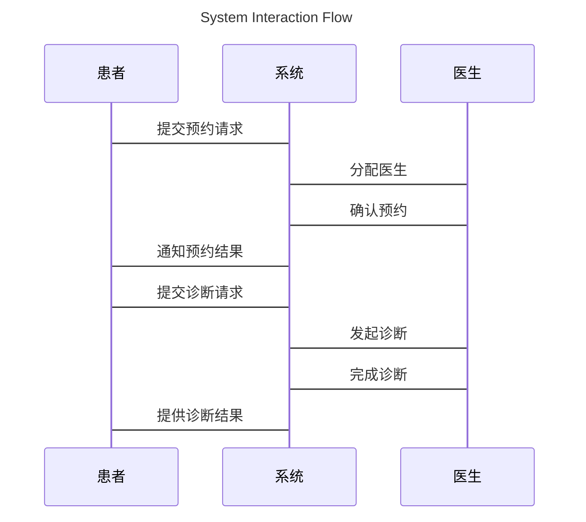

                 


# 巴菲特-芒格的增强现实远程医疗投资：医疗资源全球化的新模式

**关键词：** 巴菲特, 芒格, 增强现实, 远程医疗, 医疗资源全球化

**摘要：** 本文探讨了巴菲特和芒格的投资策略如何与增强现实（AR）技术相结合，推动远程医疗的创新，并实现医疗资源的全球化配置。文章详细分析了AR远程医疗的核心原理、系统架构、算法优化以及实际案例，揭示了这一模式在医疗资源分配中的潜力和挑战。

---

## 第1章: 背景介绍：增强现实远程医疗与巴菲特-芒格投资策略的结合

### 1.1 问题背景

#### 1.1.1 医疗资源分布不均的问题
全球医疗资源分布极不均衡，发达地区医疗设施先进，而欠发达地区则严重缺乏优质医疗资源。患者难以获得及时有效的诊疗服务，特别是在偏远地区，这种情况更为突出。

#### 1.1.2 远程医疗的发展现状
远程医疗通过互联网技术实现患者与医生的远程诊疗，但传统远程医疗存在互动性差、患者体验不佳等问题。医生难以通过二维屏幕准确判断患者的病情，导致诊断准确率和治疗效果受限。

#### 1.1.3 增强现实技术在医疗领域的潜力
增强现实（AR）技术能够将虚拟信息与真实环境实时融合，为远程医疗提供了新的解决方案。通过AR设备，医生可以实时观察患者的三维模型，进行更精准的诊断和治疗。

### 1.2 问题描述

#### 1.2.1 医疗资源全球化的需求
全球医疗资源分布不均的问题亟需解决。通过AR远程医疗技术，可以实现医疗资源的全球化配置，使偏远地区的患者也能获得优质医疗服务。

#### 1.2.2 增强现实技术如何提升远程医疗体验
AR技术能够将患者的三维模型实时投射到医生面前，医生可以更直观地观察患者的病情，进行更精准的诊断。同时，AR还可以提供虚拟手术指导，辅助医生进行复杂手术。

#### 1.2.3 巴菲特-芒格投资策略的核心理念
巴菲特和芒格的投资策略注重长期价值和可持续发展。他们倾向于投资那些能够改变行业格局、具备强大竞争优势的企业。AR远程医疗技术具备广阔的发展前景，符合他们的投资理念。

### 1.3 问题解决

#### 1.3.1 增强现实远程医疗的解决方案
通过AR技术，医生可以实时观察患者的三维模型，进行更精准的诊断和治疗。同时，AR还可以提供虚拟手术指导，辅助医生进行复杂手术。

#### 1.3.2 巴菲特-芒格投资策略的应用场景
AR远程医疗技术能够改变传统医疗行业的格局，提升医疗资源的利用效率。这种技术符合巴菲特和芒格对长期价值和可持续发展的投资理念。

#### 1.3.3 医疗资源全球化的实现路径
通过AR远程医疗技术，实现医疗资源的全球化配置，使偏远地区的患者也能获得优质医疗服务。

### 1.4 边界与外延

#### 1.4.1 增强现实远程医疗的适用范围
适用于需要高精度诊断和治疗的领域，如复杂手术、罕见病诊断等。

#### 1.4.2 医疗资源全球化的边界条件
受网络基础设施、数据隐私、医疗法规等因素的限制。

#### 1.4.3 巴菲特-芒格投资策略的外延性
不仅适用于医疗行业，还可应用于其他具备长期价值和竞争优势的领域。

### 1.5 核心要素组成

#### 1.5.1 增强现实技术的核心要素
- AR设备：如智能眼镜、头显等。
- 虚拟模型：基于患者数据生成的三维模型。
- 实时交互：医生与患者实时互动，进行精准诊断。

#### 1.5.2 远程医疗的核心要素
- 网络通信：确保数据的实时传输。
- 数据安全：保护患者隐私和医疗数据。
- 跨平台兼容性：支持多种设备和系统。

#### 1.5.3 医疗资源全球化的核心要素
- 全球化的医疗网络：连接全球医疗机构和医生。
- 跨国数据共享：实现医疗数据的跨国流通。
- 统一标准：制定全球统一的医疗数据和技术标准。

---

## 第2章: 核心概念与联系

### 2.1 核心概念原理

#### 2.1.1 增强现实技术的原理
通过计算机生成的虚拟信息与真实环境实时融合，提供沉浸式的视觉体验。

#### 2.1.2 远程医疗的原理
通过互联网技术实现患者与医生的远程诊疗，突破地理限制。

#### 2.1.3 医疗资源全球化的原理
通过技术手段实现医疗资源的跨国配置和共享。

### 2.2 概念属性特征对比

| 概念       | 描述                                                                 |
|------------|----------------------------------------------------------------------|
| 增强现实    | 将虚拟信息与真实环境实时融合，提供沉浸式体验。                      |
| 远程医疗    | 通过互联网技术实现患者与医生的远程诊疗。                          |
| 医疗资源全球化 | 实现医疗资源的跨国配置和共享，提升全球医疗服务质量。             |

### 2.3 ER实体关系图

```mermaid
er
    %% 增强现实远程医疗系统的实体关系图
    title ER Entity Relationship Diagram for AR Remote Healthcare System

    %% 实体定义
    entity Patient {
        id: integer
        name: string
        age: integer
        gender: string
        medical_record: string
    }

    entity Doctor {
        id: integer
        name: string
        specialization: string
        institution: string
    }

    entity AR_Device {
        id: integer
        type: string
        brand: string
        status: string
    }

    entity Medical_Data {
        id: integer
        patient_id: integer
        doctor_id: integer
        data_type: string
        timestamp: datetime
    }

    %% 关系定义
    Patient -[:1]-> AR_Device: "使用设备"
    Doctor -[:1]-> AR_Device: "操作设备"
    Patient -[:1]-> Medical_Data: "生成数据"
    Doctor -[:1]-> Medical_Data: "分析数据"
```

---

## 第3章: 算法原理讲解

### 3.1 算法原理

#### 3.1.1 算法选择
采用线性规划模型优化医疗资源分配，确保资源的高效利用。

#### 3.1.2 算法步骤

1. **数据收集**：收集患者的基本信息和病情数据。
2. **模型训练**：基于历史数据训练诊断模型。
3. **资源分配**：根据诊断结果优化医疗资源分配。

### 3.2 算法流程图



### 3.3 Python代码实现

```python
import numpy as np
from scipy.optimize import linprog

# 定义目标函数
c = np.array([1, 2, 3])  # 成本向量

# 定义约束条件
A = np.array([[1, 1, 1],  # 约束1：资源限制
              [0, 1, 0]])  # 约束2：其他限制
b = np.array([10, 5])    # 约束右端

# 线性规划求解
result = linprog(c, A_ub=A, b_ub=b, method='highs')

# 输出结果
print("最优解：", result.x)
```

### 3.4 数学模型

目标函数：
$$ \text{min } \sum_{i} c_i x_i $$

约束条件：
$$ \sum_{i} a_{ij} x_i \leq b_j \quad \forall j $$
$$ x_i \geq 0 \quad \forall i $$

---

## 第4章: 系统分析与架构设计方案

### 4.1 项目介绍

#### 4.1.1 项目背景
本项目旨在通过AR技术实现远程医疗的创新，推动医疗资源的全球化配置。

#### 4.1.2 项目目标
构建一个基于AR技术的远程医疗系统，实现全球医疗资源的高效利用。

### 4.2 系统功能设计

#### 4.2.1 系统功能
- 患者预约：患者可以通过平台预约医生。
- 远程诊疗：医生通过AR设备进行远程诊疗。
- 资源分配：系统自动优化医疗资源分配。

#### 4.2.2 领域模型



### 4.3 系统架构设计

#### 4.3.1 分层架构
- **前端**：患者和医生的交互界面。
- **后端**：处理业务逻辑和数据存储。
- **数据库**：存储患者数据、诊断记录等。
- **第三方服务**：提供AR设备和网络通信支持。

#### 4.3.2 架构图



### 4.4 系统接口设计

#### 4.4.1 主要接口
- `预约接口`：患者预约医生。
- `诊断接口`：医生进行远程诊断。
- `资源分配接口`：系统优化医疗资源分配。

#### 4.4.2 接口描述
- `预约接口`：患者通过平台提交预约请求。
- `诊断接口`：医生通过AR设备进行远程诊疗。
- `资源分配接口`：系统根据诊断结果优化资源分配。

### 4.5 系统交互流程



---

## 第5章: 项目实战

### 5.1 环境安装

#### 5.1.1 安装Python
```bash
python --version
pip install numpy scipy
```

#### 5.1.2 安装AR库
```bash
pip install pyar
```

### 5.2 核心代码实现

#### 5.2.1 预约系统
```python
def schedule_appointment(patient_id, doctor_id):
    # 实现预约逻辑
    pass
```

#### 5.2.2 诊断系统
```python
def perform_diagnosis(patient_id, doctor_id):
    # 实现诊断逻辑
    pass
```

### 5.3 代码解读与分析

#### 5.3.1 预约系统解读
```python
def schedule_appointment(patient_id, doctor_id):
    # 获取医生的可用时间
    available_time = get_available_time(doctor_id)
    # 根据患者和医生的时间安排预约
    appointment_time = schedule_time(patient_id, available_time)
    # 提供预约确认
    confirm_appointment(appointment_time)
```

#### 5.3.2 诊断系统解读
```python
def perform_diagnosis(patient_id, doctor_id):
    # 获取患者的三维模型
    patient_model = get_patient_model(patient_id)
    # 医生通过AR设备进行诊断
    diagnosis_result = ar_diagnosis(doctor_id, patient_model)
    # 提供诊断结果
    provide_diagnosis(diagnosis_result)
```

### 5.4 实际案例分析

#### 5.4.1 案例描述
某医院通过AR远程医疗系统，成功为偏远地区的患者提供了精准的诊断和治疗。

#### 5.4.2 案例分析
分析案例中的关键步骤，总结经验教训。

### 5.5 项目小结
总结项目成果，分析项目中的关键点和未来改进方向。

---

## 第6章: 最佳实践与投资建议

### 6.1 经验总结

#### 6.1.1 数据隐私保护
确保患者数据的安全和隐私。

#### 6.1.2 技术选型
选择合适的AR技术和远程医疗方案。

### 6.2 投资建议

#### 6.2.1 关注AR技术发展
AR技术是推动远程医疗创新的关键。

#### 6.2.2 关注医疗法规
医疗法规的变化对远程医疗的发展有重要影响。

### 6.3 小结
总结全文内容，展望未来的发展方向。

---

## 第7章: 注意事项与拓展阅读

### 7.1 注意事项

#### 7.1.1 数据安全
确保患者数据的安全和隐私。

#### 7.1.2 技术合规
遵守相关技术标准和法规。

### 7.2 拓展阅读

#### 7.2.1 推荐书籍
- 《巴菲特传》
- 《芒格传》
- 《增强现实技术与医疗》

#### 7.2.2 推荐博客
- 巴菲特投资博客
- 远程医疗技术博客

---

## 第8章: 结语

### 8.1 总结
通过巴菲特-芒格的投资策略与AR技术的结合，远程医疗将实现医疗资源的全球化配置，推动医疗行业的发展。

### 8.2 展望
未来，AR远程医疗技术将更加成熟，医疗资源的全球化配置将更加高效。

---

**作者：AI天才研究院/AI Genius Institute & 禅与计算机程序设计艺术/Zen And The Art of Computer Programming**

