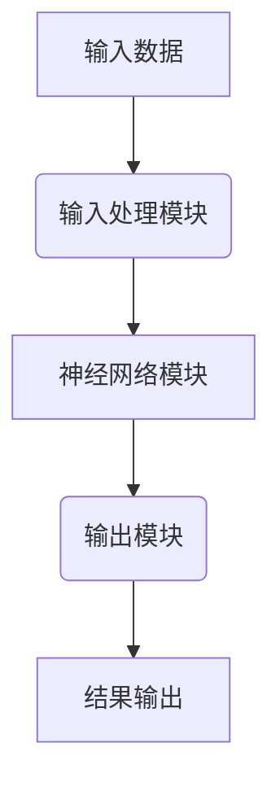

                 


```markdown
# 巴菲特-芒格的生物计算机芯片投资：类脑计算的工业革命

## 关键词：巴菲特, 芒格, 生物计算机芯片, 类脑计算, 工业革命, 投资策略, 神经网络

## 摘要：本文探讨了巴菲特和芒格在生物计算机芯片领域的投资策略，分析了类脑计算对工业革命的影响，并详细阐述了生物计算机芯片的核心技术，包括神经网络原理、数学模型和系统架构设计。文章结合实际案例，提供了从理论到实践的全面解读。

---

# 第一部分：引言

## 第1章：巴菲特与芒格的投资理念

### 1.1 巴菲特的价值投资理论
- 巴菲特的价值投资理论强调长期主义和基本面分析。
- 芒格的多元思维模型为巴菲特的投资决策提供了哲学支持。

### 1.2 生物计算机芯片的投资机会
- 生物计算机芯片的出现为科技投资带来了新的方向。
- 巴菲特与芒格的投资策略转向生物计算机芯片的原因。

### 1.3 本文的核心观点
- 生物计算机芯片将引领类脑计算的工业革命。
- 巴菲特与芒格的投资策略为科技领域的投资提供了新思路。

---

# 第二部分：生物计算机芯片的核心技术

## 第2章：神经网络的基本原理

### 2.1 神经网络的结构与功能
- 神经元的结构与功能：树突、轴突、突触。
- 神经网络的层次结构：输入层、隐藏层、输出层。

### 2.2 激活函数的作用
- Sigmoid函数：$f(x) = \frac{1}{1 + e^{-x}}$。
- ReLU函数：$f(x) = \max(0, x)$。
- Tanh函数：$f(x) = \tanh(x)$。

### 2.3 神经网络的训练过程
- 前向传播：输入数据通过网络计算输出。
- 反向传播：计算误差并更新权重。
- 梯度下降：优化模型参数。

## 第3章：生物计算机芯片的数学模型

### 3.1 神经网络的数学表示
- 神经网络的输入输出关系：$y = f(xW + b)$。
- 权重矩阵W和偏置b的作用。

### 3.2 损失函数的选择
- 均方误差：$\text{MSE} = \frac{1}{2N}\sum_{i=1}^{N}(y_i - \hat{y}_i)^2$。
- 交叉熵损失：$-\frac{1}{N}\sum_{i=1}^{N} y_i \log \hat{y}_i + (1 - y_i) \log (1 - \hat{y}_i)$。

### 3.3 优化算法的实现
- 随机梯度下降：$\theta = \theta - \eta \nabla J$。
- 动量优化：$\theta = \theta - \eta v$, 其中$v = \beta v + \nabla J$。
- Adam优化：结合动量和自适应学习率。

## 第4章：生物计算机芯片的系统架构

### 4.1 系统功能设计
- 输入处理模块：接收数据并进行预处理。
- 神经网络模块：执行前向传播和反向传播。
- 输出模块：生成结果并反馈。

### 4.2 系统架构设计
- 使用Mermaid绘制系统架构图：


### 4.3 接口设计与交互
- 输入接口：支持多种数据格式。
- 输出接口：提供结果和日志信息。

## 第5章：项目实战

### 5.1 环境安装
- 安装Python和必要的库：numpy、tensorflow、pytorch。

### 5.2 核心代码实现
```python
import numpy as np
import tensorflow as tf

# 定义神经网络模型
model = tf.keras.Sequential([
    tf.keras.layers.Dense(64, activation='relu'),
    tf.keras.layers.Dense(10, activation='softmax')
])

# 编译模型
model.compile(optimizer='adam', loss='sparse_categorical_crossentropy', metrics=['accuracy'])

# 训练模型
model.fit(x_train, y_train, epochs=10, batch_size=32)
```

### 5.3 案例分析
- 使用MNIST数据集进行训练和测试。
- 分析模型的准确率和损失函数的变化。

## 第6章：总结与展望

### 6.1 投资策略总结
- 巴菲特与芒格的投资策略为科技投资提供了新思路。
- 生物计算机芯片的投资价值巨大。

### 6.2 未来展望
- 类脑计算将推动工业革命的发展。
- 生物计算机芯片将在更多领域得到应用。

### 6.3 注意事项
- 投资需谨慎，需结合市场变化和技术发展。
- 关注政策和行业动态，及时调整投资策略。

---

# 作者：AI天才研究院/AI Genius Institute & 禅与计算机程序设计艺术 /Zen And The Art of Computer Programming
```

