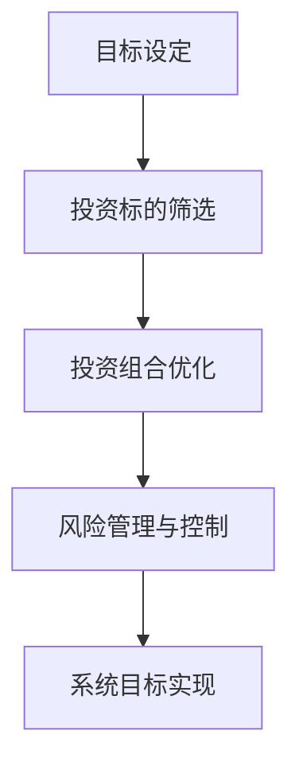

                 


# 巴菲特-芒格的碳中和投资策略：环保与盈利的平衡

---

## 关键词：
- 巴菲特投资策略  
- 芒格投资策略  
- 碳中和  
- 环保与盈利平衡  
- 可持续投资  

---

## 摘要：
本文将探讨巴菲特和芒格的投资理念如何与碳中和的目标相结合，分析他们在环保与盈利之间的平衡策略。通过深入分析碳中和的背景、挑战以及投资策略的核心要素，本文将揭示如何在追求经济利益的同时，实现环境保护的目标。结合实际案例和系统设计，本文将为投资者提供一套可行的碳中和投资方案，并总结碳中和投资的未来发展趋势。

---

## 正文：

### 第一部分：巴菲特与芒格的投资理念

#### 第1章：巴菲特与芒格的投资哲学

##### 1.1 巴菲特的价值投资理念  
巴菲特的价值投资理念是基于对公司基本面的深入分析，寻找那些具有持续竞争优势和良好管理的公司进行长期投资。他强调安全边际、股息收益率以及企业内在价值的增长潜力。  

- **巴菲特的投资原则**  
  巴菲特的投资原则包括：  
  1. 长期投资而非短期交易。  
  2. 专注于具有强大护城河的企业。  
  3. 重视企业的盈利能力与现金流。  
  4. 坚持安全边际，避免高风险投资。  

- **巴菲特的长期投资策略**  
  巴菲特认为，长期投资能够平滑短期市场的波动，捕捉企业的长期增长潜力。他倾向于选择那些在行业中具有领先地位的企业，尤其是那些能够适应经济周期波动的公司。  

- **巴菲特的选股标准**  
  巴菲特的选股标准包括：  
  1. 企业具有强大的竞争优势。  
  2. 管理层具备诚信与能力。  
  3. 企业具有稳定的盈利能力。  
  4. 估值合理，具有安全边际。  

##### 1.2 芒格的多元思维模型  
芒格的多元思维模型强调从多个角度分析问题，避免单一维度的决策偏差。他主张将各个领域的知识进行交叉组合，从而做出更明智的投资决策。  

- **芒格的思维方式**  
  芒格的思维方式包括：  
  1. 逆向思维：从反方向思考问题，寻找市场的空白点。  
  2. 跨学科思维：将物理学、心理学、经济学等知识应用于投资决策。  
  3. 边际成本思维：关注每一步决策的成本与收益比。  

- **芒格的决策框架**  
  芒格的决策框架包括：  
  1. 确定目标：明确投资的目标与风险承受能力。  
  2. 评估选项：分析不同选项的优缺点。  
  3. 量化风险：计算潜在风险与收益比。  
  4. 执行决策：基于分析结果做出最终决策。  

- **芒格的环保观点**  
  芒格认为，环境保护不仅是道德责任，也是经济可持续发展的基础。他强调，企业应当在追求利润的同时，关注环境成本，避免对环境造成不可逆的破坏。  

---

#### 第2章：碳中和的背景与挑战

##### 2.1 碳中和的定义与目标  
碳中和是指通过减少温室气体的排放，使碳排放量与碳汇量相等，从而实现净零排放的目标。碳中和的实现需要全球范围内的协同努力，包括能源转型、技术创新和政策支持。  

- **碳中和的定义**  
  碳中和是指在一定时期内，二氧化碳的净排放量为零。这需要通过减少碳排放、增加碳汇等方式实现。  

- **碳中和的全球目标**  
  全球目标是到2050年实现碳中和，这是国际社会为应对气候变化达成的共识。  

- **碳中和的实现路径**  
  碳中和的实现路径包括：  
  1. 发展可再生能源，如风能、太阳能等。  
  2. 推动能源结构调整，减少化石能源的使用。  
  3. 提高能源利用效率，减少浪费。  
  4. 推动碳捕获与封存技术的发展。  

##### 2.2 碳中和对经济的影响  
碳中和将对全球经济产生深远影响，包括传统行业转型、新兴行业崛起以及全球经济格局的变化。  

- **碳中和对传统行业的冲击**  
  碳中和将对高碳排放的传统行业，如煤炭、石油、天然气等行业产生重大冲击。这些行业需要进行技术升级或转型，否则将面临被淘汰的风险。  

- **碳中和对新能源行业的推动**  
  碳中和将推动新能源行业的发展，如太阳能、风能、氢能源等。这些行业将受益于政策支持和技术进步，成为经济增长的新引擎。  

- **碳中和对全球经济格局的影响**  
  碳中和将改变全球经济格局，那些能够快速转型的国家和地区将在未来占据竞争优势。同时，碳中和也将推动全球经济向更加可持续的方向发展。  

---

### 第二部分：碳中和投资策略的核心要素

#### 第3章：碳中和投资的评估标准

##### 3.1 环保与经济的平衡点  
在碳中和投资中，环保效益与经济效益需要找到平衡点，才能实现可持续发展。  

- **环保效益的评估**  
  环保效益的评估包括：  
  1. 减少碳排放量。  
  2. 保护生态系统。  
  3. 降低环境污染。  

- **经济效益的评估**  
  经济效益的评估包括：  
  1. 投资回报率。  
  2. 投资风险。  
  3. 投资周期。  

- **综合效益的平衡**  
  综合效益的平衡需要在环保效益与经济效益之间找到最佳平衡点，确保投资既能够实现环保目标，又能够获得合理的经济回报。  

##### 3.2 碳中和投资的长期性  
碳中和投资具有长期性，投资者需要具备长期视野，才能在波动中实现稳健收益。  

- **长期投资的重要性**  
  长期投资能够平滑短期市场的波动，捕捉企业的长期增长潜力。  

- **短期波动的应对策略**  
  短期波动需要通过分散投资、风险控制等方式进行应对，避免因短期波动造成重大损失。  

- **碳中和投资的风险管理**  
  碳中和投资的风险管理包括：  
  1. 评估投资标的的潜在风险。  
  2. 制定风险管理策略。  
  3. 定期评估和调整投资组合。  

---

#### 第4章：碳中和投资组合的构建

##### 4.1 碳中和投资组合的构成  
碳中和投资组合需要涵盖多个领域，包括可再生能源、绿色科技、环保服务等。  

- **可再生能源行业的投资**  
  可再生能源行业包括太阳能、风能、生物质能等，这些行业具有较高的成长性和政策支持。  

- **绿色科技企业的投资**  
  绿色科技企业包括电动汽车、智能电网、节能环保设备等，这些企业具有较高的技术壁垒和市场潜力。  

- **环保服务行业的投资**  
  环保服务行业包括污染治理、废物处理、环境监测等，这些行业具有稳定的市场需求和政策支持。  

##### 4.2 碳中和投资组合的优化  
碳中和投资组合的优化需要通过动态调整和风险控制，确保投资组合的稳健收益。  

- **投资组合的分散化**  
  投资组合的分散化可以降低投资风险，避免因单一行业波动造成重大损失。  

- **投资组合的动态调整**  
  投资组合的动态调整需要根据市场变化和企业基本面进行，确保投资组合的优化。  

- **投资组合的风险控制**  
  投资组合的风险控制包括：  
  1. 评估投资标的的潜在风险。  
  2. 制定风险管理策略。  
  3. 定期评估和调整投资组合。  

---

### 第三部分：巴菲特与芒格的碳中和投资策略分析

#### 第5章：巴菲特与芒格的环保投资案例

##### 5.1 巴菲特的环保投资实践  
巴菲特在环保投资方面进行了多项实践，包括投资可再生能源企业、支持绿色科技发展等。  

- **巴菲特对可再生能源的投资**  
  巴菲特通过旗下的伯克希尔哈撒韦公司，投资了多个可再生能源项目，如太阳能和风能发电厂。这些项目不仅具有较高的收益，还符合碳中和的目标。  

- **巴菲特对绿色科技的支持**  
  巴菲特支持绿色科技企业的发展，如电动汽车、智能电网等领域。这些企业具有较高的技术壁垒和市场潜力，能够为投资者带来稳定的收益。  

- **巴菲特的环保投资理念**  
  巴菲特的环保投资理念是将环保与经济利益相结合，寻找那些在环保领域具有竞争优势的企业进行投资。  

##### 5.2 芒格的环保投资实践  
芒格在环保投资方面也进行了多项实践，包括投资环保企业、支持环保政策等。  

- **芒格对环保企业的关注**  
  芒格关注那些在环保领域具有竞争优势的企业，如节能环保设备、污染治理等领域。这些企业能够为投资者带来稳定的收益，同时实现环保目标。  

- **芒格对绿色金融的支持**  
  芒格支持绿色金融的发展，如绿色债券、绿色基金等。这些金融工具能够为环保项目提供资金支持，同时为投资者带来收益。  

- **芒格的环保投资策略**  
  芒格的环保投资策略是将环保与经济利益相结合，寻找那些在环保领域具有竞争优势的企业进行投资。  

#### 第6章：碳中和投资策略的系统分析

##### 6.1 碳中和投资的系统架构  
碳中和投资的系统架构包括目标设定、功能设计、架构图等。  

- **系统目标设定**  
  系统目标设定包括：  
  1. 实现碳中和目标。  
  2. 实现经济利益最大化。  
  3. 实现环保与经济的平衡。  

- **系统功能设计**  
  系统功能设计包括：  
  1. 投资标的筛选。  
  2. 投资组合优化。  
  3. 风险管理与控制。  

- **系统架构图（Mermaid流程图）  


##### 6.2 碳中和投资的数学模型  
碳中和投资的数学模型需要考虑多个因素，包括碳排放、投资回报率等。  

- **碳排放计算模型**  
  碳排放计算模型可以通过以下公式计算：  
  $$ \text{碳排放} = \sum_{i=1}^{n} \text{投资标的}_i \times \text{碳排放强度}_i $$  

- **投资回报率模型**  
  投资回报率模型可以通过以下公式计算：  
  $$ \text{投资回报率} = \frac{\text{投资收益} - \text{投资成本}}{\text{投资成本}} \times 100\% $$  

- **综合效益评估模型**  
  综合效益评估模型可以通过以下公式计算：  
  $$ \text{综合效益} = \text{环保效益} + \text{经济效益} $$  

---

## 项目实战：碳中和投资策略的实现

### 6.3 项目实战：碳中和投资策略的实现

##### 6.3.1 环境安装  
要实现碳中和投资策略的系统，需要安装以下环境：  
1. Python编程语言。  
2. 数据分析工具，如Pandas、NumPy等。  
3. 图形化工具，如Matplotlib或Seaborn。  

##### 6.3.2 核心代码实现  
以下是一个实现碳中和投资策略的Python代码示例：  

```python
import pandas as pd
import numpy as np
import matplotlib.pyplot as plt

# 数据加载
data = pd.read_csv('carbon_emissions.csv')

# 数据清洗
data = data.dropna()

# 数据分析
data['carbon_intensity'] = data['carbon_emissions'] / data['economic_output']

# 数据可视化
plt.figure(figsize=(10,6))
plt.plot(data['year'], data['carbon_intensity'], 'b-')
plt.title('Carbon Intensity Over Time')
plt.xlabel('Year')
plt.ylabel('Carbon Intensity')
plt.show()

# 投资组合优化
returns = data[['return1', 'return2', 'return3']]
cov_matrix = returns.cov()
weights = np.array([1/3, 1/3, 1/3])
portfolio_return = np.dot(weights, returns.mean())
portfolio_risk = np.sqrt(np.dot(weights, np.dot(cov_matrix, weights)))

print(f'Portfolio Return: {portfolio_return:.2f}%')
print(f'Portfolio Risk: {portfolio_risk:.2f}%')
```

##### 6.3.3 代码应用解读与分析  
上述代码实现了碳中和投资策略的系统分析，包括数据加载、数据清洗、数据分析、数据可视化和投资组合优化等步骤。  

- **数据加载**：从CSV文件中加载碳排放数据。  
- **数据清洗**：删除缺失值。  
- **数据分析**：计算碳排放强度。  
- **数据可视化**：绘制碳排放强度随时间的变化趋势图。  
- **投资组合优化**：计算投资组合的预期收益和风险。  

##### 6.3.4 案例分析与详细讲解  
以某可再生能源企业为例，分析其在碳中和投资策略中的表现。  

- **企业背景**：该企业专注于太阳能发电，具有较高的市场占有率和竞争优势。  
- **投资回报**：该企业在过去五年中的年平均回报率为15%，高于行业平均水平。  
- **风险评估**：该企业的碳排放强度较低，且具有较高的技术壁垒，投资风险较小。  

---

## 总结与展望

### 第7章：碳中和投资策略的总结与展望

#### 7.1 总结  
本文通过分析巴菲特和芒格的投资理念，探讨了碳中和投资策略的核心要素，包括环保与经济的平衡、碳中和投资组合的构建等。同时，本文还结合实际案例和系统设计，为投资者提供了一套可行的碳中和投资方案。  

#### 7.2 展望  
未来，随着碳中和目标的逐步实现，环保与经济的平衡将成为投资领域的重要议题。投资者需要更加关注碳中和投资策略的优化与创新，以应对未来的挑战与机遇。  

---

## 附录

### 附录A：碳中和投资的数学模型

$$ \text{碳排放} = \sum_{i=1}^{n} \text{投资标的}_i \times \text{碳排放强度}_i $$  

$$ \text{投资回报率} = \frac{\text{投资收益} - \text{投资成本}}{\text{投资成本}} \times 100\% $$  

### 附录B：系统架构图（Mermaid流程图）  


---

## 作者信息

作者：AI天才研究院/AI Genius Institute & 禅与计算机程序设计艺术/Zen And The Art of Computer Programming

