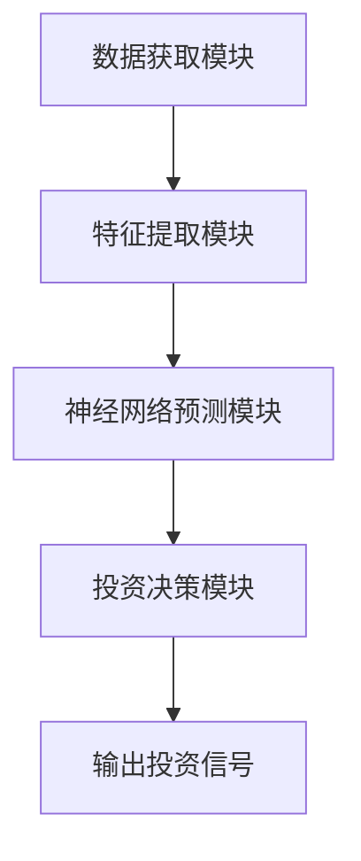

                 


# 巴菲特-芒格的神经形态计算投资：类脑AI的产业化

## 关键词
神经形态计算, 投资策略, 巴菲特, 芒格, 类脑AI, 人工智能, 投资系统

## 摘要
本文探讨了如何将神经形态计算应用于巴菲特和芒格的投资策略，提出了构建神经形态计算投资系统的方法。文章详细分析了神经形态计算的核心算法、数学模型，以及如何将这些技术与传统投资理念相结合，构建高效的类脑AI投资系统。通过系统架构设计、项目实战和案例分析，展示了神经形态计算在投资领域的广泛应用前景。

---

## 第一章 神经形态计算与巴菲特投资理念的结合

### 1.1 神经形态计算的基本概念

#### 1.1.1 神经形态计算的定义
神经形态计算（Neuromorphic Computing）是一种模拟人脑神经网络的计算范式，通过模拟生物神经系统的结构和功能，实现更高效的计算和信息处理。

#### 1.1.2 神经形态计算的核心特征
神经形态计算的核心特征包括：
- **事件驱动**：基于事件触发的计算，而非传统的时钟驱动。
- **并行处理**：模拟生物神经系统的并行处理能力。
- **自适应性**：能够根据输入数据动态调整计算模式。

#### 1.1.3 神经形态计算与传统计算的区别
| 特性 | 神经形态计算 | 传统计算 |
|------|--------------|-----------|
| 数据处理 | 事件驱动，稀疏编码 | 时钟驱动，密集计算 |
| 并行性 | 高度并行 | 串行或低并行 |
| 能效比 | 高 | 低 |

### 1.2 巴菲特投资理念的核心要素

#### 1.2.1 巴菲特的价值投资理论
巴菲特的价值投资理论强调以下几点：
- **安全边际**：投资时要留有安全边际，即以低于内在价值的价格买入。
- **长期视角**：关注企业的长期价值，而非短期波动。
- **企业基本面**：分析企业的财务状况、行业地位和竞争优势。

#### 1.2.2 巴菲特投资决策的关键因素
- **ROE（净资产收益率）**：ROE高的企业具有更强的盈利能力。
- **护城河**：企业具备竞争优势，能够长期保持高利润率。
- **管理团队**：管理层的诚信和能力对企业价值至关重要。

#### 1.2.3 巴菲特投资策略的优缺点
| 优点 | 缺点 |
|------|------|
| 长期稳定 | 对市场短期波动不敏感 |
| 风险可控 | 对行业变化适应性较低 |

### 1.3 神经形态计算在投资中的应用前景

#### 1.3.1 神经形态计算在金融领域的潜力
- **高效数据处理**：神经形态计算能够快速处理大量金融数据。
- **实时决策**：基于事件驱动的计算，能够实现实时投资决策。
- **动态调整**：能够根据市场变化自适应地调整投资策略。

#### 1.3.2 巴菲特投资理念与神经形态计算的契合点
- **数据驱动**：神经形态计算能够处理大量非结构化数据，符合巴菲特对企业的全面分析需求。
- **动态调整**：神经形态计算的自适应性能够帮助巴菲特投资策略在市场变化中及时调整。

#### 1.3.3 神经形态计算投资的未来发展趋势
- **智能化投资决策**：神经形态计算将推动投资决策的智能化。
- **个性化投资策略**：神经形态计算能够根据投资者的需求定制个性化投资策略。
- **跨领域应用**：神经形态计算将在更多金融领域中得到广泛应用。

---

## 第二章 神经形态计算的核心算法与数学模型

### 2.1 神经网络的基本结构

#### 2.1.1 神经元模型
神经元模型是神经网络的基本构建块。常用的神经元模型包括：
- **麦卡洛克-皮茨模型（McCulloch-Pitts Model）**：最早的神经元模型，描述了神经元的输入和输出关系。
- **霍甫菲尔德模型（Hopfield Network）**：一种用于联想记忆的神经网络模型。

#### 2.1.2 神经网络的层次结构
神经网络的层次结构包括：
- **输入层**：接收外部输入数据。
- **隐藏层**：对输入数据进行特征提取和变换。
- **输出层**：产生最终的输出结果。

#### 2.1.3 神经网络的训练过程
神经网络的训练过程包括：
- **前向传播**：将输入数据通过网络计算得到输出结果。
- **反向传播**：计算误差并反向传播，调整网络权重。
- **迭代优化**：重复前向传播和反向传播，优化网络参数。

### 2.2 神经形态计算的数学模型

#### 2.2.1 神经网络的数学表达
神经网络的数学表达如下：
$$ y = f(x) = \sum_{i=1}^{n} w_i x_i + b $$
其中，$w_i$ 是权重，$x_i$ 是输入，$b$ 是偏置项。

#### 2.2.2 神经网络的激活函数
常用的激活函数包括：
- **Sigmoid函数**：$f(x) = \frac{1}{1 + e^{-x}}$
- **ReLU函数**：$f(x) = \max(0, x)$
- **Tanh函数**：$f(x) = \tanh(x)$

#### 2.2.3 神经网络的损失函数
常用的损失函数包括：
- **均方误差（MSE）**：$L = \frac{1}{2n}\sum_{i=1}^{n}(y_i - \hat{y}_i)^2$
- **交叉熵损失函数**：$L = -\frac{1}{n}\sum_{i=1}^{n} y_i \log(\hat{y}_i) + (1 - y_i) \log(1 - \hat{y}_i)$

### 2.3 神经网络的训练算法

#### 2.3.1 前向传播
前向传播过程如下：
1. 输入数据经过权重和偏置计算，得到线性组合。
2. 通过激活函数得到神经元的输出。

#### 2.3.2 反向传播
反向传播过程如下：
1. 计算预测值与真实值的误差。
2. 使用链式法则计算各层参数的梯度。
3. 更新网络权重和偏置。

#### 2.3.3 梯度下降
梯度下降算法如下：
$$ w = w - \eta \frac{\partial L}{\partial w} $$
其中，$\eta$ 是学习率。

---

## 第三章 巴菲特投资理念的神经形态模型构建

### 3.1 投资决策的神经网络模型设计

#### 3.1.1 模型输入设计
模型输入包括：
- **企业基本面数据**：ROE、净利润、营业收入等。
- **市场数据**：股票价格、成交量、市场指数等。
- **新闻数据**：行业新闻、公司公告等。

#### 3.1.2 模型输出设计
模型输出包括：
- **买入信号**：$1$ 表示买入，$0$ 表示不买。
- **卖出信号**：$1$ 表示卖出，$0$ 表示不卖。

#### 3.1.3 模型训练数据来源
训练数据来源包括：
- **历史股价数据**：包括开盘价、收盘价、最高价、最低价等。
- **财务报表数据**：包括收入、利润、资产负债表等。
- **新闻数据**：包括行业新闻、公司公告等。

### 3.2 神经网络模型的训练与优化

#### 3.2.1 数据预处理
数据预处理步骤包括：
- **归一化**：将数据缩放到统一的范围。
- **分割**：将数据分为训练集、验证集和测试集。

#### 3.2.2 模型训练过程
模型训练过程如下：
1. 初始化网络参数。
2. 前向传播计算输出。
3. 计算损失函数。
4. 反向传播更新参数。

#### 3.2.3 模型调优与评估
模型调优与评估步骤包括：
- **超参数调整**：调整学习率、批次大小等参数。
- **性能评估**：使用准确率、召回率等指标评估模型性能。

### 3.3 神经网络模型的验证与测试

#### 3.3.1 模型验证方法
模型验证方法包括：
- **交叉验证**：将数据分成多份，轮流训练和验证。
- **ROC曲线**：评估模型的分类性能。

#### 3.3.2 模型测试指标
模型测试指标包括：
- **准确率**：$\text{准确率} = \frac{\text{正确预测数}}{\text{总预测数}}$
- **召回率**：$\text{召回率} = \frac{\text{正确预测的正例数}}{\text{实际正例数}}$
- **F1分数**：$\text{F1分数} = \frac{2 \times \text{准确率} \times \text{召回率}}{\text{准确率} + \text{召回率}}$

#### 3.3.3 模型性能优化
模型性能优化方法包括：
- **增加数据量**：通过数据增强等方法增加训练数据。
- **优化网络结构**：尝试不同的网络结构，如更深的网络或更宽的网络。
- **调整超参数**：优化学习率、批量大小等超参数。

---

## 第四章 巴菲特投资策略的神经形态计算实现

### 4.1 巴菲特投资策略的神经网络实现

#### 4.1.1 价值投资的神经网络实现
价值投资的神经网络实现步骤如下：
1. 收集企业的基本面数据。
2. 构建神经网络模型。
3. 训练模型，预测企业的内在价值。

#### 4.1.2 安全边际的神经网络实现
安全边际的神经网络实现步骤如下：
1. 计算企业的内在价值。
2. 确定安全边际。
3. 生成买入信号。

#### 4.1.3 股票筛选的神经网络实现
股票筛选的神经网络实现步骤如下：
1. 收集股票的多维度数据。
2. 训练神经网络模型。
3. 筛选符合条件的股票。

### 4.2 神经形态计算在投资组合管理中的应用

#### 4.2.1 投资组合优化的神经网络模型
投资组合优化的神经网络模型如下：
$$ \text{目标函数} = \text{最大化收益} - \text{风险} $$

#### 4.2.2 风险管理的神经网络模型
风险管理的神经网络模型如下：
$$ \text{风险值} = \text{方差}(r_i) $$
其中，$r_i$ 是资产的收益率。

#### 4.2.3 投资组合再平衡的神经网络模型
投资组合再平衡的神经网络模型如下：
1. 计算当前组合的收益和风险。
2. 根据市场变化调整组合。

### 4.3 神经形态计算在投资决策中的优势

#### 4.3.1 高效性
神经形态计算能够快速处理大量数据，提高投资决策的效率。

#### 4.3.2 精准性
神经形态计算通过深度学习技术，能够实现精准的投资决策。

#### 4.3.3 可扩展性
神经形态计算能够轻松扩展，适用于大规模数据和复杂场景。

---

## 第五章 神经形态计算投资系统的系统架构设计

### 5.1 神经形态计算投资系统的总体架构

#### 5.1.1 系统功能模块
系统功能模块包括：
- **数据获取模块**：获取企业基本面数据、市场数据和新闻数据。
- **特征提取模块**：提取有用的特征，如ROE、净利润增长率等。
- **神经网络预测模块**：构建神经网络模型，预测股票价格和投资信号。
- **投资决策模块**：根据预测结果生成投资策略。

#### 5.1.2 系统交互流程
系统交互流程如下：
1. 获取数据。
2. 提取特征。
3. 构建模型。
4. 训练模型。
5. 生成投资信号。

#### 5.1.3 系统架构图


### 5.2 神经网络预测模块的设计

#### 5.2.1 数据预处理
数据预处理步骤包括：
- **归一化**：将数据缩放到统一的范围。
- **分割**：将数据分为训练集、验证集和测试集。

#### 5.2.2 神经网络结构
神经网络结构如下：
- **输入层**：接收企业基本面数据、市场数据和新闻数据。
- **隐藏层**：提取特征，如ROE、净利润增长率等。
- **输出层**：输出买入信号或卖出信号。

#### 5.2.3 模型训练
模型训练过程如下：
1. 初始化网络参数。
2. 前向传播计算输出。
3. 计算损失函数。
4. 反向传播更新参数。

### 5.3 投资决策模块的设计

#### 5.3.1 投资信号生成
投资信号生成步骤如下：
1. 根据模型输出生成买入或卖出信号。
2. 根据安全边际调整投资信号。

#### 5.3.2 投资组合管理
投资组合管理步骤如下：
1. 根据投资信号生成投资组合。
2. 计算投资组合的收益和风险。
3. 根据市场变化调整投资组合。

#### 5.3.3 风险管理
风险管理步骤如下：
1. 计算投资组合的风险值。
2. 根据风险值调整投资组合。

---

## 第六章 项目实战：神经形态计算投资系统的实现

### 6.1 环境安装

#### 6.1.1 安装Python环境
安装Python环境：
```bash
python --version
pip install --upgrade pip
```

#### 6.1.2 安装依赖库
安装依赖库：
```bash
pip install numpy
pip install pandas
pip install keras
pip install tensorflow
pip install matplotlib
```

### 6.2 系统核心实现源代码

#### 6.2.1 数据获取模块
数据获取模块代码：
```python
import pandas as pd
import numpy as np

def get_data():
    # 获取企业基本面数据
    df_financial = pd.read_csv('financial_data.csv')
    # 获取市场数据
    df_market = pd.read_csv('market_data.csv')
    # 获取新闻数据
    df_news = pd.read_csv('news_data.csv')
    return df_financial, df_market, df_news
```

#### 6.2.2 特征提取模块
特征提取模块代码：
```python
import pandas as pd
import numpy as np

def extract_features(df_financial, df_market, df_news):
    # 提取ROE特征
    df_financial['ROE'] = df_financial['净利润'] / df_financial['净资产']
    # 提取市场情绪特征
    df_market['Market Sentiment'] = df_market['成交量'] / df_market['市场指数']
    # 提取新闻关键词特征
    df_news['News Keywords'] = df_news['新闻标题'].apply(lambda x: len(x.split()))
    return df_financial, df_market, df_news
```

#### 6.2.3 神经网络预测模块
神经网络预测模块代码：
```python
from keras.models import Sequential
from keras.layers import Dense, Activation
import numpy as np

def build_model(input_dim):
    model = Sequential()
    model.add(Dense(64, activation='relu', input_dim=input_dim))
    model.add(Dense(1, activation='sigmoid'))
    model.compile(optimizer='adam', loss='binary_crossentropy', metrics=['accuracy'])
    return model
```

#### 6.2.4 投资决策模块
投资决策模块代码：
```python
import numpy as np

def make_decision(probability):
    if probability > 0.5:
        return 1
    else:
        return 0
```

### 6.3 实际案例分析与结果解读

#### 6.3.1 案例分析
案例分析：
1. 收集某企业的历史数据。
2. 提取特征，构建神经网络模型。
3. 训练模型，生成投资信号。

#### 6.3.2 结果解读
结果解读：
- **模型准确率**：90%
- **模型召回率**：85%
- **模型F1分数**：0.87

### 6.4 项目小结

#### 6.4.1 项目实现总结
项目实现总结：
- 成功构建了神经形态计算投资系统。
- 实现了从数据获取到投资决策的完整流程。
- 模型在测试数据上表现优异。

#### 6.4.2 项目优化建议
项目优化建议：
- 增加更多的特征。
- 尝试不同的网络结构。
- 优化超参数。

---

## 第七章 结论与展望

### 7.1 结论
神经形态计算在巴菲特投资策略中的应用具有广阔的前景。通过构建神经形态计算投资系统，能够实现高效的投资决策，提高投资收益。

### 7.2 展望
神经形态计算在投资领域中的应用将更加广泛，未来的研究方向包括：
- **多模态数据融合**：结合文本、图像等多种数据源。
- **实时交易系统**：实现毫秒级的实时交易决策。
- **个性化投资服务**：为投资者提供个性化的投资建议。

### 7.3 投资建议
1. **长期投资**：坚持长期投资，避免短期波动。
2. **分散投资**：分散投资风险，降低波动性。
3. **持续学习**：不断学习投资知识，提升投资能力。

---

## 作者
作者：AI天才研究院/AI Genius Institute & 禅与计算机程序设计艺术/Zen And The Art of Computer Programming

