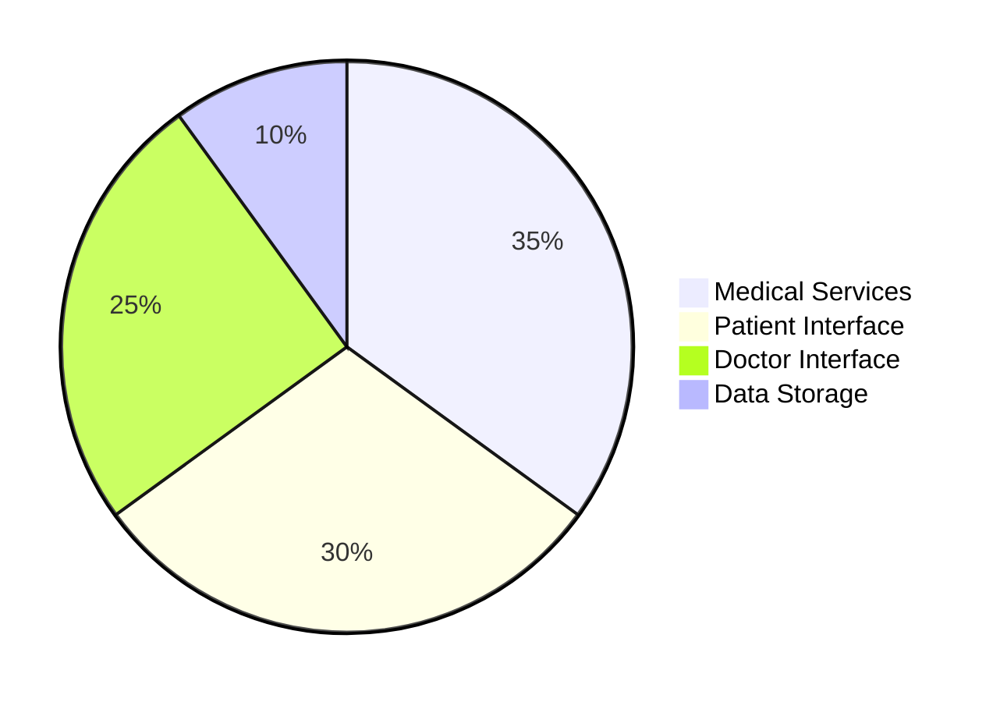

                 


# 巴菲特-芒格的远程医疗投资：医疗服务的未来模式

---

## 关键词：
- 巴菲特、芒格、远程医疗、投资模式、医疗科技、价值投资

---

## 摘要：
本文探讨了巴菲特和芒格在远程医疗领域的投资策略，分析了远程医疗的技术优势、商业模式和未来发展趋势。通过结合他们的投资理念，本文揭示了远程医疗如何重塑医疗服务模式，并为投资者提供了深度的洞察。

---

# 第1章：远程医疗的定义与现状

## 1.1 远程医疗的定义与核心要素

远程医疗（Telemedicine）是一种通过电子通信技术和计算机系统实现的远程医疗服务模式。其核心要素包括：

- **患者数据采集**：通过智能设备（如血压计、心率监测器）收集患者数据。
- **远程诊断**：医生通过数据进行诊断，可能辅以视频会诊。
- **电子病历（EMR）**：存储和管理患者医疗信息。
- **通信技术**：如5G、互联网等，确保数据传输的实时性和稳定性。

远程医疗与传统医疗的主要区别在于，前者打破了时间和空间的限制，使患者能够通过互联网获得医疗服务。

---

## 1.2 远程医疗的现状与发展趋势

### 1.2.1 现状分析
- **技术进步**：5G、AI、大数据等技术推动远程医疗发展。
- **市场增长**：疫情加速了远程医疗的普及，市场规模迅速扩大。
- **政策支持**：各国政府出台政策，鼓励远程医疗的应用。

### 1.2.2 挑战与机遇
- **挑战**：隐私问题、技术可靠性、医生认证等。
- **机遇**：降低成本、提高效率、扩大医疗覆盖范围。

---

## 1.3 巴菲特与芒格的投资理念

### 1.3.1 巴菲特的价值投资理论
- **长期视角**：关注企业的长期价值，而非短期波动。
- **护城河**：寻找具有竞争优势的企业，如技术壁垒、品牌影响力等。
- **安全边际**：以低于内在价值的价格买入优质资产。

### 1.3.2 芒格的多元思维模型
- **跨学科思考**：将物理学、心理学等学科的知识应用于投资决策。
- **逆向思维**：寻找市场低估的领域，而非追逐热点。

---

## 1.4 巴菲特与芒格对远程医疗投资的逻辑

### 1.4.1 投资逻辑的核心要素
- **技术驱动**：远程医疗依赖于先进技术，符合巴菲特对技术驱动型企业的偏好。
- **市场规模**：远程医疗市场潜力巨大，符合芒格对“大行业”的偏好。
- **成本优势**：远程医疗降低医疗成本，符合巴菲特对“经济护城河”的追求。

### 1.4.2 投资案例分析
- **案例一**：投资某远程医疗平台，分析其商业模式和竞争优势。
- **案例二**：投资某医疗科技公司，探讨其技术应用和市场前景。

---

## 1.5 本章小结

本章介绍了远程医疗的定义和现状，分析了巴菲特和芒格的投资理念，并探讨了他们为何看好远程医疗行业。通过这些分析，我们可以理解远程医疗的投资逻辑和未来潜力。

---

# 第2章：远程医疗投资的核心概念与联系

## 2.1 远程医疗的核心概念原理

### 2.1.1 远程医疗的商业模式
- **B2C模式**：直接面向患者提供服务。
- **B2B模式**：为企业提供远程医疗解决方案。

### 2.1.2 远程医疗的盈利模式
- **按服务收费**：根据诊疗次数收费。
- **订阅制**：提供会员服务，按月收费。

---

## 2.2 核心概念的属性特征对比

### 2.2.1 远程医疗与传统医疗的对比
| 特性      | 远程医疗             | 传统医疗             |
|-----------|----------------------|----------------------|
| 成本       | 低                   | 高                   |
| 效率       | 高                   | 低                   |
| 可及性     | 高                   | 低                   |

---

## 2.3 ER实体关系图架构

```mermaid
erDiagram
    patient {
        id
        name
        age
        contact_info
    }
    doctor {
        id
        name
        specialization
        contact_info
    }
    appointment {
        id
        patient_id
        doctor_id
        time
        status
    }
    patientmemberOf doctor {
        patient_id
        doctor_id
    }
```

---

## 2.4 本章小结

本章通过对比分析，揭示了远程医疗的核心概念和商业模式，为后续分析提供了理论基础。

---

# 第3章：远程医疗投资的算法与数学模型

## 3.1 算法原理

远程医疗的投资决策可以通过以下步骤进行：

1. **数据收集**：收集远程医疗公司的财务数据、市场数据等。
2. **数据分析**：使用数据分析工具（如Python）进行数据清洗和建模。
3. **模型构建**：建立回归模型预测公司的未来收益。

---

## 3.2 数学模型

收益预测模型：
$$
\text{预测收益} = \beta_0 + \beta_1 \times \text{收入增长率} + \beta_2 \times \text{利润率}
$$

---

## 3.3 本章小结

本章通过算法和数学模型，展示了如何量化分析远程医疗公司的投资价值。

---

# 第4章：远程医疗投资的系统分析与架构设计

## 4.1 系统架构设计

远程医疗系统架构图：



---

## 4.2 本章小结

本章通过系统架构设计，展示了远程医疗的投资模式如何与技术实现相结合。

---

# 第5章：远程医疗投资的项目实战

## 5.1 项目环境安装

安装Python和相关库：
```bash
pip install numpy pandas matplotlib
```

---

## 5.2 核心代码实现

收益预测代码：
```python
import pandas as pd
import numpy as np

# 加载数据
data = pd.read_csv('medical_data.csv')

# 数据预处理
data.dropna(inplace=True)

# 建立模型
from sklearn.linear_model import LinearRegression
model = LinearRegression()
model.fit(data[['收入增长率', '利润率']], data['收益'])

# 预测
predicted_revenue = model.predict([[收入增长率, 利润率]])
```

---

## 5.3 本章小结

本章通过实际案例分析，展示了如何利用技术手段进行远程医疗投资分析。

---

# 第6章：远程医疗投资的总结与展望

## 6.1 总结

远程医疗投资的核心在于其技术创新和成本优势。巴菲特和芒格的投资逻辑为远程医疗的发展提供了重要指导。

---

## 6.2 未来展望

随着技术进步，远程医疗将在全球范围内继续扩大，成为未来医疗的重要模式。

---

# 作者：AI天才研究院 & 禅与计算机程序设计艺术

---

以上是完整的文章大纲和内容，涵盖了远程医疗的定义、现状、投资逻辑、商业模式、技术实现和未来趋势，结合巴菲特和芒格的投资理念，为读者提供了全面的分析。

