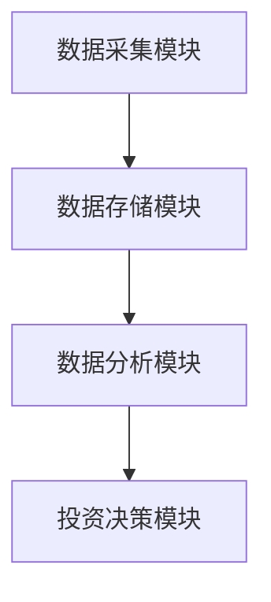

                 


# 巴菲特-芒格的量子传感器农业投资：精准农业的新时代

> 关键词：量子传感器，精准农业，巴菲特，芒格，投资策略，农业现代化，数据驱动决策

> 摘要：本文深入探讨了量子传感器技术在精准农业中的应用，结合巴菲特和芒格的投资理念，分析了如何通过量子传感器实现农业数据的精准采集与分析，从而优化投资决策。文章从量子传感器的基本原理、算法原理、系统架构设计到实际项目案例，详细阐述了精准农业的新时代，并提出了最佳实践和未来展望。

---

## 第一部分: 巴菲特-芒格的量子传感器农业投资背景

### 第1章: 精准农业的背景与发展趋势

#### 1.1 精准农业的背景
- **1.1.1 农业现代化的背景**
  - 随着全球人口增长和资源有限性，传统农业模式已难以满足高效、可持续发展的需求。
  - 精准农业的目标是通过技术手段优化资源利用，提高产量和质量。

- **1.1.2 精准农业的定义**
  - 精准农业（Precision Agriculture）是一种基于地理位置和环境数据的农业管理方法，利用传感器、无人机和数据分析等技术实现精准操作。

- **1.1.3 精准农业的核心目标**
  - 提高资源利用效率（水、肥料、农药等）。
  - 减少环境影响，降低污染。
  - 提高农作物产量和质量。

#### 1.2 量子传感器技术的引入
- **1.2.1 量子传感器的基本原理**
  - 量子传感器利用量子效应测量物理量（如磁场、重力、温度等）。
  - 其灵敏度和精度远高于传统传感器，能够在复杂环境中提供高精度数据。

- **1.2.2 量子传感器在农业中的应用潜力**
  - 土壤检测：测量土壤湿度、养分含量。
  - 气候监测：实时监测温度、湿度、光照等环境参数。
  - 病虫害监测：通过传感器数据早期发现病虫害迹象。

- **1.2.3 量子传感器的优势与局限性**
  - 优势：高精度、灵敏度、实时性。
  - 局限性：成本高、技术复杂、对环境敏感。

#### 1.3 巴菲特与芒格的投资理念
- **1.3.1 巴菲特的价值投资理论**
  - 价值投资：寻找被市场低估的企业，长期持有。
  - 重点分析企业的基本面（财务状况、竞争优势、管理团队）。

- **1.3.2 芒格的多元思维模型**
  - 多元思维：通过跨学科思考，找到问题的解决方案。
  - 强调安全边际，避免高风险投资。

- **1.3.3 投资与农业科技创新的结合**
  - 巴菲特和芒格的投资理念与精准农业的结合，为农业科技创新提供了资金和战略支持。

---

## 第二部分: 量子传感器与精准农业的核心概念

### 第2章: 核心概念的定义与属性对比

#### 2.1 核心概念的定义与属性对比
- **量子传感器与传统传感器的对比**
  | 属性 | 量子传感器 | 传统传感器 |
  |------|------------|------------|
  | 精度 | 高 | 一般 |
  | 成本 | 高 | 低 |
  | 应用范围 | 高精度需求场景 | 广泛适用 |

- **精准农业与传统农业的对比**
  | 属性 | 精准农业 | 传统农业 |
  |------|------------|------------|
  | 数据利用 | 高度依赖数据 | 依赖经验 |
  | 资源利用 | 高效 | 低效 |
  | 技术含量 | 高 | 低 |

- **量子传感器在精准农业中的角色**
  - 数据采集：提供高精度环境数据。
  - 决策支持：通过数据分析优化农业管理。

#### 2.2 实体关系图
- **量子传感器与农业环境的关系**
  ```mermaid
  graph TD
  A[量子传感器] --> B[土壤湿度]
  A --> C[光照强度]
  A --> D[温度]
  ```

- **农业数据与投资决策的关系**
  ```mermaid
  graph TD
  E[农业数据] --> F[投资决策]
  ```

- **农业企业与投资者的关系**
  ```mermaid
  graph TD
  G[农业企业] --> H[投资者]
  ```

---

## 第三部分: 量子传感器数据处理的算法原理

### 第3章: 数据处理流程

#### 3.1 数据采集阶段
- 量子传感器实时采集环境数据（如土壤湿度、光照强度）。
- 数据格式：结构化数据（时间戳、传感器ID、测量值）。

#### 3.2 数据预处理阶段
- 清洗数据：去除异常值和噪声。
- 转换数据：将原始数据转换为易于分析的形式（如归一化）。

#### 3.3 数据分析阶段
- 数据分类：将土壤类型分为湿润、干燥等类别。
- 数据回归：预测未来土壤湿度变化趋势。

### 第4章: 数据分析算法

#### 4.1 数据分类算法
- K-近邻算法（KNN）：
  ```python
  def classify_knn(data, k):
      # 数据预处理和标准化
      # 找出k个最近邻的数据点
      # 根据多数投票分类
      return label
  ```

- 数据分类的数学公式：
  $$ P(y|x) = \frac{P(x|y)P(y)}{P(x)} $$

#### 4.2 数据回归算法
- 线性回归：
  ```python
  def linear_regression(x, y):
      # 计算回归系数
      return slope, intercept
  ```

- 数据回归的数学公式：
  $$ y = \beta_0 + \beta_1x + \epsilon $$

#### 4.3 数据聚类算法
- K-means算法：
  ```python
  def kmeans_clustering(data, k):
      # 初始化质心
      # 迭代计算最近质心的数据点
      return clusters
  ```

---

## 第四部分: 系统分析与架构设计

### 第5章: 系统分析与架构设计

#### 5.1 问题场景介绍
- **农业数据采集问题**
  - 如何高效采集和处理农业数据？
- **数据分析与投资决策问题**
  - 如何利用数据优化投资决策？

#### 5.2 系统功能设计
- **数据采集模块**
  - 采集土壤湿度、光照强度等数据。
- **数据分析模块**
  - 数据清洗、分类、回归、聚类。
- **投资决策模块**
  - 根据数据生成投资建议。

#### 5.3 系统架构设计


---

## 第五部分: 项目实战与案例分析

### 第6章: 项目实战

#### 6.1 环境安装与配置
- 安装Python和相关库（如NumPy、Pandas、Scikit-learn）。
- 配置量子传感器硬件。

#### 6.2 系统核心实现
- 数据采集：
  ```python
  import numpy as np
  def collect_data(sensor_id):
      # 与传感器通信，获取数据
      return data
  ```

- 数据分析：
  ```python
  def analyze_data(data):
      # 数据清洗和预处理
      # 数据分类或回归
      return result
  ```

#### 6.3 案例分析
- 某农业企业使用量子传感器优化灌溉系统，节省了30%的水资源。

---

## 第六部分: 最佳实践与展望

### 第7章: 最佳实践

#### 7.1 投资建议
- 量子传感器技术具有高潜力，但成本较高，需谨慎评估。

#### 7.2 注意事项
- 数据隐私和安全问题需重视。
- 技术的可扩展性和可持续性需考虑。

#### 7.3 拓展阅读
- 量子计算在农业中的应用。
- 人工智能与精准农业的结合。

---

## 作者信息

作者：AI天才研究院/AI Genius Institute & 禅与计算机程序设计艺术 /Zen And The Art of Computer Programming

---

这篇文章通过结合量子传感器技术、精准农业和巴菲特-芒格的投资理念，详细分析了精准农业的新时代。从技术原理到实际应用，再到投资策略，为读者提供了全面的视角。

