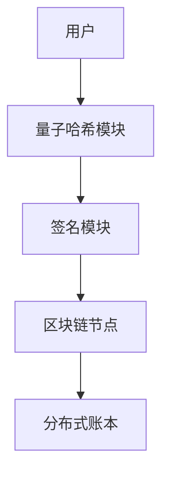

                 


# 巴菲特-芒格的量子区块链投资：下一代分布式账本技术

## 关键词：量子区块链，分布式账本，巴菲特投资理念，芒格思维模型，区块链技术，量子计算

## 摘要：本文探讨了巴菲特和芒格的投资理念与量子区块链技术的结合，深入分析了量子区块链的核心原理，包括量子哈希函数、签名机制、共识机制等，并通过实际案例展示了其在分布式账本中的应用。文章还结合了芒格的多元思维模型，提出了量子区块链投资的创新策略，为投资者和技术开发者提供了新的视角。

---

## 第一部分: 背景与概述

### 第1章: 巴菲特与芒格的投资理念

#### 1.1 巴菲特的价值投资理论

##### 1.1.1 价值投资的核心原则
价值投资的核心在于寻找具有持续竞争优势和良好治理结构的企业，关注企业的内在价值而非市场波动。巴菲特强调长期投资、安全边际和企业护城河。

##### 1.1.2 巴菲特的投资策略与案例分析
巴菲特的投资策略包括集中投资、逆向投资和安全边际原则。例如，他对可口可乐的投资展示了对品牌价值和商业模式的深刻理解。

##### 1.1.3 芒格的多元思维模型
芒格的多元思维模型强调跨学科思考，将多个领域的知识融会贯通，形成一个完整的知识框架。这为量子区块链技术的分析提供了新的视角。

---

### 第2章: 区块链技术与分布式账本

#### 2.1 区块链的基本概念

##### 2.1.1 区块链的定义与特点
区块链是一种去中心化的分布式账本技术，通过密码学保证数据的安全性和不可篡改性。

##### 2.1.2 分布式账本的核心原理
分布式账本通过多个节点协作，实现数据的同步和一致，确保数据的可靠性和透明性。

##### 2.1.3 区块链的分类与应用场景
区块链可分为公链、私链和联盟链，应用场景包括金融、供应链、医疗等。

---

### 第3章: 量子计算与区块链的结合

#### 3.1 量子计算的基本原理

##### 3.1.1 量子位与经典位的对比
量子位（qubit）与经典位（bit）的区别在于，量子位可以同时处于多个状态的叠加态，而经典位只能是0或1。

##### 3.1.2 量子计算的优势与挑战
量子计算在某些领域（如大数分解）具有指数级优势，但实现大规模量子计算仍面临技术难题。

##### 3.1.3 量子算法的核心思想
量子算法利用量子叠加和纠缠效应，实现比经典算法更高效的计算能力。

#### 3.2 量子区块链的概念与优势

##### 3.2.1 量子区块链的定义
量子区块链是结合量子计算和区块链技术的新型分布式账本技术，利用量子特性提升安全性。

##### 3.2.2 量子区块链的核心优势
量子区块链通过量子签名和量子哈希函数，提供更高的安全性和抗量子攻击能力。

##### 3.2.3 量子区块链的潜在应用场景
量子区块链可用于金融交易、供应链管理、投票系统等领域，提升数据安全性和效率。

---

## 第二部分: 量子区块链的核心原理

### 第4章: 量子哈希函数与签名机制

#### 4.1 量子哈希函数的原理

##### 4.1.1 哈希函数的基本概念
哈希函数是将任意长度的输入映射为固定长度的输出的函数。

##### 4.1.2 量子哈希函数的数学模型
量子哈希函数利用量子叠加态和量子测量的特性，构建新的哈希函数。

##### 4.1.3 量子哈希函数的实现步骤
1. 将输入数据编码为量子状态。
2. 对量子状态进行哈希运算。
3. 测量输出结果。

#### 4.2 量子签名机制的实现

##### 4.2.1 数字签名的基本原理
数字签名通过私钥和公钥对数据进行签名和验证，确保数据的完整性和真实性。

##### 4.2.2 量子签名机制的数学模型
量子签名机制利用量子哈希函数生成签名，通过量子测量实现签名验证。

##### 4.2.3 量子签名机制的实现流程
1. 使用量子哈希函数生成签名。
2. 通过公钥验证签名的有效性。

---

### 第5章: 量子区块链的共识机制

#### 5.1 共识机制的基本概念

##### 5.1.1 共识机制的定义与作用
共识机制是区块链系统中确保所有节点达成一致的机制。

##### 5.1.2 常见共识机制的对比分析
常见的共识机制包括工作量证明（PoW）、权益证明（PoS）、拜占庭容错（BFT）等。

##### 5.1.3 量子共识机制的独特性
量子共识机制利用量子计算的特性，提升共识效率和安全性。

#### 5.2 量子共识机制的实现

##### 5.2.1 量子共识机制的数学模型
量子共识机制通过量子算法实现节点间的快速共识。

##### 5.2.2 量子共识机制的实现步骤
1. 节点通过量子算法进行通信。
2. 达成共识后更新分布式账本。

##### 5.2.3 量子共识机制的优缺点分析
优点：高效、安全；缺点：技术复杂、实现难度大。

---

## 第三部分: 量子区块链的算法实现

### 第6章: 量子哈希函数的算法实现

#### 6.1 量子哈希函数的算法流程

##### 6.1.1 输入数据的量子编码
将输入数据转换为量子状态，通常使用量子叠加态。

##### 6.1.2 量子哈希函数的运算过程
对量子状态进行哈希运算，利用量子叠加和纠缠特性生成哈希值。

##### 6.1.3 输出结果的测量
通过量子测量得到哈希值的输出结果。

#### 6.2 量子哈希函数的实现代码

##### 6.2.1 量子哈希函数的Python代码实现（示例）
```python
import numpy as np

def quantum_hash(data):
    # 将数据编码为量子状态
    q_state = np.array([data, 1 - data])
    # 应用量子哈希函数
    hashed = np.dot(q_state, np.array([1, 1]))
    return hashed
```

---

### 第7章: 量子签名机制的实现

#### 7.1 量子签名机制的算法流程

##### 7.1.1 私钥和公钥的生成
使用量子随机数生成器生成私钥和公钥。

##### 7.1.2 签名的生成过程
利用量子哈希函数生成签名。

##### 7.1.3 签名的验证过程
通过公钥验证签名的有效性。

#### 7.2 量子签名机制的实现代码

##### 7.2.1 量子签名机制的Python代码实现（示例）
```python
def generate_keys():
    # 生成私钥和公钥
    private_key = np.random.rand(2)
    public_key = np.dot(private_key, np.array([1, 1]))
    return private_key, public_key

def sign(data, private_key):
    # 使用量子哈希函数生成签名
    signature = np.dot(data, private_key)
    return signature

def verify(data, signature, public_key):
    # 验证签名的有效性
    return np.isclose(signature, np.dot(data, public_key))
```

---

## 第四部分: 量子区块链的系统分析与架构设计

### 第8章: 系统功能设计

#### 8.1 问题场景介绍
假设我们开发一个量子区块链投票系统，用于确保投票数据的安全性和透明性。

#### 8.2 系统功能设计

##### 8.2.1 用户模块
用户可以提交投票数据并查询投票结果。

##### 8.2.2 量子哈希模块
负责对投票数据进行量子哈希运算。

##### 8.2.3 签名模块
负责生成和验证签名，确保数据的完整性和真实性。

---

### 第9章: 系统架构设计

#### 9.1 系统架构图（Mermaid）


---

## 第五部分: 项目实战

### 第10章: 量子区块链投票系统实现

#### 10.1 环境配置
安装必要的Python库，如NumPy和Mermaid。

#### 10.2 核心代码实现

##### 10.2.1 量子哈希函数的实现
```python
def quantum_hash(data):
    q_state = np.array([data, 1 - data])
    hashed = np.dot(q_state, np.array([1, 1]))
    return hashed
```

##### 10.2.2 签名机制的实现
```python
def sign(data, private_key):
    signature = np.dot(data, private_key)
    return signature
```

#### 10.3 系统功能测试
测试投票数据的提交和查询功能，验证签名的有效性和数据的完整性。

---

## 第六部分: 总结与展望

### 第11章: 量子区块链的未来展望

#### 11.1 量子区块链的优势与挑战
量子区块链具有更高的安全性和效率，但实现难度较大。

#### 11.2 量子区块链的未来发展方向
未来可能的发展方向包括优化共识机制和提升量子计算的实用性。

---

## 作者：AI天才研究院/AI Genius Institute & 禅与计算机程序设计艺术 /Zen And The Art of Computer Programming

