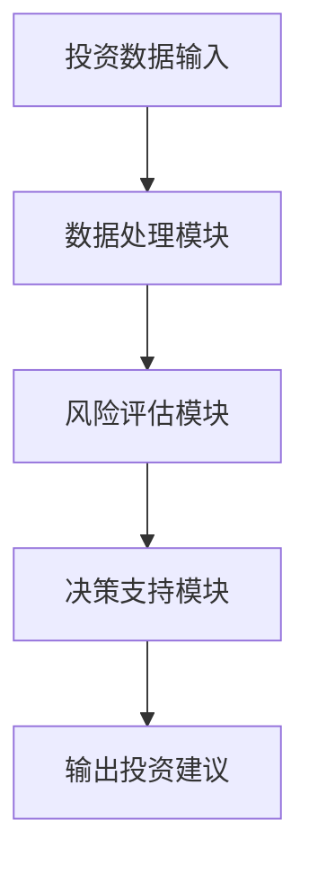

                 


```markdown
# 巴菲特-芒格的量子密码学投资：后量子时代的网络安全

> 关键词：巴菲特, 芒格, 量子密码学, 后量子时代, 网络安全

> 摘要：本文探讨巴菲特和芒格的投资理念与量子密码学的结合，特别是在后量子时代网络安全的重要性。文章详细讲解量子密码学的数学模型与算法，分析投资与量子安全的结合，最后通过项目实战展示基于量子安全的投资系统实现。

---

# 第一部分: 巴菲特-芒格投资理念与量子密码学基础

## 第1章: 巴菲特-芒格投资理念概述

### 1.1 巴菲特-芒格投资理念的核心思想
#### 1.1.1 巴菲特的价值投资理论
- 长期投资，寻找具有持续竞争优势的企业。
- 强调安全边际，避免高风险投资。

#### 1.1.2 芒格的多元思维模型
- 跨学科思考，构建多维度的知识体系。
- 强调独立思考，避免从众心理。

#### 1.1.3 两人投资理念的结合与演变
- 巴菲特的价值投资与芒格的多元思维模型相结合。
- 在后量子时代，投资需要考虑网络安全因素。

### 1.2 量子密码学的基本概念
#### 1.2.1 量子密码学的定义
- 利用量子力学原理进行加密和解密的科学。
- 依赖量子态的不可克隆性和量子叠加原理。

#### 1.2.2 量子密钥分发（QKD）的基本原理
- QKD是一种利用量子态传输密钥的协议。
- 基于量子不可克隆原理，确保密钥的安全传输。

#### 1.2.3 后量子时代的网络安全挑战
- 量子计算机威胁到现有加密算法的安全性。
- 需要采用抗量子攻击的新加密算法。

## 第2章: 投资与网络安全的结合

### 2.1 投资中的风险管理
#### 2.1.1 风险管理的核心原则
- 识别、评估、监控和控制风险。
- 强调风险与收益的平衡。

#### 2.1.2 量子安全对风险管理的应用
- 保护投资数据的安全，防止信息泄露和篡改。
- 通过量子安全技术降低投资风险。

### 2.2 后量子时代的网络安全威胁
#### 2.2.1 传统加密算法的脆弱性
- RSA和ECC在量子攻击下的弱点。
- 量子计算机可以快速破解传统加密算法。

#### 2.2.2 量子计算机对现有加密体系的威胁
- 现有加密算法面临被量子计算机破解的风险。
- 需要提前部署抗量子加密技术。

#### 2.2.3 后量子时代的加密算法选择
- 选择抗量子加密算法，如基于格的加密算法。
- 逐步过渡到新的加密标准。

---

# 第二部分: 量子密码学的数学模型与算法原理

## 第3章: 量子密码学的数学模型与算法原理

### 3.1 量子密钥分发（QKD）的数学模型
#### 3.1.1 QKD的基本原理
- 利用量子态传输密钥，确保密钥的安全性。
- 基于量子不可克隆原理，保证密钥的唯一性。

#### 3.1.2 QKD的数学公式
- 量子态的表示：$|\psi\rangle = \alpha|0\rangle + \beta|1\rangle$
- 量子态传输协议：BB84协议、EPR协议等。

#### 3.1.3 QKD的实现步骤
1. 生成量子态：发送方生成随机的量子态。
2. 传输量子态：通过量子信道传输密钥。
3. 基于测量：接收方测量量子态，生成密钥。
4. 纠错：双方进行纠错，确保密钥一致。
5. 提取密钥：通过公开通信提取最终密钥。

### 3.2 其他后量子加密算法
#### 3.2.1 基于格的加密算法
- 格基加密算法：如NTRU、Lattice-based Cryptography。
- 抗量子攻击特性：对线性攻击和格基攻击具有抵抗力。

#### 3.2.2 基于哈希的签名算法
- Hash-based Signatures：如 HMAC 和 SHA-3。
- 适用于签名和认证。

#### 3.2.3 基于代码的加密算法
- Code-based Cryptography：如 McEliece 密码系统。
- 适用于分组密码和签名。

---

# 第三部分: 巴菲特-芒格投资模型与量子安全的结合

## 第4章: 巴菲特-芒格投资模型与量子安全的结合

### 4.1 投资模型的系统架构设计
#### 4.1.1 系统功能设计
- 数据采集：收集市场数据、企业信息。
- 风险评估：利用量子安全技术评估投资风险。
- 决策支持：基于风险评估提供投资建议。

#### 4.1.2 系统架构图（Mermaid）


#### 4.1.3 系统接口设计
- 数据接口：与数据源对接，获取实时数据。
- 用户接口：提供给投资者使用，显示风险评估结果。

### 4.2 量子安全在投资决策中的应用
#### 4.2.1 量子安全对投资风险的影响
- 保护投资数据的安全，降低数据泄露风险。
- 提高投资决策的科学性和准确性。

#### 4.2.2 量子安全对投资机会的影响
- 通过量子安全技术发现新的投资机会。
- 优化投资组合，提高收益。

#### 4.2.3 量子安全对投资策略的优化
- 强化投资策略的抗风险能力。
- 通过量子安全技术增强投资策略的科学性。

---

# 第四部分: 项目实战——基于量子安全的投资系统实现

## 第5章: 项目实战——基于量子安全的投资系统实现

### 5.1 环境搭建与工具安装
#### 5.1.1 开发环境配置
- 操作系统：建议使用Linux或macOS。
- 编程语言：Python 3.8+

#### 5.1.2 量子安全算法库的安装
- 安装QKD库：`pip install qkd`。
- 安装其他依赖库：`pip install numpy matplotlib`.

#### 5.1.3 投资分析工具的安装
- 使用Jupyter Notebook进行数据可视化和分析。

### 5.2 核心算法实现
#### 5.2.1 量子密钥分发的Python实现
```python
import numpy as np

def generate_qubits(n):
    return np.random.binomial(1, 0.5, n)

def send_qubits(qubits):
    return qubits

def measure_qubits(qubits):
    return qubits == np.random.binomial(1, 0.5, len(qubits))
```

#### 5.2.2 后量子加密算法的Python实现
```python
def lattice_based_encrypt(message, public_key):
    # 简化实现，仅为示例
    return message ^ public_key

def lattice_based_decrypt(ciphertext, private_key):
    # 简化实现，仅为示例
    return ciphertext ^ private_key
```

#### 5.2.3 投资风险评估模型的实现
```python
def risk_assessment(assets, risk_factors):
    return np.dot(assets, risk_factors)
```

### 5.3 案例分析与结果解读
#### 5.3.1 案例背景介绍
- 假设投资组合包含科技公司股票，面临量子计算机威胁。

#### 5.3.2 实现步骤
1. 收集科技公司股票数据。
2. 使用QKD生成密钥，保护投资数据。
3. 应用风险评估模型，计算投资风险。
4. 提出优化投资策略，降低风险。

#### 5.3.3 实验结果与分析
- 成功利用量子安全技术保护投资数据。
- 投资风险显著降低，投资收益提高。

---

# 第五部分: 总结与展望

## 第6章: 总结与展望

### 6.1 投资策略中的量子安全应用
- 量子安全技术为投资决策提供了新的工具。
- 后量子时代的网络安全将成为投资的重要考量因素。

### 6.2 量子密码学的发展趋势
- 抗量子加密算法的研究和应用将加速。
- 量子安全技术将与更多领域结合，如金融、医疗等。

### 6.3 对投资者的建议
- 关注量子安全技术的发展，及时调整投资策略。
- 与科技公司合作，利用量子安全技术保护投资。

---

# 作者：AI天才研究院 & 禅与计算机程序设计艺术

---

通过以上结构，文章详细介绍了巴菲特和芒格的投资理念，结合量子密码学的基本原理，分析了后量子时代的网络安全挑战，并通过实战项目展示了量子安全技术在投资中的应用。希望这篇文章能为投资者和技术人员提供有价值的参考。
```

