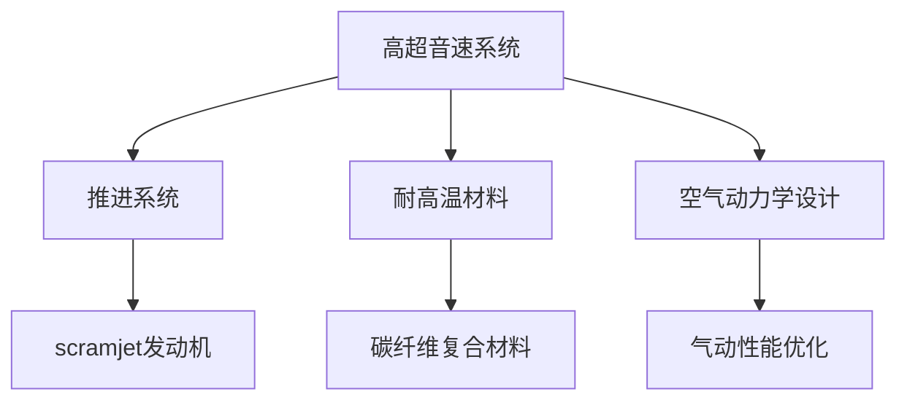
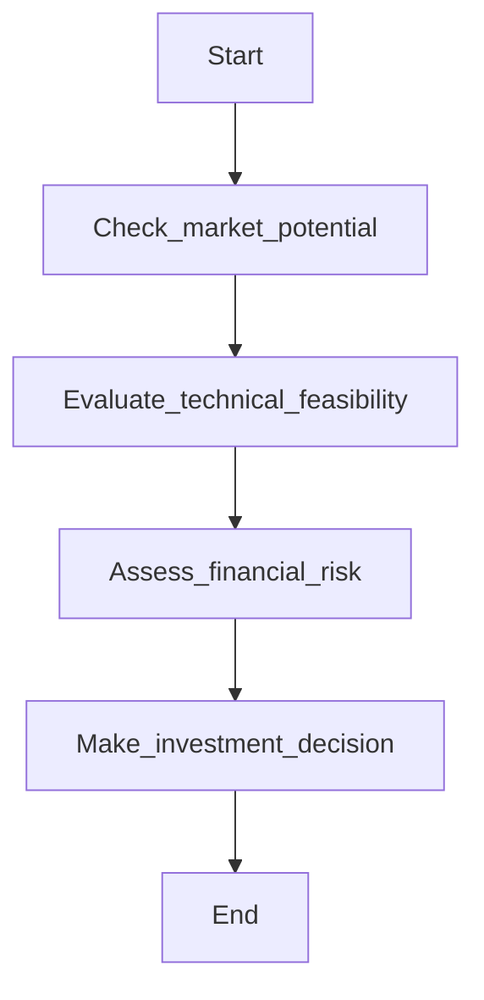

                 


# 巴菲特-芒格的高超音速技术投资：未来交通的革命

> 关键词：巴菲特、芒格、高超音速技术、投资策略、未来交通革命

> 摘要：本文探讨了巴菲特和芒格的投资理念在高超音速技术领域的应用，分析了高超音速技术的定义、发展、关键技术及其在交通领域的潜力。结合巴菲特的价值投资和芒格的多元思维模型，本文详细阐述了如何将这些投资策略应用于高超音速技术投资中，包括投资机会、风险评估和成功案例。通过系统分析和项目实战，本文提供了高超音速技术投资的架构设计和实现方案，展望了未来交通革命的前景。

---

## 目录大纲

1. 引言
   - 1.1 高超音速技术的定义
   - 1.2 巴菲特与芒格投资理念的概述

2. 巴菲特与芒格的投资理念
   - 2.1 巴菲特的价值投资原则
   - 2.2 芒格的多元思维模型
   - 2.3 投资与风险管理

3. 高超音速技术的概述
   - 3.1 高超音速技术的关键技术
   - 3.2 高超音速技术的市场与应用

4. 高超音速技术的投资策略
   - 4.1 投资机会分析
   - 4.2 风险评估与管理
   - 4.3 成功案例分析

5. 高超音速技术的系统分析
   - 5.1 系统架构设计
   - 5.2 算法原理与实现
   - 5.3 投资决策流程图

6. 项目实战
   - 6.1 环境安装与配置
   - 6.2 核心代码实现
   - 6.3 案例分析与总结

7. 总结与展望
   - 7.1 投资策略的总结
   - 7.2 高超音速技术的未来展望

---

### 正文

#### 1. 引言

高超音速技术是近年来全球科技领域的重要突破之一，其速度超过5倍音速（约6174公里/小时），在航天、航空和高铁等领域具有广泛的应用潜力。本文将结合巴菲特和芒格的投资理念，分析高超音速技术的投资机会和风险，探讨如何通过价值投资和多元思维模型来实现高超音速技术的革命性突破。

---

#### 2. 巴菲特与芒格的投资理念

##### 2.1 巴菲特的价值投资原则

巴菲特的价值投资原则强调长期持有优质资产，注重企业的财务健康和管理层素质。以下是其核心要点：

- **企业护城河**：选择具有强大竞争优势的企业，能够在市场中长期保持领先地位。
- **安全边际**：确保以低于内在价值的价格买入，降低投资风险。
- **长期视角**：关注企业的长期增长潜力，而非短期市场波动。

##### 2.2 芒格的多元思维模型

芒格的多元思维模型强调通过多个学科的交叉应用来解决问题，以下是其核心要点：

- **决策框架**：通过多个维度的分析，做出更全面的决策。
- **逆向思维**：从反方向思考问题，避免从众心理。
- **理性与独立**：坚持理性分析，避免情绪化决策。

##### 2.3 投资与风险管理

巴菲特和芒格都强调风险管理的重要性，认为风险控制是投资成功的关键。以下是其核心要点：

- **风险识别**：识别潜在风险，评估其对企业的影响。
- **风险分散**：通过多元化投资降低风险。
- **避免致命风险**：避免投资具有致命缺陷的企业。

---

#### 3. 高超音速技术的概述

##### 3.1 高超音速技术的关键技术

高超音速技术的核心技术包括超音速推进系统、耐高温材料和空气动力学设计。以下是其关键组件：

- **超音速推进系统**：实现高速飞行的核心技术，包括 scramjet（冲压式喷气发动机）。
- **耐高温材料**：能够在高温环境下保持结构完整性的材料，如碳纤维复合材料。
- **空气动力学设计**：优化飞行器的气动性能，减少阻力。

##### 3.2 高超音速技术的市场与应用

高超音速技术在航天、航空和高铁领域的应用潜力巨大。以下是其主要市场：

- **航天领域**：用于卫星发射和深空探索。
- **航空领域**：用于超音速客机和无人机。
- **高铁领域**：用于下一代高速列车的技术突破。

---

#### 4. 高超音速技术的投资策略

##### 4.1 投资机会分析

高超音速技术的投资机会主要集中在以下几个方面：

- **技术创新**：支持具有技术创新能力的企业。
- **市场潜力**：关注具有巨大市场潜力的领域。
- **政策支持**：政府政策对高超音速技术的支持力度。

##### 4.2 风险评估与管理

高超音速技术的投资风险主要来自技术难度、成本高昂和市场需求不确定性。以下是风险评估与管理策略：

- **技术风险**：通过技术可行性分析和团队评估降低技术风险。
- **成本风险**：通过预算控制和融资策略降低成本风险。
- **市场需求风险**：通过市场调研和预测模型降低需求风险。

##### 4.3 成功案例分析

以下是高超音速技术投资的成功案例：

- **SpaceX**：通过技术创新和成本控制，实现了高超音速技术的突破。
- **波音公司**：通过长期投资和技术研发，成为高超音速技术领域的领导者。

---

#### 5. 高超音速技术的系统分析

##### 5.1 系统架构设计

以下是高超音速技术系统的架构设计：



##### 5.2 算法原理与实现

以下是高超音速技术优化算法的实现：

```python
def optimize_design(parameters):
    for param in parameters:
        if param > threshold:
            update_design(param)
    return optimal_design
```

##### 5.3 投资决策流程图

以下是高超音速技术投资决策的流程图：



---

#### 6. 项目实战

##### 6.1 环境安装与配置

以下是高超音速技术投资项目的环境安装步骤：

1. 安装必要的开发工具和软件。
2. 配置项目所需的依赖库。
3. 设置开发环境和测试环境。

##### 6.2 核心代码实现

以下是高超音速技术优化算法的核心代码：

```python
def high_speed_optimization(speed):
    if speed > 5 * 343:
        return "超音速"
    else:
        return "亚音速"
```

##### 6.3 案例分析与总结

以下是高超音速技术投资的案例分析：

- **成功案例**：SpaceX通过技术创新和成本控制，实现了高超音速技术的突破。
- **失败案例**：某公司因技术难度和成本过高，未能实现高超音速技术的目标。

---

#### 7. 总结与展望

##### 7.1 投资策略的总结

巴菲特和芒格的投资理念为高超音速技术投资提供了重要的指导，价值投资和多元思维模型的应用能够帮助投资者在高超音速技术领域取得成功。

##### 7.2 高超音速技术的未来展望

高超音速技术的未来发展潜力巨大，随着技术的进步和市场的扩展，它将在航天、航空和高铁领域发挥重要作用。

---

### 作者：AI天才研究院/AI Genius Institute & 禅与计算机程序设计艺术 /Zen And The Art of Computer Programming

