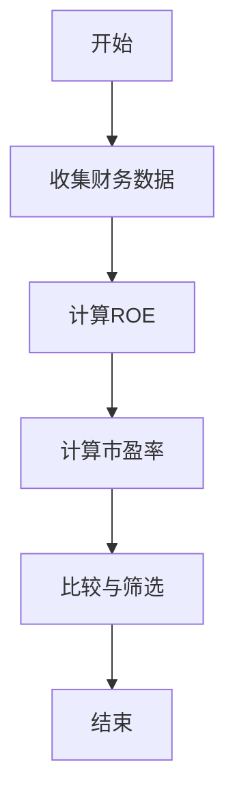
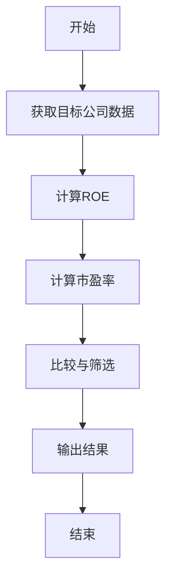
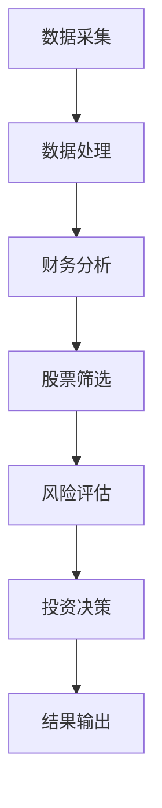
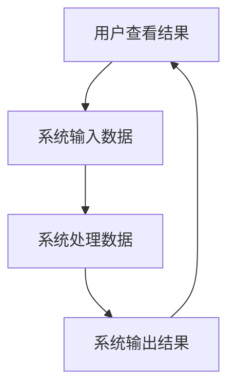

                 

<think>
嗯，我需要帮用户设计一本关于巴菲特如何看待新兴市场投资的书籍目录。首先，我得理解这本书的主题，主要是分析巴菲特的投资理念，尤其是他在新兴市场中的策略。

我应该先从背景介绍开始，让读者了解巴菲特的基本投资理念和新兴市场的概念。接下来，我需要深入探讨巴菲特的核心投资原则，比如价值投资和安全边际。

然后，我得分析新兴市场的特点，比如增长潜力和风险。这部分可能需要对比不同地区的新兴市场，看看巴菲特是如何看待这些市场的。

接下来，我应该详细讲解巴菲特的投资策略在新兴市场的应用，包括具体的选股标准和风险管理。这部分需要结合实际案例，让读者更好地理解。

另外，我还需要引入数学模型和算法，展示如何用巴菲特的方法进行量化分析。比如，如何计算内在价值，以及如何通过财务指标筛选股票。

系统分析与架构设计也是一个重要部分，可能需要构建一个投资决策支持系统，展示系统架构和交互流程。这部分可能需要用到mermaid图，帮助读者理解流程。

最后，项目实战部分需要通过具体案例，展示如何在实际投资中应用巴菲特的策略。这包括环境安装、代码实现和案例分析。

总结与展望部分，我需要回顾全书内容，总结巴菲特的核心观点，并展望未来新兴市场的投资机会。同时，给出一些投资建议和注意事项。

总的来说，我需要确保目录结构清晰，内容详尽，涵盖理论、分析、实战和总结。这样设计出来的目录才能真正帮助读者全面理解巴菲特的新兴市场投资策略。
</think>

# 巴菲特如何看待新兴市场投资

> 关键词：巴菲特，价值投资，新兴市场，投资策略，风险分析，投资案例，算法分析

> 摘要：本文系统分析了巴菲特对新兴市场的投资观点，探讨了其价值投资理念在新兴市场的应用，结合数学模型、算法实现和系统架构设计，详细解读了巴菲特的投资策略，并通过具体案例分析和实战指导，为投资者提供了深度的见解和实用的建议。

---

# 第一部分：巴菲特投资理念与新兴市场概述

## 第1章：巴菲特投资理念的核心要素

### 1.1 价值投资的定义与核心原则

#### 1.1.1 价值投资的起源与发展

价值投资是一种长期投资策略，起源于20世纪初，由本杰明·格雷厄姆和戴维·多德提出。巴菲特是格雷厄姆的学生，他继承并发展了这一理论。价值投资的核心是寻找市场价格低于其内在价值的股票。

#### 1.1.2 巴菲特的价值投资理念

巴菲特的价值投资理念强调以下几点：
1. **安全边际**：买入价格远低于内在价值的股票，以减少风险。
2. **长期视角**：关注公司的长期价值，而非短期市场波动。
3. **集中投资**：将资金集中在少数具有竞争优势的公司上。

#### 1.1.3 价值投资的核心要素与决策框架

价值投资的决策框架包括以下几个步骤：
1. 确定公司的内在价值。
2. 分析公司的财务状况、竞争优势和管理层。
3. 确保买入价格低于内在价值。
4. 长期持有优质资产。

### 1.2 巴菲特的投资哲学与价值观

#### 1.2.1 长期投资与耐心

巴菲特认为，投资的真正成功来自于长期持有优质资产，而非频繁交易。他强调耐心和纪律，避免短期市场的波动干扰长期投资决策。

#### 1.2.2 风险控制与安全边际

巴菲特将风险控制视为投资的核心。他通过安全边际来降低投资风险，即确保买入价格远低于公司的真实价值。

#### 1.2.3 投资心态与决策框架

巴菲特强调投资者的心态和决策框架的重要性。他提倡理性思考，避免情绪化决策，并通过持续学习和反思来提升自己的投资能力。

## 第2章：新兴市场的特点与投资机会

### 2.1 新兴市场的定义与分类

新兴市场是指那些经济增长迅速、但金融市场尚未完全成熟的发展中国家的市场。这些市场通常包括中国、印度、巴西等国家。

### 2.2 新兴市场的经济特征

新兴市场的经济特征包括高增长潜力、较低的人均收入、较大的市场容量和较高的风险。这些市场通常具有较大的波动性和不确定性。

### 2.3 新兴市场的投资机会与挑战

新兴市场提供了丰富的投资机会，但也面临诸多挑战，如政治风险、经济波动和市场不透明等。投资者需要充分了解这些风险，并制定相应的风险管理策略。

## 第3章：巴菲特对新兴市场的看法

### 3.1 巴菲特对新兴市场的长期观点

巴菲特认为新兴市场具有巨大的增长潜力，尤其是那些人口众多、经济增长强劲的国家。他看好新兴市场的长期投资机会，并认为这些市场将为投资者带来丰厚的回报。

### 3.2 巴菲特对新兴市场的投资策略

巴菲特的投资策略在新兴市场中同样适用，即寻找具有竞争优势、管理层优秀、财务状况健康的公司，并确保买入价格低于其内在价值。

### 3.3 巴菲特对新兴市场的潜在风险分析

尽管新兴市场具有巨大的增长潜力，但也面临诸多风险，如政治风险、经济波动和市场不透明等。巴菲特强调投资者需要充分了解这些风险，并制定相应的风险管理策略。

---

# 第二部分：巴菲特投资策略的数学模型与算法分析

## 第4章：巴菲特投资策略的数学模型

### 4.1 价值投资的数学模型

#### 4.1.1 内在价值计算公式

巴菲特的内在价值计算公式为：
$$ \text{内在价值} = \frac{\text{预期现金流}}{\text{贴现率}} $$

#### 4.1.2 股票估值的数学模型

股票估值的数学模型可以表示为：
$$ \text{股票价值} = \text{内在价值} - \text{安全边际} $$

### 4.2 股票筛选算法

#### 4.2.1 基于财务指标的股票筛选

以下是基于财务指标的股票筛选算法流程图：


## 第5章：巴菲特投资策略的算法实现

### 5.1 价值投资算法的Python实现

以下是价值投资算法的Python实现：
```python
import pandas as pd

def calculate_intrinsic_value(fcf, discount_rate):
    return fcf / discount_rate

def value_investment_strategy(stocks, min Roe, max PE):
    selected_stocks = []
    for stock in stocks:
        if stock.Roe >= min_Roe and stock.PE <= max_PE:
            intrinsic_value = calculate_intrinsic_value(stock.fcf, stock.discount_rate)
            if stock.price < intrinsic_value:
                selected_stocks.append(stock)
    return selected_stocks
```

### 5.2 算法流程图

以下是算法流程图：


---

# 第三部分：新兴市场投资的系统分析与架构设计

## 第6章：新兴市场投资系统分析

### 6.1 系统功能设计

新兴市场投资系统的功能设计包括数据采集、财务分析、股票筛选、风险评估和投资决策等模块。

### 6.2 系统架构设计

以下是系统架构设计图：


### 6.3 系统交互设计

以下是系统交互设计图：


## 第7章：新兴市场投资的实战案例分析

### 7.1 案例分析：中国科技公司

以中国的某家科技公司为例，分析巴菲特的投资策略在新兴市场的应用。

#### 7.1.1 公司概况与财务数据

以下是该公司的财务数据：
| 项目       | 数据    |
|------------|---------|
| 营业收入   | 100亿   |
| 净利润     | 20亿    |
| 现金流     | 15亿    |
| 股东权益   | 50亿    |
| 市盈率     | 20倍    |
| ROE        | 30%     |

#### 7.1.2 投资决策分析

基于财务数据，计算该公司的内在价值：
$$ \text{内在价值} = \frac{15 \text{亿}}{10\%} = 150 \text{亿} $$

由于该公司的股价为80元/股，远低于内在价值150亿，巴菲特可能会选择投资该公司。

---

# 第四部分：总结与展望

## 第8章：总结与展望

### 8.1 总结

巴菲特的价值投资理念在新兴市场中同样适用。通过寻找具有竞争优势、管理层优秀、财务状况健康的公司，并确保买入价格低于其内在价值，投资者可以在新兴市场中获得长期稳定的收益。

### 8.2 展望

随着全球经济的发展，新兴市场将继续增长，为投资者提供更多的机会。未来，投资者需要更加关注新兴市场的风险，并制定相应的风险管理策略。

---

# 作者：AI天才研究院/AI Genius Institute & 禅与计算机程序设计艺术 /Zen And The Art of Computer Programming

