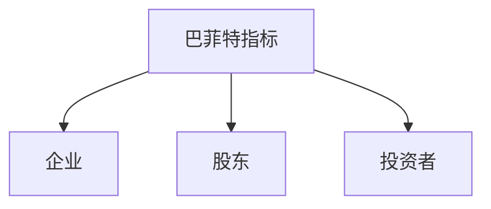
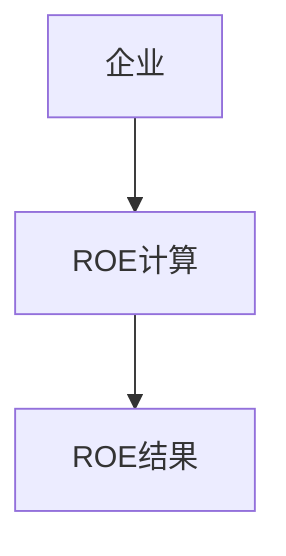
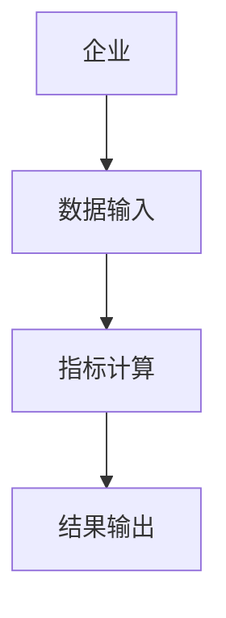
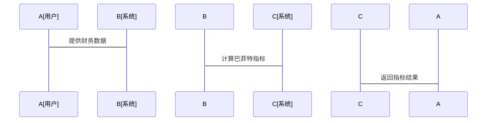

                 


```markdown
# 巴菲特指标在国际市场的适用性探讨

> 关键词：巴菲特指标、国际市场、ROE、ROA、ROI、投资评估、财务分析

> 摘要：本文探讨了巴菲特指标在国际市场的适用性，分析了不同市场环境下的指标表现，结合数学模型和实际案例，评估了其在跨国投资中的应用价值，并提出了优化建议。

---

# 第一部分: 巴菲特指标的背景与核心概念

## 第1章: 巴菲特指标的基本概念与适用性背景

### 1.1 巴菲特指标的定义与核心要素
#### 1.1.1 巴菲特指标的定义
巴菲特指标是用于评估企业财务健康状况的一组关键指标，主要包括ROE（净资产收益率）、ROA（资产回报率）和ROI（投资回报率）等。

#### 1.1.2 巴菲特指标的核心要素
- **ROE（净资产收益率）**：衡量企业净利润与股东权益的比率，公式为：
  $$ \text{ROE} = \frac{\text{净利润}}{\text{平均股东权益}} $$
- **ROA（资产回报率）**：衡量企业净利润与总资产的比率，公式为：
  $$ \text{ROA} = \frac{\text{净利润}}{\text{平均总资产}} $$
- **ROI（投资回报率）**：衡量企业投资收益与投资成本的比率，公式为：
  $$ \text{ROI} = \frac{\text{净利润}}{\text{平均投资}} $$`

#### 1.1.3 巴菲特指标的适用范围与边界
巴菲特指标适用于评估企业的盈利能力，但需注意其局限性，如忽视企业规模和行业差异。

### 1.2 巴菲特指标在国际市场中的重要性
#### 1.2.1 国际市场环境的多样性
不同国家和地区的经济体制、法律法规和文化背景差异，影响巴菲特指标的适用性。

#### 1.2.2 巴菲特指标在跨国投资中的作用
巴菲特指标为投资者提供了一种标准化的评估工具，帮助跨国投资者快速评估企业的财务状况。

#### 1.2.3 不同市场文化与经济体制对指标的影响
例如，在新兴市场中，企业可能面临更高的风险和不确定性，这可能影响ROE和ROA的计算。

---

## 第2章: 巴菲特指标的核心概念与联系

### 2.1 巴菲特指标的原理与属性特征
#### 2.1.1 巴菲特指标的原理
通过分析企业的盈利能力，巴菲特指标帮助投资者识别高回报、低风险的投资目标。

#### 2.1.2 巴菲特指标的属性特征对比表格
| 指标名称 | 核心属性 | 描述 |
|----------|----------|------|
| ROE      | 计算方式 | 净利润/平均股东权益 |
| ROA      | 计算方式 | 净利润/平均总资产     |
| ROI      | 计算方式 | 净利润/平均投资       |

#### 2.1.3 巴菲特指标的ER实体关系图


### 2.2 巴菲特指标与国际市场的关联
#### 2.2.1 巴菲特指标在不同市场的适用性
不同市场的企业会计准则和经济环境可能影响指标的计算和解读。

#### 2.2.2 国际市场中文化差异对指标的影响
例如，在日本市场，企业可能更倾向于保留利润，这可能影响ROE的计算。

#### 2.2.3 经济周期对指标适用性的影响
在经济衰退期间，企业的盈利能力下降，可能影响巴菲特指标的适用性。

---

# 第二部分: 巴菲特指标的算法原理与数学模型

## 第3章: 巴菲特指标的算法原理

### 3.1 巴菲特指标的评估算法
#### 3.1.1 巴菲特指标的核心算法


#### 3.1.2 巴菲特指标的Python实现示例
```python
def calculate_roe(net_profit, shareholders_equity):
    return net_profit / shareholders_equity
```

### 3.2 巴菲特指标的数学模型与公式
#### 3.2.1 ROE（净资产收益率）公式
$$ \text{ROE} = \frac{\text{净利润}}{\text{平均股东权益}} $$

#### 3.2.2 ROI（投资回报率）公式
$$ \text{ROI} = \frac{\text{净利润}}{\text{平均投资}} $$

#### 3.2.3 实际案例分析
假设某企业净利润为100万元，平均股东权益为500万元，则ROE为：
$$ \text{ROE} = \frac{100}{500} = 0.2 \text{（即20%）} $$

---

## 第4章: 巴菲特指标的系统分析与架构设计

### 4.1 系统功能设计
#### 4.1.1 领域模型类图


#### 4.1.2 系统架构设计


#### 4.1.3 接口设计
- 数据输入接口：接受企业的财务数据。
- 指标计算接口：计算ROE、ROA和ROI。
- 结果输出接口：输出指标结果。

#### 4.1.4 交互流程图


---

## 第5章: 巴菲特指标的项目实战

### 5.1 环境安装与配置
安装Python和相关库，如Pandas和NumPy。

### 5.2 核心代码实现
```python
import pandas as pd

def calculate_roe(net_profit, shareholders_equity):
    return net_profit / shareholders_equity

data = pd.DataFrame({
    '净利润': [100, 200, 300],
    '股东权益': [500, 600, 700]
})

data['ROE'] = data.apply(lambda x: calculate_roe(x['净利润'], x['股东权益']), axis=1)
print(data)
```

### 5.3 实际案例分析
分析某跨国公司的财务数据，计算其ROE、ROA和ROI，并评估其在国际市场中的表现。

### 5.4 项目总结与经验分享
总结项目实施过程中的经验，提出改进建议。

---

## 第6章: 巴菲特指标的优化与未来展望

### 6.1 小结
巴菲特指标在国际市场的适用性受到多种因素的影响，需要结合具体市场环境进行调整。

### 6.2 注意事项
- 注意企业规模和行业差异。
- 考虑经济周期的影响。
- 结合其他指标进行综合评估。

### 6.3 拓展阅读
推荐相关书籍和论文，供读者深入研究。

---

# 作者

作者：AI天才研究院/AI Genius Institute & 禅与计算机程序设计艺术 /Zen And The Art of Computer Programming
```

