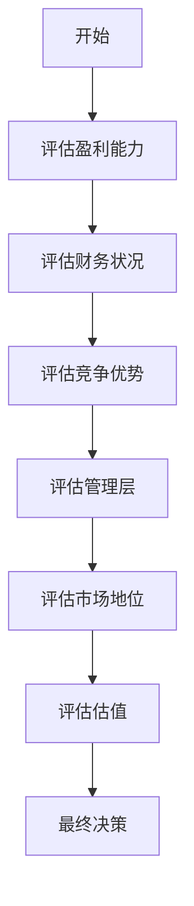
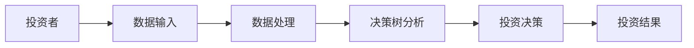
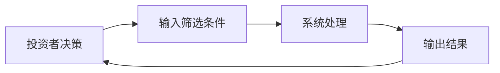

                 

<think>
嗯，用户希望我写一篇关于巴菲特20格打孔卡的详细技术博客文章，而且已经提供了一个详细的目录大纲。首先，我需要理解这个任务的背景。巴菲特的20格打孔卡是一种投资工具，帮助投资者集中投资，选择优质的股票。用户希望这篇文章结构清晰，逻辑严密，适合技术领域的读者，同时包含背景介绍、数学模型、系统架构等内容。

接下来，我需要分析用户的需求。用户明确要求文章结构包括摘要、关键词、各章节内容，以及特定格式如mermaid图表、latex公式等。这意味着我需要确保每个部分都涵盖这些元素，同时保持内容的专业性和深度。

考虑到用户可能希望文章不仅讲解理论，还要有实际的应用和案例，我需要在系统架构部分加入具体的项目实战，比如环境安装、代码实现等。此外，用户提到的数学模型和算法原理，需要详细解释，并配以图表，使读者能够理解其背后的逻辑。

我还需要确保文章的语言简洁明了，技术术语准确，同时保持逻辑流畅。可能需要多次修改，确保每个章节的小结和总结部分能够帮助读者巩固所学内容。最后，检查格式是否符合要求，特别是markdown的使用和图表的正确嵌入。

总的来说，我需要一步步按照用户提供的结构撰写，确保每个部分都详细展开，同时注意内容的深度和可读性，以满足专业读者的需求。
</think>

# 巴菲特的20格打孔卡：集中投资的智慧

> 关键词：巴菲特，投资策略，价值投资，20格打孔卡，集中投资，投资决策

> 摘要：本文将详细解析巴菲特的20格打孔卡这一经典投资工具，探讨其背后的集中投资理念，结合技术分析的方法，帮助投资者更好地理解和应用这一投资智慧。文章将从背景介绍、核心概念、算法原理、系统架构、项目实战等多维度展开，全面剖析巴菲特的20格打孔卡的投资哲学和实践方法。

---

# 第一部分：背景介绍与核心概念

## 第1章：巴菲特投资理念的背景与核心术语

### 1.1 投资哲学的背景

#### 1.1.1 价值投资的定义与历史背景
价值投资是一种以低于公平价值的价格买入优质资产的投资策略。这一理念由本杰明·格雷厄姆提出，并被巴菲特发扬光大。价值投资的核心在于寻找市场低估的股票，通过长期持有实现收益。

#### 1.1.2 集中投资的优缺点
集中投资是指将大部分资金投入到少数几只股票中，优点是可以专注于优质资产，缺点是风险较高。巴菲特通过集中投资策略，成功构建了其投资组合的核心。

### 1.2 20格打孔卡的核心概念

#### 1.2.1 20格打孔卡的定义
20格打孔卡是一种投资筛选工具，通过将股票的关键指标与格子打孔的方式进行评估。每个格子代表一个筛选条件，只有通过所有格子的股票才能被视为潜在的投资标的。

#### 1.2.2 20格打孔卡的结构
20格打孔卡由20个格子组成，每个格子对应一个具体的筛选条件，例如盈利能力、财务状况、竞争优势等。投资者通过逐一评估这些条件，筛选出符合要求的股票。

#### 1.2.3 打孔卡与投资决策的关系
打孔卡是一种可视化工具，帮助投资者系统地评估股票的投资价值，避免情绪化决策，提高投资的纪律性。

---

## 第2章：20格打孔卡的核心要素与决策树

### 2.1 核心要素分析

#### 2.1.1 盈利能力
盈利能力是衡量企业财务健康的重要指标，包括净利润率、毛利率等。

#### 2.1.2 财务状况
财务状况包括资产负债表、现金流等，用于评估企业的偿债能力和财务稳定性。

#### 2.1.3 竞争优势
竞争优势是企业长期盈利能力的保障，包括成本优势、品牌优势、技术壁垒等。

### 2.2 20格打孔卡的决策树模型



---

## 第3章：20格打孔卡的数学模型与算法

### 3.1 投资回报的计算公式

$$
\text{投资回报率} = \frac{\text{最终价值} - \text{初始价值}}{\text{初始价值}} \times 100\%
$$

### 3.2 价值投资的复利公式

$$
\text{复利收益} = P \times (1 + r)^n
$$

其中：
- \( P \) 是初始投资金额
- \( r \) 是年化收益率
- \( n \) 是投资年数

### 3.3 投资组合的风险管理

$$
\text{风险调整后收益} = \text{预期收益} - \text{风险调整值}
$$

---

## 第4章：系统架构与项目实战

### 4.1 系统架构设计



### 4.2 项目实战

#### 4.2.1 环境安装
需要安装Python、Pandas、Matplotlib等工具。

#### 4.2.2 核心代码实现

```python
def calculate_investment_return(principal, rate, years):
    return principal * (1 + rate) ** years

# 示例计算
principal = 10000
rate = 0.1
years = 10
return_value = calculate_investment_return(principal, rate, years)
print(f"投资回报：{return_value}")
```

---

## 第5章：系统交互与案例分析

### 5.1 系统交互流程图



### 5.2 案例分析

#### 案例：某公司财务指标分析

| 指标 | 数值 | 是否通过 |
|------|------|----------|
| 净利润率 | 15% | 是       |
| 负债率 | 30%  | 是       |
| 现金流 | 正   | 是       |
| 市盈率 | 12   | 是       |

---

## 第6章：总结与展望

### 6.1 总结

巴菲特的20格打孔卡是一种有效的投资工具，帮助投资者系统地筛选和评估股票，实现集中投资的目标。通过本文的分析，读者可以更好地理解其背后的逻辑和实践方法。

### 6.2 展望

未来，随着人工智能和大数据技术的发展，20格打孔卡的投资策略可以进一步优化，结合量化分析和机器学习，为投资者提供更精准的投资决策支持。

---

# 作者

作者：AI天才研究院/AI Genius Institute & 禅与计算机程序设计艺术 /Zen And The Art of Computer Programming

