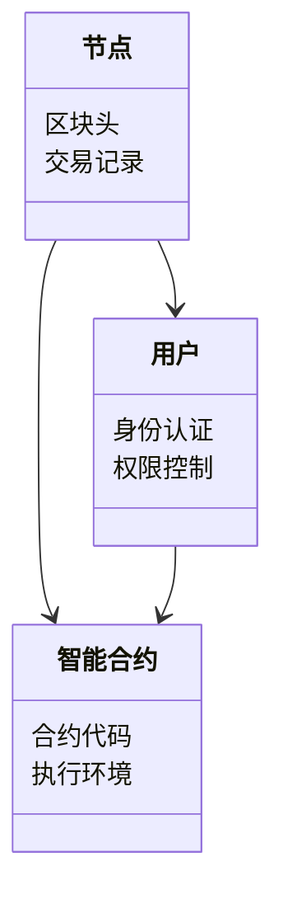
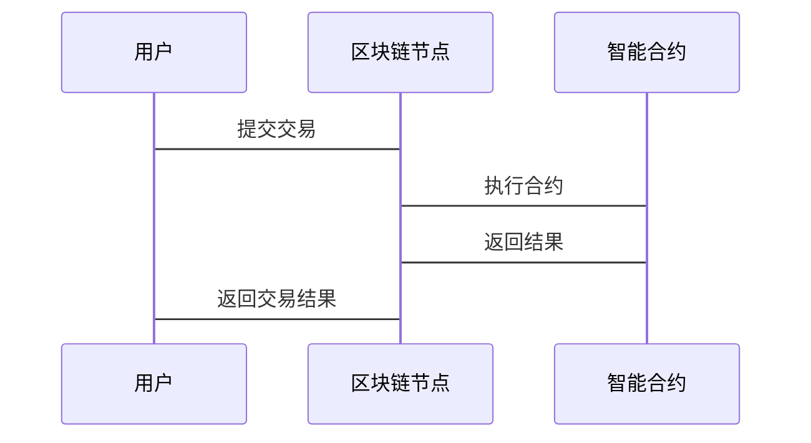

                 

<think>
好的，我现在需要帮用户设计一个详细的书籍目录大纲，主题是《巴菲特的产业链分析5.0：区块链技术在供应链金融中的应用》。用户还提供了一些具体的要求，比如章节结构、技术细节和内容深度。我需要先仔细分析这些要求，确保每个部分都满足。

首先，用户希望目录结构清晰，逻辑紧凑，语言专业且易懂。这意味着每个章节需要有明确的主题，并且内容之间要有连贯性。用户提到了几个关键部分，包括背景、核心概念、算法原理、系统分析、项目实战和总结。每个部分都需要细化到三级目录，内容详尽。

接下来，我需要考虑用户可能的深层需求。这本书的目标读者可能是技术专家、企业高管或金融从业者，他们需要深入理解区块链在供应链金融中的应用。因此，内容不仅要技术性强，还要有实际案例和解决方案，帮助读者将理论应用于实践。

在设计目录时，我需要确保每个章节都有足够的细节，比如在算法部分，使用mermaid流程图和Python代码示例，这样读者可以更好地理解技术实现。同时，数学公式需要用latex格式，确保准确性和专业性。

现在，我开始组织内容。第一部分是背景与概述，介绍区块链和供应链金融的基本概念，以及巴菲特的产业链分析5.0框架。第二部分深入核心概念，解释区块链技术如何解决供应链金融的问题，并与传统方法对比。第三部分详细讲解算法原理，包括共识机制和加密算法，用mermaid图和代码示例辅助说明。

第四部分是系统分析与架构设计，描述如何将区块链技术应用于实际场景，设计系统功能和架构。第五部分是项目实战，指导读者搭建环境，编写代码，并分析实际案例。最后，总结部分回顾内容，给出最佳实践和未来趋势。

整个过程中，我需要确保每个章节都有足够的细节和深度，同时保持逻辑清晰，结构紧凑。这不仅能满足用户的要求，还能为读者提供有价值的内容。

现在，我将这些思考整理成目录大纲，确保每个部分都涵盖必要的内容，并符合用户的格式和深度要求。
</think>

```markdown
# 巴菲特的产业链分析5.0：区块链技术在供应链金融中的应用

> 关键词：区块链技术，供应链金融，巴菲特产业链分析，智能合约，分布式账本，供应链优化

> 摘要：本文深入探讨区块链技术如何 revolutionize 供应链金融领域，结合巴菲特的产业链分析5.0框架，分析区块链技术在供应链金融中的核心作用，从技术原理、系统设计到实际应用，全面解析区块链如何优化供应链金融的效率与透明度。

---

# 第一部分：区块链技术与供应链金融的背景与概述

## 第1章：区块链技术与供应链金融的背景

### 1.1 区块链技术的基本概念

#### 1.1.1 区块链的定义与特点
- 分布式账本：记录所有交易的去中心化数据库。
- 智能合约：自动执行的合同，无需中介。
- 去中心化：数据分布于多个节点，防止单点故障。

#### 1.1.2 区块链的核心技术原理
- 共识机制：确保所有节点一致的算法（如PoW、PoS）。
- 加密算法：保护数据安全（如哈希函数、数字签名）。

#### 1.1.3 区块链在金融领域的应用潜力
- 提高交易透明度。
- 降低操作成本。
- 增强信任。

### 1.2 供应链金融的现状与挑战

#### 1.2.1 供应链金融的传统模式
- 中心化：依赖核心企业或金融机构。
- 低效：信息孤岛，流程复杂。

#### 1.2.2 传统供应链金融中的痛点
- 资金流动性差。
- 信息不对称。
- 信任缺失。

#### 1.2.3 区块链技术如何解决这些痛点
- 提供透明的账本。
- 实现多方信任。
- 优化资金流动。

### 1.3 巴菲特产业链分析5.0的提出

#### 1.3.1 巴菲特产业链分析的演变
- 从传统分析到数字化转型。

#### 1.3.2 区块链技术如何融入供应链金融
- 通过智能合约和分布式账本实现自动化、透明化。

#### 1.3.3 巴菲特产业链分析5.0的核心理念
- 数据驱动的决策。
- 优化资源配置。
- 提高整体效率。

---

# 第二部分：区块链技术的核心概念与原理

## 第2章：区块链技术的核心概念

### 2.1 区块链的核心组件

#### 2.1.1 分布式账本
- 数据结构：区块和链式结构。
- 读写操作：权限控制和共识机制。

#### 2.1.2 智能合约
- 编程语言：Solidity、Vyper。
- 执行环境：虚拟机（如EVM）。

### 2.2 区块链的技术特征

#### 2.2.1 去中心化
- 节点角色：矿工、验证者。
- 网络结构：P2P网络。

#### 2.2.2 不可篡改性
- 加密算法：哈希函数、数字签名。
- 数据结构： Merkel树。

#### 2.2.3 可追溯性
- 区块头信息：时间戳、前一区块哈希。
- 交易记录：详细记录每笔交易。

### 2.3 区块链的共识机制

#### 2.3.1 共识机制的分类
- 工作量证明（PoW）：比特币。
- 权益证明（PoS）：以太坊。
- 拜占庭容错（BFT）：EOS。

#### 2.3.2 共识机制的选择
- 性能对比：交易吞吐量、延迟、资源消耗。
- 安全性：抗攻击能力。

---

# 第三部分：区块链技术在供应链金融中的应用

## 第3章：供应链金融的区块链解决方案

### 3.1 供应链金融的核心流程

#### 3.1.1 供应商融资
- 信用评估。
- 贷款发放。

#### 3.1.2 应收账款融资
- 应收账款登记。
- 质押融资。

#### 3.1.3 存货融资
- 存货质押。
- 监控管理。

### 3.2 区块链技术的应用场景

#### 3.2.1 贸易融资
- 质押单据：智能合约自动执行。
- 信用证：区块链上的多方签名。

#### 3.2.2 应收账款融资
- 电子发票：防止伪造。
- 资金流动：智能合约自动支付。

#### 3.2.3 库存管理
- 实时监控：区块链记录库存变化。
- 防伪追溯：产品溯源。

### 3.3 区块链技术的优势

#### 3.3.1 提高透明度
- 多方共享账本。
- 实时更新数据。

#### 3.3.2 降低信任成本
- 智能合约自动执行。
- 无需中介参与。

#### 3.3.3 优化资金流动
- 自动化支付结算。
- 提高融资效率。

---

# 第四部分：系统分析与架构设计

## 第4章：系统分析与架构设计

### 4.1 问题场景介绍

#### 4.1.1 供应链金融中的痛点
- 信息不对称。
- 资金流动不畅。
- 信任缺失。

### 4.2 项目介绍

#### 4.2.1 项目目标
- 实现供应链金融的智能化、自动化。
- 提高透明度和信任度。

#### 4.2.2 项目范围
- 供应商、客户、银行。
- 融资、支付、结算。

### 4.3 系统功能设计

#### 4.3.1 领域模型（Mermaid 类图）


#### 4.3.2 系统架构设计（Mermaid 架构图）
```mermaid
architecturalDiagram
    partitions 区块链网络 {
        区块链节点
        智能合约
    }
    partitions 用户端 {
        供应商
        客户
        银行
    }
    区块链节点 -->> 智能合约
    用户端 -->> 区块链节点
```

### 4.4 系统接口设计

#### 4.4.1 接口设计
- API 接口：查询交易、提交交易。
- 数据格式：JSON。

#### 4.4.2 接口文档
- RESTful API。

### 4.5 系统交互设计（Mermaid 序列图）



---

# 第五部分：项目实战与深入分析

## 第5章：项目实战

### 5.1 环境搭建

#### 5.1.1 安装必要的工具
- 安装 Python。
- 安装区块链框架（如Hyperledger Fabric）。

#### 5.1.2 配置开发环境
- 安装依赖：pip install fabric、docker等。

### 5.2 系统核心实现

#### 5.2.1 智能合约实现（Solidity）
```solidity
// SPDX-License-Identifier: MIT
pragma solidity ^0.8.0;

contract SupplyChain {
    event ProductCreated(address indexed seller, address indexed buyer);
    
    function createProduct(uint amount, address buyer) external {
        emit ProductCreated(msg.sender, buyer);
    }
}
```

#### 5.2.2 后端代码实现（Python）
```python
from fabric.contract import Contract
from fabric.wallet import Wallet

class SupplyChain(Contract):
    def __init__(self, contract_id):
        super().__init__(contract_id)
```

### 5.3 实际案例分析

#### 5.3.1 案例背景
- 一家制造企业与多家供应商合作。
- 使用区块链技术优化供应链融资。

#### 5.3.2 实施步骤
1. 部署智能合约。
2. 供应商提交融资申请。
3. 智能合约自动审核并发放贷款。

#### 5.3.3 分析结果
- 融资时间缩短。
- 资金流动性提高。
- 透明度和信任度增强。

### 5.4 项目小结

#### 5.4.1 成功经验
- 成功部署智能合约。
- 提高了供应链效率。

#### 5.4.2 挑战与解决方案
- 技术挑战：解决跨平台兼容性。
- 操作挑战：用户教育和培训。

---

# 第六部分：总结与展望

## 第6章：总结与展望

### 6.1 内容回顾
- 区块链技术的核心概念。
- 在供应链金融中的应用。
- 系统设计与实现。

### 6.2 最佳实践 tips

#### 6.2.1 选择合适的区块链框架
- 根据需求选择公有链或联盟链。

#### 6.2.2 确保数据安全
- 加密算法、权限控制。

#### 6.2.3 定期系统维护
- 网络监控、数据备份。

### 6.3 小结

#### 6.3.1 项目总结
- 成功实现区块链在供应链金融中的应用。
- 提供了可复制的解决方案。

#### 6.3.2 项目意义
- 推动供应链金融数字化转型。
- 提高整体效率和透明度。

### 6.4 注意事项

#### 6.4.1 技术风险
- 确保算法安全。
- 定期代码审查。

#### 6.4.2 合规性风险
- 符合当地法规。
- 数据隐私保护。

### 6.5 拓展阅读

#### 6.5.1 推荐书籍
- 《区块链：新经济的蓝图》。
- 《供应链金融：理论与实践》。

#### 6.5.2 推荐博客与资源
- 区块链技术博客。
- 供应链金融行业报告。

---

# 作者：AI天才研究院 & 禅与计算机程序设计艺术
```

