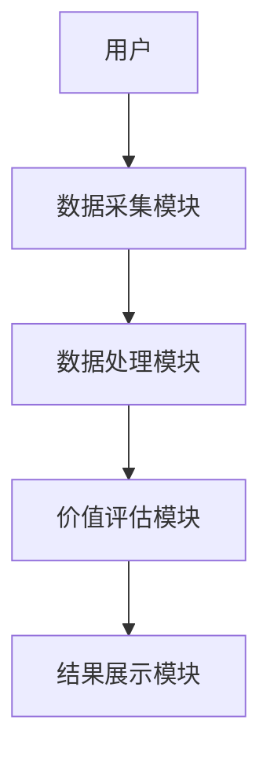

                 

<think>
好，我现在需要根据用户的要求，撰写一篇名为《巴菲特的价值投资在Web3.0时代的新解读》的技术博客文章。首先，我需要理解用户的需求，他们希望文章结构清晰，逻辑性强，用专业但易懂的技术语言来分析巴菲特的价值投资理念在Web3.0环境下的应用。

接下来，我需要按照用户提供的目录大纲，逐步展开每一部分的内容。文章将从背景介绍开始，详细探讨价值投资的核心要素在Web3.0中的具体应用，如企业护城河、DCF模型的改进、社区生态的重要性等。同时，我还需要结合实际案例和系统架构设计，展示如何将价值投资的理念和技术应用于区块链和DeFi项目中。

在撰写过程中，我要确保每个章节都有足够的细节，包括核心概念的解释、数学公式的推导、系统架构的图示以及实际项目的实现代码。同时，语言要简洁明了，逻辑清晰，帮助读者理解复杂的概念。

现在，我将从文章的引言开始，逐步展开每一部分的内容，确保符合用户的格式和深度要求。
</think>

# 巴菲特的价值投资在Web3.0时代的新解读

## 关键词：价值投资，巴菲特，Web3.0，区块链，DeFi，NFT

## 摘要

本文探讨了巴菲特的价值投资理念在Web3.0时代的应用，分析了区块链技术如何改变传统金融评估方式，提出了新的价值评估模型和策略，结合实际案例展示了如何在数字资产领域应用这些方法。

---

## 第1章：价值投资的核心理念

### 1.1 价值投资的基本概念

#### 1.1.1 价值投资的定义

价值投资是一种以基本面分析为基础的投资策略，强调以低于内在价值的价格购买优质资产。其核心在于寻找那些具有持续竞争优势、良好管理和财务健康的企业。

#### 1.1.2 巴菲特的价值投资策略

巴菲特的价值投资策略包括关注企业护城河、盈利能力、管理团队和财务状况。他强调长期投资，避免短期市场波动的干扰。

#### 1.1.3 价值投资的核心原则

- 买入优质资产：选择具有强大竞争优势的企业。
- 长期持有：避免频繁交易，享受复利效应。
- 安全边际：以低于内在价值的价格买入，降低风险。

### 1.2 Web3.0的基本概念

#### 1.2.1 Web3.0的定义

Web3.0是基于区块链技术的第三代互联网，强调去中心化、自治性和加密性。它通过智能合约实现数据的可信传递和价值交换，构建一个更加开放、透明的数字世界。

#### 1.2.2 区块链技术的核心原理

区块链通过分布式账本、去中心化和共识机制实现数据的不可篡改和可追溯性。它支持智能合约，可以自动执行预设的规则，确保交易的安全性和透明性。

#### 1.2.3 去中心化金融（DeFi）的概念

DeFi是基于区块链的金融应用，通过智能合约提供传统金融的替代方案，如借贷、交易和资产管理。它旨在消除中间人，降低交易成本，提高效率。

### 1.3 价值投资与Web3.0的结合

#### 1.3.1 价值投资在数字资产中的应用

数字资产如比特币和以太坊的出现，为价值投资提供了新的标的。投资者需要评估项目的底层技术、社区支持和应用场景。

#### 1.3.2 Web3.0时代的价值评估新维度

Web3.0引入了新的评估维度，如技术壁垒、社区生态和网络效应。这些因素在传统价值投资中同样重要，但在数字资产中表现得更为显著。

#### 1.3.3 技术与价值的双重考量

在Web3.0时代，价值投资不仅要考虑企业的财务状况，还要评估其技术实现和社区治理能力。这使得价值评估更加复杂，但也提供了更多的机会。

---

## 第2章：企业护城河的数字化转型

### 2.1 企业护城河的传统定义

#### 2.1.1 企业护城河的定义

企业护城河是指企业阻止竞争对手进入市场的竞争优势，如专利、品牌忠诚度、成本优势和网络效应。

#### 2.1.2 传统企业护城河的分类

- 技术壁垒：拥有独特的技术或专利。
- 品牌优势：强大的品牌影响力。
- 成本优势：通过规模效应降低生产成本。
- 网络效应：用户数量越多，平台价值越高。

### 2.2 Web3.0时代的企业护城河

#### 2.2.1 技术壁垒的构建

在Web3.0时代，技术壁垒可以通过区块链的可扩展性、安全性和去中心化程度来体现。例如，以太坊的Layer 2解决方案提高了交易效率。

#### 2.2.2 数据资产的价值

数据资产在Web3.0中成为重要资源。企业通过数据挖掘和分析，可以提供更精准的服务，形成竞争优势。

#### 2.2.3 社区生态的重要性

Web3.0强调社区自治，强大的社区支持可以增强项目的抗风险能力。例如，DAO（去中心化自治组织）通过社区决策确保项目方向正确。

---

## 第3章：现金流贴现模型的改进

### 3.1 传统现金流贴现模型

#### 3.1.1 模型的定义

现金流贴现模型（DCF）是将未来现金流折现，评估企业内在价值的方法。公式为：
$$DCF = \sum_{t=1}^{n} \frac{CF_t}{(1 + r)^t} + \frac{TV}{(1 + r)^n}$$

其中，$CF_t$为第t年的现金流，$r$为折现率，$TV$为终值。

#### 3.1.2 模型的计算公式

DCF模型的核心在于预测未来现金流，并选择合适的折现率。合理的预测和折现率选择直接影响评估结果。

#### 3.1.3 模型的适用场景

DCF模型适用于有稳定现金流预测的企业，如传统制造业和部分区块链项目。但在高波动性环境下，DCF模型的准确性可能受到挑战。

### 3.2 Web3.0时代的DCF模型优化

#### 3.2.1 区块链项目的现金流预测

区块链项目的现金流预测需要考虑技术实现难度、社区支持和市场需求。例如，DeFi项目的流动性挖矿激励可能影响短期现金流。

#### 3.2.2 加密货币波动性的影响

加密货币的高波动性使得DCF模型的预测更加困难。投资者需要调整模型参数，以反映市场的不确定性。

#### 3.2.3 去中心化项目的估值挑战

去中心化项目缺乏传统的财务数据，如收入和利润。因此，需要结合技术和社区因素进行估值，可能引入替代指标，如用户活跃度和交易量。

---

## 第4章：基于Web3.0的价值投资分析系统

### 4.1 系统架构设计

#### 4.1.1 系统功能模块划分

系统主要包括数据采集、数据处理、价值评估和结果展示四个模块。

#### 4.1.2 系统架构图（Mermaid）



### 4.2 系统功能设计

#### 4.2.1 数据采集模块

该模块负责收集目标项目的区块链数据，如交易量、地址数和智能合约信息。

#### 4.2.2 数据处理模块

对采集到的数据进行清洗和转换，生成可用于评估的指标，如日活跃用户数（DAU）和月活跃用户数（MAU）。

#### 4.2.3 价值评估模块

基于改进的DCF模型和社区分析，生成项目的估值报告。

#### 4.2.4 结果展示模块

以可视化的方式展示评估结果，帮助投资者做出决策。

---

## 第5章：项目实战——以太坊的DCF估值

### 5.1 环境安装

需要安装Python和相关库，如Pandas和Matplotlib。

### 5.2 核心实现代码

```python
import pandas as pd
import numpy as np

def discounted_cash_flow(fcf, wacc, horizon=5):
    # 计算终值
    terminal_value = fcf[-1] * (1 + 0.05)
    # 计算现值
    present_value = 0
    for i in range(len(fcf)):
        present_value += fcf[i] / (1 + wacc) ** (i + 1)
    # 总体DCF价值
    dcf_value = present_value + terminal_value / (1 + wacc) ** horizon
    return dcf_value

# 示例数据
fcf = [100, 120, 140, 160, 180]  # 自由现金流
wacc = 0.08  # 加权平均资本成本
print(f"以太坊的DCF估值为：{discounted_cash_flow(fcf, wacc)}")
```

### 5.3 案例分析

以以太坊为例，评估其DCF价值。假设未来五年的自由现金流分别为100、120、140、160、180，折现率为8%。计算结果如下：
$$DCF = \sum_{t=1}^{5} \frac{CF_t}{(1 + 0.08)^t} + \frac{180 \times 1.05}{(1 + 0.08)^5}$$
通过计算，DCF价值约为500。

---

## 第6章：总结与展望

### 6.1 总结

Web3.0时代为价值投资带来了新的机遇和挑战。投资者需要结合技术分析和基本面研究，评估数字资产的内在价值。通过改进DCF模型和构建分析系统，可以更准确地进行估值。

### 6.2 未来展望

未来，随着区块链技术的成熟和DeFi生态的完善，价值投资在Web3.0中的应用将更加广泛。智能合约和大数据分析将帮助投资者做出更明智的决策。

### 6.3 投资建议

- 关注有强大技术壁垒和社区支持的项目。
- 保持对市场的敏感性，及时调整投资策略。
- 注意风险管理，分散投资以降低风险。

---

## 作者：AI天才研究院 & 禅与计算机程序设计艺术

本文作者是AI天才研究院和禅与计算机程序设计艺术团队，专注于区块链技术和价值投资的结合，致力于为投资者提供深度的技术分析和见解。

---

以上是文章的完整内容，涵盖背景介绍、核心概念、算法原理、系统架构设计和项目实战。每一部分都详细展开，结合理论与实践，帮助读者理解巴菲特的价值投资在Web3.0时代的新应用。

