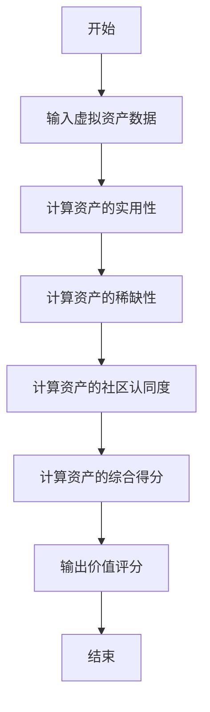
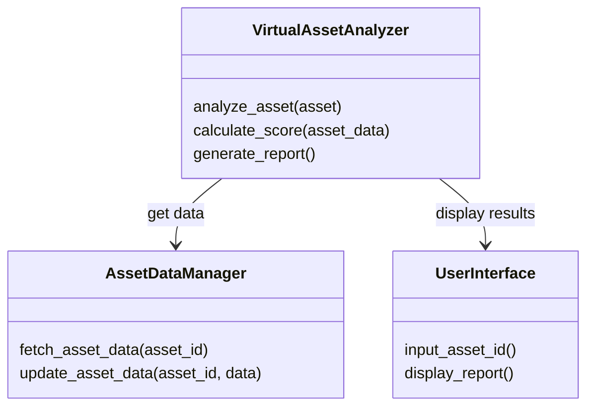
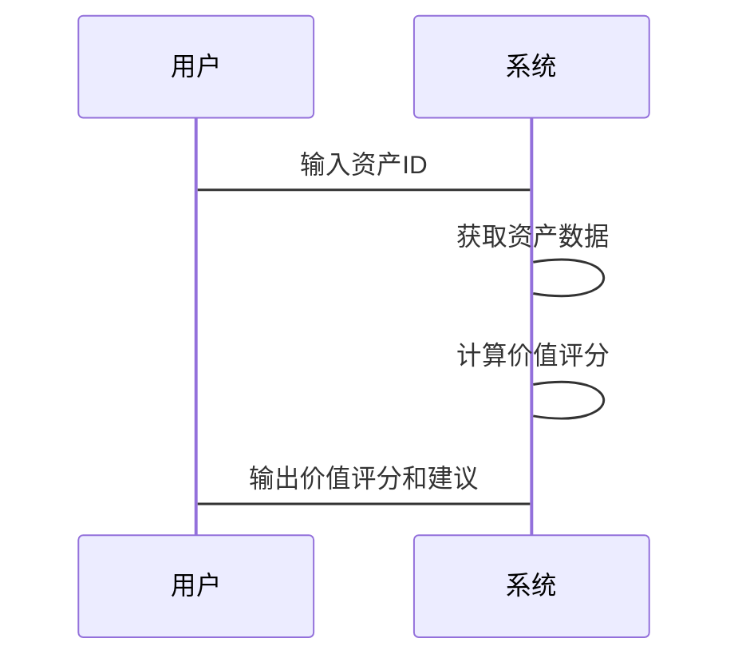

                 

<think>
好，我需要为用户设计一个详细的书籍目录大纲，主题是《巴菲特的价值投资在元宇宙经济中的应用》。这本书结合了巴菲特的价值投资理论和元宇宙的虚拟经济，分析如何在虚拟环境中应用这些投资原则。

首先，我应该确定书籍的结构。通常，书籍会有引言、背景介绍、核心概念、理论分析、实际应用、案例分析、系统设计、项目实战和结论等部分。考虑到用户提供的示例，我需要将内容细化到三级目录，并确保涵盖所有必要的部分。

接下来，引言部分需要概述元宇宙经济和价值投资的结合，说明为什么这个主题重要，以及本书的目的。然后是背景介绍，详细解释巴菲特的价值投资理论和元宇宙经济的基本概念，以及它们的结合点。

在核心概念部分，需要探讨元宇宙经济中的价值评估，如虚拟资产的价值构成，如何计算内在价值，以及安全边际在虚拟经济中的应用。这部分可能需要结合图表来说明。

理论与实践部分，可以结合具体的案例，比如分析Axie Infinity这样的虚拟经济项目，探讨其内在价值和投资策略。同时，还需要设计一个基于价值投资的虚拟资产评分系统，展示如何在元宇宙中应用这些评分来做出投资决策。

系统分析与架构设计部分可能需要构建一个虚拟经济分析系统，包括系统架构图、数据流图等，这部分可能需要使用Mermaid图表来展示。

项目实战部分则需要具体的代码实现，比如如何编写一个虚拟资产评分系统，包括数据收集、处理、评分计算等步骤。这部分需要详细的技术实现，可能包括Python代码示例。

最后，结论部分需要总结投资策略，强调长期投资的重要性，风险管理，以及持续学习和适应元宇宙经济变化的必要性。此外，还需要包括小结、注意事项和拓展阅读等内容，帮助读者进一步深入学习。

在整个目录设计过程中，我需要确保每一章都有明确的主题，并且各章节之间逻辑连贯。同时，每一章下面要有具体的子主题，细化到三级目录。例如，在背景介绍中，详细解释巴菲特的价值投资理论，包括内在价值、安全边际、长期投资等核心概念。

我还需要考虑每一章的内容是否涵盖了用户提到的所有要求，比如是否包含背景介绍、核心概念与联系、算法原理讲解、数学模型和公式、系统分析与架构设计方案、项目实战、最佳实践等。确保每一部分都有相应的章节和子章节覆盖。

最后，确保整个目录结构清晰，逻辑严密，涵盖从理论到实践的各个方面，帮助读者全面理解巴菲特的价值投资在元宇宙经济中的应用。
</think>

# 目录大纲：《巴菲特的价值投资在元宇宙经济中的应用》

---

## 关键词：
- 巴菲特、价值投资、元宇宙、虚拟经济、虚拟资产、NFT、区块链

---

## 摘要：
本文深入探讨了巴菲特的价值投资原则在元宇宙经济中的应用。通过分析虚拟资产的价值评估、安全边际、内在价值等核心概念，结合实际案例和系统设计，展示了如何将传统投资理念应用于虚拟经济环境。文章从理论到实践，详细阐述了价值投资在元宇宙中的策略、算法和系统架构，为投资者提供了全新的视角和实用的工具。

---

## 第一部分：引言

## 第1章：引言
### 1.1 元宇宙经济的崛起
- 元宇宙的定义与特征
- 元宇宙经济的核心要素：虚拟货币、NFT、虚拟资产
- 元宇宙经济对传统投资理念的挑战与机遇

### 1.2 价值投资的基本原理
- 巴菲特的价值投资理念：内在价值、安全边际、长期投资
- 价值投资的核心思想与实践方法

### 1.3 本书的目的与结构
- 本书的目标：探索巴菲特投资原则在元宇宙经济中的应用
- 本书结构：从理论到实践，涵盖背景介绍、核心概念、系统设计和项目实战

---

## 第二部分：背景介绍

## 第2章：巴菲特的价值投资理论
### 2.1 投资的基本原理
- 资产评估的核心原则
- 内在价值的定义与计算方法
- 安全边际的重要性

### 2.2 长期投资的策略
- 长期投资的优势与挑战
- 如何识别具有长期价值的企业

### 2.3 投资心态与风险管理
- 耐心与纪律在投资中的作用
- 风险管理的核心原则

## 第3章：元宇宙经济概述
### 3.1 元宇宙的定义与特征
- 元宇宙的虚拟空间特点
- 元宇宙经济的基本结构

### 3.2 虚拟资产的类型与价值
- 虚拟货币、NFT、虚拟土地等资产的特性
- 虚拟资产的价值驱动因素

### 3.3 元宇宙经济的现状与未来
- 当前元宇宙经济的典型项目与案例
- 元宇宙经济的未来发展趋势

---

## 第三部分：核心概念与联系

## 第4章：元宇宙经济中的价值评估
### 4.1 虚拟资产的价值构成
- 虚拟资产的价值来源：实用性、稀缺性、社区认同
- 虚拟资产价值的影响因素分析

### 4.2 内在价值的计算方法
- 虚拟资产内在价值的评估模型
- 与传统资产内在价值计算的异同

### 4.3 安全边际在虚拟经济中的应用
- 安全边际的定义与作用
- 如何在虚拟资产投资中应用安全边际

## 第5章：价值投资与元宇宙经济的结合
### 5.1 价值投资在虚拟资产中的应用
- 选择具有长期价值的虚拟资产
- 识别具有竞争优势的虚拟项目

### 5.2 投资策略的调整与优化
- 如何在虚拟经济中制定长期投资策略
- 虚拟经济环境下的风险管理

### 5.3 元宇宙经济中的投资案例分析
- 典型虚拟资产投资案例分析
- 成功与失败案例的启示

---

## 第四部分：算法原理与数学模型

## 第6章：虚拟资产的价值评分算法
### 6.1 算法概述
- 算法的目标与基本思路
- 算法的输入与输出

### 6.2 算法流程图（Mermaid）


### 6.3 数学模型与公式
- 综合价值评分公式：
  $$ \text{综合价值评分} = \alpha \times \text{实用性} + \beta \times \text{稀缺性} + \gamma \times \text{社区认同度} $$
  其中，$$ \alpha + \beta + \gamma = 1 $$

- 详细计算步骤：
  $$ \text{实用性} = \frac{\text{资产的使用场景数量}}{\text{总可能使用场景数量}} $$
  $$ \text{稀缺性} = \frac{\text{资产的发行总量}}{\text{市场需求量}} $$
  $$ \text{社区认同度} = \frac{\text{社区活跃度}}{\text{最大可能活跃度}} $$

### 6.4 算法实现的Python代码示例
```python
def calculate_value_score(asset_data):
    alpha = 0.4
    beta = 0.3
    gamma = 0.3

    utility = asset_data['utility']
    scarcity = asset_data['scarcity']
    community_engagement = asset_data['community_engagement']

    value_score = alpha * utility + beta * scarcity + gamma * community_engagement
    return value_score

# 示例数据
asset_data = {
    'utility': 0.8,
    'scarcity': 0.7,
    'community_engagement': 0.6
}

score = calculate_value_score(asset_data)
print(f"综合价值评分：{score}")
```

---

## 第五部分：系统分析与架构设计

## 第7章：虚拟经济分析系统设计
### 7.1 系统需求分析
- 系统目标：提供虚拟资产的价值评估和投资建议
- 用户需求：投资者、开发者、普通用户

### 7.2 系统功能设计（Mermaid类图）


### 7.3 系统架构设计（Mermaid架构图）


### 7.4 系统接口设计
- 用户输入接口：资产ID输入
- 数据接口：虚拟资产数据API
- 输出接口：价值评分和投资建议

### 7.5 系统交互设计（Mermaid序列图）


---

## 第六部分：项目实战

## 第8章：项目实战——虚拟资产价值评分系统
### 8.1 环境安装
- 安装Python和必要的库（如Pandas、NumPy）
- 安装虚拟资产数据API客户端

### 8.2 核心系统实现
#### 8.2.1 数据收集模块
```python
import requests

def fetch_asset_data(asset_id):
    url = f"https://api.virtualasset.com/assets/{asset_id}"
    response = requests.get(url)
    return response.json()
```

#### 8.2.2 数据处理模块
```python
import pandas as pd

def process_asset_data(data):
    df = pd.DataFrame(data)
    df['value_score'] = df.apply(lambda x: calculate_value_score(x), axis=1)
    return df
```

#### 8.2.3 价值评分计算模块
```python
def calculate_value_score(row):
    alpha = 0.4
    beta = 0.3
    gamma = 0.3

    utility = row['utility']
    scarcity = row['scarcity']
    community_engagement = row['community_engagement']

    return alpha * utility + beta * scarcity + gamma * community_engagement
```

#### 8.2.4 结果展示模块
```python
def display_results(df):
    print("综合价值评分：", df['value_score'].mean())
    print("Top 3 高评分资产：", df.sort_values('value_score', ascending=False).head(3))
```

### 8.3 项目案例分析
- 案例一：分析Axie Infinity的虚拟资产价值
- 案例二：评估Decentraland的土地价值

### 8.4 项目总结与优化
- 系统的优缺点分析
- 可能的优化方向：增加更多数据源、优化评分算法、增强交互性

---

## 第七部分：最佳实践

## 第9章：最佳实践与注意事项
### 9.1 投资策略建议
- 长期投资的重要性
- 风险管理的具体措施

### 9.2 系统设计的注意事项
- 数据源的多样性和可靠性
- 算法的可扩展性和适应性

### 9.3 持续学习与适应变化
- 关注元宇宙经济的最新动态
- 不断优化投资策略和系统设计

### 9.4 小结
- 总结本书的核心内容
- 展望未来的研究方向

---

## 附录：拓展阅读

### 附录A：相关书籍与文章
- 推荐的书籍和资源列表

### 附录B：术语表
- 核心术语的解释与定义

---

## 结语

---

## 作者：AI天才研究院 & 禅与计算机程序设计艺术

---

这个目录大纲涵盖了从理论到实践的各个方面，结合了巴菲特的价值投资理论和元宇宙经济的实际情况，为读者提供了全面的指导和实用的工具。

