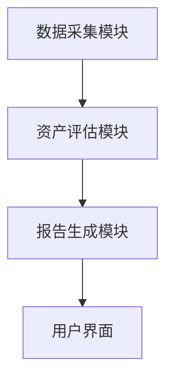

                 


# 巴菲特的价值投资在元宇宙资产评估中的新应用

> 关键词：巴菲特，价值投资，元宇宙，资产评估，NFT，虚拟资产，投资策略

> 摘要：本文深入探讨了巴菲特的价值投资理念在元宇宙资产评估中的新应用。通过分析元宇宙资产的独特性，结合传统价值投资方法，提出了适合元宇宙环境的资产评估模型和投资策略。文章详细介绍了NFT、虚拟土地等元宇宙资产的评估方法，并通过具体案例展示了如何将价值投资理念应用于元宇宙投资中。

---

# 第1章 巴菲特价值投资理念概述

## 1.1 巴菲特价值投资的核心理念

### 1.1.1 价值投资的定义与核心原则

价值投资是一种以基本面分析为基础的投资策略，其核心理念是寻找被市场低估的资产，并长期持有，等待其价值回归。巴菲特的价值投资理念强调以下几点：

- **长期视角**：投资不是短期交易，而是长期价值的发现与积累。
- **安全边际**：买入价格应低于资产的内在价值，以确保投资的安全性。
- **企业基本面**：关注企业的财务状况、盈利能力、行业地位等因素。

### 1.1.2 巴菲特投资哲学的演变

巴菲特的投资哲学经历了从“烟蒂股”到“护城河”的演变。早期，他专注于寻找被市场低估的廉价股票；后来，他更注重企业的竞争优势和持续盈利能力。

### 1.1.3 价值投资与市场波动的关系

尽管市场短期波动难以预测，但长期来看，资产价格终将回归其内在价值。价值投资者需要耐心等待市场波动带来的机会。

## 1.2 元宇宙的基本概念与特征

### 1.2.1 元宇宙的定义与技术基础

元宇宙（Metaverse）是一个虚拟的三维空间，结合了区块链、虚拟现实（VR）、增强现实（AR）、人工智能（AI）等多种技术，构建一个持续、共享、开放的虚拟生态系统。

### 1.2.2 元宇宙的核心特征

- **去中心化**：基于区块链技术，元宇宙中的资产和交易不受任何中心化机构的控制。
- **虚拟经济**：元宇宙内存在虚拟货币、NFT（非同质化代币）等经济体系。
- **用户共创**：用户可以创建、修改和分享虚拟内容，形成一个动态的生态系统。

### 1.2.3 元宇宙与现实世界的关系

元宇宙与现实世界并非完全割裂，而是通过虚拟货币、NFT等形式实现价值互通。例如，用户可以在元宇宙中购买虚拟土地，再将这些土地的价值转化为现实世界中的收益。

---

# 第2章 元宇宙资产评估的独特性与挑战

## 2.1 元宇宙资产的类型与特点

### 2.1.1 数字货币与虚拟货币

- **数字货币**：如比特币、以太坊等，具有去中心化、匿名性等特点。
- **虚拟货币**：如元宇宙中的原生代币（例如Decentraland的MANE币），用于购买虚拟商品和服务。

### 2.1.2 NFT（非同质化代币）的特性

NFT是基于区块链技术的唯一数字资产，具有不可分割、不可复制和可追溯的特点。NFT可以用于表示虚拟艺术品、虚拟土地、虚拟角色等。

### 2.1.3 虚拟土地与虚拟商品

- **虚拟土地**：如Decentraland或The Sandbox中的虚拟地块，可以用于开发虚拟房地产或游戏场景。
- **虚拟商品**：如虚拟装备、虚拟道具等，具有稀缺性和收藏价值。

## 2.2 元宇宙资产评估的核心挑战

### 2.2.1 虚拟资产的流动性问题

虚拟资产的流动性较低，尤其是在某些新兴的元宇宙平台中，交易市场可能不够成熟，导致资产难以快速变现。

### 2.2.2 虚拟资产的价值波动性

由于市场参与度较低，虚拟资产的价格波动较大，尤其是在新兴市场中，价格可能受到市场情绪的影响。

### 2.2.3 虚拟资产的监管不确定性

元宇宙资产的监管框架尚未完善，不同国家和地区对虚拟货币和NFT的监管政策差异较大，这增加了投资的不确定性。

## 2.3 巴菲特价值投资在元宇宙中的适用性

### 2.3.1 传统价值投资与元宇宙的结合

尽管元宇宙环境与传统金融市场差异较大，但巴菲特的价值投资理念中的一些核心原则仍然适用，例如长期视角、安全边际和基本面分析。

### 2.3.2 元宇宙资产评估中的长期视角

元宇宙的虚拟资产可能具有长期增值潜力，尤其是那些具有强大社区支持和技术创新的项目。投资者需要关注项目的长期发展和内在价值。

### 2.3.3 虚拟资产的内在价值与市场定价

尽管虚拟资产的价格可能受到市场情绪的影响，但其内在价值仍然可以通过基本面分析来评估。例如，NFT的价值可以基于其创作者的声誉、社区影响力和作品的独特性来评估。

---

# 第3章 元宇宙资产评估的数学模型与算法

## 3.1 资产评估的基本数学模型

### 3.1.1 贴现现金流模型（DCF）

贴现现金流模型是一种常用的资产评估方法，适用于评估具有稳定现金流的资产。其核心公式为：

$$
\text{内在价值} = \sum_{t=1}^{n} \frac{\text{现金流}_t}{(1 + r)^t}
$$

其中，$r$ 是折现率，$n$ 是评估期限。

### 3.1.2 市盈率与市净率分析

- **市盈率（P/E）**：市盈率 = 股价 / 每股收益。
- **市净率（P/B）**：市净率 = 股价 / 每股净资产。

### 3.1.3 资产定价的其他方法

包括资产重置成本法、市场比较法等。

## 3.2 元宇宙资产评估的改进算法

### 3.2.1 基于NFT的资产评估模型

NFT的评估需要考虑其独特性、创作者声誉和社区影响力。例如，一个知名艺术家创作的NFT艺术品可能具有更高的市场价值。

### 3.2.2 虚拟土地的经济价值评估

虚拟土地的价值可以基于其地理位置、用途和社区活跃度等因素进行评估。例如，Decentraland中的热门区域土地价格可能更高。

### 3.2.3 虚拟商品的市场供需模型

虚拟商品的价格可以基于市场供需关系进行评估。例如，热门游戏中的虚拟装备可能因为稀缺性而价格上涨。

## 3.3 算法实现与案例分析

### 3.3.1 算法实现步骤

1. 收集目标资产的基本信息（如NFT的创作者、交易历史等）。
2. 进行基本面分析，评估资产的内在价值。
3. 结合市场趋势和波动性，调整评估结果。

### 3.3.2 案例分析：NFT价值评估

假设我们有一个NFT艺术品，其创作者在区块链艺术领域具有较高的声誉，且该艺术品在多个平台上被广泛收藏。我们可以使用以下步骤进行评估：

1. 评估NFT的创作者声誉。
2. 分析NFT的交易历史和市场流动性。
3. 结合市场趋势，评估其内在价值。

### 3.3.3 案例分析：虚拟土地开发项目

假设我们在Decentraland中购买了一块虚拟土地，计划用于开发虚拟房地产项目。我们可以使用贴现现金流模型评估其潜在收益。

$$
\text{内在价值} = \sum_{t=1}^{5} \frac{\text{年收益}_t}{(1 + 0.08)^t}
$$

假设年收益分别为100,000, 120,000, 140,000, 160,000, 180,000美元，折现率为8%。

---

# 第4章 元宇宙资产评估系统的设计与实现

## 4.1 系统需求分析

### 4.1.1 系统目标与范围

设计一个基于价值投资理念的元宇宙资产评估系统，能够对NFT、虚拟土地等虚拟资产进行智能化评估。

### 4.1.2 系统功能需求

- 资产信息输入与管理。
- 基于价值投资的资产评估算法。
- 资产价值报告生成。

### 4.1.3 系统性能需求

- 高效的数据处理能力。
- 实时市场数据获取能力。

## 4.2 系统架构设计

### 4.2.1 系统模块划分

- 数据采集模块：获取虚拟资产的市场数据。
- 资产评估模块：基于价值投资理念进行资产评估。
- 报告生成模块：输出资产评估报告。

### 4.2.2 系统架构图（Mermaid）



### 4.2.3 系统接口设计

- 数据接口：与区块链平台和NFT市场对接。
- 用户接口：提供资产信息输入和报告查看功能。

## 4.3 系统实现与代码实现

### 4.3.1 环境搭建与依赖安装

- Python 3.8及以上版本。
- 安装必要的库：pandas, numpy, matplotlib。

### 4.3.2 核心代码实现

```python
import pandas as pd
import numpy as np

def discounted_cash_flow(cash_flows, discount_rate):
    return sum(cash_flow / (1 + discount_rate) ** t for t, cash_flow in enumerate(cash_flows))

# 示例数据
cash_flows = [100000, 120000, 140000, 160000, 180000]
discount_rate = 0.08

# 计算内在价值
intrinsic_value = discounted_cash_flow(cash_flows, discount_rate)
print(f"内在价值为：${intrinsic_value:.2f}")
```

### 4.3.3 系统功能测试

测试系统对NFT和虚拟土地的资产评估功能，确保算法正确性和结果合理。

---

# 第5章 巴菲特价值投资在元宇宙中的实战应用

## 5.1 元宇宙投资策略的制定

### 5.1.1 投资目标与风险偏好

根据投资者的风险承受能力和投资目标，制定适合的元宇宙投资策略。

### 5.1.2 资产配置与投资组合

将元宇宙资产与其他资产进行合理配置，分散投资风险。

### 5.1.3 投资策略的动态调整

根据市场变化和项目发展，动态调整投资组合。

## 5.2 元宇宙投资案例分析

### 5.2.1 NFT投资案例

分析知名NFT项目（如Beeple的NFT艺术品）的投资价值和市场表现。

### 5.2.2 虚拟土地投资案例

分析Decentraland或The Sandbox中的虚拟土地投资案例。

### 5.2.3 虚拟商品投资案例

分析热门游戏中的虚拟装备投资案例。

## 5.3 投资风险与风险管理

### 5.3.1

---

# 总结与展望

本文深入探讨了巴菲特的价值投资理念在元宇宙资产评估中的新应用。通过分析元宇宙资产的独特性，结合传统价值投资方法，提出了适合元宇宙环境的资产评估模型和投资策略。未来，随着元宇宙技术的不断发展和市场的成熟，价值投资在元宇宙中的应用将更加广泛和深入。

---

# 作者：AI天才研究院/AI Genius Institute & 禅与计算机程序设计艺术 /Zen And The Art of Computer Programming

