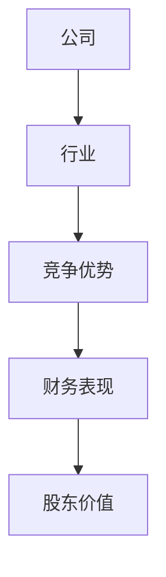
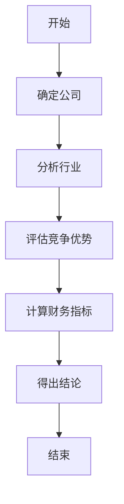
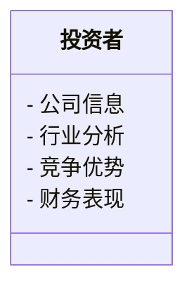
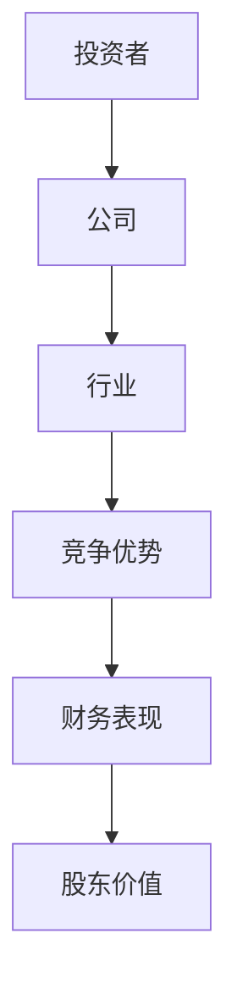

                 

<think>
嗯，用户想要我写一篇关于巴菲特的价值链分析的详细技术博客，首先我得理解用户的需求。他们希望有一个结构清晰、内容丰富的博客，包含背景、核心概念、算法原理、系统架构设计、项目实战以及总结。我需要确保每个部分都详细且有深度。

首先，背景部分需要介绍巴菲特的投资理念和价值链分析的重要性。这部分要让读者明白什么是价值链分析，以及它在投资中的作用。我可能会提到可口可乐和喜诗糖果的例子，展示巴菲特如何应用这种方法。

接下来是核心概念，这里我需要详细解释巴菲特的价值链分析模型，包括每个环节的定义和它们之间的关系。使用ER图来展示公司、行业、竞争优势、财务表现和股东价值之间的关系，这样读者能更直观地理解。

然后是算法原理部分，我需要将分析步骤分解成几个明确的步骤，比如确定公司行业地位、分析竞争优势、评估财务表现和判断未来前景。数学模型方面，ROE和竞争优势的评估模型是关键，我需要解释这些公式的含义和应用。

系统架构设计部分，我需要描述问题场景，比如投资者如何快速评估公司价值，然后设计一个系统功能，包括领域模型和架构图。这部分可能需要使用Mermaid图来展示类图和架构图，帮助读者理解系统结构。

项目实战部分，我会选择一个具体的公司，比如苹果，进行案例分析。从环境安装到数据收集，再到分析过程和结果展示，逐步指导读者如何应用这些分析方法。通过这个案例，读者可以更好地理解理论在实际中的应用。

最后是总结和最佳实践部分，我需要总结本书的主要内容，提醒读者在实际操作中的一些注意事项，并建议进一步阅读的资料。这部分可以巩固读者的知识，并帮助他们更好地应用这些分析方法。

整体来看，我需要确保文章逻辑清晰，每部分内容详实，同时使用适当的图表和公式来辅助说明。这样，读者不仅能理解巴菲特的价值链分析，还能实际应用这些方法来评估公司价值。

现在，我需要按照这个结构来撰写博客，确保每个部分都涵盖必要的内容，并保持语言简洁明了。可能还需要多次修改，确保文章流畅且有深度。希望通过这样的思考，能够写出一篇高质量的技术博客，帮助读者深入理解巴菲特的价值链分析。
</think>

# 巴菲特的价值链分析：理解公司在产业中的位置

> 关键词：巴菲特，价值链分析，投资策略，公司分析，产业位置

> 摘要：本文通过分析巴菲特的价值链分析方法，帮助读者理解公司在产业中的位置。从巴菲特的投资理念、价值链分析的核心模型、算法原理、系统架构设计到项目实战，全面解析如何通过价值链分析评估公司价值，做出明智的投资决策。

---

## 第1章: 巴菲特投资理念与价值链分析概述

### 1.1 巴菲特投资理念的核心思想

#### 1.1.1 价值投资的定义与特点
价值投资是一种长期投资策略，强调以低于内在价值的价格购买优质资产。巴菲特的价值投资理念注重企业的基本面分析，寻找具有持续竞争优势的企业。

#### 1.1.2 巴菲特的价值投资体系
巴菲特的价值投资体系包括以下关键要素：
1. **安全边际**：以低于内在价值的价格买入资产。
2. **竞争优势**：寻找具有护城河的企业。
3. **财务健康**：关注企业的盈利能力、现金流和负债情况。
4. **管理层能力**：信任能够持续创造价值的管理层。

#### 1.1.3 价值链分析在投资中的重要性
价值链分析是巴菲特评估企业的重要工具，它帮助投资者理解企业在行业中的位置、竞争优势以及未来的盈利能力。

---

### 1.2 价值链分析的基本概念

#### 1.2.1 价值链的定义与组成
价值链是指企业在生产、销售、服务等过程中创造价值的一系列活动。巴菲特将价值链分为以下五个核心环节：
1. **原材料获取**：企业获取所需原材料的能力。
2. **生产过程**：将原材料转化为最终产品的过程。
3. **分销网络**：产品从工厂到消费者的渠道。
4. **客户服务**：与客户互动并提供支持的过程。
5. **收益分配**：企业通过价值链创造的最终收益。

#### 1.2.2 价值链分析的目的与意义
- **目的**：识别企业在价值链中的优势和劣势，评估其在行业中的竞争力。
- **意义**：通过分析价值链，投资者可以找到具有可持续竞争优势的企业。

#### 1.2.3 巴菲特视角下的价值链分析框架
巴菲特的价值链分析框架强调企业的竞争优势和财务表现。他关注企业在价值链中各个环节的效率和能力，尤其是能否持续创造价值。

---

### 1.3 巴菲特价值链分析方法的应用案例

#### 1.3.1 可口可乐的长期投资案例
可口可乐拥有强大的品牌优势和全球分销网络，巴菲特通过分析其价值链，认为它具备持续创造价值的能力。

#### 1.3.2 喜诗糖果的收购与整合
喜诗糖果是一家具有强大市场地位的公司，巴菲特通过收购和整合，进一步巩固其在价值链中的优势。

#### 1.3.3 巴菲特对银行股的价值链分析
巴菲特分析银行股时，关注其贷款业务的风控能力、资本效率和盈利能力，确保其在价值链中的稳定收益。

---

## 第2章: 巴菲特价值链分析的核心模型

### 2.1 巴菲特价值链分析模型的构成

#### 2.1.1 价值链的五个核心环节
1. **原材料获取**：企业的采购能力。
2. **生产过程**：企业的生产能力。
3. **分销网络**：企业的销售渠道。
4. **客户服务**：企业的客户关系。
5. **收益分配**：企业的盈利能力。

#### 2.1.2 环节之间的关系与依赖
- 原材料获取依赖于供应商的稳定性。
- 生产过程依赖于设备和技术。
- 分销网络依赖于渠道的广度和深度。
- 客户服务依赖于客户满意度。
- 收益分配依赖于前面各环节的效率和能力。

#### 2.1.3 模型属性的特征对比
| 环节       | 优势特征 | 劣势特征 |
|------------|----------|----------|
| 原材料获取 | 成本低    | 依赖供应商 |
| 生产过程   | 效率高    | 技术依赖 |
| 分销网络   | 覆盖广    | 管理复杂 |
| 客户服务   | 满意度高  | 成本高    |
| 收益分配   | 利润高    | 竞争激烈 |

#### 2.1.4 ER实体关系图


---

## 第3章: 巴菲特价值链分析的算法原理

### 3.1 巴菲特价值链分析的步骤与流程

#### 3.1.1 确定公司的行业地位
分析公司在行业中的市场份额、竞争地位和行业周期。

#### 3.1.2 分析公司的竞争优势
评估公司在价值链各环节的竞争优势，如品牌、技术、成本等。

#### 3.1.3 评估公司的财务表现
通过财务指标（如ROE、ROA）评估公司的盈利能力。

#### 3.1.4 判断公司的未来前景
结合行业趋势和公司战略，预测公司的未来表现。

### 3.2 巴菲特价值链分析的数学模型

#### 3.2.1 财务指标分析模型
$$ROE = \frac{\text{净利润}}{\text{股东权益}}$$
$$ROA = \frac{\text{净利润}}{\text{总资产}}$$

#### 3.2.2 竞争优势评估模型
$$\text{竞争优势} = \frac{\text{市场份额}}{\text{行业集中度}}$$

### 3.3 巴菲特价值链分析的流程图


---

## 第4章: 巴菲特价值链分析的系统架构设计

### 4.1 问题场景介绍

#### 4.1.1 投资者如何快速评估公司价值
投资者需要通过价值链分析，快速识别具有竞争优势的企业。

#### 4.1.2 价值链分析在投资决策中的作用
价值链分析帮助投资者理解企业在行业中的位置，评估其竞争优势和财务表现。

### 4.2 系统功能设计

#### 4.2.1 领域模型


#### 4.2.2 系统架构图


---

## 第5章: 巴菲特价值链分析的项目实战

### 5.1 项目背景与目标

#### 5.1.1 项目背景
选择苹果公司作为案例，分析其在科技行业的价值链位置。

#### 5.1.2 项目目标
通过价值链分析，评估苹果的竞争优势和财务表现，判断其投资价值。

### 5.2 项目实施步骤

#### 5.2.1 环境安装
安装数据分析工具（如Excel、Python）和相关库（如Pandas、Matplotlib）。

#### 5.2.2 数据收集
收集苹果的财务数据、行业数据和竞争优势信息。

#### 5.2.3 系统功能实现

##### 5.2.3.1 数据预处理
```python
import pandas as pd

# 读取数据
data = pd.read_csv('apple_data.csv')

# 删除缺失值
data.dropna(inplace=True)
```

##### 5.2.3.2 竞争优势分析
```python
import matplotlib.pyplot as plt

# 绘制市场份额图
plt.bar(['iPhone', 'Mac', '服务'], [50, 30, 20])
plt.title('苹果的主要业务市场份额')
plt.show()
```

##### 5.2.3.3 财务表现分析
计算苹果的ROE和ROA，评估其盈利能力。

##### 5.2.3.4 价值链分析
通过价值链各环节的效率和能力，评估苹果的竞争优势。

#### 5.2.4 实验结果展示

##### 5.2.4.1 竞争优势分析结果
苹果在iPhone和Mac领域具有强大的竞争优势，服务业务正在快速增长。

##### 5.2.4.2 财务表现分析结果
苹果的ROE和ROA均高于行业平均水平，财务表现稳健。

##### 5.2.4.3 项目小结
苹果在科技行业具有强大的竞争优势和稳健的财务表现，是具有投资价值的公司。

---

## 第6章: 巴菲特价值链分析的最佳实践

### 6.1 小结
本文通过分析巴菲特的价值链分析方法，帮助投资者理解公司在产业中的位置。通过实际案例分析，展示了如何将理论应用于投资决策。

### 6.2 注意事项
- **数据准确性**：确保数据来源可靠。
- **行业动态**：关注行业趋势和政策变化。
- **长期视角**：投资需要长期视角，避免短期波动影响判断。

### 6.3 拓展阅读
- 巴菲特的《投资之道》
- 《巴菲特的信仰》
- 《价值投资入门》

---

## 作者：AI天才研究院/AI Genius Institute & 禅与计算机程序设计艺术/Zen And The Art of Computer Programming

