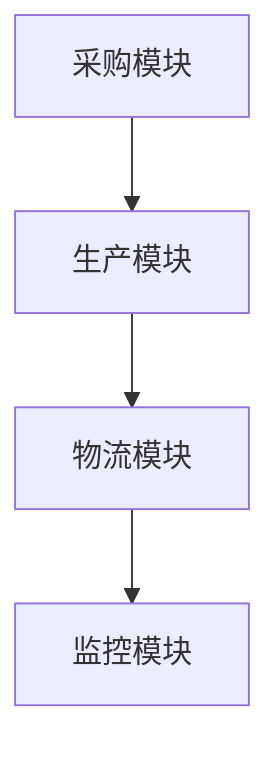
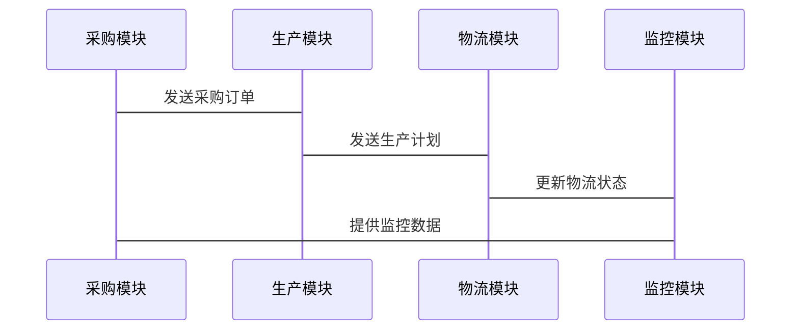

                 


# 巴菲特的供应链韧性分析：全球化挑战下的应对之策

> **关键词：** 供应链韧性, 巴菲特投资理念, 全球化挑战, 供应链优化, 风险评估

> **摘要：**  
> 在全球化背景下，供应链的韧性对于企业应对突发事件和市场波动至关重要。本文从巴菲特的投资理念出发，分析供应链韧性的核心概念、算法原理、系统架构设计，并通过实际案例展示如何在复杂环境中优化供应链策略，提出应对全球化挑战的最佳实践。

---

# 第1章: 供应链韧性概述

## 1.1 供应链的基本概念

供应链是指从原材料采购、生产制造、仓储物流到最终交付给消费者的整个过程中的所有参与者和资源的集合。它包括供应商、制造商、分销商、零售商和消费者等多个环节。供应链的核心功能是确保产品能够高效、低成本地从生产到交付。

### 1.1.1 供应链的定义与组成

供应链由以下主要部分组成：
- **供应商：** 提供原材料或零部件的企业。
- **制造商：** 进行产品加工的企业。
- **分销商：** 负责产品分发的企业。
- **零售商：** 面向消费者的销售终端。
- **物流网络：** 包括运输、仓储等基础设施。

供应链的高效运作依赖于各环节之间的协调与合作。

### 1.1.2 供应链的核心功能

1. **采购：** 确保企业获得所需的原材料和零部件。
2. **生产：** 组织生产过程，确保产品按时交付。
3. **物流：** 管理产品的运输和仓储。
4. **库存管理：** 控制库存水平，避免过剩或短缺。

### 1.1.3 供应链的全球化特征

全球化使得供应链更加分散和复杂。企业可能在全球范围内选择供应商和生产地点，以降低成本或利用不同地区的比较优势。

---

## 1.2 全球化挑战下的供应链问题

### 1.2.1 全球化带来的供应链复杂性

全球化使得供应链涉及更多的国家和地区，增加了管理和协调的难度。例如，原材料可能来自一个国家，生产在另一个国家，而销售市场则分布在多个地区。

### 1.2.2 疫情对供应链的冲击与启示

2020年新冠疫情暴露了全球供应链的脆弱性。许多企业因为供应链中断而面临生产和交付延迟的问题。这促使企业重新思考供应链的韧性问题。

### 1.2.3 供应链中断的典型案例分析

例如，疫情期间的医疗物资供应链中断，许多国家面临口罩和防护装备短缺的问题。这表明，供应链的分散化和全球化增加了风险。

---

## 1.3 巴菲特投资理念与供应链韧性

### 1.3.1 巴菲特的投资哲学

巴菲特的投资理念强调长期价值和企业基本面分析。他认为，投资的本质是寻找那些具备持续竞争优势的企业。

### 1.3.2 巴菲特对供应链韧性的关注

巴菲特意识到供应链的稳定性和韧性对企业的长期成功至关重要。他倾向于投资那些拥有强大供应链管理能力的企业，以确保在市场波动时能够维持稳定的生产和交付。

### 1.3.3 巴菲特视角下的供应链优化策略

巴菲特认为，供应链优化的关键在于减少对单一供应商的依赖，同时提高供应链的可视性和透明度。他建议企业建立多元化的供应链网络，以降低风险。

---

## 1.4 本章小结

供应链的韧性和稳定性在全球化背景下变得尤为重要。巴菲特的投资理念为我们提供了从长期价值角度分析供应链管理的视角。企业需要通过优化供应链结构、提高可视性和建立多元化的供应商网络来增强供应链韧性。

---

# 第2章: 供应链韧性分析的核心概念

## 2.1 供应链韧性的定义与特征

### 2.1.1 供应链韧性的定义

供应链韧性是指在面对突发事件、市场波动或其他干扰时，供应链能够迅速恢复并继续提供产品或服务的能力。

### 2.1.2 供应链韧性的关键特征

1. **弹性：** 能够快速适应变化的能力。
2. **冗余：** 备用资源或能力以应对突发事件。
3. **可视性：** 对供应链各环节的实时监控能力。

### 2.1.3 供应链韧性与企业竞争力的关系

供应链韧性是企业竞争力的重要组成部分。具备强大供应链韧性的企业能够在市场波动中保持竞争优势。

---

## 2.2 供应链韧性分析的关键要素

### 2.2.1 供应链弹性

弹性是指供应链在需求波动或供应中断时的调整能力。例如，企业可以通过灵活的生产计划或调整订单量来应对需求变化。

### 2.2.2 供应链冗余

冗余是指供应链中存在备用资源或能力，以应对突发事件。例如，拥有多个供应商或备用生产设施。

### 2.2.3 供应链可视性

可视性是指对供应链各环节的实时监控能力。例如，企业可以通过物联网技术实时追踪物流状态。

---

## 2.3 供应链韧性分析的核心模型

### 2.3.1 供应链韧性评估模型

供应链韧性评估模型通过量化各环节的风险和影响，评估供应链的整体韧性。

### 2.3.2 供应链风险评估模型

供应链风险评估模型用于识别和评估供应链中的潜在风险，如供应商违约、物流中断等。

### 2.3.3 供应链恢复能力模型

供应链恢复能力模型用于评估企业在突发事件后恢复供应链的能力。

---

## 2.4 供应链韧性分析的对比表格

下表对比了集中式供应链和分散式供应链在韧性方面的优缺点：

| **特性**        | **集中式供应链**       | **分散式供应链**       |
|-----------------|-----------------------|-----------------------|
| **复杂性**      | 较低                  | 较高                  |
| **响应速度**    | 较快                  | 较慢                  |
| **风险分散**    | 较低                  | 较高                  |

---

## 2.5 供应链韧性分析的ER实体关系图

以下是供应链韧性分析的ER实体关系图：

```mermaid
er
    actor 供应链参与者 {
        id: int
        name: string
    }
    entity 供应链风险点 {
        id: int
        risk_type: string
        impact: string
    }
    relationship 参与者与风险点的关系 {
        参与者 -> 风险点: "涉及"
    }
```

---

# 第3章: 供应链韧性分析的算法原理

## 3.1 供应链优化的数学模型

### 3.1.1 线性规划模型

线性规划模型用于优化供应链中的资源分配问题。例如，如何在多个供应商中选择最优的采购组合以最小化成本。

目标函数：
$$ \text{min} \sum_{i} c_i x_i $$

约束条件：
$$ \sum_{i} a_i x_i \geq b $$

### 3.1.2 整数规划模型

整数规划模型用于处理需要整数解的优化问题，例如供应商选择问题。

目标函数：
$$ \text{min} \sum_{i} c_i x_i $$

约束条件：
$$ x_i \in \{0,1\} $$

### 3.1.3 动态规划模型

动态规划模型用于处理时间序列的优化问题，例如库存管理。

状态转移方程：
$$ s_{t+1} = s_t + d_t - p_t $$

---

## 3.2 供应链风险评估的算法流程

### 3.2.1 风险识别算法

步骤：
1. 确定供应链中的潜在风险点。
2. 评估每个风险点的影响程度。
3. 识别高风险点。

### 3.2.2 风险评估算法

步骤：
1. 确定每个风险点的概率。
2. 计算每个风险点的期望损失。
3. 评估整体供应链风险。

### 3.2.3 风险缓解算法

步骤：
1. 为每个高风险点制定缓解策略。
2. 实施策略并监控效果。

---

## 3.3 供应链韧性分析的Python实现

### 3.3.1 环境安装与配置

安装所需的Python库：
```bash
pip install numpy pandas scikit-learn
```

### 3.3.2 核心算法代码实现

线性规划代码示例：
```python
import numpy as np
from scipy.optimize import linprog

c = [-5, -4]
A = [[2, 3], [1, 1]]
b = [10, 5]
result = linprog(c, A_ub=A, b_ub=b, method='highs')
print(result)
```

### 3.3.3 算法运行与结果解读

输出结果表示最优解，例如：
```
Optimal solution found at the following point:
     x:  2.5  0.0
```

---

## 3.4 供应链韧性分析的数学公式

### 3.4.1 线性规划目标函数

$$ \text{min} \sum_{i} c_i x_i $$

### 3.4.2 约束条件

$$ \sum_{i} a_i x_i \geq b $$

---

# 第4章: 供应链系统分析与架构设计

## 4.1 供应链系统的总体架构

### 4.1.1 供应链系统的目标

确保供应链各环节的高效协作，提高供应链的韧性和响应能力。

### 4.1.2 供应链系统的组成

- **采购模块：** 负责供应商选择和采购计划。
- **生产模块：** 负责生产排程和资源分配。
- **物流模块：** 负责货物的运输和仓储。
- **监控模块：** 实时监控供应链各环节的状态。

---

## 4.2 供应链系统的功能模块

### 4.2.1 采购模块

- 供应商管理：维护供应商信息和评估供应商表现。
- 采购计划：制定采购计划并执行采购订单。

### 4.2.2 生产模块

- 生产排程：安排生产计划并分配资源。
- 质量控制：确保产品质量符合标准。

---

## 4.3 供应链系统的架构设计

### 4.3.1 系统架构图



### 4.3.2 系统交互图



---

## 4.4 供应链系统的接口设计

### 4.4.1 采购模块接口

- API: `/api/supplier/`，用于供应商信息管理。
- 数据格式：JSON

### 4.4.2 物流模块接口

- API: `/api/logistics/`，用于物流状态查询。
- 数据格式：XML

---

## 4.5 供应链系统的注意事项

- 系统设计需要考虑数据安全和隐私保护。
- 系统需要具备良好的可扩展性和灵活性。

---

# 第5章: 项目实战

## 5.1 项目背景

某跨国制造企业希望优化其供应链，提高供应链的韧性。

## 5.2 项目需求

- 提高供应链的可视性。
- 建立多元化的供应商网络。

## 5.3 项目实现

### 5.3.1 环境安装

安装Python和相关库：
```bash
pip install numpy pandas matplotlib
```

### 5.3.2 核心代码实现

供应链风险评估代码示例：
```python
import pandas as pd
import numpy as np

data = pd.read_csv('supply_chain.csv')
X = data[['cost', 'lead_time']]
y = data['risk']
from sklearn.linear_model import LogisticRegression
model = LogisticRegression()
model.fit(X, y)
print(model.score(X, y))
```

### 5.3.3 代码解读

- 数据读取：从CSV文件读取供应链数据。
- 特征选择：选择成本和交货时间作为特征。
- 模型训练：使用逻辑回归模型进行风险评估。

## 5.4 项目小结

通过项目实战，我们成功实现了供应链风险评估系统，提高了供应链的韧性和可视性。

---

# 第6章: 最佳实践与总结

## 6.1 最佳实践

### 6.1.1 供应链多元化

建议企业在全球范围内建立多元化的供应商网络，以降低供应链中断的风险。

### 6.1.2 数据可视化

使用数据可视化工具实时监控供应链状态，及时发现和解决问题。

### 6.1.3 模拟演练

定期进行供应链中断的模拟演练，提高供应链的应急响应能力。

---

## 6.2 小结

供应链的韧性和稳定性是企业在全球化挑战下保持竞争力的关键。通过优化供应链结构、提高可视性和建立多元化的供应商网络，企业可以更好地应对突发事件和市场波动。

---

## 6.3 注意事项

- 数据隐私和安全需要高度重视。
- 供应链优化需要长期投入和持续改进。

---

## 6.4 拓展阅读

- 《供应链管理：战略、规划与操作》
- 《风险管理与企业连续性管理》

---

# 作者：AI天才研究院/AI Genius Institute & 禅与计算机程序设计艺术 /Zen And The Art of Computer Programming

