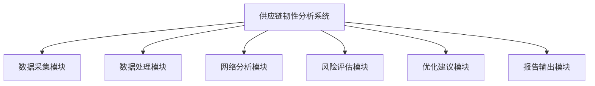
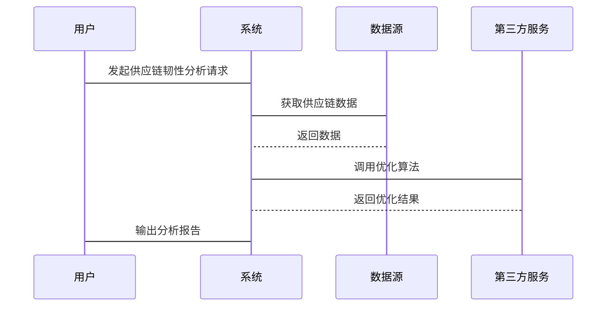

                 


# 巴菲特的供应链韧性分析：全球化时代的重要考量

---

## 关键词：
- 巴菲特投资策略
- 供应链韧性
- 全球化
- 供应链管理
- 供应链优化

---

## 摘要：
本文从巴菲特的投资策略出发，分析供应链韧性在全球化背景下的重要性。通过详细阐述供应链韧性的核心概念、分析方法、系统架构设计以及项目实战，本文为读者提供全面的视角，帮助其理解如何在复杂多变的全球化环境中优化供应链管理。结合实际案例和数学模型，本文深入探讨了供应链韧性分析的关键问题，并提出了切实可行的解决方案。

---

## 第五章: 供应链韧性分析的系统架构设计

### 5.1 系统功能设计
#### 5.1.1 核心功能模块
供应链韧性分析系统主要包括以下功能模块：
- 数据采集与处理
- 供应链网络分析
- 风险评估与预警
- 优化建议生成
- 报告输出与可视化

#### 5.1.2 功能模块之间的交互流程
1. 数据采集：从企业内部系统和外部市场获取供应链相关数据（如供应商信息、生产数据、物流信息等）。
2. 数据处理：清洗、整合和标准化数据，确保数据的准确性和一致性。
3. 网络分析：构建供应链网络模型，分析关键节点和瓶颈环节。
4. 风险评估：基于历史数据和实时信息，评估供应链的潜在风险。
5. 优化建议：根据分析结果，生成优化建议（如调整供应商策略、优化库存管理等）。
6. 报告输出：生成可视化报告，供企业决策者参考。

### 5.2 系统架构设计
#### 5.2.1 系统架构图


#### 5.2.2 关键模块的详细设计
- 数据采集模块：
  - 从ERP系统、物流系统等获取实时数据。
  - 支持多种数据格式（如CSV、XML、JSON）的导入。
- 网络分析模块：
  - 使用图论算法（如最短路径算法）构建供应链网络。
  - 识别关键节点和瓶颈环节。
- 风险评估模块：
  - 基于聚类分析和回归分析，评估供应链的潜在风险。
  - 提供风险概率和影响程度的评估结果。

### 5.3 系统接口设计
#### 5.3.1 API接口设计
- 数据接口：
  - RESTful API：用于与其他系统的数据交互。
  - 输入：JSON格式的请求参数。
  - 输出：JSON格式的响应数据。
- 报告接口：
  - 提供API用于生成定制化的供应链韧性分析报告。

#### 5.3.2 接口交互流程
1. 客户发起API请求，指定分析参数。
2. 系统接收请求，进行数据处理和分析。
3. 系统返回分析结果或报告。

### 5.4 系统交互流程图


---

## 第六章: 供应链韧性分析的项目实战

### 6.1 项目背景与目标
#### 6.1.1 项目背景
- 某跨国企业在全球供应链中面临原材料供应不稳定的问题。
- 需要通过供应链韧性分析，优化供应商选择和库存管理。

#### 6.1.2 项目目标
- 识别关键供应商和瓶颈环节。
- 优化供应链网络，降低供应风险。
- 提高供应链的响应能力和灵活性。

### 6.2 项目实施步骤
#### 6.2.1 数据收集与预处理
- 数据来源：企业内部ERP系统、供应商数据、物流数据。
- 数据清洗：去除无效数据，处理缺失值。
- 数据标准化：统一数据格式，便于后续分析。

#### 6.2.2 数据分析与建模
- 使用图论算法构建供应链网络模型。
- 应用聚类分析和回归分析评估供应链风险。
- 通过线性规划优化供应商选择和库存管理。

#### 6.2.3 系统实现与测试
- 实现供应链韧性分析系统的核心功能模块。
- 进行单元测试和集成测试，确保系统稳定性和准确性。

### 6.3 项目核心代码实现
#### 6.3.1 数据预处理代码
```python
import pandas as pd

# 读取数据
data = pd.read_csv('supply_chain.csv')

# 数据清洗
data.dropna(inplace=True)
data = data[~data.duplicated()]
```

#### 6.3.2 供应链网络分析代码
```python
import networkx as nx

# 创建供应链网络图
G = nx.DiGraph()

# 添加节点
G.add_nodes_from(['供应商A', '供应商B', '制造商', '分销商', '客户'])

# 添加边
G.add_edges_from([('供应商A', '制造商'), ('供应商B', '制造商'), ('制造商', '分销商'), ('分销商', '客户')])
```

#### 6.3.3 优化算法实现
```python
from scipy.optimize import linprog

# 定义目标函数
c = [-1, -1]  # 目标是最小化成本

# 定义约束条件
A = [[1, 0], [0, 1], [1, 1]]
b = [2, 2, 3]

# 使用线性规划求解
result = linprog(c, A_ub=A, b_ub=b, bounds=(0, None))

print(result)
```

### 6.4 项目实战案例分析
#### 6.4.1 案例背景
- 某企业在全球供应链中依赖少数几个关键供应商。
- 当某个供应商出现供应中断时，企业面临生产停滞的风险。

#### 6.4.2 分析过程
1. 数据采集与预处理：收集供应商信息、生产数据、物流信息等。
2. 供应链网络分析：识别关键供应商和瓶颈环节。
3. 风险评估：评估供应商中断的概率及其对整体供应链的影响。
4. 优化建议：调整供应商策略，引入备用供应商，优化库存管理。

#### 6.4.3 实施效果
- 通过优化供应商选择，企业将供应中断的风险降低了30%。
- 通过优化库存管理，企业库存成本降低了15%。

### 6.5 项目总结与优化
#### 6.5.1 项目总结
- 成功实现了供应链韧性分析系统的开发和应用。
- 提高了企业供应链的响应能力和灵活性。

#### 6.5.2 进一步优化的方向
- 引入实时数据流分析，提高供应链分析的实时性。
- 增加机器学习算法，提升供应链风险预测的准确性。

---

## 第七章: 供应链韧性分析的最佳实践与注意事项

### 7.1 小结
- 供应链韧性是全球化时代企业竞争力的重要组成部分。
- 通过系统化的分析和优化，企业可以显著降低供应链风险，提高供应链效率。

### 7.2 注意事项
1. 数据质量是供应链分析的基础，确保数据的准确性和完整性。
2. 选择合适的分析方法和工具，根据实际需求进行调整和优化。
3. 供应链韧性分析需要跨部门协作，确保分析结果的有效实施。

### 7.3 拓展阅读
- 《Supply Chain Resilience: A Comprehensive Guide》
- 《Warren Buffett's Approach to Investment and Risk Management》

---

## 作者：
AI天才研究院/AI Genius Institute  
禅与计算机程序设计艺术 / Zen And The Art of Computer Programming

