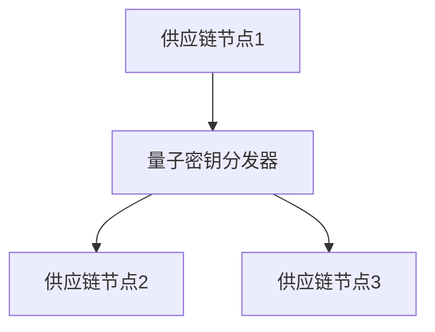

                 


# 巴菲特的供应链韧性分析：量子加密在供应链安全中的应用

> **关键词**: 供应链韧性, 巴菲特, 量子加密, 供应链安全, 量子密钥分发

> **摘要**:  
本文探讨了巴菲特的供应链韧性分析，并深入研究了量子加密技术在供应链安全中的应用。通过分析供应链韧性的核心概念、巴菲特的供应链策略，以及量子加密技术的原理和应用场景，本文揭示了如何利用量子加密技术提升供应链的安全性。文章还详细介绍了量子加密技术的数学模型、算法实现、系统架构设计，以及实际案例分析，为读者提供了全面的技术视角。

---

# 第一部分: 供应链韧性与量子加密概述

## 第1章: 供应链韧性与巴菲特的供应链策略

### 1.1 供应链韧性的概念与重要性

#### 1.1.1 供应链韧性的定义
供应链韧性是指供应链在面对外部干扰、不确定性或压力时，能够维持正常运作并迅速恢复的能力。它强调供应链的灵活性、冗余性和适应性。

#### 1.1.2 供应链韧性的重要性
供应链韧性是企业应对市场波动、自然灾害、疫情等不确定性的关键能力。具备强大供应链韧性的企业能够在危机中快速响应，确保业务连续性。

#### 1.1.3 供应链韧性与企业竞争力的关系
供应链韧性直接影响企业的成本控制、交付能力和客户满意度。强大的供应链韧性能够提升企业的竞争力，增强市场应对能力。

---

### 1.2 巴菲特的供应链策略分析

#### 1.2.1 巴菲特投资理念与供应链管理
巴菲特的投资理念强调长期稳健的回报和对企业的深入了解。他的供应链策略注重成本控制、供应商稳定性以及供应链的透明化。

#### 1.2.2 巴菲特供应链策略的典型案例
以巴菲特投资的可口可乐公司为例，可口可乐通过优化供应链网络、建立本地化的生产设施，提升了供应链的效率和韧性。

#### 1.2.3 巴菲特供应链策略对现代企业的启示
巴菲特的供应链策略启示我们，供应链管理不仅是成本问题，更是企业战略的核心组成部分。企业应注重供应链的灵活性和冗余性。

---

### 1.3 量子加密技术的基本原理

#### 1.3.1 量子加密的定义
量子加密是一种基于量子力学原理的加密技术，利用量子态的叠加性和纠缠性实现信息的加密和传输。

#### 1.3.2 量子加密的核心原理
量子加密的核心是量子密钥分发（QKD），通过在量子状态下传输密钥，确保密钥的安全性。任何未经授权的窃听都会破坏量子态，从而被发现。

#### 1.3.3 量子加密技术的特点与优势
量子加密技术具有不可破解性、高安全性、抗干扰性强等特点，是保护供应链数据传输安全的理想选择。

---

## 第2章: 供应链安全问题与量子加密的应用场景

### 2.1 供应链安全问题的现状

#### 2.1.1 供应链安全问题的定义
供应链安全问题是指在供应链的各个环节中，由于人为或技术原因导致的数据泄露、信息篡改等问题。

#### 2.1.2 供应链安全问题的典型案例
近年来，多起供应链安全事件暴露了传统加密技术的局限性，如某知名芯片制造商的数据泄露事件。

#### 2.1.3 供应链安全问题对企业的影响
供应链安全问题可能导致企业面临巨大的经济损失、声誉损害以及法律风险。

---

### 2.2 量子加密在供应链安全中的应用

#### 2.2.1 量子加密在数据传输中的应用
通过量子密钥分发技术，供应链中的数据传输可以实现端到端加密，确保数据的机密性和完整性。

#### 2.2.2 量子加密在供应链节点间的信任建立
量子加密技术可以帮助供应链中的不同节点建立信任关系，确保数据的透明性和不可篡改性。

#### 2.2.3 量子加密在供应链风险管理中的作用
量子加密技术可以实时监测供应链中的潜在威胁，帮助企业在风险发生前采取预防措施。

---

## 第3章: 量子加密技术的核心概念与实现原理

### 3.1 量子加密技术的核心概念

#### 3.1.1 量子态的基本性质
量子态具有叠加性和纠缠性，是量子加密技术的核心基础。

#### 3.1.2 量子叠加与量子纠缠
量子叠加是指一个量子系统可以同时处于多个状态；量子纠缠是指两个或多个量子系统之间存在强关联。

#### 3.1.3 量子密钥分发（QKD）的原理
量子密钥分发通过在量子状态下传输密钥，确保密钥的安全性。任何未经授权的窃听都会破坏量子态，从而被发现。

---

### 3.2 量子加密技术的实现原理

#### 3.2.1 量子密钥分发（QKD）的流程
1. **密钥生成**: 通过量子态传输生成共享密钥。
2. **密钥分发**: 将密钥安全地分发给供应链中的各个节点。
3. **密钥验证**: 确保密钥的完整性和安全性。

#### 3.2.2 量子加密算法的数学模型
量子密钥分发的数学模型基于量子态的叠加性和纠缠性，确保密钥的安全性。

#### 3.2.3 量子加密技术的优缺点对比
- **优点**: 高安全性、抗干扰性强。
- **缺点**: 实施成本高、技术复杂。

---

## 第4章: 量子加密技术的数学模型与公式

### 4.1 量子态的数学表示

#### 4.1.1 量子态的叠加原理
量子态可以表示为多个基态的线性组合，例如：
$$|\psi\rangle = \alpha|0\rangle + \beta|1\rangle$$

#### 4.1.2 量子态的纠缠原理
两个量子系统的纠缠态可以表示为：
$$|\psi\rangle = \frac{1}{\sqrt{2}}(|0\rangle|1\rangle + |1\rangle|0\rangle)$$

#### 4.1.3 量子态的测量原理
量子态的测量会将量子态投影到某个基态，例如测量结果为$|0\rangle$或$|1\rangle$。

---

## 第5章: 量子加密技术的系统分析与架构设计

### 5.1 供应链安全系统的应用场景

#### 5.1.1 供应链节点间的通信安全
通过量子加密技术，供应链中的节点间通信可以实现端到端加密。

#### 5.1.2 供应链数据的加密传输
量子加密技术可以确保供应链数据在传输过程中的机密性和完整性。

#### 5.1.3 供应链风险管理中的量子加密应用
量子加密技术可以帮助企业在风险管理中实现数据的安全共享和分析。

---

### 5.2 供应链安全系统的功能设计

#### 5.2.1 供应链安全系统的功能模块
- **密钥管理模块**: 负责密钥的生成、分发和管理。
- **数据加密模块**: 负责数据的加密和解密。
- **风险管理模块**: 实时监测供应链中的潜在威胁。

#### 5.2.2 供应链安全系统的功能流程
1. **密钥生成**: 使用量子态生成共享密钥。
2. **数据加密**: 对供应链数据进行加密。
3. **数据传输**: 通过量子加密通道传输数据。
4. **数据解密**: 在接收端解密数据。
5. **风险管理**: 实时监测供应链中的潜在威胁。

---

## 第6章: 量子加密技术的系统架构设计

### 6.1 系统架构设计

#### 6.1.1 系统架构图


#### 6.1.2 系统接口设计
- **输入接口**: 接收供应链数据和密钥请求。
- **输出接口**: 发送加密数据和共享密钥。

#### 6.1.3 系统交互流程
1. 供应链节点1向量子密钥分发器发送密钥请求。
2. 量子密钥分发器生成共享密钥并分发给供应链节点2和3。
3. 供应链节点1发送加密数据给供应链节点2。
4. 供应链节点2解密数据并发送给供应链节点3。

---

## 第7章: 量子加密技术的项目实战

### 7.1 环境安装

#### 7.1.1 系统环境
- 操作系统: Linux
- 量子加密库: QKD库
- 开发工具: Python

#### 7.1.2 安装步骤
```bash
pip install qkd-library
```

---

### 7.2 核心代码实现

#### 7.2.1 量子密钥分发器代码
```python
import qkd_library

def generate_key():
    key = qkd_library.generate_quantum_key()
    return key

def distribute_key(node1, node2):
    key = generate_key()
    qkd_library.distribute_key(node1, node2, key)

distribute_key(node1, node2)
```

---

#### 7.2.2 数据加密与解密代码
```python
def encrypt_data(data, key):
    return qkd_library.encrypt(data, key)

def decrypt_data(ciphertext, key):
    return qkd_library.decrypt(ciphertext, key)

encrypted_data = encrypt_data("供应链数据", key)
decrypted_data = decrypt_data(encrypted_data, key)
```

---

### 7.3 案例分析

#### 7.3.1 案例背景
假设一家制造企业与多家供应商通过量子加密技术实现数据共享，确保供应链数据的安全性。

#### 7.3.2 案例分析
1. 企业A生成量子密钥并分发给供应商B和C。
2. 企业A向供应商B发送加密的采购订单。
3. 供应商B解密订单并确认后，向企业A发送加密的确认信息。
4. 同时，供应商C也通过量子加密技术与企业A进行数据交互。

---

## 第8章: 总结与展望

### 8.1 总结
本文探讨了巴菲特的供应链韧性分析，并深入研究了量子加密技术在供应链安全中的应用。通过理论分析和实际案例，展示了量子加密技术在提升供应链安全性和韧性中的巨大潜力。

### 8.2 展望
未来，随着量子技术的不断发展，量子加密技术将在供应链安全中发挥更重要的作用。企业应积极拥抱这一技术，提升供应链的竞争力和抗风险能力。

---

# 作者：AI天才研究院/AI Genius Institute & 禅与计算机程序设计艺术 /Zen And The Art of Computer Programming

