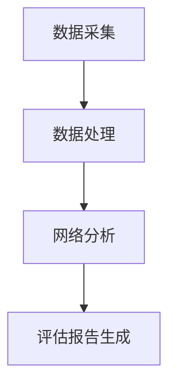

                 


# 巴菲特的创新能力评估：分布式创新网络的价值创造

---

## 关键词

- 创新能力评估
- 分布式创新网络
- 巴菲特创新方法
- 价值创造
- 网络分析

---

## 摘要

本文探讨了巴菲特创新能力评估的核心概念，分析了分布式创新网络的结构及其在价值创造中的作用。通过理论与实践结合，详细阐述了创新网络的评估方法和系统架构设计，结合实际案例，展示了如何通过分布式创新网络实现高效的价值创造。

---

# 目录

## 第一部分：背景介绍

## 第二部分：核心概念与联系

## 第三部分：算法原理

## 第四部分：系统分析与架构设计

## 第五部分：项目实战

## 第六部分：总结与最佳实践

---

## 第一部分：背景介绍

### 第1章：创新能力评估的背景与问题

#### 1.1 创新能力评估的重要性

创新是企业发展的核心驱动力，创新能力评估成为企业战略管理的重要环节。在知识经济时代，创新能力的强弱直接关系到企业的生存与发展。传统的创新能力评估方法往往局限于单点评估，难以捕捉创新网络中的协同效应。因此，如何构建一个全面的创新能力评估体系，成为学术界和企业界的共同关注点。

#### 1.2 巴菲特的创新方法论

巴菲特作为投资界的传奇人物，其成功不仅源于其价值投资理念，还与其独特的创新方法论密不可分。巴菲特注重长期投资，通过深入分析企业的基本面，挖掘其潜在价值。他的创新方法论强调长期视角和系统性思考，为企业创新能力评估提供了新的思路。

#### 1.3 分布式创新网络的定义与特点

分布式创新网络是指由多个创新主体（如企业、研究机构、个人等）通过网络连接，协同创新的组织形式。其特点是去中心化、开放性和协作性强。分布式创新网络能够整合不同领域的资源，形成创新合力，从而提高创新效率和价值创造能力。

---

## 第二部分：核心概念与联系

### 第2章：分布式创新网络的核心要素

#### 2.1 创新网络的结构分析

创新网络由节点和边组成，节点代表创新主体，边代表合作关系。通过分析网络的结构密度、连接强度等指标，可以评估网络的协同创新能力。

#### 2.2 创新能力评估模型

创新能力评估模型包括创新能力、协同能力和价值实现能力三个维度。模型通过量化指标，评估创新网络的整体效能。

#### 2.3 巴菲特创新方法与分布式创新网络的结合

巴菲特的长期投资理念与分布式创新网络的协同效应高度契合。通过构建长期合作关系，巴菲特实现了创新网络的价值最大化。

---

## 第三部分：算法原理

### 第3章：创新能力评估算法

#### 3.1 网络分析算法

使用网络分析算法评估创新网络的结构特征，包括节点度数、中心度和网络密度等指标。这些指标反映了网络的协同能力和创新潜力。

#### 3.2 评估模型的数学公式

创新能力评估模型的数学表达如下：

$$
\text{创新能力} = \alpha \times \text{创新能力指标} + \beta \times \text{协同能力指标} + \gamma \times \text{价值实现能力指标}
$$

其中，$\alpha$、$\beta$、$\gamma$为权重系数，$\alpha + \beta + \gamma = 1$。

---

## 第四部分：系统分析与架构设计

### 第4章：系统架构设计

#### 4.1 问题场景介绍

本文设计了一个基于分布式创新网络的创新能力评估系统，旨在帮助企业识别创新潜力和协同机会。

#### 4.2 系统功能设计

系统功能包括数据采集、网络分析、评估报告生成等模块。

#### 4.3 系统架构图



---

## 第五部分：项目实战

### 第5章：项目实现与案例分析

#### 5.1 环境安装

需要安装Python和相关库，如NetworkX、Matplotlib等。

#### 5.2 核心代码实现

以下是创新能力评估模型的Python代码：

```python
import networkx as nx
import matplotlib.pyplot as plt

# 创建一个空图
G = nx.Graph()

# 添加节点
G.add_nodes_from(['A', 'B', 'C', 'D'])

# 添加边
G.add_edges_from([('A', 'B'), ('B', 'C'), ('C', 'D'), ('D', 'A')])

# 绘制图形
nx.draw(G, with_labels=True, node_color='blue', edge_color='red')
plt.show()
```

#### 5.3 案例分析

以某科技公司为例，通过分析其创新网络的结构和协作关系，评估其创新能力，并提出改进建议。

---

## 第六部分：总结与最佳实践

### 第6章：总结与小结

#### 6.1 总结

本文详细探讨了巴菲特创新能力评估的核心概念，分析了分布式创新网络的结构及其在价值创造中的作用。通过理论与实践结合，展示了如何通过分布式创新网络实现高效的价值创造。

#### 6.2 最佳实践

建议企业在构建创新网络时，注重长期合作关系的建立，同时借助网络分析工具，量化评估创新能力，实现创新价值的最大化。

---

## 作者

作者：AI天才研究院（AI Genius Institute） & 禅与计算机程序设计艺术（Zen And The Art of Computer Programming）

---

## 附录

### 附录A：相关文献

1. 巴菲特投资哲学的研究
2. 分布式创新网络的文献综述

### 附录B：工具与代码

提供创新能力评估模型的完整代码和详细解释。

---

以上是《巴菲特的创新能力评估：分布式创新网络的价值创造》的完整目录和内容概要。文章通过理论分析和实践案例，深入探讨了分布式创新网络的价值创造机制，为企业创新能力评估提供了新的视角和方法。

