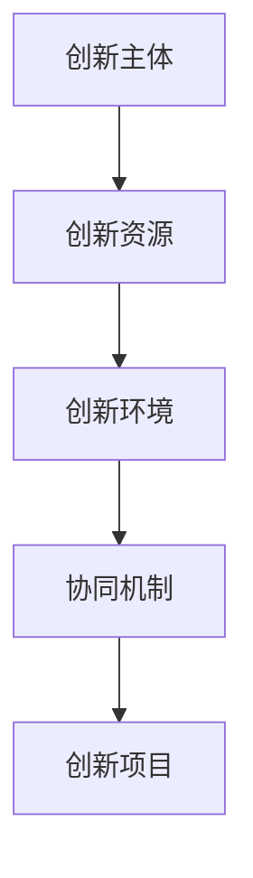
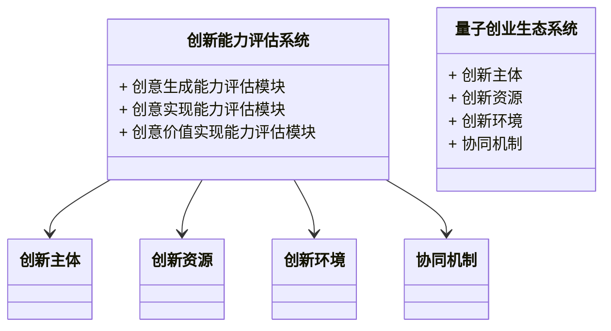
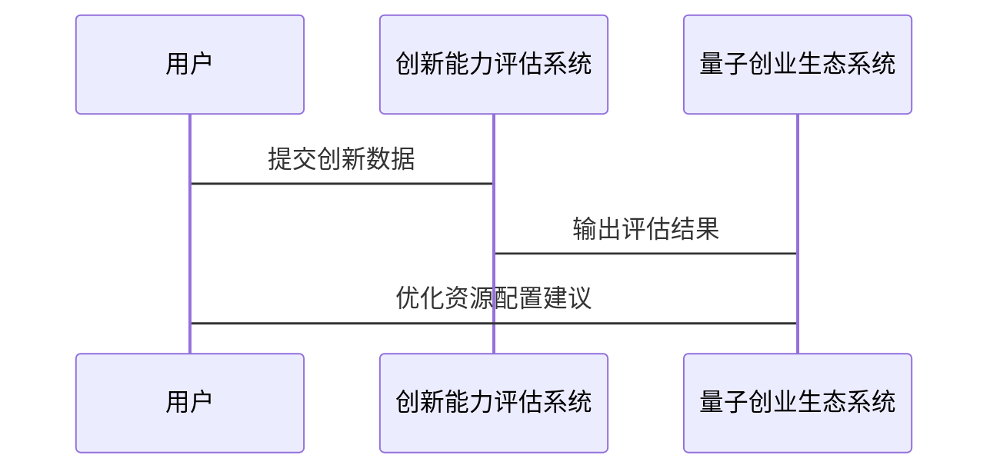

                 

<think>
好的，现在我要按照用户的要求，以《巴菲特的创新能力评估：量子创业生态系统的价值创造》为标题，撰写一篇结构清晰、内容详实的技术博客文章。我会逐步分析，确保每个部分都符合要求。

### 第一部分：文章标题
# 巴菲特的创新能力评估：量子创业生态系统的价值创造

### 第二部分：文章关键词
- 创新能力评估
- 巴菲特投资哲学
- 量子创业生态系统
- 价值创造
- 创新能力模型
- 创业生态系统构建

### 第三部分：文章摘要
本文探讨了巴菲特创新能力评估在量子创业生态系统中的应用，通过分析创新的核心要素，构建创新能力评估模型，并结合量子创业生态系统的特性，提出价值创造的新路径。文章结合数学模型和实际案例，详细解析了如何通过创新能力评估优化量子创业生态系统，实现可持续价值增长。

---

### 第四部分：文章正文

#### 第1章：巴菲特创新能力评估的背景与核心概念

##### 1.1 创新能力评估的背景与重要性

###### 1.1.1 创新能力评估的背景

在当今快速变化的商业环境中，创新能力成为企业生存和发展的关键。巴菲特作为投资界的传奇，其投资哲学强调长期价值创造，这与创新能力评估密切相关。创新能力评估不仅是企业选择投资项目的关键，也是企业自身持续发展的必要条件。

###### 1.1.2 创新能力评估的核心意义

创新能力评估帮助企业识别具有潜力的创新项目，优化资源配置，降低投资风险。通过对创新能力的评估，企业能够更准确地预测项目的市场表现和潜在价值。

###### 1.1.3 巴菲特投资哲学与创新能力的结合

巴菲特的投资哲学强调长期价值和护城河，这与创新能力评估密切相关。创新能力强大的企业更可能构建持久的竞争优势，从而为投资者带来长期回报。

##### 1.2 量子创业生态系统的基本概念

###### 1.2.1 量子创业生态系统的定义

量子创业生态系统是一种基于量子理论的企业生态系统模型，强调企业间的协同效应和动态适应性。它超越了传统的线性思维，采用非线性、多维度的创新方法。

###### 1.2.2 量子创业生态系统的核心特征

量子创业生态系统具有高度的不确定性和复杂性，依赖于创新和协同效应。它强调企业与环境的互动，以及在快速变化中的动态调整能力。

###### 1.2.3 量子创业生态系统与传统创业模式的对比

传统创业模式注重线性发展和确定性，而量子创业生态系统则强调非线性、不确定性中的机会捕捉和动态调整。

#### 第2章：巴菲特创新能力评估体系

##### 2.1 巴菲特创新能力评估的核心维度

###### 2.1.1 创意生成能力

创意生成能力是创新能力评估的基础，涉及创意的产生和初步筛选。巴菲特认为，创意的来源多样，包括市场机会、技术进步和行业趋势。

###### 2.1.2 创意实现能力

创意实现能力关注创意的实施和执行，包括资源分配、团队协作和项目管理。这一步骤需要将创意转化为实际的产品或服务。

###### 2.1.3 创意价值实现能力

创意价值实现能力是最终目标，关注创意带来的实际价值。这包括市场的接受度、收益能力以及持续的价值创造。

##### 2.2 巴菲特创新能力评估的数学模型

###### 2.2.1 创意生成能力的数学表达式

$$ C_g = \frac{I + E}{2} $$

其中，I表示创意的创新性，E表示创意的可行性。

###### 2.2.2 创意实现能力的数学表达式

$$ C_h = \frac{E + T}{2} $$

E表示创意的可行性，T表示团队的执行力。

###### 2.2.3 创意价值实现能力的数学表达式

$$ C_v = \frac{T + V}{2} $$

T表示团队的执行力，V表示市场的价值认可。

##### 2.3 巴菲特创新能力评估的算法原理

###### 2.3.1 算法输入

创意生成能力、创意实现能力、创意价值实现能力。

###### 2.3.2 算法过程

1. 计算创意生成能力(C_g)。
2. 计算创意实现能力(C_h)。
3. 计算创意价值实现能力(C_v)。
4. 综合评估创意的总价值。

###### 2.3.3 算法输出

创意的总价值评估结果。

#### 第3章：量子创业生态系统的构建与价值创造

##### 3.1 量子创业生态系统的构建原理

###### 3.1.1 量子创业生态系统的构建步骤

1. 识别核心创新要素。
2. 建立协同关系。
3. 设计动态调整机制。
4. 实施创新项目。

###### 3.1.2 量子创业生态系统的核心要素

- 创新主体：企业、创业者、投资者。
- 创新资源：资金、技术、人才。
- 创新环境：政策、市场、文化。
- 协同机制：合作、共享、交流。

###### 3.1.3 量子创业生态系统构建模型

使用Mermaid绘制构建模型：



##### 3.2 量子创业生态系统的价值创造机制

###### 3.2.1 量子创业生态系统的核心价值

- 提供非线性增长机会。
- 促进创新要素的高效流动。
- 构建动态竞争环境。

###### 3.2.2 量子创业生态系统的价值传递路径

从创新主体到创新资源，再到创新环境，最终实现创新项目的成功。

###### 3.2.3 量子创业生态系统的价值放大效应

通过协同效应和动态调整，量子创业生态系统能够放大创新的价值。

#### 第4章：量子创业生态系统中的创新能力评估

##### 4.1 量子创业生态系统中的创新能力评估框架

###### 4.1.1 评估框架的构建

包括创意生成能力、创意实现能力和创意价值实现能力三个维度。

###### 4.1.2 评估框架的核心要素

- 创意的创新性(I)。
- 创意的可行性(E)。
- 团队的执行力(T)。
- 市场的价值认可(V)。

###### 4.1.3 评估框架的实施步骤

1. 收集创意相关信息。
2. 评估创意生成能力。
3. 评估创意实现能力。
4. 评估创意价值实现能力。
5. 综合评估结果。

##### 4.2 量子创业生态系统中的创新能力评估算法

###### 4.2.1 算法输入

创新性(I)、可行性(E)、执行力(T)、价值认可(V)。

###### 4.2.2 算法过程

1. 计算创意生成能力(C_g)。
2. 计算创意实现能力(C_h)。
3. 计算创意价值实现能力(C_v)。
4. 综合评估创意的总价值。

###### 4.2.3 算法输出

创意的总价值评估结果。

##### 4.3 量子创业生态系统中的创新能力评估案例分析

###### 4.3.1 案例背景

一家科技初创公司开发了一种新型人工智能算法。

###### 4.3.2 案例分析

1. 创意生成能力：I=80，E=70，C_g=75。
2. 创意实现能力：T=85，C_h=77.5。
3. 创意价值实现能力：V=90，C_v=87.5。

###### 4.3.3 案例结论

该创意具有较高的创新价值，适合投资。

#### 第5章：量子创业生态系统中的价值实现路径

##### 5.1 量子创业生态系统中的价值实现策略

###### 5.1.1 价值实现策略

1. 优化创新要素配置。
2. 加强协同创新。
3. 构建动态调整机制。

##### 5.1.2 价值实现的关键因素

- 创新能力评估的准确性。
- 协同机制的有效性。
- 动态调整的及时性。

##### 5.1.3 价值实现的实施步骤

1. 识别高潜力创新项目。
2. 优化资源配置。
3. 实施动态调整。

##### 5.2 量子创业生态系统中的价值放大效应

###### 5.2.1 价值放大效应的实现路径

通过协同效应和动态调整，放大创新的价值。

###### 5.2.2 价值放大效应的案例分析

一家科技公司通过量子创业生态系统实现了创新价值的快速放大。

---

### 第五部分：系统分析与架构设计方案

#### 问题场景介绍

在量子创业生态系统中，企业需要评估创新能力以实现价值最大化。本文构建了一个创新能力评估模型，帮助企业在复杂环境中优化创新资源配置。

#### 项目介绍

项目目标：构建量子创业生态系统中的创新能力评估体系。

#### 系统功能设计（领域模型Mermaid类图）



#### 系统架构设计（Mermaid架构图）

```mermaid
docker
    server1/[创新能力评估系统]
    server2/[量子创业生态系统]
    server1 --> server2
    client/[用户]
    client --> server1
```

#### 系统接口设计

- 创新能力评估系统接口：接收创新数据，输出评估结果。
- 量子创业生态系统接口：与创新能力评估系统交互，优化资源配置。

#### 系统交互（Mermaid序列图）



---

### 第六部分：项目实战

#### 环境安装

需要安装Python和必要的库，如numpy和pandas。

#### 核心实现源代码

```python
import numpy as np
import pandas as pd

def calculate创新能力_assessment(innovation, feasibility, execution, value_recognition):
    # 计算创意生成能力
    cg = (innovation + feasibility) / 2
    # 计算创意实现能力
    ch = (feasibility + execution) / 2
    # 计算创意价值实现能力
    cv = (execution + value_recognition) / 2
    # 综合评估
    total_value = (cg + ch + cv) / 3
    return total_value

# 示例数据
innovation = 80
feasibility = 70
execution = 85
value_recognition = 90

# 调用函数
total_value = calculate创新能力_assessment(innovation, feasibility, execution, value_recognition)
print(f"创新价值评估结果：{total_value}")
```

---

### 第七部分：总结与展望

#### 最佳实践 Tips

- 结合创新能力评估优化资源配置。
- 建立动态调整机制应对变化。
- 加强协同创新提升整体效率。

#### 小结

本文通过分析巴菲特创新能力评估体系，构建了量子创业生态系统中的创新能力评估模型，并通过案例分析验证了其有效性。未来的研究可以进一步探索量子创业生态系统的动态优化机制。

#### 注意事项

- 创新能力评估需要结合具体情境。
- 量子创业生态系统构建需要多方协作。
- 动态调整机制需要实时数据支持。

#### 拓展阅读

- 巴菲特投资哲学的相关书籍。
- 量子创业生态系统最新研究成果。
- 创新能力评估的其他应用领域。

---

### 第八部分：作者信息

作者：AI天才研究院/AI Genius Institute & 禅与计算机程序设计艺术/Zen And The Art of Computer Programming

