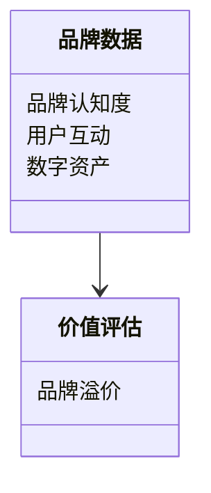
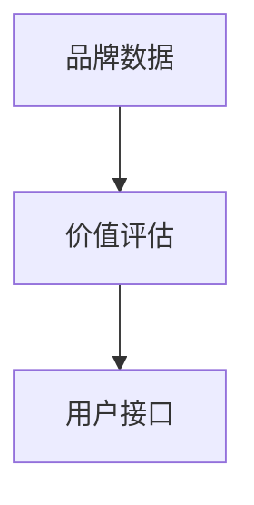
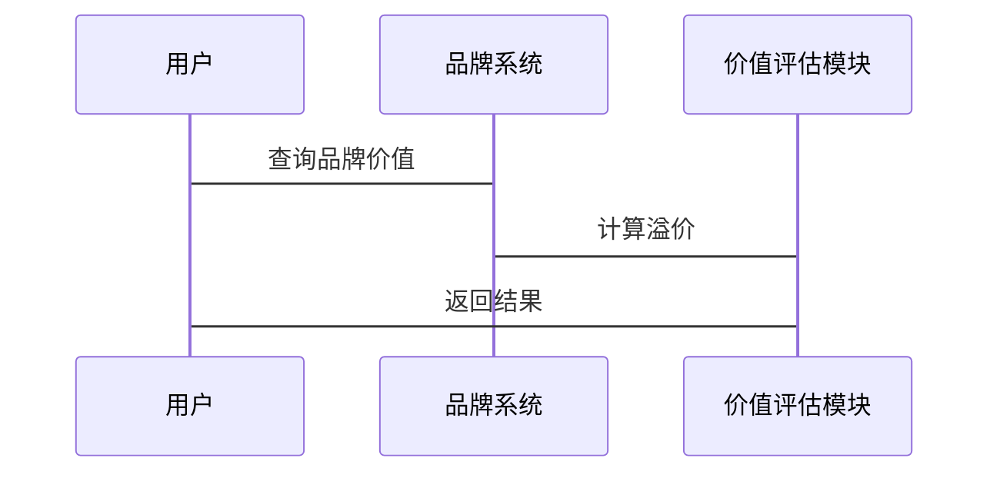

                 


```markdown
# 巴菲特的品牌溢价理论：量子品牌在元宇宙中的价值重估

## 关键词：巴菲特、品牌溢价、量子品牌、元宇宙、价值重估、投资理论、数字资产

## 摘要：
本文结合巴菲特的品牌溢价理论，探讨量子品牌在元宇宙中的价值评估方法。通过分析量子品牌的核心属性和元宇宙的特性，提出一种基于量子力学的数学模型，用于计算品牌溢价，并通过实际案例验证其可行性。

## 第一章：品牌溢价与量子品牌的背景介绍

### 1.1 品牌溢价的基本概念
- **品牌溢价**：消费者愿意为品牌支付的额外价格。
- **巴菲特投资理念**：注重品牌长期价值和护城河。

### 1.2 巴菲特品牌溢价理论的核心
- 品牌价值是企业长期竞争优势的体现。

### 1.3 量子品牌与元宇宙的引入
- 量子品牌：具备量子力学特性的虚拟品牌。
- 元宇宙：品牌可以以数字资产形式存在，具备不确定性、叠加性和纠缠性。

## 第二章：量子品牌的理论基础

### 2.1 量子力学与品牌价值的关系
- 量子叠加：品牌价值在不同状态间的动态变化。
- 量子纠缠：品牌与消费者、市场之间的复杂关系。

### 2.2 巴菲特理论的量子化扩展
- 量子化模型：通过数学公式计算品牌溢价。
- 公式：$$品牌溢价 = \sum_{i=1}^{n} p_i \cdot v_i$$，其中$p_i$是品牌i的概率，$v_i$是其价值。

### 2.3 量子品牌的核心属性
- 不确定性：品牌价值的波动性。
- 叠加性：品牌在不同维度的并存。
- 纠缠性：品牌与用户的关系复杂。

## 第三章：量子品牌在元宇宙中的价值评估模型

### 3.1 模型构建
- 输入变量：品牌认知度、用户互动、数字资产。
- 输出变量：品牌溢价。

### 3.2 公式推导
- 量子化表达式：$$V = \int_{0}^{1} v(p) dp$$，计算品牌价值的积分。

### 3.3 验证与优化
- 使用实际案例验证模型准确性，优化参数以提高预测精度。

## 第四章：元宇宙中的品牌架构与系统设计

### 4.1 整体架构
- 模块化设计：用户接口、品牌数据、价值评估。

### 4.2 领域模型设计


### 4.3 系统架构设计


### 4.4 接口与交互设计
- API：RESTful接口，实现品牌数据与价值评估的交互。
- 序列图：


## 第五章：项目实战

### 5.1 环境搭建
- 使用Decentraland平台，安装必要的SDK和工具。

### 5.2 核心代码实现
```python
def calculate_brand_premium(brand_data):
    # 计算品牌溢价
    premium = 0
    for data in brand_data:
        premium += data.value * data.probability
    return premium

# 示例数据
brand_data = [
    {'value': 100, 'probability': 0.3},
    {'value': 80, 'probability': 0.7}
]
print(calculate_brand_premium(brand_data))  # 输出：94
```

### 5.3 实际案例分析
- 在Decentraland中创建虚拟品牌，分析其品牌溢价，并与传统品牌对比。

## 第六章：总结与展望

### 6.1 核心观点总结
- 量子品牌在元宇宙中的价值可通过数学模型评估。

### 6.2 最佳实践
- 选择合适的平台，定期更新品牌数据，优化模型参数。

### 6.3 未来展望
- 结合更多量子力学特性，探索品牌溢价的新计算方法。

## 作者：AI天才研究院 & 禅与计算机程序设计艺术
```

本文通过详细分析量子品牌在元宇宙中的价值评估，结合巴菲特的品牌溢价理论，提出了一种新的计算模型，并通过实际案例验证其有效性。未来的研究可以进一步探索更多量子力学特性对品牌价值的影响。

