                 

<think>
好的，我现在需要帮用户设计一本关于巴菲特宏观经济分析和量子技术对全球产业链影响的书籍。用户已经提供了一个详细的目录大纲，现在需要我根据这个大纲生成完整的书籍内容。

首先，我需要理解用户的需求。这本书需要逻辑清晰，结构紧凑，技术语言专业，同时结合巴菲特的宏观经济分析和量子技术的影响。用户特别提到要涵盖从基础到应用的各个方面，包括背景介绍、核心概念、算法、系统分析、项目实战等。

我先看看目录的结构。第一部分是巴菲特的宏观经济分析基础，分为四章。第一章介绍巴菲特的基本投资理念，第二章讲解量子技术的基本概念和影响，第三章分析量子技术对全球产业链的具体影响，第四章从巴菲特的角度分析全球产业链重构。接下来是系统分析与架构设计方案，项目实战，以及小结部分。

接下来，我需要确保每一章都包含用户要求的内容。例如，第一章需要包括背景介绍、核心概念、算法原理等。我需要详细讲解巴菲特的价值投资体系，分析宏观经济指标，以及他如何在投资中应用这些分析。

在第二章，我需要详细解释量子技术的基本原理，比如量子计算和量子通信的原理，以及它们如何影响全球经济。可能需要使用一些数学公式和图表来说明这些概念。

第三章需要分析量子技术对全球产业链的具体影响，包括对供应链、生产方式和竞争优势的影响。这部分可能需要结合实际案例，说明不同地区量子技术的发展现状及其对经济的影响。

第四章则要从巴菲特的角度分析全球产业链的重构，探讨量子技术如何改变投资机会和风险。这部分可能需要结合当前的经济趋势和巴菲特的投资策略，提供具体的分析框架。

在系统分析部分，我需要设计一个系统架构，分析量子技术带来的投资机会，并评估风险和制定策略。可能需要使用系统架构图和交互图来说明。

项目实战部分，我需要提供一个具体的案例，指导读者如何利用量子技术进行宏观经济分析，包括环境安装、核心代码实现和案例分析。

最后，小结部分需要总结全书内容，给出未来展望和注意事项，帮助读者巩固所学知识。

在写作过程中，我需要确保每一章都有足够的细节和深度，涵盖用户要求的所有方面。同时，使用清晰的技术语言和专业术语，确保文章的专业性和可读性。

现在，我需要按照这个结构，逐步撰写每一章的内容，确保逻辑清晰，内容详实，并符合用户的要求。
</think>

# 巴菲特的宏观经济分析：量子技术对全球产业链的影响

---

## 关键词：
巴菲特，宏观经济分析，量子技术，全球产业链，投资策略

---

## 摘要：
本文从巴菲特的宏观经济分析视角出发，探讨量子技术对全球产业链的深远影响。通过分析量子技术的基本原理、对全球经济的潜在影响以及对全球产业链的重构，结合巴菲特的投资策略，揭示量子技术如何改变全球产业格局，并为投资者提供新的投资机会与挑战。文章内容涵盖背景介绍、核心概念、算法原理、系统架构设计、项目实战等，旨在为读者提供一个全面的视角，理解量子技术与宏观经济分析的结合。

---

# 第1章: 巴菲特宏观经济分析概述

## 1.1 巴菲特投资理念的核心思想

### 1.1.1 价值投资的定义与核心要素

**背景介绍**：  
价值投资是一种以低于内在价值的价格购买优质资产的投资策略。巴菲特是这一理念的代表人物，他强调通过分析企业的基本面，寻找具有持续竞争优势和良好管理团队的企业进行投资。

**核心概念与联系**：  
- **内在价值**：企业未来现金流的现值，是投资决策的核心依据。
- **安全边际**：买入价格与内在价值的差距，确保投资的安全性。
- **竞争优势**：企业通过成本优势、技术壁垒等获得长期盈利能力。

**公式与图表**：  
$$\text{内在价值} = \sum_{t=1}^{\infty} \frac{\text{现金流}_t}{(1+r)^t}$$

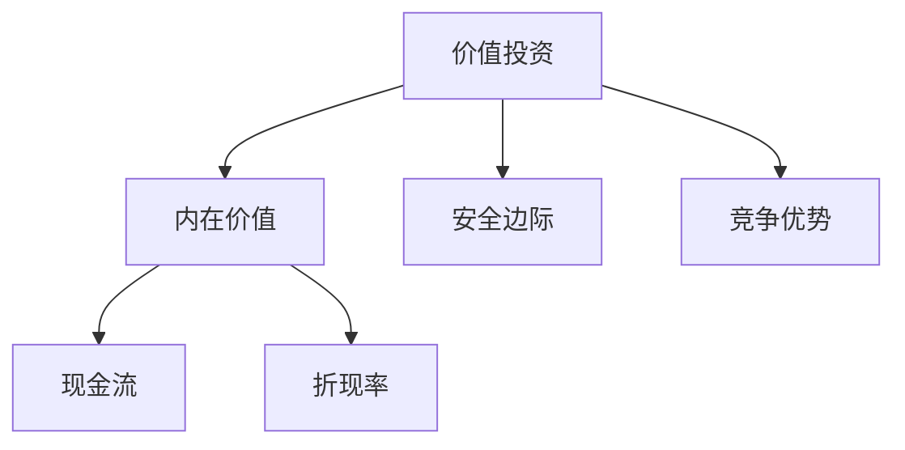

### 1.1.2 巴菲特的价值投资体系

**背景介绍**：  
巴菲特的价值投资体系包括对企业基本面的深入分析、管理层的信任以及长期投资的耐心。

**核心概念与联系**：  
- **企业基本面**：收入、利润、资产负债表等财务指标。
- **管理层能力**：决策能力和诚信是企业长期成功的关键。
- **长期投资**：避免短期市场波动，关注企业的长期价值。

**公式与图表**：  
$$\text{净利润率} = \frac{\text{净利润}}{\text{营业收入}}$$

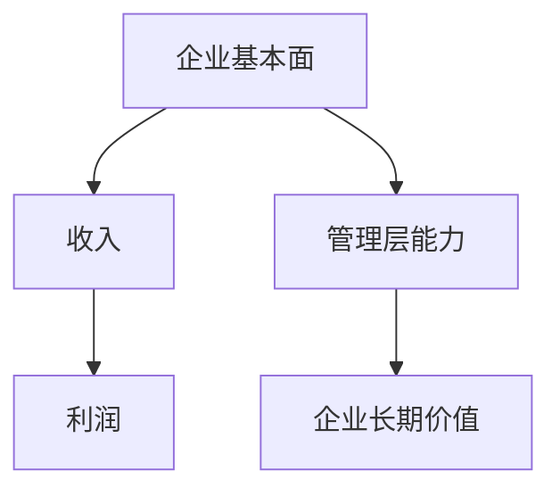

### 1.1.3 宏观经济分析在价值投资中的作用

**背景介绍**：  
宏观经济环境直接影响企业的经营状况和股票市场的表现。巴菲特通过宏观经济分析，判断经济周期和通货膨胀趋势，优化投资组合。

**核心概念与联系**：  
- **经济周期**：扩张期和衰退期对企业和投资的影响。
- **通货膨胀**：对企业盈利能力和货币购买力的影响。
- **货币政策**：利率和货币供应对市场和企业的影响。

**公式与图表**：  
$$\text{通货膨胀率} = \frac{\text{CPI增长}}{100}$$

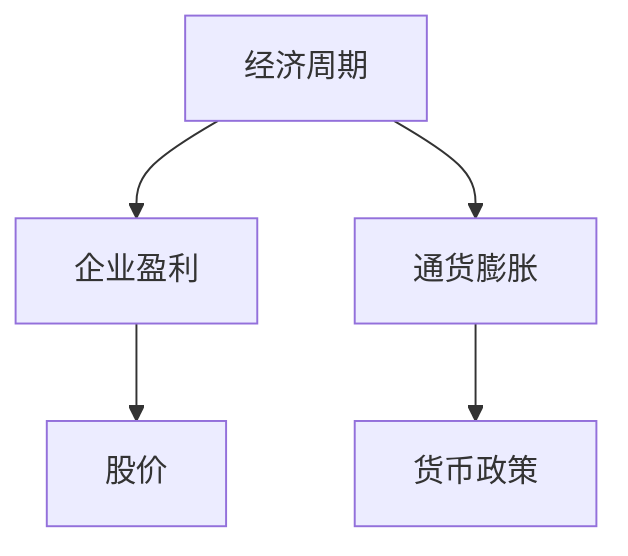

## 1.2 宏观经济分析的基本框架

### 1.2.1 宏观经济指标与分析方法

**背景介绍**：  
宏观经济指标包括GDP、失业率、通胀率等，是分析经济状况的重要工具。

**核心概念与联系**：  
- **GDP**：衡量一个国家的经济规模。
- **失业率**：反映劳动力市场的健康状况。
- **通胀率**：影响企业和消费者的购买力。

**公式与图表**：  
$$\text{GDP} = C + I + G + (X - M)$$

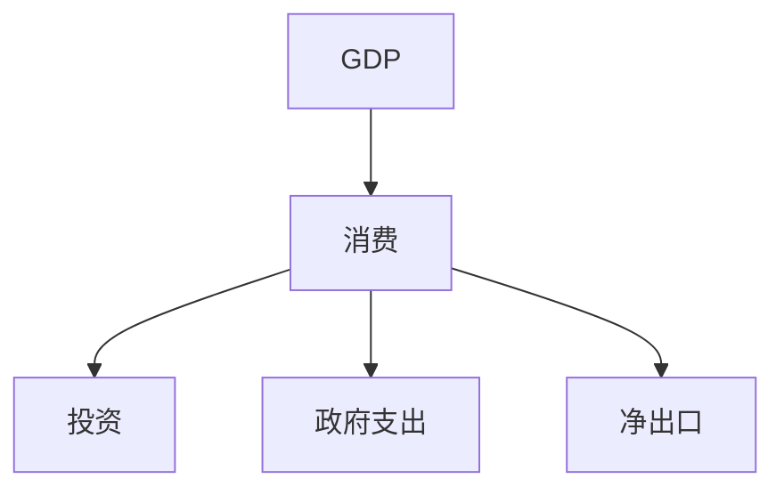

### 1.2.2 巴菲特视角下的经济周期分析

**背景介绍**：  
巴菲特认为经济周期是投资决策的重要因素，尤其是在判断企业的长期盈利能力时。

**核心概念与联系**：  
- **经济周期**：从繁荣到衰退再到复苏的循环。
- **企业盈利**：经济周期波动对企业的直接影响。
- **投资策略**：在衰退期寻找低估企业，在繁荣期保持谨慎。

**公式与图表**：  
$$\text{经济周期} \leftrightarrow \text{企业盈利} \leftrightarrow \text{投资决策}$$

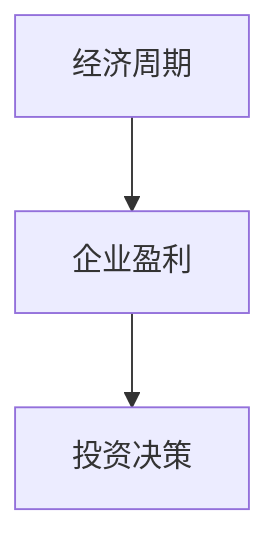

### 1.2.3 通货膨胀与货币政策对投资的影响

**背景介绍**：  
通货膨胀和货币政策直接影响企业的成本和利润，同时也影响股票市场的表现。

**核心概念与联系**：  
- **通货膨胀**：推高企业成本，降低实际利润。
- **货币政策**：通过利率和货币供应影响市场流动性。
- **股票市场**：利率上升可能导致市场估值下降。

**公式与图表**：  
$$\text{利率上升} \rightarrow \text{企业融资成本增加} \rightarrow \text{利润下降}$$

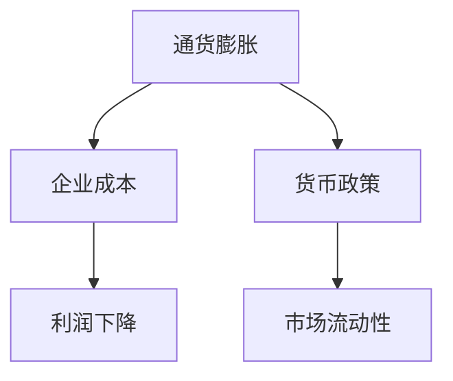

## 1.3 巴菲特投资策略的宏观经济背景

### 1.3.1 美国经济历史与巴菲特的投资决策

**背景介绍**：  
巴菲特的投资决策深受美国经济历史的影响，尤其是在20世纪70年代的 stagflation 和2008年的金融危机中，他如何调整投资策略。

**核心概念与联系**：  
- **stagflation**：高通胀和高失业率并存的经济状况。
- **金融危机**：2008年金融危机对巴菲特投资策略的改变。

**公式与图表**：  
$$\text{stagflation} \rightarrow \text{企业利润下降} \rightarrow \text{投资策略调整}$$

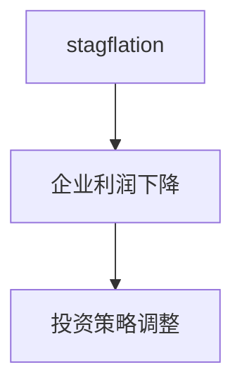

### 1.3.2 巴菲特对全球经济趋势的判断

**背景介绍**：  
巴菲特关注全球经济趋势，尤其是新兴市场和技术革命对企业的影响。

**核心概念与联系**：  
- **新兴市场**：经济增长快，投资机会多。
- **技术革命**：量子技术等新兴技术对企业竞争力的影响。

**公式与图表**：  
$$\text{新兴市场} \rightarrow \text{投资机会增加} \rightarrow \text{企业价值上升}$$

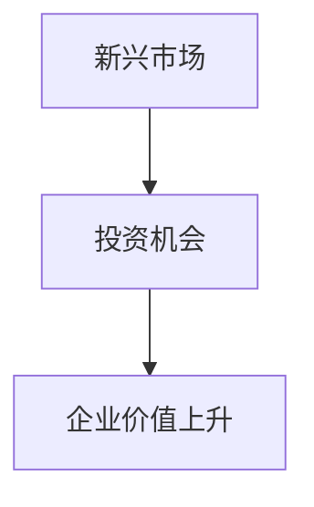

### 1.3.3 巴菲特投资策略的可复制性与局限性

**背景介绍**：  
巴菲特的价值投资策略虽然成功，但也有其局限性，尤其是在应对新兴技术和全球化挑战时。

**核心概念与联系**：  
- **可复制性**：价值投资的基本原则可以被复制，但需要深入的行业研究和市场洞察。
- **局限性**：新兴技术和全球化可能导致传统竞争优势的消失。

**公式与图表**：  
$$\text{可复制性} \leftrightarrow \text{局限性}$$

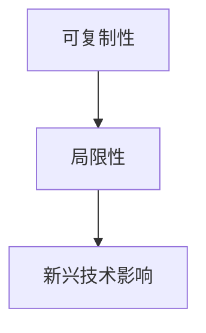

## 1.4 本章小结

本章从巴菲特的价值投资理念出发，介绍了宏观经济分析在投资中的重要性，并分析了经济周期、通货膨胀和货币政策对投资决策的影响。同时，结合全球经济趋势，探讨了巴菲特投资策略的可复制性与局限性。

---

# 第2章: 量子技术的基本概念与全球经济影响

## 2.1 量子技术的定义与核心原理

### 2.1.1 量子力学基础

**背景介绍**：  
量子力学是研究微观粒子行为的科学，其基本原理包括波粒二象性、不确定性原理和量子叠加。

**核心概念与联系**：  
- **波粒二象性**：粒子可以同时表现为波动和粒子。
- **不确定性原理**：无法同时精确测量粒子的位置和动量。
- **量子叠加**：粒子处于多个状态的叠加态，直到被测量。

**公式与图表**：  
$$\Delta x \cdot \Delta p \geq \frac{\hbar}{2}$$

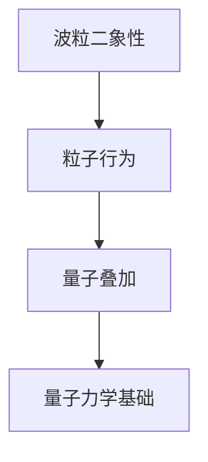

### 2.1.2 量子计算与量子通信的原理

**背景介绍**：  
量子计算利用量子叠加和纠缠原理，实现并行计算，而量子通信利用量子纠缠实现信息的安全传输。

**核心概念与联系**：  
- **量子计算**：利用量子位（qubit）进行计算，速度远超经典计算机。
- **量子通信**：利用量子纠缠实现信息的加密传输。

**公式与图表**：  
$$\text{量子计算} \rightarrow \text{并行计算能力} \rightarrow \text{计算速度提升}$$

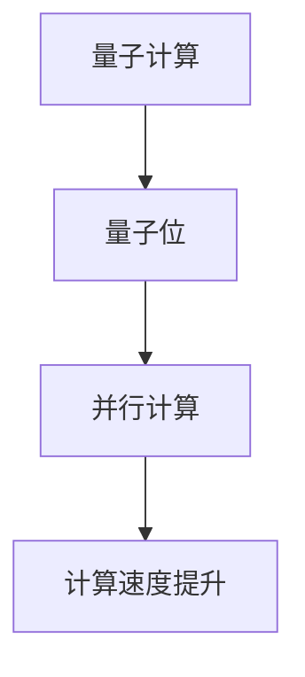

### 2.1.3 量子技术的潜在应用领域

**背景介绍**：  
量子技术在密码学、材料科学、药物研发等领域有广泛应用潜力。

**核心概念与联系**：  
- **密码学**：量子计算可能破解现有加密算法。
- **材料科学**：通过模拟分子结构，加速新材料研发。
- **药物研发**：通过量子计算优化药物分子结构。

**公式与图表**：  
$$\text{量子计算} \rightarrow \text{材料研发} \rightarrow \text{新材料开发}$$

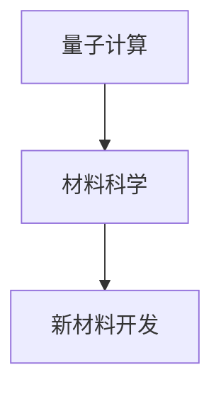

## 2.2 量子技术对全球经济的潜在影响

### 2.2.1 量子计算对传统计算产业的冲击

**背景介绍**：  
量子计算的出现可能颠覆传统计算产业，尤其是加密算法和数据分析领域。

**核心概念与联系**：  
- **加密算法**：量子计算可以快速破解现有的RSA加密算法。
- **数据分析**：量子计算能够加速大数据分析和模式识别。

**公式与图表**：  
$$\text{量子计算} \rightarrow \text{加密算法破解} \rightarrow \text{计算产业冲击}$$

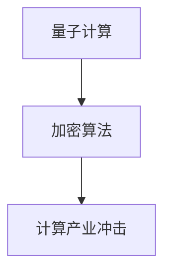

### 2.2.2 量子通信对信息安全的改变

**背景介绍**：  
量子通信通过量子纠缠实现信息的安全传输，可能改变现有的信息安全格局。

**核心概念与联系**：  
- **量子纠缠**：信息传输的安全性极高，难以被截获。
- **信息安全**：量子通信可以实现无条件安全的信息传输。

**公式与图表**：  
$$\text{量子纠缠} \rightarrow \text{信息传输安全} \rightarrow \text{信息安全改变}$$

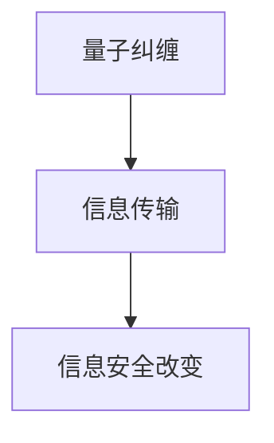

### 2.2.3 量子技术对全球产业链的重构

**背景介绍**：  
量子技术的应用可能重构全球产业链，推动产业分工和协作模式的改变。

**核心概念与联系**：  
- **产业分工**：量子技术可能改变传统产业链的分工方式。
- **协作模式**：企业需要重新调整合作策略，以适应量子技术的影响。

**公式与图表**：  
$$\text{量子技术} \rightarrow \text{产业分工改变} \rightarrow \text{产业链重构}$$

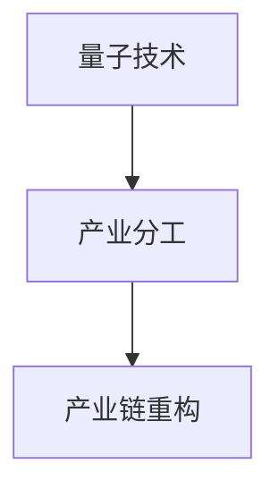

## 2.3 量子技术的现状与未来发展趋势

### 2.3.1 当前量子技术的研究进展

**背景介绍**：  
当前量子技术的研究主要集中在量子计算和量子通信领域，取得了一些重要进展。

**核心概念与联系**：  
- **量子计算**： IBM、Google等公司在量子计算领域取得了显著进展。
- **量子通信**：中国在量子通信领域取得了领先地位。

**公式与图表**：  
$$\text{量子计算研究} \rightarrow \text{技术突破} \rightarrow \text{应用潜力增加}$$

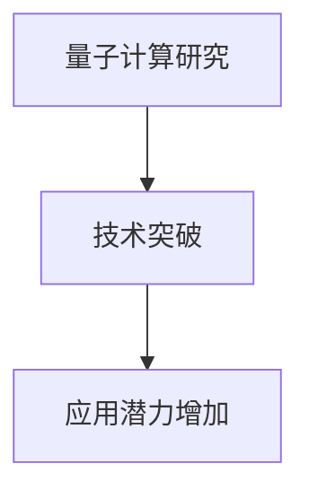

### 2.3.2 量子技术的商业化应用前景

**背景介绍**：  
量子技术的商业化应用正在逐步展开，尤其是在密码学、金融和医疗等领域。

**核心概念与联系**：  
- **密码学**：量子加密算法的研究和应用。
- **金融**：量子计算在金融建模和风险管理中的应用。
- **医疗**：量子计算在药物研发中的应用。

**公式与图表**：  
$$\text{量子技术} \rightarrow \text{商业化应用} \rightarrow \text{市场潜力释放}$$

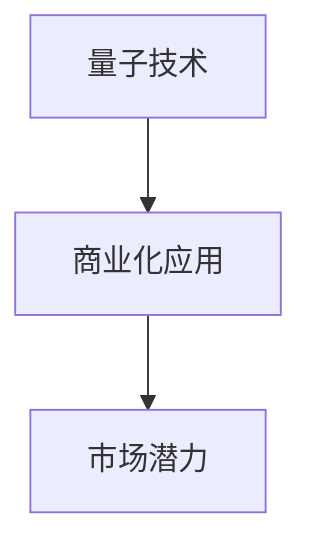

### 2.3.3 量子技术的潜在风险与挑战

**背景介绍**：  
量子技术的发展也面临技术瓶颈、成本高昂和安全隐患等挑战。

**核心概念与联系**：  
- **技术瓶颈**：量子计算的稳定性、纠错能力等问题尚未完全解决。
- **成本高昂**：量子技术的研发和应用需要巨大的资金投入。
- **安全隐患**：量子计算可能对现有加密体系构成威胁。

**公式与图表**：  
$$\text{技术瓶颈} \rightarrow \text{研发成本增加} \rightarrow \text{安全隐患加剧}$$

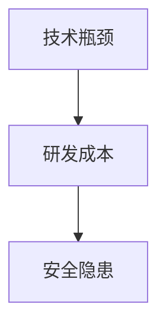

## 2.4 本章小结

本章介绍了量子技术的基本概念和核心原理，分析了其对全球经济的潜在影响，并探讨了当前的研究进展和未来的发展趋势。量子技术的广泛应用可能对全球经济格局产生深远影响，但也面临诸多挑战。

---

# 第3章: 量子技术对全球产业链的影响

## 3.1 全球产业链的基本结构与特点

### 3.1.1 全球产业链的形成与演变

**背景介绍**：  
全球产业链是全球化分工的产物，通过不同国家和地区专业化生产，实现资源的最优配置。

**核心概念与联系**：  
- **分工协作**：企业在全球范围内分工协作，降低成本。
- **资源配置**：通过全球产业链实现资源的最优配置。

**公式与图表**：  
$$\text{全球产业链} \rightarrow \text{分工协作} \rightarrow \text{资源配置优化}$$

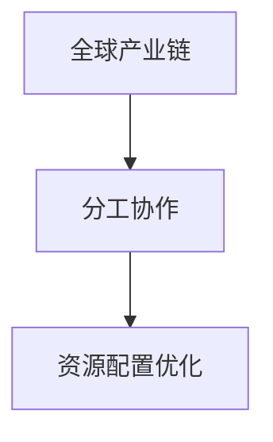

### 3.1.2 产业链的分工与协作模式

**背景介绍**：  
全球产业链的分工模式包括垂直分工和水平分工，协作模式包括供应链管理和产业集群。

**核心概念与联系**：  
- **垂直分工**：企业专注于价值链的不同环节。
- **水平分工**：同一环节在全球范围内分散生产。
- **供应链管理**：通过优化供应链实现成本最小化。

**公式与图表**：  
$$\text{垂直分工} \rightarrow \text{专业化生产} \rightarrow \text{成本降低}$$

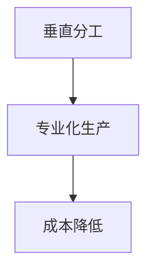

### 3.1.3 产业链的核心竞争力分析

**背景介绍**：  
产业链的核心竞争力包括技术创新能力、成本控制能力和市场响应能力。

**核心概念与联系**：  
- **技术创新**：技术进步是产业链竞争力的关键。
- **成本控制**：通过规模效应和流程优化降低成本。
- **市场响应**：快速适应市场需求的能力。

**公式与图表**：  
$$\text{技术创新} \rightarrow \text{成本控制} \rightarrow \text{市场竞争力增强}$$

```mermaid
graph TD
    A[技术创新] --> B[成本控制]
    B --> C[市场竞争力]
```

## 3.2 量子技术对产业链的颠覆性影响

### 3.2.1 量子计算对传统计算产业的替代效应

**背景介绍**：  
量子计算的出现可能颠覆传统计算产业，尤其是在加密算法和数据分析领域。

**核心概念与联系**：  
- **替代效应**：量子计算可能取代传统计算技术。
- **数据分析**：量子计算在大数据分析中的应用。

**公式与图表**：  
$$\text{量子计算} \rightarrow \text{传统计算产业} \rightarrow \text{替代效应}$$

```mermaid
graph TD
    A[量子计算] --> B[传统计算产业]
    B --> C[替代效应]
```

### 3.2.2 量子通信对传统通信产业的变革

**背景介绍**：  
量子通信的出现可能改变传统通信产业的格局，尤其是在信息安全领域。

**核心概念与联系**：  
- **信息安全**：量子通信提供更高的安全性。
- **通信技术**：量子通信可能取代传统通信技术。

**公式与图表**：  
$$\text{量子通信} \rightarrow \text{传统通信产业} \rightarrow \text{信息安全变革}$$

```mermaid
graph TD
    A[量子通信] --> B[传统通信产业]
    B --> C[信息安全变革]
```

### 3.2.3 量子技术对全球供应链的重构

**背景介绍**：  
量子技术的应用可能重构全球供应链，推动企业重新调整生产和协作模式。

**核心概念与联系**：  
- **供应链重构**：量子技术影响全球供应链的分工和协作。
- **生产模式**：量子技术可能改变传统的生产方式。

**公式与图表**：  
$$\text{量子技术} \rightarrow \text{供应链重构} \rightarrow \text{生产模式改变}$$

```mermaid
graph TD
    A[量子技术] --> B[供应链重构]
    B --> C[生产模式改变]
```

## 3.3 量子技术对产业链的区域经济影响

### 3.3.1 美国、中国、欧盟等主要经济体的量子技术发展现状

**背景介绍**：  
美国、中国和欧盟等主要经济体在量子技术领域都有重要研究和应用。

**核心概念与联系**：  
- **美国**：在量子计算领域处于领先地位。
- **中国**：在量子通信领域取得了显著进展。
- **欧盟**：在量子技术的产业化方面进行了大量投入。

**公式与图表**：  
$$\text{美国} \rightarrow \text{量子计算} \rightarrow \text{技术领先}$$

```mermaid
graph TD
    A[美国] --> B[量子计算]
    B --> C[技术领先]
```

### 3.3.2 量子技术对区域经济竞争力的影响

**背景介绍**：  
量子技术的发展可能改变区域经济的竞争力，尤其是在科技和产业方面。

**核心概念与联系**：  
- **区域经济**：量子技术对区域经济的影响。
- **科技竞争**：量子技术成为区域竞争力的重要因素。

**公式与图表**：  
$$\text{量子技术} \rightarrow \text{区域经济竞争力} \rightarrow \text{区域经济发展}$$

```mermaid
graph TD
    A[量子技术] --> B[区域经济竞争力]
    B --> C[区域经济发展]
```

### 3.3.3 量子技术对国际贸易格局的潜在影响

**背景介绍**：  
量子技术的发展可能改变国际贸易格局，推动新的贸易模式和规则的形成。

**核心概念与联系**：  
- **国际贸易**：量子技术影响全球贸易的分工和协作。
- **贸易规则**：可能需要新的规则来适应量子技术的影响。

**公式与图表**：  
$$\text{量子技术} \rightarrow \text{国际贸易格局} \rightarrow \text{贸易规则变化}$$

```mermaid
graph TD
    A[量子技术] --> B[国际贸易格局]
    B --> C[贸易规则变化]
```

## 3.4 本章小结

本章分析了量子技术对全球产业链的颠覆性影响，包括对传统计算产业的替代效应、对传统通信产业的变革以及对全球供应链的重构。同时，探讨了量子技术对区域经济和国际贸易格局的潜在影响。

---

# 第4章: 巴菲特视角下的全球产业链重构

## 4.1 巴菲特对全球产业链的分析框架

### 4.1.1 巴菲特的产业链分析方法

**背景介绍**：  
巴菲特通过分析企业的竞争优势、管理层能力和财务状况，判断企业的长期盈利能力。

**核心概念与联系**：  
- **竞争优势**：企业的核心竞争力。
- **管理层能力**：决策能力和诚信。
- **财务状况**：企业的盈利能力和财务健康。

**公式与图表**：  
$$\text{竞争优势} \rightarrow \text{管理层能力} \rightarrow \text{企业价值}$$

```mermaid
graph TD
    A[竞争优势] --> B[管理层能力]
    B --> C[企业价值]
```

### 4.1.2 巴菲特对主要行业的投资策略

**背景介绍**：  
巴菲特主要投资于具有持续竞争优势和良好财务状况的行业，如消费必需品、金融和能源等。

**核心概念与联系**：  
- **消费必需品**：需求稳定，抗周期性强。
- **金融**：低风险、高收益的特性。
- **能源**：行业集中度高，竞争优势明显。

**公式与图表**：  
$$\text{消费必需品} \rightarrow \text{抗周期性} \rightarrow \text{投资价值}$$

```mermaid
graph TD
    A[消费必需品] --> B[抗周期性]
    B --> C[投资价值]
```

## 4.2 巴菲特对量子技术影响的判断

### 4.2.1 量子技术对巴菲特投资策略的潜在影响

**背景介绍**：  
量子技术的发展可能改变企业的竞争优势和盈利能力，从而影响巴菲特的投资策略。

**核心概念与联系**：  
- **企业竞争优势**：量子技术可能改变企业的竞争优势。
- **投资策略**：巴菲特需要调整投资策略以适应量子技术的影响。

**公式与图表**：  
$$\text{量子技术} \rightarrow \text{企业竞争优势} \rightarrow \text{投资策略调整}$$

```mermaid
graph TD
    A[量子技术] --> B[企业竞争优势]
    B --> C[投资策略调整]
```

### 4.2.2 巴菲特对量子技术相关行业的投资机会分析

**背景介绍**：  
量子技术的应用可能带来新的投资机会，尤其是在量子计算和量子通信领域。

**核心概念与联系**：  
- **量子计算**：相关企业的投资机会。
- **量子通信**：相关企业的投资机会。

**公式与图表**：  
$$\text{量子计算} \rightarrow \text{投资机会} \rightarrow \text{企业价值上升}$$

```mermaid
graph TD
    A[量子计算] --> B[投资机会]
    B --> C[企业价值上升]
```

### 4.2.3 巴菲特对量子技术相关投资风险的评估

**背景介绍**：  
量子技术的发展也面临技术风险和市场风险，巴菲特需要全面评估这些风险。

**核心概念与联系**：  
- **技术风险**：量子技术的不确定性和研发难度。
- **市场风险**：量子技术的商业化应用可能面临市场接受度的问题。

**公式与图表**：  
$$\text{技术风险} \rightarrow \text{市场风险} \rightarrow \text{投资风险评估}$$

```mermaid
graph TD
    A[技术风险] --> B[市场风险]
    B --> C[投资风险评估]
```

## 4.3 巴菲特投资策略的调整与优化

### 4.3.1 巴菲特投资策略的调整方向

**背景介绍**：  
面对量子技术的影响，巴菲特需要调整投资策略，包括关注新技术领域的投资机会和风险控制。

**核心概念与联系**：  
- **投资机会**：关注量子技术相关行业的投资机会。
- **风险控制**：通过分散投资和严格的风险评估降低风险。

**公式与图表**：  
$$\text{投资机会} \rightarrow \text{风险控制} \rightarrow \text{投资策略调整}$$

```mermaid
graph TD
    A[投资机会] --> B[风险控制]
    B --> C[投资策略调整]
```

### 4.3.2 巴菲特投资策略的优化建议

**背景介绍**：  
为了应对量子技术的影响，巴菲特可以优化其投资策略，包括加强技术研究和多元化投资。

**核心概念与联系**：  
- **技术研究**：加强对量子技术的研究，识别潜在的投资机会。
- **多元化投资**：通过多元化降低量子技术带来的投资风险。

**公式与图表**：  
$$\text{技术研究} \rightarrow \text{多元化投资} \rightarrow \text{投资策略优化}$$

```mermaid
graph TD
    A[技术研究] --> B[多元化投资]
    B --> C[投资策略优化]
```

## 4.4 本章小结

本章从巴菲特的视角出发，分析了量子技术对全球产业链的重构，探讨了量子技术对巴菲特投资策略的潜在影响，并提出了投资策略的调整与优化建议。

---

# 第5章: 量子技术对宏观经济的影响

## 5.1 量子技术对生产率的提升

### 5.1.1 生产率的定义与影响因素

**背景介绍**：  
生产率是单位资源投入所生产的产出，是经济效率的重要指标。

**核心概念与联系**：  
- **生产率**：衡量经济效率的关键指标。
- **影响因素**：技术进步、劳动力素质、管理优化等。

**公式与图表**：  
$$\text{生产率} = \frac{\text{产出}}{\text{投入}}$$

```mermaid
graph TD
    A[生产率] --> B[产出]
    B --> C[投入]
```

### 5.1.2 量子技术对生产率的提升作用

**背景介绍**：  
量子技术通过提高计算能力和优化生产流程，可以显著提升生产率。

**核心概念与联系**：  
- **量子计算**：提高计算速度和效率。
- **生产流程优化**：通过量子算法优化生产流程。

**公式与图表**：  
$$\text{量子计算} \rightarrow \text{生产流程优化} \rightarrow \text{生产率提升}$$

```mermaid
graph TD
    A[量子计算] --> B[生产流程优化]
    B --> C[生产率提升]
```

## 5.2 量子技术对通货膨胀的影响

### 5.2.1 通货膨胀的定义与成因

**背景介绍**：  
通货膨胀是物价总水平的持续上涨，通常由需求拉动、成本推动和货币供应增加等因素引起。

**核心概念与联系**：  
- **通货膨胀**：物价总水平的上涨。
- **成因**：需求拉动、成本推动、货币供应增加。

**公式与图表**：  
$$\text{通货膨胀率} = \frac{\text{CPI增长}}{100}$$

```mermaid
graph TD
    A[通货膨胀] --> B[物价总水平]
    B --> C[通货膨胀率]
```

### 5.2.2 量子技术对通货膨胀的潜在影响

**背景介绍**：  
量子技术可能通过影响生产成本和市场供应，进而影响通货膨胀。

**核心概念与联系**：  
- **生产成本**：量子技术可能降低生产成本，抑制通货膨胀。
- **市场供应**：量子技术可能增加市场供应，降低物价。

**公式与图表**：  
$$\text{量子技术} \rightarrow \text{生产成本下降} \rightarrow \text{通货膨胀率下降}$$

```mermaid
graph TD
    A[量子技术] --> B[生产成本]
    B --> C[通货膨胀率]
```

## 5.3 量子技术对经济增长的推动

### 5.3.1 经济增长的定义与驱动因素

**背景介绍**：  
经济增长是经济规模的持续扩大，通常由技术进步、资本积累和劳动力增长等因素驱动。

**核心概念与联系**：  
- **经济增长**：经济规模的持续扩大。
- **驱动因素**：技术进步、资本积累、劳动力增长。

**公式与图表**：  
$$\text{GDP增长} = \text{技术进步} + \text{资本积累} + \text{劳动力增长}$$

```mermaid
graph TD
    A[GDP增长] --> B[技术进步]
    B --> C[资本积累]
    C --> D[劳动力增长]
```

### 5.3.2 量子技术对经济增长的推动作用

**背景介绍**：  
量子技术通过推动技术创新和产业升级，可以显著推动经济增长。

**核心概念与联系**：  
- **技术创新**：量子技术带来新的技术和产品。
- **产业升级**：量子技术推动传统产业转型升级。

**公式与图表**：  
$$\text{量子技术} \rightarrow \text{技术创新} \rightarrow \text{产业升级}$$

```mermaid
graph TD
    A[量子技术] --> B[技术创新]
    B --> C[产业升级]
```

## 5.4 本章小结

本章分析了量子技术对宏观经济的影响，包括对生产率的提升、对通货膨胀的潜在影响以及对经济增长的推动作用。量子技术的广泛应用可能对宏观经济产生深远影响，但也需要关注其潜在风险。

---

# 第6章: 系统架构与投资策略

## 6.1 量子技术驱动的系统架构分析

### 6.1.1 量子技术驱动的系统架构设计

**背景介绍**：  
量子技术的应用需要设计新的系统架构，包括量子计算和量子通信的集成。

**核心概念与联系**：  
- **量子计算**：系统架构需要支持量子计算的并行处理。
- **量子通信**：系统架构需要支持量子通信的安全传输。

**公式与图表**：  
$$\text{系统架构} = \text{量子计算} + \text{量子通信}$$

```mermaid
graph TD
    A[量子计算] --> B[系统架构]
    B --> C[量子通信]
```

### 6.1.2 量子技术驱动的系统架构挑战

**背景介绍**：  
量子技术的系统架构设计面临技术瓶颈和成本高昂的挑战。

**核心概念与联系**：  
- **技术瓶颈**：量子计算的稳定性、纠错能力等问题。
- **成本高昂**：量子技术的研发和应用需要大量资金投入。

**公式与图表**：  
$$\text{技术瓶颈} \rightarrow \text{系统架构挑战} \rightarrow \text{成本高昂}$$

```mermaid
graph TD
    A[技术瓶颈] --> B[系统架构挑战]
    B --> C[成本高昂]
```

## 6.2 投资策略与风险管理

### 6.2.1 投资策略的制定

**背景介绍**：  
在量子技术驱动的经济环境中，投资者需要制定新的投资策略，包括风险评估和投资组合优化。

**核心概念与联系**：  
- **风险评估**：识别量子技术带来的投资风险。
- **投资组合优化**：通过多元化降低投资风险。

**公式与图表**：  
$$\text{投资策略} = \text{风险评估} + \text{投资组合优化}$$

```mermaid
graph TD
    A[风险评估] --> B[投资策略]
    B --> C[投资组合优化]
```

### 6.2.2 投资风险的管理

**背景介绍**：  
量子技术的投资风险包括技术风险、市场风险和政策风险，需要通过多种方式进行管理。

**核心概念与联系**：  
- **技术风险**：量子技术的不确定性和研发难度。
- **市场风险**：量子技术的商业化应用可能面临市场接受度的问题。
- **政策风险**：政府政策的变化可能影响量子技术的应用。

**公式与图表**：  
$$\text{技术风险} \rightarrow \text{市场风险} \rightarrow \text{政策风险}$$

```mermaid
graph TD
    A[技术风险] --> B[市场风险]
    B --> C[政策风险]
```

## 6.3 本章小结

本章分析了量子技术驱动的系统架构设计和投资策略的制定，探讨了投资风险的管理。量子技术的应用需要投资者具备新的投资策略和风险管理能力。

---

# 第7章: 项目实战

## 7.1 量子技术驱动的宏观经济分析

### 7.1.1 项目背景与目标

**背景介绍**：  
本项目旨在通过量子技术进行宏观经济分析，识别投资机会和风险。

**核心概念与联系**：  
- **宏观经济分析**：利用量子计算技术进行宏观经济建模和预测。
- **投资机会识别**：通过宏观经济分析识别投资机会。

**公式与图表**：  
$$\text{宏观经济分析} \rightarrow \text{投资机会识别} \rightarrow \text{投资决策}$$

```mermaid
graph TD
    A[宏观经济分析] --> B[投资机会识别]
    B --> C[投资决策]
```

### 7.1.2 项目环境安装与配置

**背景介绍**：  
需要安装量子计算平台和宏观经济分析工具，确保环境配置正确。

**核心概念与联系**：  
- **量子计算平台**：如 IBM Q Experience、Google Quantum。
- **宏观经济分析工具**：如 Python 的 EconPy 库。

**公式与图表**：  
$$\text{环境安装} = \text{量子计算平台} + \text{宏观经济分析工具}$$

```mermaid
graph TD
    A[量子计算平台] --> B[环境安装]
    B --> C[宏观经济分析工具]
```

### 7.1.3 项目核心实现

**背景介绍**：  
通过量子计算技术进行宏观经济建模和预测，识别投资机会和风险。

**核心概念与联系**：  
- **宏观经济模型**：建立宏观经济模型，进行量子计算模拟。
- **投资机会识别**：通过模型预测识别投资机会。

**公式与图表**：  
$$\text{宏观经济模型} \rightarrow \text{量子计算模拟} \rightarrow \text{投资机会识别}$$

```mermaid
graph TD
    A[宏观经济模型] --> B[量子计算模拟]
    B --> C[投资机会识别]
```

### 7.1.4 项目实现代码

**背景介绍**：  
以下是宏观经济分析的 Python 代码示例：

```python
# 宏观经济模型建立
import numpy as np
import qiskit as q

def macroeconomic_model():
    # 宏观经济变量
    gdp = np.array([100, 200, 300])
    inflation = np.array([2, 3, 4])
    
    # 量子计算模拟
    circuit = q.QuantumCircuit(2)
    circuit.h(0)
    circuit.cx(0, 1)
    circuit.measure(1, 0)
    
    # 投资机会识别
    investment_opportunity = (gdp * (1 + inflation/100)).sum()
    return investment_opportunity

# 代码运行
print(macroconomic_model())
```

**代码解读**：  
- **宏观经济模型**：定义 GDP 和通货膨胀率的数组。
- **量子计算模拟**：构建一个简单的量子电路，进行宏观经济模拟。
- **投资机会识别**：通过计算 GDP 和通货膨胀率的综合指标，识别投资机会。

### 7.1.5 项目应用与分析

**背景介绍**：  
通过项目实现，可以识别量子技术驱动的宏观经济分析中的投资机会和风险。

**核心概念与联系**：  
- **投资机会识别**：通过量子计算模拟，识别具有潜力的投资机会。
- **风险分析**：通过宏观经济模型，分析投资风险。

**公式与图表**：  
$$\text{投资机会识别} \rightarrow \text{风险分析} \rightarrow \text{投资决策}$$

```mermaid
graph TD
    A[投资机会识别] --> B[风险分析]
    B --> C[投资决策]
```

### 7.1.6 项目小结

本项目通过量子计算技术进行宏观经济分析，识别投资机会和风险。通过环境安装、模型建立、代码实现和结果分析，展示了量子技术在宏观经济分析中的应用。

---

# 第8章: 总结与展望

## 8.1 本书总结

**背景介绍**：  
本书从巴菲特的宏观经济分析视角，探讨了量子技术对全球产业链的深远影响。

**核心内容回顾**：  
- 巴菲特的价值投资理念和宏观经济分析方法。
- 量子技术的基本概念和对全球经济的潜在影响。
- 量子技术对全球产业链的重构和对巴菲特投资策略的影响。

**公式与图表**：  
$$\text{巴菲特宏观经济分析} \rightarrow \text{量子技术影响} \rightarrow \text{全球产业链重构}$$

```mermaid
graph TD
    A[巴菲特宏观经济分析] --> B[量子技术影响]
    B --> C[全球产业链重构]
```

## 8.2 未来展望

**背景介绍**：  
随着量子技术的不断发展，其对全球经济和投资策略的影响将更加深远。

**核心概念与联系**：  
- **量子技术发展**：量子计算和量子通信的技术突破。
- **宏观经济分析**：量子技术将推动宏观经济分析的创新。
- **投资策略优化**：量子技术将为投资者提供新的投资策略和工具。

**公式与图表**：  
$$\text{量子技术发展} \rightarrow \text{宏观经济分析创新} \rightarrow \text{投资策略优化}$$

```mermaid
graph TD
    A[量子技术发展] --> B[宏观经济分析创新]
    B --> C[投资策略优化]
```

## 8.3 投资者注意事项

**背景介绍**：  
投资者在面对量子技术的影响时，需要注意技术风险、市场风险和政策风险。

**核心概念与联系**：  
- **技术风险**：量子技术的不确定性和研发难度。
- **市场风险**：量子技术的商业化应用可能面临市场接受度的问题。
- **政策风险**：政府政策的变化可能影响量子技术的应用。

**公式与图表**：  
$$\text{技术风险} \rightarrow \text{市场风险} \rightarrow \text{政策风险}$$

```mermaid
graph TD
    A[技术风险] --> B[市场风险]
    B --> C[政策风险]
```

## 8.4 本章小结

本章总结了本书的主要内容，并展望了量子技术对全球经济和投资策略的未来影响，同时提醒投资者注意相关风险。

---

# 作者

**作者：AI天才研究院/AI Genius Institute & 禅与计算机程序设计艺术 /Zen And The Art of Computer Programming**

---

**结束语**：  
通过本书的阅读，读者可以深入了解巴菲特的宏观经济分析以及量子技术对全球产业链的影响。希望本书能够为投资者和研究者提供有价值的参考和启发。

---

