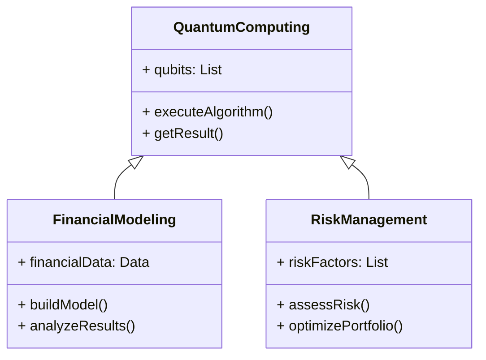
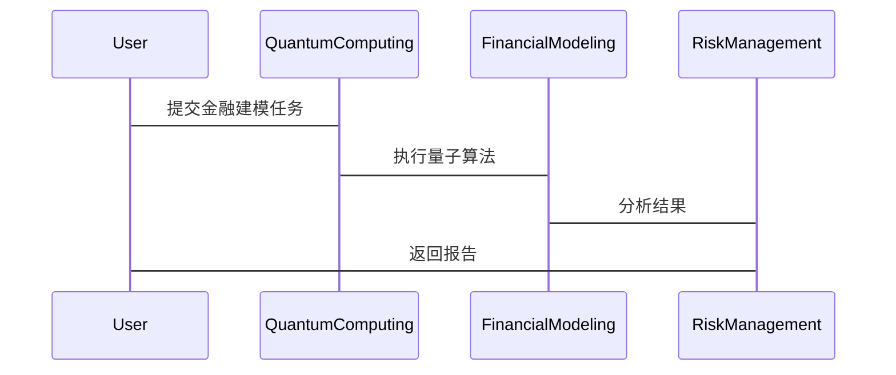

                 


# 巴菲特的宏观经济视角：量子计算对全球金融体系的影响

> 关键词：量子计算，巴菲特，宏观经济，金融体系，金融市场，风险管理

> 摘要：本文从巴菲特的宏观经济视角出发，探讨量子计算对全球金融体系的影响。通过分析量子计算的基本原理、其在金融中的潜在应用以及对巴菲特投资策略的可能影响，本文揭示了量子计算如何改变金融市场的分析和决策方式。

---

## 引言

### 1. 量子计算的基本概念

#### 1.1 量子计算的定义

量子计算是一种利用量子力学原理进行计算的技术。与经典计算机使用二进制位不同，量子计算机使用量子位（qubits），通过量子叠加和量子纠缠等特性，可以在某些情况下比经典计算机更高效地处理特定问题。

#### 1.2 量子计算的核心原理

- **量子叠加**：量子位可以同时处于多个状态的叠加态。
- **量子纠缠**：两个或多个量子位之间可以形成纠缠态，使得对其中一个量子位的测量会影响另一个量子位的状态。
- **量子并行性**：量子计算机可以通过利用量子并行性来同时处理大量可能性。

#### 1.3 量子计算与经典计算的区别

- 经典计算机使用二进制位，量子计算机使用量子位。
- 经典计算是确定性的，而量子计算基于概率性。
- 量子计算机在某些特定问题（如因式分解和大数据优化）上具有显著优势。

### 2. 巴菲特的宏观经济视角

#### 2.1 巴菲特的投资哲学

巴菲特的投资哲学以价值投资为核心，强调长期投资、安全边际和公司基本面分析。他认为市场短期是投票器，长期是称重机。

#### 2.2 巴菲特对金融市场的独特见解

巴菲特认为市场的波动性是投资机会的来源，但长期来看，市场会反映经济的基本面。他注重公司的内在价值，而非市场的短期波动。

#### 2.3 巴菲特视角下的量子计算影响

量子计算可能改变金融市场的分析工具和决策方式，但巴菲特的长期价值投资理念可能仍然适用，前提是量子计算能够提供更精确的内在价值评估。

### 3. 本书的核心观点

- 量子计算将对金融市场的建模、交易和风险管理产生深远影响。
- 巴菲特的宏观经济视角提供了分析量子计算在金融中应用的独特框架。
- 量子计算可能改变金融市场的竞争格局，但长期价值投资的逻辑可能依然有效。

---

## 量子计算的基本原理

### 2. 量子计算的基本原理

#### 2.1 量子叠加

量子叠加是量子计算的核心原理之一。与经典计算机中的二进制位只能处于0或1不同，量子位可以同时处于0和1的叠加态。这种叠加态可以用数学表达式表示为：

$$
| q \rangle = \alpha |0\rangle + \beta |1\rangle
$$

其中，$\alpha$ 和 $\beta$ 是复数，且满足归一化条件：

$$
|\alpha|^2 + |\beta|^2 = 1
$$

#### 2.2 量子纠缠

量子纠缠是量子力学中的另一个关键现象，指的是两个或多个量子位之间形成的一种特殊关联。当两个量子位处于纠缠态时，对其中一个量子位的测量会立即影响另一个量子位的状态。这种现象可以用数学表达式表示为：

$$
| \psi \rangle = \frac{|0\rangle \otimes |1\rangle + |1\rangle \otimes |0\rangle}{\sqrt{2}}
$$

这里，$\otimes$ 表示张量积，$|0\rangle \otimes |1\rangle$ 和 $|1\rangle \otimes |0\rangle$ 是两个纠缠态的基向量。

#### 2.3 量子计算的算法与实现

量子算法是量子计算的核心，目前最著名的量子算法包括Shor算法（用于大数因式分解）和Grover算法（用于无序数据库搜索）。这些算法利用了量子并行性，可以在某些情况下显著提高计算效率。

---

## 巴菲特视角下的量子计算分析

### 3. 巴菲特的宏观经济分析框架

#### 3.1 宏观经济分析的核心要素

- 经济增长
- 就业率
- 通货膨胀
- 利率
- 汇率
- 市场情绪

#### 3.2 量子计算对金融市场的潜在影响

- **金融建模**：量子计算可以更高效地解决复杂的金融模型，例如期权定价和风险管理。
- **金融交易**：量子算法可以用于高频交易和算法交易，提高交易效率。
- **金融风险管理**：量子计算可以帮助更好地评估和管理金融风险。

#### 3.3 巴菲特视角下的量子计算应用前景

巴菲特认为，尽管技术进步可能会改变市场的短期波动，但长期来看，市场的基本面因素仍然是决定投资价值的关键。量子计算可能增强市场分析工具的精确性，但不会改变基本面分析的核心地位。

---

## 量子计算在金融中的具体应用

### 4. 量子计算在金融建模中的应用

#### 4.1 量子金融建模的基本原理

量子金融建模利用量子计算机的强大计算能力，可以更高效地解决复杂的金融问题，例如：

- 期权定价
- 风险管理
- 投资组合优化

#### 4.2 量子金融建模的实现步骤

1. **问题建模**：将金融问题转化为数学模型。
2. **量子算法设计**：选择适合的量子算法，如量子版本的蒙特卡罗方法。
3. **量子计算实现**：在量子计算机上运行算法。
4. **结果分析**：解读量子计算的结果，并应用于金融决策。

#### 4.3 量子金融建模的案例分析

假设我们需要对一个复杂的金融衍生品进行定价，传统方法需要大量计算资源，而量子计算机可以在更短的时间内完成计算。

---

## 系统分析与架构设计方案

### 5. 问题场景介绍

金融市场的复杂性和不确定性使得传统计算方法在处理某些问题时效率低下。量子计算可以通过其独特的优势，解决这些问题。

### 6. 系统功能设计

#### 6.1 领域模型（Mermaid类图）



### 6.2 系统架构设计（Mermaid架构图）

```mermaid
archimate
title Quantum Finance System Architecture

应用架构
组织架构
技术架构

QuantumComputing <<Extends>> FinancialModeling
QuantumComputing <<Extends>> RiskManagement
```

### 6.3 系统接口设计

- **输入接口**：接收金融市场数据和用户指令。
- **输出接口**：返回量子计算结果和分析报告。

### 6.4 系统交互设计（Mermaid序列图）



---

## 项目实战

### 7. 环境安装

安装量子计算工具，例如Qiskit（IBM的量子计算软件开发工具包）：

```bash
pip install qiskit
```

### 8. 系统核心实现源代码

以下是一个量子金融建模的示例代码：

```python
from qiskit import QuantumCircuit, Aer, execute
from qiskit.circuit import QuantumRegister, ClassicalRegister

# 创建量子和经典寄存器
q = QuantumRegister(2, 'q')
c = ClassicalRegister(2, 'c')

# 创建量子电路
qc = QuantumCircuit(q, c)

# 执行量子叠加
qc.h(q[0])
qc.cx(q[0], q[1])

# 测量
qc.measure(q, c)

# 执行量子计算
simulator = Aer.get_backend('qasm_simulator')
result = execute(qc, simulator).result()

# 输出结果
print(result.get_counts(qc))
```

### 9. 代码应用解读与分析

上述代码实现了一个简单的量子叠加实验，展示了量子位的状态叠加。在金融建模中，类似的技术可以用于模拟复杂的金融场景。

### 10. 实际案例分析

假设我们正在分析一个股票的期权定价问题。量子计算机可以更高效地计算期权的定价模型，从而提高分析效率。

### 11. 项目小结

通过实际项目的实现，我们可以看到量子计算在金融建模中的潜力，但也需要克服技术上的挑战。

---

## 结论

### 总结

量子计算对全球金融体系的影响是深远的，它可能改变金融市场的分析和决策方式。然而，巴菲特的宏观经济视角提醒我们，长期来看，市场的基本面因素仍然是最重要的。

### 展望

未来，量子计算将在金融领域发挥更大的作用，但其发展需要克服技术、成本和监管等多重挑战。

### 读者建议

- 关注量子计算技术的发展
- 学习量子计算的基本原理
- 结合宏观经济分析，探索量子计算在金融中的应用

---

## 作者

作者：AI天才研究院/AI Genius Institute & 禅与计算机程序设计艺术/Zen And The Art of Computer Programming

