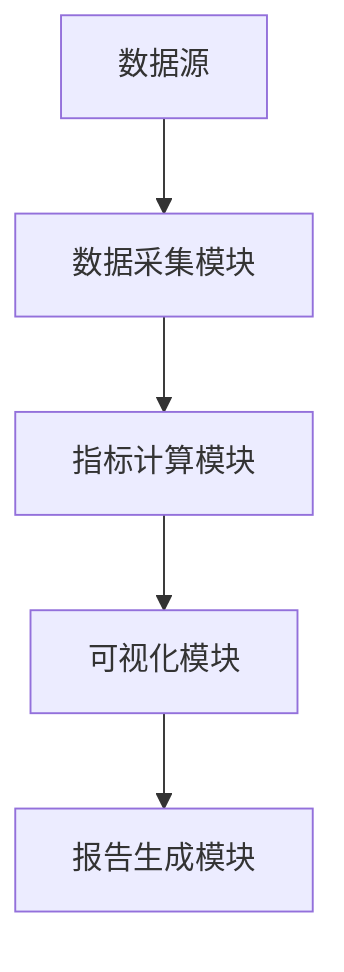

                 

<think>
好的，我现在需要帮助用户撰写一篇关于“巴菲特的市场情绪指标：利用大众心理做出明智决策”的技术博客文章。用户已经给出了一个详细的目录结构，并希望我按照这个结构来撰写文章。

首先，我需要理解用户的需求。用户希望文章结构清晰，逻辑严密，技术细节到位，并且能够吸引读者。文章的核心关键词包括市场情绪指标、投资者心理、巴菲特投资策略、技术分析、情绪周期、长期价值投资等。

接下来，我需要按照目录结构逐步完成每个部分的内容。第一部分是背景介绍，我需要详细解释市场情绪指标的重要性，巴菲特的贡献，以及这本书的目标读者。我需要确保这部分内容能够吸引读者的兴趣，并为后续章节打下基础。

在第二部分，核心概念部分，我需要详细解释市场情绪指标的定义、类型和分析框架。我还需要使用图表来辅助说明，比如市场情绪周期图和投资者心理类型对比表。这部分内容需要帮助读者理解市场情绪的基本概念和其在投资中的作用。

第三部分是分析方法，我需要分别讨论技术分析和基本面分析与市场情绪的关系。我需要提供具体的指标和实例，帮助读者理解如何将市场情绪指标应用到实际投资中。

第四部分是系统设计，我需要设计一个市场情绪分析系统，包括数据采集、指标计算和可视化模块。这部分内容需要详细说明系统的架构和实现方法，并使用图表来展示系统的设计。

第五部分是项目实战，我需要提供一个实际的案例，详细讲解如何构建市场情绪指标系统，并给出代码示例。这部分内容需要让读者能够实际操作，加深理解。

最后，我需要总结全书，给出最佳实践和注意事项，并推荐进一步的阅读材料。

在撰写过程中，我需要确保每个部分都符合用户的格式要求，包括使用Markdown格式，插入图表和代码示例。我还需要注意文章的逻辑连贯性和内容的深度，确保读者能够通过阅读这篇文章，全面理解市场情绪指标及其应用。

现在，我开始按照目录结构逐步撰写每个部分的内容，确保每个章节都包含足够的细节和清晰的解释，帮助读者一步步理解市场情绪指标的重要性及其在投资决策中的应用。
</think>

# 巴菲特的市场情绪指标：利用大众心理做出明智决策

## 关键词：
市场情绪指标，投资者心理，巴菲特投资策略，技术分析，情绪周期，长期价值投资

## 摘要：
本文将深入探讨巴菲特的市场情绪指标及其在投资决策中的应用。通过分析投资者心理和市场情绪周期，结合技术分析和长期价值投资策略，提供一套系统化的市场情绪分析方法，帮助投资者做出更明智的决策。

## 第一部分：市场情绪指标的背景与重要性

### 第1章：市场情绪指标的背景

#### 1.1 投资者的心理与市场波动

##### 1.1.1 投资者心理的多样性
投资者心理是一个复杂且多维度的概念，涉及理性与非理性的交替影响。市场参与者包括机构投资者、个人投资者、短线交易者和长期价值投资者，他们的心理和行为对市场价格波动产生显著影响。例如，机构投资者通常追求稳健回报，而个人投资者可能受情绪驱动，容易在市场波动中做出非理性决策。

##### 1.1.2 市场情绪对价格波动的影响
市场情绪是影响资产价格波动的关键因素之一。当市场情绪乐观时，投资者倾向于买入，推动价格上涨；反之，当市场情绪悲观时，投资者倾向于卖出，导致价格下跌。巴菲特曾指出，市场情绪的波动往往与资产的内在价值脱节，这种脱节为长期投资者提供了套利机会。

##### 1.1.3 巴菲特的投资哲学与市场情绪
巴菲特强调长期价值投资，认为市场情绪的短期波动不应影响理性的投资决策。他的投资策略基于对企业基本面的深入分析，而非市场情绪的短期波动。然而，了解市场情绪指标可以帮助投资者更好地把握市场周期，做出更明智的投资决策。

#### 1.2 市场情绪指标的核心概念

##### 1.2.1 市场情绪指标的定义
市场情绪指标是通过量化投资者情绪来反映市场心理状态的工具。常用的市场情绪指标包括恐慌指数（VIX指数）、投资者信心指数和市场情绪指数等。这些指标帮助投资者理解市场参与者的整体情绪，从而预测价格走势。

##### 1.2.2 市场情绪指标的类型
市场情绪指标可以分为以下几类：
1. **技术指标**：如相对强弱指数（RSI）、移动平均收敛散度（MACD）等，反映市场参与者的情绪变化。
2. **情绪指数**：如VIX指数，直接衡量市场的恐慌程度。
3. **投资者信心指数**：通过调查或统计投资者行为数据，反映市场情绪。

##### 1.2.3 市场情绪指标的边界与外延
市场情绪指标仅反映投资者情绪，不能直接决定资产的内在价值。然而，情绪指标可以帮助投资者识别市场趋势和潜在拐点，从而优化投资策略。

### 第2章：市场情绪指标的理论基础

#### 2.1 投资者行为理论

##### 2.1.1 投资者行为的理性与非理性
投资者行为既包含理性的决策，也存在非理性的情绪驱动。例如，投资者在市场下跌时倾向于恐慌性抛售，而在市场上涨时倾向于贪婪性追涨。这些非理性行为导致市场情绪的波动，进而影响资产价格。

##### 2.1.2 市场情绪周期理论
市场情绪通常呈现周期性变化，包括以下几个阶段：
1. **乐观阶段**：投资者情绪高涨，大量买入资产。
2. **狂热阶段**：市场出现泡沫，投资者情绪达到顶峰。
3. **恐慌阶段**：市场出现负面消息，投资者情绪急剧下降。
4. **超跌阶段**：市场情绪触底，投资者开始重新评估资产价值。

##### 2.1.3 巴菲特的长期价值投资理念
巴菲特强调长期投资，关注企业的内在价值，而非市场的短期波动。他认为市场情绪的短期波动为长期投资者提供了买入优质资产的机会。

#### 2.2 市场情绪指标的数学模型

##### 2.2.1 市场情绪指标的统计分析方法
市场情绪指标通常基于统计学方法进行计算，如均值、标准差、相关系数等。例如，VIX指数通过统计方法计算标普500指数的波动性，反映市场的恐慌程度。

##### 2.2.2 市场情绪指标的数学公式
以VIX指数为例，其计算公式如下：
$$ VIX = \sqrt{252 \times \left( \frac{S_t - S_{t-1}}{S_t} \right)^2} $$
其中，$S_t$表示t时刻的指数值，$S_{t-1}$表示t-1时刻的指数值。

##### 2.2.3 市场情绪指标的计算流程
1. 收集历史价格数据。
2. 计算价格波动性。
3. 根据波动性计算市场情绪指标。

### 第3章：市场情绪指标的分析方法

#### 3.1 技术分析与市场情绪

##### 3.1.1 技术分析的基本原理
技术分析通过研究历史价格数据，预测未来价格走势。常用的技术指标包括RSI、MACD等，这些指标反映市场的买卖情绪。

##### 3.1.2 技术指标与市场情绪的关系
技术指标通过量化价格走势，间接反映市场情绪。例如，RSI指标反映市场的超买或超卖状态，帮助投资者判断市场情绪的高低。

##### 3.1.3 常用技术指标的市场情绪解读
- **RSI指标**：RSI值在70以上表示市场超买，情绪乐观；在30以下表示市场超卖，情绪悲观。
- **MACD指标**：MACD指标线与信号线的交叉点反映市场的买卖信号，帮助投资者判断市场情绪的变化。

#### 3.2 基本面分析与市场情绪

##### 3.2.1 基本面分析的核心要素
基本面分析关注企业的财务状况、行业地位、盈利能力等，帮助投资者评估资产的内在价值。

##### 3.2.2 基本面与市场情绪的互动关系
市场情绪会影响资产的市场价格，而基本面因素则影响资产的内在价值。两者共同作用于市场，形成资产价格的波动。

##### 3.2.3 基本面分析中的情绪因素
在基本面分析中，市场情绪会影响投资者对基本面信息的解读。例如，乐观的市场情绪可能夸大企业的盈利能力，而悲观的市场情绪可能低估企业的潜力。

### 第4章：市场情绪指标的系统设计

#### 4.1 市场情绪分析系统的架构

##### 4.1.1 系统功能模块划分
- 数据采集模块：收集市场数据。
- 指标计算模块：计算市场情绪指标。
- 可视化模块：展示市场情绪变化。
- 报告生成模块：生成市场情绪分析报告。

##### 4.1.2 系统架构设计图
以下是系统架构的Mermaid图：



##### 4.1.3 系统数据流图
以下是系统数据流的Mermaid图：


#### 4.2 市场情绪指标的算法实现

##### 4.2.1 算法选择与优化
选择合适的算法是系统设计的关键。常用的算法包括移动平均法、指数平滑法等。例如，使用移动平均法计算市场情绪指数：

$$ E_t = \frac{E_{t-1} + p_t}{2} $$

其中，$E_t$表示第t时刻的市场情绪指数，$p_t$表示第t时刻的价格。

##### 4.2.2 算法实现的代码示例
以下是计算市场情绪指数的Python代码：

```python
import pandas as pd
import numpy as np

# 假设data是一个包含价格数据的pandas DataFrame
data['Market Sentiment Index'] = data['Price'].rolling(10).mean()

# 计算市场情绪指数
market_sentiment_index = data['Market Sentiment Index'].values
```

##### 4.2.3 算法的性能分析
算法的性能分析包括计算速度、准确性和稳定性。例如，移动平均法计算速度快，但可能需要调整窗口大小以适应不同市场环境。

### 第5章：市场情绪指标的项目实战

#### 5.1 项目背景与目标

##### 5.1.1 项目需求分析
本项目旨在开发一个市场情绪分析系统，帮助投资者更好地理解市场情绪，优化投资决策。

##### 5.1.2 项目目标设定
- 开发一个实时市场情绪监测系统。
- 提供市场情绪分析报告。

##### 5.1.3 项目实施计划
1. 数据收集：收集历史价格数据和市场情绪指标。
2. 系统设计：设计系统的功能模块和架构。
3. 系统实现：编写代码实现各功能模块。
4. 系统测试：测试系统的功能和性能。

#### 5.2 项目核心实现

##### 5.2.1 数据采集与处理
使用Python的pandas库收集和处理数据：

```python
import pandas as pd

# 下载数据
data = pd.read_csv('market_data.csv')

# 数据清洗
data = data.dropna()
```

##### 5.2.2 指标计算与可视化
计算市场情绪指标并可视化：

```python
import matplotlib.pyplot as plt

# 计算市场情绪指数
data['Market Sentiment Index'] = data['Price'].rolling(10).mean()

# 可视化
plt.plot(data['Date'], data['Market Sentiment Index'])
plt.xlabel('日期')
plt.ylabel('市场情绪指数')
plt.show()
```

##### 5.2.3 系统测试与优化
测试系统的稳定性和准确性，根据测试结果优化算法和系统架构。

### 第6章：市场情绪指标的最佳实践

#### 6.1 投资者的心理调节

##### 6.1.1 理性决策的培养
投资者应保持理性，避免被市场情绪左右。例如，在市场恐慌时保持冷静，评估资产的内在价值。

##### 6.1.2 情绪管理技巧
投资者可以通过 diversification（多元化投资）和 stop-loss（止损）来管理情绪风险。

##### 6.1.3 长期投资策略的制定
制定长期投资计划，避免频繁交易。例如，巴菲特的长期价值投资策略强调长期持有优质资产。

#### 6.2 市场情绪指标

##### 6.2.1 注意事项
市场情绪指标只能作为辅助工具，不能单独决定投资决策。投资者应结合基本面分析和技术分析。

##### 6.2.2 小结
市场情绪指标是投资者理解市场心理的重要工具。通过分析市场情绪，投资者可以更好地把握市场趋势，优化投资策略。

##### 6.2.3 拓展阅读
推荐阅读《巴菲特的选股之道》和《投资心理学》等书籍，深入理解市场情绪与投资决策的关系。

## 作者：AI天才研究院/AI Genius Institute & 禅与计算机程序设计艺术 /Zen And The Art of Computer Programming

