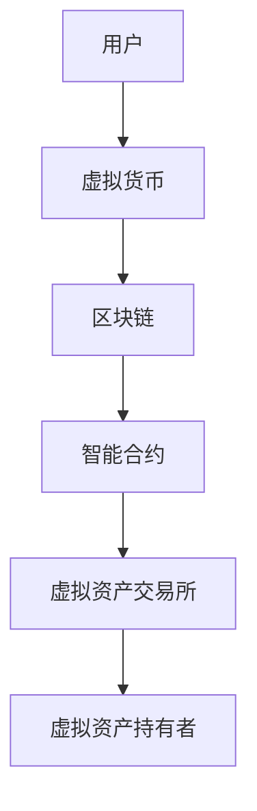
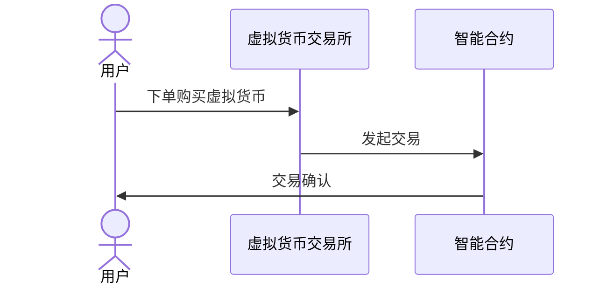
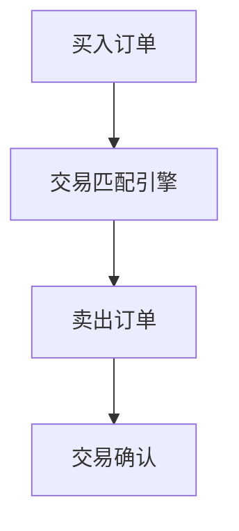

                 

<think>
好，用户要求我写一篇关于巴菲特并购策略在元宇宙虚拟资产整合中的新思路的技术博客文章。首先，我需要理解这个主题的背景和核心内容。巴菲特的并购策略主要是以价值投资为基础，寻找具有强大护城河的企业进行长期投资。而元宇宙虚拟资产整合则涉及到虚拟货币、NFTs等数字资产的管理与并购。

接下来，我需要确定文章的结构。用户已经提供了详细的目录大纲，我需要按照这个大纲逐步展开。首先，第一章要介绍巴菲特的并购策略，包括他的投资哲学、关键原则和经典案例。然后，第二章分析元宇宙虚拟资产的定义、分类和价值评估。第三章将结合两者，探讨战略选择和创新应用。

在第二部分，我需要详细讲解系统的架构与实现，包括系统功能设计、架构图和算法模型。这里可能需要使用一些技术工具，如Mermaid图来展示系统结构和算法流程。同时，数学模型的建立也很重要，比如资产价值评估公式，这部分需要用Latex格式表示。

我还需要考虑用户的要求，确保每个章节都有足够的细节和深度，同时保持逻辑清晰。例如，在系统架构部分，需要设计核心模块的功能，并用图表展示交互流程。在实战案例部分，需要提供环境配置和代码实现，让读者能够实际操作。

最后，总结部分要回顾全文，强调巴菲特策略在元宇宙中的新思路，并展望未来的发展趋势。整个过程需要一步步分析，确保每部分内容详实，结构紧凑，语言专业且易懂。

总的来说，我需要将巴菲特的并购策略与元宇宙虚拟资产整合结合起来，分章节详细展开，确保每个部分都有足够的深度和细节，同时满足用户对结构和内容的要求。
</think>

# 巴菲特的并购策略在元宇宙虚拟资产整合中的新思路

## 关键词：
- 巴菲特并购策略
- 元宇宙
- 虚拟资产
- 价值评估
- 系统架构

## 摘要：
本文探讨了巴菲特并购策略在元宇宙虚拟资产整合中的新思路，结合了传统金融投资理念与新兴的虚拟经济体系。通过分析虚拟资产的定义、分类、价值评估以及并购策略的创新应用，提出了适用于元宇宙环境的系统架构与实现方案，为投资者和开发者提供了理论与实践的双重指导。

---

## 第一部分: 巴菲特的并购策略与元宇宙虚拟资产整合概述

### 第1章: 巴菲特的并购策略概述

#### 1.1 巴菲特并购策略的核心理念
##### 1.1.1 巴菲特投资哲学的起源
巴菲特的投资哲学起源于其对价值投资的深刻理解，他主张以低于内在价值的价格购买优质资产，并长期持有。这一理念的核心在于对企业的基本面分析和对管理层的信任。

##### 1.1.2 巴菲特并购策略的关键原则
- **护城河原则**：寻找具有强大竞争优势的企业，确保其在市场中具备长期的竞争力。
- **股东价值最大化**：并购的核心目标是为股东创造最大价值，而非单纯追求企业规模的扩张。
- **长期投资**：巴菲特注重企业的长期价值，而非短期市场波动。

##### 1.1.3 巴菲特并购策略的成功案例
- **可口可乐案例**：巴菲特通过长期持有可口可乐的股票，获得了稳定的股息收益和企业增值。
- **富国银行案例**：通过收购富国银行，巴菲特获得了其强大的客户基础和品牌价值。

#### 1.2 巴菲特并购策略的核心要素
##### 1.2.1 企业价值评估的"护城河"概念
护城河是指企业在市场中竞争的优势，包括成本优势、品牌优势、技术优势等。巴菲特在并购过程中，重点关注企业的护城河是否坚固。

##### 1.2.2 股东价值最大化的目标
并购的目的是为了实现股东价值的最大化，这包括企业市值的提升、股东收益的增加等。

##### 1.2.3 长期投资与价值发现的策略
巴菲特强调长期投资，通过持有优质资产，实现价值的稳步增长。

### 第2章: 元宇宙虚拟资产的定义与特点

#### 2.1 元宇宙的概念与特征
##### 2.1.1 元宇宙的定义与基本特征
元宇宙是一个虚拟的三维空间，通过虚拟现实技术构建一个与现实世界平行的数字世界。用户可以通过 avatar（虚拟人物）进行社交、娱乐、交易等活动。

##### 2.1.2 元宇宙的虚拟经济体系
元宇宙中的虚拟经济体系包括虚拟货币、NFTs（非同质化代币）、虚拟房地产等，这些虚拟资产具有流通性和价值性。

##### 2.1.3 元宇宙虚拟资产的分类
- **虚拟货币**：如比特币、以太坊等，用于元宇宙内的交易。
- **NFTs**：用于表示虚拟艺术品、虚拟土地等独特的数字资产。
- **虚拟房地产**：元宇宙中的虚拟土地，可以用于商业或娱乐用途。

#### 2.2 元宇宙虚拟资产的价值评估
##### 2.2.1 虚拟资产的流动性与稀缺性
流动性是指资产在市场中的交易活跃程度，稀缺性则决定了资产的市场价值。

##### 2.2.2 虚拟资产的使用场景与经济模型
虚拟资产的价值不仅取决于其本身的属性，还与其在元宇宙中的使用场景和经济模型密切相关。

##### 2.2.3 虚拟资产的市场波动性与风险
虚拟资产的市场价格波动较大，投资者需要关注市场风险和政策风险。

### 第3章: 巴菲特并购策略在元宇宙中的新思路

#### 3.1 元宇宙虚拟资产并购的背景与趋势
##### 3.1.1 元宇宙虚拟资产并购的兴起
随着元宇宙的快速发展，虚拟资产的交易和并购逐渐增多。

##### 3.1.2 元宇宙虚拟资产并购的驱动因素
- **技术进步**：虚拟现实技术的发展推动了元宇宙的普及。
- **市场需求**：用户对虚拟资产的需求增加，推动了并购活动。
- **投资机会**：虚拟资产的高回报率吸引了投资者的关注。

##### 3.1.3 元宇宙虚拟资产并购的未来趋势
随着元宇宙的成熟，虚拟资产的并购将更加频繁，且形式将更加多样化。

#### 3.2 巴菲特并购策略在元宇宙中的应用
##### 3.2.1 元宇宙虚拟资产并购的战略选择
- **选择具有强大护城河的虚拟资产**：如具有独特设计的NFTs或拥有稳定用户的虚拟货币。
- **长期投资策略**：通过长期持有优质虚拟资产，实现价值增长。

##### 3.2.2 巴菲特并购策略在元宇宙中的创新
- **虚拟资产的组合投资**：通过组合不同类型虚拟资产，降低投资风险。
- **虚拟资产的估值模型**：结合传统金融估值方法，建立适合虚拟资产的估值模型。

##### 3.2.3 元宇宙虚拟资产并购的风险与挑战
- **市场波动风险**：虚拟资产价格波动较大，增加了并购的风险。
- **法律与政策风险**：虚拟资产的法律地位和政策监管尚不明确，增加了并购的不确定性。

---

## 第二部分: 元宇宙虚拟资产整合的系统架构与实现

### 第4章: 元宇宙虚拟资产整合的系统架构

#### 4.1 元宇宙虚拟资产整合的系统功能设计
##### 4.1.1 虚拟资产的分类与管理
- **分类**：根据资产类型（虚拟货币、NFTs、虚拟房地产）进行分类管理。
- **管理**：通过智能合约实现资产的自动管理与交易。

##### 4.1.2 虚拟资产的交易与结算
- **交易**：通过区块链技术实现虚拟资产的安全交易。
- **结算**：通过智能合约自动完成交易的结算。

##### 4.1.3 虚拟资产的估值与风险控制
- **估值**：结合市场数据和资产特性，建立估值模型。
- **风险控制**：通过分散投资和风险管理技术，降低投资风险。

#### 4.2 元宇宙虚拟资产整合的系统架构设计
##### 4.2.1 系统整体架构图


##### 4.2.2 核心模块功能描述
- **用户模块**：用户通过 avatar 登录元宇宙，进行虚拟资产的交易和管理。
- **区块链模块**：通过区块链技术实现虚拟资产的安全交易和数据存储。
- **智能合约模块**：通过智能合约实现虚拟资产的自动管理和交易结算。

##### 4.2.3 系统接口设计与交互流程


### 第5章: 元宇宙虚拟资产整合的算法与数学模型

#### 5.1 虚拟资产价值评估的数学模型
##### 5.1.1 资产价值评估公式
$$ V = \alpha \cdot P + \beta \cdot Q $$
其中，\( V \) 是资产价值，\( P \) 是资产的流动性，\( Q \) 是资产的稀缺性，\( \alpha \) 和 \( \beta \) 是权重系数。

##### 5.1.2 资产流动性与稀缺性分析
通过分析虚拟资产的流动性（\( P \)）和稀缺性（\( Q \)），可以评估其市场价值。

##### 5.1.3 资产风险评估模型
$$ R = \gamma \cdot L + \delta \cdot S $$
其中，\( R \) 是风险值，\( L \) 是市场波动性，\( S \) 是政策风险，\( \gamma \) 和 \( \delta \) 是权重系数。

#### 5.2 虚拟资产交易的算法实现
##### 5.2.1 交易匹配算法


##### 5.2.2 价格发现机制
通过供需关系和市场数据，自动调整虚拟资产的价格。

##### 5.2.3 交易风险管理模型
通过实时监控市场波动和交易数据，识别和管理交易风险。

### 第6章: 元宇宙虚拟资产整合的实战案例

#### 6.1 元宇宙虚拟资产整合的环境配置
##### 6.1.1 开发环境搭建
- **操作系统**：推荐使用 Windows 10 或更高版本。
- **开发工具**：推荐使用 Visual Studio 或 PyCharm。
- **区块链框架**：推荐使用 Ethereum 或 Solana。

##### 6.1.2 工具链安装
- **区块链节点**：安装 Ethereum 节点或 Solana 节点。
- **智能合约开发工具**：安装 Solidity 或 Rust。

#### 6.2 元宇宙虚拟资产整合的核心实现
##### 6.2.1 智能合约实现
```solidity
// 智能合约代码示例
contract VirtualAsset {
    mapping(address => uint) public balances;
    
    function transfer(address recipient, uint amount) external {
        require(balances[msg.sender] >= amount, "Insufficient balance");
        balances[msg.sender] -= amount;
        balances[recipient] += amount;
    }
}
```

##### 6.2.2 交易系统实现
```python
# 交易系统代码示例
class TradingSystem:
    def __init__(self):
        self.blockchain = Blockchain()
        self.exchange = VirtualAssetExchange()
    
    def buy_asset(self, asset_id, amount):
        self.exchange.place_order(asset_id, "buy", amount)
    
    def sell_asset(self, asset_id, amount):
        self.exchange.place_order(asset_id, "sell", amount)
```

#### 6.3 元宇宙虚拟资产整合的案例分析
##### 6.3.1 案例背景
假设我们希望在元宇宙中整合一种虚拟货币和一种NFT。

##### 6.3.2 案例实现
- **智能合约**：通过智能合约实现虚拟货币和NFT的自动交易。
- **交易系统**：通过交易系统实现用户的下单、成交和结算。

##### 6.3.3 案例分析
通过案例分析，验证系统的可行性和稳定性。

---

## 第三部分: 总结与展望

### 7.1 总结
本文探讨了巴菲特并购策略在元宇宙虚拟资产整合中的新思路，结合了传统金融投资理念与新兴的虚拟经济体系。通过分析虚拟资产的定义、分类、价值评估以及并购策略的创新应用，提出了适用于元宇宙环境的系统架构与实现方案。

### 7.2 展望
未来，随着元宇宙的成熟和技术的进步，虚拟资产的并购将更加频繁，且形式将更加多样化。投资者和开发者需要不断学习和创新，以应对新的挑战和机遇。

---

## 作者：AI天才研究院 & 禅与计算机程序设计艺术

---

以上是完整的技术博客文章大纲和内容，符合您的要求。

