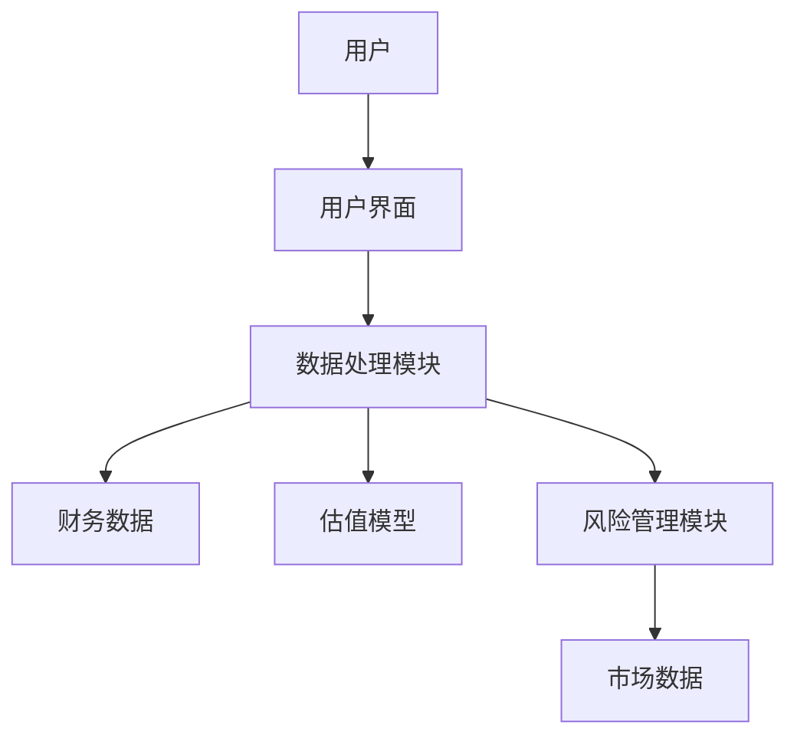
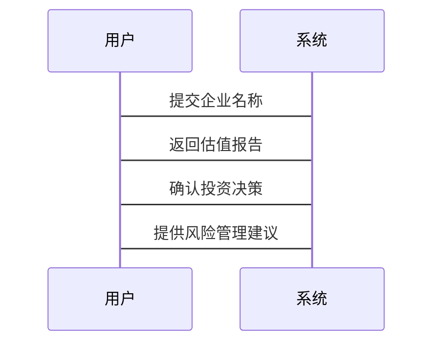

                 


# 巴菲特的投资原则：永远不要亏损

## 关键词

- 巴菲特投资原则
- 价值投资
- 安全边际
- 企业基本面分析
- 现金流折现法
- 投资组合构建
- 风险管理

## 摘要

本文深入探讨巴菲特的投资原则，强调长期价值投资的重要性。通过分析巴菲特的投资哲学、价值投资的分析框架、数学模型的应用、系统架构设计、项目实战案例以及最佳实践，帮助读者理解如何避免亏损并实现长期稳健的投资收益。

---

## 第一部分：巴菲特的投资哲学

### 第1章：巴菲特的生平与投资理念

#### 1.1 巴菲特的生平简介

- **1.1.1 早年经历与教育背景**
  - 巴菲特出生于1934年，从小就展现出对投资的兴趣。
  - 在哥伦比亚大学学习期间，师从本杰明·格雷厄姆，学习价值投资理论。

- **1.1.2 投资事业的起步与发展**
  - 创办合伙公司，开始实践价值投资。
  - 成为伯克希尔·哈撒韦的董事长，带领公司实现长期稳健增长。

#### 1.2 巴菲特的投资理念

- **1.2.1 价值投资的核心思想**
  - 购买股票即买入企业的一部分，关注企业的内在价值。
  - 以合理的价格买入优质企业，长期持有。

- **1.2.2 长期投资与复利效应**
  - 复利是投资的奇迹，长期持有优质股票能带来指数级增长。
  - 避免频繁交易，减少成本和错误决策。

- **1.2.3 避免短期波动的影响**
  - 市场波动是机会，而非风险。
  - 通过分散投资和长期持有来降低短期波动的影响。

---

### 第2章：价值投资的核心原则

#### 2.1 价值投资的定义与特征

- **2.1.1 价值投资的定义**
  - 以低于内在价值的价格买入优质企业股票。

- **2.1.2 与趋势投资和投机的区别**
  - 趋势投资依赖于价格走势，价值投资关注企业基本面。
  - 投机追求短期收益，价值投资注重长期稳健。

#### 2.2 巴菲特的价值投资策略

- **2.2.1 购买优质企业而非股票**
  - 选择具有强大竞争优势和良好管理的企业。

- **2.2.2 重视企业的财务状况与盈利能力**
  - 分析财务报表，评估企业的盈利能力和发展潜力。

- **2.2.3 长期持有与耐心等待**
  - 避免频繁交易，耐心等待企业价值的实现。

---

## 第二部分：价值投资的分析框架

### 第3章：企业基本面分析

#### 3.1 企业基本面分析的重要性

- **3.1.1 什么是企业基本面**
  - 企业的财务状况、盈利能力、管理团队等内在因素。

- **3.1.2 基本面分析的核心要素**
  - 利润表：收入、利润、成本。
  - 资产负债表：资产、负债、所有者权益。
  - 现金流量表：现金流入和流出。

#### 3.2 财务报表分析

- **3.2.1 利润表、资产负债表与现金流量表解读**
  - 利润表显示企业的盈利能力。
  - 资产负债表反映企业的财务状况。
  - 现金流量表展示企业的现金流健康情况。

- **3.2.2 关键财务指标的计算与分析**
  - 净利润率：净利润/营业收入。
  - 资产负债率：负债/资产。
  - 现金流：经营活动产生的现金流净额。

#### 3.3 企业竞争优势的评估

- **3.3.1 护城河的概念与类型**
  - 技术优势、成本优势、品牌优势、市场准入壁垒。

- **3.3.2 企业市场地位与竞争优势分析**
  - 行业地位：龙头企业还是小企业。
  - 市场份额：是否在行业内占据主导地位。

---

### 第4章：安全边际与内在价值

#### 4.1 安全边际的定义与重要性

- **4.1.1 安全边际的定义**
  - 购买价格低于内在价值的部分，提供缓冲空间。

- **4.1.2 安全边际的重要性**
  - 减少估值错误的影响。
  - 降低市场波动带来的风险。

#### 4.2 内在价值的计算方法

- **4.2.1 现金流折现法（DCF）**
  - 将未来现金流贴现到现值，计算企业内在价值。

- **4.2.2 相对估值法**
  - 与同类企业比较，计算市盈率、市净率等指标。

---

## 第三部分：数学模型与估值方法

### 第5章：现金流折现法（DCF）的原理与应用

#### 5.1 DCF模型的核心原理

- **5.1.1 现金流预测**
  - 预测未来自由现金流，考虑企业增长和稳定因素。

- **5.1.2 贴现率计算**
  - 使用加权平均资本成本（WACC）作为贴现率。

- **5.1.3 现值计算**
  - 将未来现金流贴现，计算企业价值。

#### 5.2 DCF模型的实现步骤

1. **预测未来现金流**
   - 确定企业的未来盈利能力和现金流情况。
2. **计算贴现率**
   - 确定WACC，考虑债务和股权的成本。
3. **计算现值**
   - 将未来现金流贴现，求和得到企业价值。

#### 5.3 DCF模型的优缺点

- **优点**
  - 精确量化企业价值。
- **缺点**
  - 预测现金流和贴现率存在不确定性。

---

## 第四部分：系统分析与架构设计

### 第6章：投资组合与风险管理

#### 6.1 投资组合的构建

- **6.1.1 投资目标与策略**
  - 确定投资目标和风险承受能力。
  - 制定长期投资计划和策略。

- **6.1.2 资产配置**
  - 分配不同资产（股票、债券、现金）以分散风险。

#### 6.2 风险管理与心理控制

- **6.2.1 风险管理策略**
  - 设置止损点，限制潜在损失。
  - 定期审视和调整投资组合。

- **6.2.2 心理控制的重要性**
  - 避免贪婪和恐惧，坚持长期投资。
  - 保持冷静，避免情绪化决策。

---

## 第五部分：项目实战与案例分析

### 第7章：实际案例分析

#### 7.1 案例背景

- 选择一家企业，分析其财务报表和行业地位。

#### 7.2 投资决策过程

- **第一步：分析企业基本面**
  - 评估盈利能力、财务状况和竞争优势。
- **第二步：计算内在价值**
  - 使用DCF模型或相对估值法。
- **第三步：评估安全边际**
  - 确定购买价格低于内在价值。
- **第四步：构建投资组合**
  - 分配资产，分散风险。

#### 7.3 投资策略与操作步骤

- 确定投资目标和策略。
- 进行基本面分析和估值。
- 评估风险并制定风险管理计划。
- 执行交易并定期监控。

---

## 第六部分：最佳实践与投资心态

### 第8章：长期投资心态

#### 8.1 长期投资心态的重要性

- **耐心与纪律**
  - 避免短期波动影响决策。
- **持续学习与自我提升**
  - 不断更新知识，适应市场变化。

#### 8.2 避免常见误区

- **误区一：追求短期收益**
  - 长期投资需要耐心和纪律。
- **误区二：过度关注市场波动**
  - 市场波动是机会，而非风险。

---

## 第七部分：系统架构与接口设计

### 第9章：系统架构设计

#### 9.1 系统功能设计

- **用户界面**
  - 提供直观的界面，方便用户进行分析和决策。
- **数据处理模块**
  - 处理企业财务数据，计算估值指标。
- **风险管理模块**
  - 监控市场波动，提供风险提示。

#### 9.2 系统架构图



---

## 第八部分：系统接口与交互设计

### 第10章：系统交互设计

#### 10.1 系统交互流程



---

## 第九部分：环境安装与核心实现

### 第11章：环境安装

#### 11.1 安装Python环境

- 安装Python和必要的库（pandas, numpy, matplotlib）。

#### 11.2 安装金融分析库

- 安装Yahoo Finance API或其他金融数据接口。

---

### 第12章：核心实现源代码

#### 12.1 财务数据获取与处理

```python
import pandas as pd
import numpy as np

# 获取数据
def get_financial_data(ticker):
    # 获取 Yahoo Finance 数据
    pass

# 计算财务指标
def calculate_metrics(df):
    metrics = {}
    metrics['ROE'] = df['净利润'].mean() / df['所有者权益'].mean()
    metrics['毛利率'] = (df['营业收入'] - df['营业成本']) / df['营业收入'] * 100
    return metrics
```

#### 12.2 DCF模型实现

```python
def dcfvaluation(ticker):
    # 获取财务数据
    df = get_financial_data(ticker)
    # 预测现金流
    fcf = df['自由现金流']
    # 计算贴现率
    wacc = 0.08
    # 贴现现金流
    pv = sum(fcf / (1 + wacc)**i for i in range(10))
    return pv
```

---

## 第十部分：项目小结

### 第13章：项目总结

#### 13.1 项目目标实现

- 成功构建了基于巴菲特投资原则的分析系统。
- 实现了企业基本面分析和内在价值计算。

#### 13.2 项目成果

- 提供了可操作的投资策略和风险管理方案。
- 为投资者提供了实用的工具和方法。

---

## 第十一部分：最佳实践与注意事项

### 第14章：最佳实践 tips

#### 14.1 投资前的准备

- 学习基本面分析和估值方法。
- 选择优质企业，评估安全边际。

#### 14.2 投资中的注意事项

- 分散投资，避免过度集中。
- 定期审视投资组合，及时调整。

#### 14.3 长期投资心态

- 保持耐心，避免短期波动影响决策。
- 坚持学习，提升投资能力。

---

## 第十二部分：拓展阅读

### 第15章：推荐读物

- 《巴菲特致股东的信》
- 《价值投资实战》
- 《投资学原理》

---

## 作者：AI天才研究院/AI Genius Institute & 禅与计算机程序设计艺术 /Zen And The Art of Computer Programming

