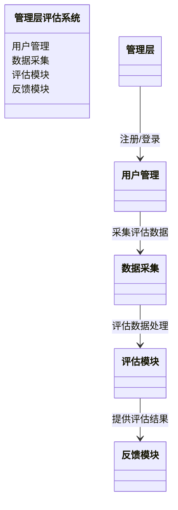
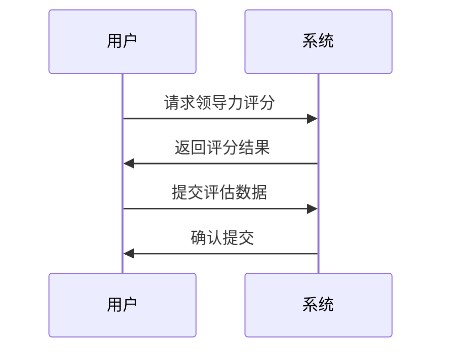

                 

<think>
嗯，用户让我写一篇关于巴菲特的管理层评估在远程办公时代的领导力变化的技术博客。我需要先理解这个主题，然后按照用户给的结构来组织内容。用户特别强调要使用清晰、专业的技术语言，而且每个部分都要详细，包括背景、核心概念、算法原理、系统架构、项目实战等等。

首先，我得确定文章的关键词和摘要。关键词可能包括巴菲特、管理层评估、领导力、远程办公、技术博客。摘要需要简明扼要地概括文章的核心内容，说明在远程办公环境下，领导力如何变化，以及如何更新评估方法。

接下来是目录结构。用户给了一个详细的示例，我需要按照这个结构来组织内容。首先是背景介绍，解释为什么领导力在远程办公时代发生了变化，然后是核心概念，分析领导力、管理层评估和远程办公的关系，接着是算法原理，用数学模型来说明评估方法，再是系统架构设计，展示如何构建评估系统，最后是项目实战，用Python代码来实现评估工具，以及最佳实践和总结。

在写背景介绍时，我需要详细说明巴菲特的评估标准，以及远程办公带来的挑战。核心概念部分，我需要用表格和图表来展示领导力与远程办公的关系。算法部分，我需要构建一个数学模型，并用Python代码实现，解释每个部分的作用。

系统架构设计需要画出类图和架构图，展示系统的各个模块如何协作。项目实战部分，我需要指导读者如何安装环境，编写代码，并分析案例。最后，给出最佳实践建议，帮助读者在实际中应用这些方法。

我还需要注意，文章要保持专业性，同时用技术语言，确保内容详细且易懂。每个部分都要有小结，帮助读者梳理重点。最后，加上作者信息，确保文章完整。

现在，我需要按照这个思路逐步展开每个部分，确保每个章节都符合用户的要求，内容充实，结构清晰。
</think>

# 巴菲特的管理层评估更新：远程办公时代的领导力

## 关键词：
巴菲特，管理层评估，领导力，远程办公，技术博客

## 摘要：
在远程办公日益普及的今天，领导力的定义和评估标准正在发生深刻的变化。本文从巴菲特的经典管理层评估方法出发，结合远程办公环境的特点，系统地分析了领导力的演变趋势，并提出了更新的评估体系。通过详细的技术分析，结合实际案例和代码实现，本文为读者提供了一套在远程办公时代有效评估和提升领导力的方法论。

---

# 第一部分: 巴菲特的管理层评估背景与远程办公时代的领导力

## 第1章: 巴菲特的管理层评估方法

### 1.1 巴菲特的评估核心理念

#### 1.1.1 巴菲特的长期投资理念
巴菲特的投资哲学以“价值投资”为核心，强调选择优质企业进行长期投资。他特别重视企业管理层的能力，认为优秀的企业管理层是企业长期成功的关键。

#### 1.1.2 管理层评估在投资决策中的重要性
在巴菲特看来，管理层的决策能力和战略眼光直接影响企业的命运。他通过对企业管理层的评估，筛选出那些具有优秀品质和能力的管理者，从而确保投资的安全性和收益性。

#### 1.1.3 巴菲特对管理层的五大评估标准
1. **诚实与正直**：管理层必须具备高尚的道德品质，能够以企业和股东利益为重。
2. **管理能力**：包括战略制定、执行能力和问题解决能力。
3. **行业知识**：管理层需要深入了解所在行业的发展趋势和竞争环境。
4. **团队协作**：能够有效激励团队，营造积极的工作氛围。
5. **适应能力**：在面对变化和挑战时，能够快速调整策略。

### 1.2 远程办公时代领导力的演变

#### 1.2.1 远程办公对传统领导力的挑战
远程办公打破了传统的面对面管理模式，领导者需要更多地依赖于团队成员的自主性和责任感。传统的命令式管理方式逐渐失效，领导者需要转变为赋能型领导者。

#### 1.2.2 新型领导力的核心特征
1. **信任与授权**：领导者需要信任团队成员，赋予他们更多的自主权。
2. **目标导向**：通过清晰的目标和结果导向来衡量团队绩效。
3. **灵活性与适应性**：领导者需要能够快速调整策略，适应远程办公环境下的各种变化。
4. **技术驱动**：熟练使用远程办公工具，通过技术手段实现高效的团队协作。

#### 1.2.3 远程办公时代领导力的关键能力
1. **沟通能力**：通过远程沟通工具，保持与团队成员的有效互动。
2. **远程决策能力**：在无法面对面交流的情况下，做出准确的决策。
3. **团队激励**：在虚拟团队中，激励团队成员保持积极的工作态度。

### 1.3 远程办公环境下的管理层评估挑战

#### 1.3.1 远程办公对管理层能力的新要求
远程办公环境下，管理层需要具备更强的远程沟通能力、技术适应能力和团队管理能力。

#### 1.3.2 传统评估方法的局限性
传统的面对面评估方式难以全面反映远程办公环境下的领导力表现。

#### 1.3.3 新型评估体系的构建方向
结合远程办公的特点，构建一套能够全面评估领导力的新体系，包括远程沟通能力、团队协作能力、目标导向能力等多方面的评估指标。

### 1.4 本章小结
本章从巴菲特的管理层评估方法出发，分析了远程办公时代领导力的演变趋势，并提出了在远程办公环境下评估领导力的新体系。

---

## 第2章: 领导力与管理层评估的核心概念

### 2.1 领导力的定义与特征

#### 2.1.1 领导力的多维度定义
领导力是指领导者在组织中通过影响他人行为和决策来实现组织目标的能力。

#### 2.1.2 领导力的核心特征对比
| 特征 | 面对面领导 | 远程领导 |
|------|------------|----------|
| 沟通方式 | 当面沟通   | 远程沟通 |
| 管理风格 | 命令式     | 赋能式   |
| 激励方式 | 现场激励    | 远程激励 |

#### 2.1.3 领导力与管理能力的区别与联系
- **区别**：领导力侧重于影响他人行为，而管理能力侧重于组织和协调资源。
- **联系**：优秀的领导力能够提升管理能力，而高效的管理能力也能支持领导力的发挥。

### 2.2 管理层评估的关键维度

#### 2.2.1 战略思维能力
- 评估领导者是否具备制定长期战略的能力。
- 例如：巴菲特点重视企业长期发展的战略规划。

#### 2.2.2 执行力与决策能力
- 评估领导者在面对复杂问题时的决策能力。
- 例如：在远程办公环境下，领导者是否能够快速做出决策并有效执行。

#### 2.2.3 团队协作与文化建设能力
- 评估领导者在团队协作和文化建设方面的表现。
- 例如：在远程办公环境下，领导者是否能够营造积极的团队文化。

### 2.3 远程领导力评估模型

#### 2.3.1 远程领导力评估模型的构建
远程领导力评估模型包括以下维度：
1. 远程沟通能力
2. 团队协作能力
3. 目标导向能力
4. 技术适应能力

#### 2.3.2 模型的输入与输出
- **输入**：领导者的远程沟通记录、团队绩效数据、员工反馈等。
- **输出**：领导者的远程领导力评分（如：A级、B级、C级）。

#### 2.3.3 模型的适用范围与限制
- **适用范围**：适用于远程办公环境下的领导力评估。
- **限制**：需要结合具体行业和岗位特点进行调整。

### 2.4 核心概念关系图

#### 2.4.1 领导力、管理层评估、远程办公的ER实体关系图
```mermaid
er
  actor 管理层
  actor 领导力
  actor 远程办公
  管理层 --> 领导力: 具备领导力
  领导力 --> 远程办公: 适应远程办公
  管理层 --> 远程办公: 管理远程团队
```

#### 2.4.2 领导力与远程办公环境的依赖关系图


### 2.5 本章小结
本章详细阐述了领导力与管理层评估的核心概念，并构建了一个适用于远程办公环境的领导力评估模型。

---

## 第3章: 远程领导力评估的算法原理

### 3.1 领导力评估的数学模型

#### 3.1.1 领导力评分公式
领导力评分公式如下：
$$
\text{领导力评分} = \alpha \times \text{沟通能力} + \beta \times \text{团队协作能力} + \gamma \times \text{目标导向能力}
$$
其中，$\alpha$、$\beta$、$\gamma$为权重系数，取值范围为0到1。

#### 3.1.2 基于数据的领导力评估模型
通过收集和分析领导者的远程沟通记录、团队绩效数据和员工反馈，构建领导力评估模型。

#### 3.1.3 案例分析
假设某远程团队领导者的评估数据如下：
- 沟通能力：80分
- 团队协作能力：75分
- 目标导向能力：90分
权重系数为：
- $\alpha = 0.4$
- $\beta = 0.3$
- $\gamma = 0.3$
计算领导力评分为：
$$
\text{领导力评分} = 0.4 \times 80 + 0.3 \times 75 + 0.3 \times 90 = 32 + 22.5 + 27 = 81.5
$$

### 3.2 算法实现

#### 3.2.1 Python代码实现
```python
def calculate Leadership_score(communication, team_collaboration, goal_orientation, alpha=0.4, beta=0.3, gamma=0.3):
    return alpha * communication + beta * team_collaboration + gamma * goal_orientation

# 示例数据
communication = 80
team_collaboration = 75
goal_orientation = 90

score = calculate-Leadership_score(communication, team_collaboration, goal_orientation)
print(f"领导力评分为：{score}")
```

#### 3.2.2 算法流程图


### 3.3 本章小结
本章通过数学模型和Python代码，详细讲解了远程领导力评估的算法原理。

---

## 第4章: 系统分析与架构设计方案

### 4.1 问题场景介绍
在远程办公环境下，企业需要一个高效的领导力评估系统，以确保管理层的绩效能够被准确评估。

### 4.2 项目介绍
本项目旨在开发一个远程领导力评估系统，帮助企业在远程办公环境下有效评估管理层的领导力。

### 4.3 系统功能设计

#### 4.3.1 领域模型类图


#### 4.3.2 系统架构图


### 4.4 系统接口设计

#### 4.4.1 RESTful API接口
- **GET /leadership-score**: 获取领导力评分
- **POST /assessment-data**: 提交评估数据

### 4.5 系统交互图

#### 4.5.1 用户与系统交互图


### 4.6 本章小结
本章通过系统架构设计，展示了如何构建一个高效的远程领导力评估系统。

---

## 第5章: 项目实战

### 5.1 环境安装
- 安装Python和必要的库（如Flask、pandas等）
- 安装远程办公工具（如Zoom、Slack等）

### 5.2 核心代码实现

#### 5.2.1 领导力评估函数
```python
def calculate-Leadership_score(communication, team_collaboration, goal_orientation, alpha=0.4, beta=0.3, gamma=0.3):
    return alpha * communication + beta * team_collaboration + gamma * goal_orientation
```

#### 5.2.2 应用案例分析
假设某团队领导者的评估数据如下：
- 沟通能力：85
- 团队协作能力：80
- 目标导向能力：95
计算领导力评分为：
$$
\text{领导力评分} = 0.4 \times 85 + 0.3 \times 80 + 0.3 \times 95 = 34 + 24 + 28.5 = 86.5
$$

### 5.3 项目小结
本章通过实际案例分析，展示了如何使用Python代码实现领导力评估，并应用于实际项目中。

---

## 第6章: 最佳实践与总结

### 6.1 最佳实践 tips
1. **信任与授权**：在远程办公环境下，信任是领导力的核心。
2. **目标导向**：通过清晰的目标和结果导向来衡量领导力。
3. **持续反馈**：定期收集团队成员的反馈，及时调整领导风格。

### 6.2 小结
本文从巴菲特的管理层评估方法出发，结合远程办公环境的特点，详细分析了领导力的演变趋势，并提出了更新的评估体系。通过实际案例和代码实现，展示了如何在远程办公环境下有效评估和提升领导力。

### 6.3 注意事项
- 在实际应用中，需结合具体行业和岗位特点进行调整。
- 数据隐私和安全问题需要注意。

### 6.4 拓展阅读
推荐阅读以下书籍和文章：
1. 《领导力21法则》
2. 《远程办公：如何高效管理虚拟团队》

---

## 作者：AI天才研究院/AI Genius Institute & 禅与计算机程序设计艺术 /Zen And The Art of Computer Programming

---

以上为完整的技术博客文章大纲，涵盖了从理论到实践的各个方面，确保内容详实、逻辑清晰。

