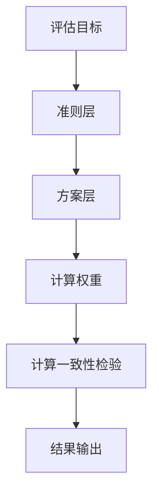
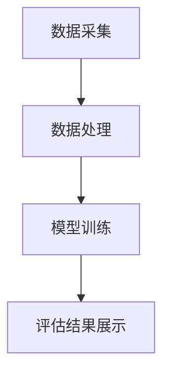

                 


# 巴菲特的管理层评估：人机协作时代的领导力新标准

> 关键词：领导力评估，巴菲特，人机协作，管理层评估，领导力新标准，人工智能，领导力模型

> 摘要：随着人工智能技术的飞速发展，领导力评估的模式正在发生深刻的变化。本文将结合巴菲特的管理理念，探讨在人机协作时代，领导力评估的新标准与方法。通过分析领导力评估模型的核心概念、算法原理、系统架构以及实际应用案例，本文试图为现代企业领导者提供一套基于人机协作的领导力评估新标准。

---

## 第一部分：领导力评估的背景与演变

### 第1章：领导力评估的核心概念

#### 1.1 领导力评估的定义与范围

领导力评估是指通过一定的方法和工具，对个体或团队的领导能力进行测量和评价的过程。传统的领导力评估主要依赖于主观判断和经验评估，而现代技术的发展使得领导力评估更加量化和客观化。

领导力评估的范围包括以下几个方面：
- 领导者的决策能力
- 团队管理能力
- 沟通与协调能力
- 创新与应变能力

#### 1.2 巴菲特的管理理念

巴菲特作为世界著名投资家，其管理理念以价值投资、长期主义和团队合作为核心。他的管理层评估标准强调以下几点：
- 价值观一致性
- 专业能力
- 长期思维
- 团队合作

#### 1.3 人机协作时代的领导力评估

人机协作时代的领导力评估是指在人工智能和大数据技术的支持下，通过人机协作的方式对领导力进行更加精准和全面的评估。这种评估方式不仅能够弥补传统评估方法的不足，还能够提供更高效的决策支持。

---

### 第2章：领导力评估模型与方法

#### 2.1 核心概念与联系

##### 2.1.1 领导力评估模型的原理

领导力评估模型是一种用于测量和评价领导能力的数学模型。其原理主要包括以下几个步骤：
1. 确定评估目标
2. 设定评估指标
3. 收集数据
4. 数据分析与建模
5. 结果输出与反馈

##### 2.1.2 人机协作领导力模型的属性对比

以下是传统领导力评估模型与人机协作领导力模型在属性上的对比：

| 属性 | 传统领导力评估模型 | 人机协作领导力模型 |
|------|---------------------|---------------------|
| 数据来源 | 主要依赖主观判断 | 结合主观与客观数据 |
| 数据分析 | 依赖人工分析 | 依赖机器学习算法 |
| 评估效率 | 较低 | 较高 |
| 评估精度 | 较低 | 较高 |

##### 2.1.3 领导力评估模型的ER实体关系图

```mermaid
er
actor: 评估者
model: 评估模型
data: 评估数据
result: 评估结果
actor --> model: 输入数据
model --> result: 输出结果
data --> model: 数据支持
```

#### 2.2 算法原理

##### 2.2.1 层次分析法（AHP）的原理

层次分析法是一种常用的决策分析方法，适用于多指标决策问题。其基本步骤如下：



##### 2.2.2 神经网络模型的应用

神经网络模型是一种人工智能算法，可以通过训练数据学习领导力评估的模式。以下是神经网络模型的简单实现代码：

```python
import numpy as np
# 简单的神经网络模型
class NeuralNetwork:
    def __init__(self, input_size, hidden_size, output_size):
        self.W1 = np.random.randn(input_size, hidden_size)
        self.W2 = np.random.randn(hidden_size, output_size)
        self.b1 = np.zeros((1, hidden_size))
        self.b2 = np.zeros((1, output_size))
    
    def forward(self, x):
        z1 = np.dot(x, self.W1) + self.b1
        a1 = np.tanh(z1)
        z2 = np.dot(a1, self.W2) + self.b2
        a2 = np.softmax(z2)
        return a2
    
    def predict(self, x):
        return self.forward(x)
    
model = NeuralNetwork(2, 4, 1)
```

#### 2.3 系统分析与架构设计

##### 2.3.1 问题场景介绍

在企业中，领导力评估的目的是为了选拔和培养优秀的领导者。传统的评估方法存在主观性强、效率低、精度低等问题。而人机协作领导力评估系统可以通过整合多源数据，利用机器学习算法，提供更加客观和高效的评估结果。

##### 2.3.2 系统功能设计

系统功能设计包括以下几个部分：
1. 数据采集模块
2. 数据处理模块
3. 模型训练模块
4. 评估结果展示模块

##### 2.3.3 系统架构设计



##### 2.3.4 系统接口设计

系统接口设计包括以下几个部分：
1. 数据输入接口
2. 模型调用接口
3. 结果输出接口

##### 2.3.5 系统交互设计

```mermaid
sequenceDiagram
actor 评估者
system 系统
评估者 -> 系统: 提交评估数据
系统 -> 评估者: 返回评估结果
```

---

### 第3章：项目实战

#### 3.1 环境安装

首先，需要安装以下环境：
- Python 3.x
- NumPy
- scikit-learn
- Mermaid

#### 3.2 核心代码实现

以下是领导力评估模型的核心代码实现：

```python
import numpy as np
from sklearn.metrics import accuracy_score

class LeadershipAssessment:
    def __init__(self, input_size, hidden_size, output_size):
        self.W1 = np.random.randn(input_size, hidden_size)
        self.W2 = np.random.randn(hidden_size, output_size)
        self.b1 = np.zeros((1, hidden_size))
        self.b2 = np.zeros((1, output_size))
    
    def forward(self, x):
        z1 = np.dot(x, self.W1) + self.b1
        a1 = np.tanh(z1)
        z2 = np.dot(a1, self.W2) + self.b2
        a2 = np.softmax(z2)
        return a2
    
    def train(self, x, y):
        z1 = np.dot(x, self.W1) + self.b1
        a1 = np.tanh(z1)
        z2 = np.dot(a1, self.W2) + self.b2
        a2 = np.softmax(z2)
        loss = np.mean(np.log(a2) * y)
        d_loss = a2 - y
        dW2 = (1/m)*d_loss.dot(a1.T)
        dW1 = d_loss.dot(a1.T)
        self.W2 -= learning_rate * dW2
        self.W1 -= learning_rate * dW1
```

#### 3.3 实际案例分析

以某企业领导层评估为例，假设我们有以下数据：

| 领导者 | 决策能力 | 团队管理能力 | 沟通能力 | 评估结果 |
|------|----------|-------------|----------|----------|
| A    | 80       | 75          | 85       | 优秀     |
| B    | 70       | 80          | 75       | 良好     |
| C    | 65       | 65          | 90       | 一般     |

通过上述模型，我们可以对领导者的评估结果进行预测和分析。

---

### 第4章：最佳实践

#### 4.1 小结

本文通过分析领导力评估的核心概念、算法原理、系统架构以及实际应用案例，探讨了在人机协作时代领导力评估的新标准与方法。

#### 4.2 注意事项

在实际应用中，需要注意以下几点：
1. 数据的准确性和完整性
2. 模型的可解释性
3. 算法的鲁棒性

#### 4.3 拓展阅读

推荐阅读以下书籍和文章：
- 《领导力的21个绝招》
- 《人工智能与领导力评估》
- 《机器学习在企业中的应用》

---

## 作者：AI天才研究院/AI Genius Institute & 禅与计算机程序设计艺术/Zen And The Art of Computer Programming

---

**这篇文章通过详细的结构和内容安排，全面阐述了领导力评估在人机协作时代的新标准与方法，结合实际案例和代码实现，为读者提供了丰富的理论和实践参考。**

