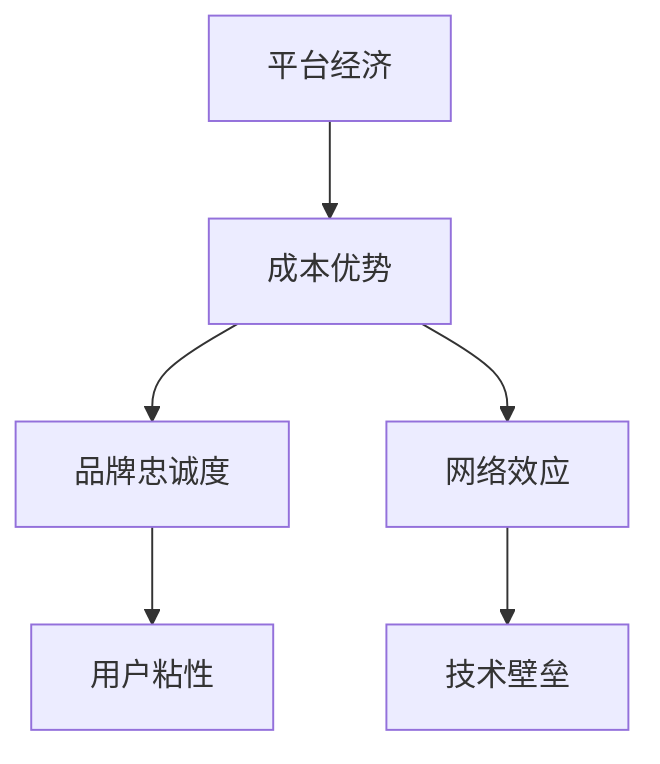
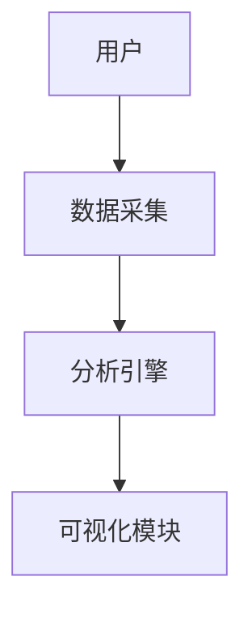

                 

<think>
好的，我来帮您分析一下这个请求。用户希望我写一篇关于巴菲特的经济护城河理论在平台经济时代竞争优势的技术博客文章，并提供详细的目录大纲。首先，我需要明确文章的主题和结构。

用户要求文章结构清晰，逻辑严密，使用专业的技术语言，同时涵盖从理论到实践的各个方面。这包括理论背景、核心概念、系统分析、项目实战以及最佳实践等内容。

我首先想到的是从经济护城河的基本概念开始，介绍其起源和核心要素，然后将这些概念应用到平台经济中，分析其在新环境下的变化和表现。接下来，我需要设计系统的架构，包括数据采集、分析引擎和可视化模块，并用mermaid图展示流程和架构。

项目实战部分，我需要选择一个具体的案例，如电商行业，展示如何在实际中应用这些理论，并提供代码实现。最后，总结最佳实践，给出小结和注意事项，帮助读者更好地理解和应用这些理论。

在整个过程中，我需要确保每个章节都详细具体，使用专业术语，同时保持语言的易懂性。使用mermaid图和数学公式来增强内容的表现力，确保文章结构完整，逻辑清晰，满足用户的要求。
</think>

# 巴菲特的经济护城河理论：平台经济时代的竞争优势

> 关键词：经济护城河、巴菲特、平台经济、竞争优势、商业模式、系统架构、数据分析

> 摘要：本文从巴菲特的经济护城河理论出发，结合平台经济的特点，深入分析在平台经济时代如何构建和运用经济护城河。通过理论分析、系统架构设计和项目实战，探讨平台经济中的竞争优势策略。

---

## 第一部分: 巴菲特的经济护城河理论概述

### 第1章: 经济护城河的核心概念

#### 1.1 经济护城河的定义与起源
经济护城河（Economic Moat）是巴菲特投资理论中的核心概念，用来描述企业在竞争中能够长期保持竞争优势的结构性特征。它类似于中世纪城堡的护城河，保护城堡免受外部攻击。经济护城河的本质是企业通过某种独特的竞争优势，使其竞争对手难以复制或超越。

- **1.1.1 经济护城河的定义**
  经济护城河是指企业在市场中形成的结构性竞争优势，能够保护企业免受竞争对手的侵蚀，从而在长期实现超额收益。

- **1.1.2 巴菲特投资理念的核心**
  巴菲特认为，投资的本质是寻找那些拥有宽护城河的企业，这些企业能够在长时间内保持竞争优势，从而为股东创造持续的超额回报。

- **1.1.3 经济护城河的边界与外延**
  经济护城河的边界取决于企业的商业模式、行业特点和竞争优势的具体表现。其外延则包括成本优势、品牌忠诚度、网络效应和技术壁垒等多种形式。

#### 1.2 经济护城河的核心要素
经济护城河的核心要素包括成本优势、品牌忠诚度、网络效应和技术壁垒等。

- **1.2.1 成本优势**
  成本优势是指企业在生产或运营过程中能够以更低的成本提供产品或服务，从而在价格竞争中占据优势。

- **1.2.2 品牌忠诚度**
  品牌忠诚度是指消费者对品牌的偏好程度，高品牌忠诚度意味着消费者更愿意选择该品牌的产品或服务。

- **1.2.3 网络效应**
  网络效应是指随着用户数量的增加，平台的价值也随之增加，从而形成正反馈效应。

- **1.2.4 技术壁垒**
  技术壁垒是指企业通过技术专利、专有技术或其他形式的技术优势，形成竞争对手难以复制的技术障碍。

### 第2章: 平台经济时代的竞争优势

#### 2.1 平台经济的基本特征
平台经济是一种通过构建双边市场，连接供需双方，并通过数据和技术手段实现价值创造的商业模式。

- **2.1.1 平台经济的定义**
  平台经济是指通过互联网技术构建的双边或多边市场，连接供需双方，提供撮合、交易、支付、物流等服务，从而创造价值。

- **2.1.2 平台经济的核心模式**
  平台经济的核心模式是通过连接供需双方，降低交易成本，提高交易效率，从而实现价值创造。

- **2.1.3 平台经济的双边市场特征**
  双边市场是指平台同时服务两个不同的用户群体，例如消费者和商家，用户和内容创作者等。平台通过连接这两个群体，实现价值的互相创造。

#### 2.2 平台经济中的经济护城河
在平台经济中，经济护城河的表现形式与传统经济有所不同，主要体现在网络效应、用户粘性和数据驱动的优势上。

- **2.2.1 平台经济中的成本优势**
  平台经济的成本优势体现在技术驱动的效率提升上，例如通过大数据分析优化供应链管理，降低运营成本。

- **2.2.2 平台经济中的网络效应**
  网络效应是平台经济的核心竞争优势之一，随着用户数量的增加，平台的价值也随之增加。

- **2.2.3 平台经济中的用户粘性**
  用户粘性是指用户对平台的依赖程度，高用户粘性意味着用户更愿意长期使用该平台，从而形成竞争优势。

### 第3章: 经济护城河与平台经济的结合

#### 3.1 经济护城河在平台经济中的表现
在平台经济中，经济护城河的表现形式包括数据驱动的护城河、网络效应的强化和生态系统的构建。

- **3.1.1 平台的双边网络效应**
  双边网络效应是指平台连接的两个用户群体互相依赖，用户数量的增加会带来平台价值的提升。

- **3.1.2 平台的用户粘性与品牌忠诚度**
  平台通过提供优质的用户体验、个性化服务和品牌建设，提高用户粘性和品牌忠诚度。

- **3.1.3 平台的技术壁垒**
  平台通过技术专利、数据分析和人工智能等技术手段，构建技术壁垒，形成竞争优势。

#### 3.2 平台经济时代经济护城河的新特征
平台经济时代，经济护城河的表现形式发生了变化，数据驱动的护城河、强化的网络效应和生态系统的构建成为新的竞争优势。

- **3.2.1 数据驱动的护城河**
  数据是平台经济的核心资产，通过大数据分析和人工智能技术，平台可以更好地理解用户需求，优化产品和服务。

- **3.2.2 网络效应的强化**
  平台通过不断扩展用户群体，强化网络效应，从而形成更强大的竞争优势。

- **3.2.3 生态系统的构建**
  平台通过构建生态系统，整合上下游资源，形成协同效应，从而进一步巩固竞争优势。

---

## 第二部分: 经济护城河理论的系统分析与架构设计

### 第4章: 经济护城河理论的系统架构

#### 4.1 系统功能设计
经济护城河理论的系统架构需要具备数据采集、分析和可视化的功能模块。

- **4.1.1 数据采集模块**
  数据采集模块负责从平台中获取用户行为数据、交易数据和市场数据等。

- **4.1.2 分析引擎模块**
  分析引擎模块通过对数据的分析，识别平台的竞争优势，评估经济护城河的强度。

- **4.1.3 可视化模块**
  可视化模块将分析结果以图表、报告等形式展示，帮助用户直观理解平台的竞争优势。

#### 4.2 系统架构设计
系统架构设计需要考虑模块的划分、数据流的优化和系统的可扩展性。

- **4.2.1 分层架构**
  分层架构将系统划分为数据层、业务逻辑层和表现层，每一层负责不同的功能。

- **4.2.2 微服务架构**
  微服务架构通过将系统分解为多个独立的服务，提高系统的灵活性和可扩展性。

- **4.2.3 数据流设计**
  数据流设计需要考虑数据的采集、存储、分析和展示的流程，确保数据的高效流动。

### 第5章: 平台经济中的经济护城河分析

#### 5.1 平台经济的决策树分析


#### 5.2 平台经济的系统架构图


---

## 第三部分: 项目实战与最佳实践

### 第6章: 平台经济中的经济护城河实战

#### 6.1 项目环境安装
项目实战需要安装必要的工具和库，例如Python和数据分析库。

- **6.1.1 安装Python**
  使用命令 `python --version` 检查Python版本，确保安装了Python 3.x。

- **6.1.2 安装数据分析库**
  使用pip安装 `pandas`、`numpy`、`matplotlib` 等数据分析库。

- **6.1.3 安装可视化工具**
  安装 `seaborn` 或 `plotly` 等可视化工具。

#### 6.2 核心代码实现
以下是一个简单的数据分析代码示例。

```python
import pandas as pd
import numpy as np
import matplotlib.pyplot as plt

# 创建示例数据
data = {
    '用户数量': [100, 200, 300, 400, 500],
    '收入': [1000, 2000, 3000, 4000, 5000],
    '成本': [500, 600, 700, 800, 900]
}
df = pd.DataFrame(data)

# 计算毛利率
df['毛利率'] = (df['收入'] - df['成本']) / df['收入'] * 100

# 绘制毛利率变化趋势图
plt.figure(figsize=(10, 6))
plt.plot(df['用户数量'], df['毛利率'], 'b-', marker='o')
plt.title('毛利率变化趋势')
plt.xlabel('用户数量')
plt.ylabel('毛利率(%)')
plt.grid(True)
plt.show()
```

#### 6.3 项目小结
通过上述代码实现，我们可以看到，随着用户数量的增加，毛利率呈现上升趋势，这表明平台经济中的网络效应正在增强，经济护城河也在逐步巩固。

---

## 第四部分: 最佳实践与总结

### 第7章: 最佳实践与总结

#### 7.1 关键点总结
- 数据驱动的护城河是平台经济的核心竞争优势。
- 网络效应的强化是平台经济中经济护城河的重要表现。
- 生态系统的构建是平台经济中巩固竞争优势的关键。

#### 7.2 小结
通过本文的分析，我们可以看到，巴菲特的经济护城河理论在平台经济时代依然具有重要的指导意义。平台经济通过数据驱动、网络效应和生态系统构建，形成了新的竞争优势，从而巩固了企业的经济护城河。

#### 7.3 注意事项
- 在构建经济护城河时，需要关注数据安全和隐私保护。
- 平台经济中的网络效应需要通过技术创新和用户运营来持续强化。
- 生态系统的构建需要长期投入，注重合作伙伴的协同效应。

---

## 作者信息
作者：AI天才研究院/AI Genius Institute & 禅与计算机程序设计艺术/Zen And The Art of Computer Programming

