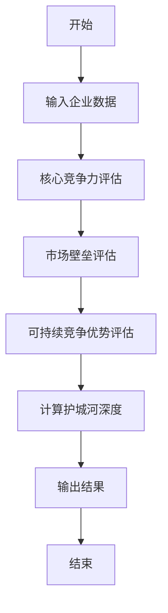
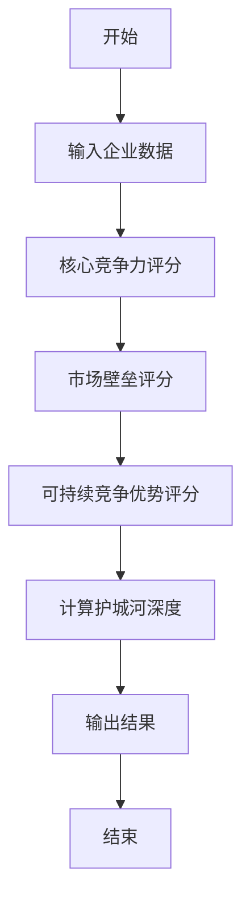
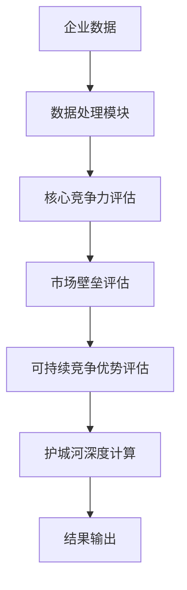

                 


# 巴菲特的经济护城河理论：持久竞争优势的来源

## 关键词：经济护城河、巴菲特、竞争优势、投资策略、商业模式

## 摘要：  
本文深入探讨了巴菲特提出的经济护城河理论，分析了企业如何通过建立持久的竞争优势来实现长期成功。文章从经济护城河的核心概念出发，结合实际案例，详细阐述了其类型、构建策略、评估模型及数学算法。最后，本文提出了系统化的架构设计和项目实战方案，帮助读者更好地理解和应用这一理论。

---

## 第1章: 经济护城河的核心概念

### 1.1 经济护城河的定义与背景

经济护城河（Economic Moat）是巴菲特投资理论中的核心概念，指企业为了防止竞争对手入侵而建立的长期竞争优势。这种优势可以是成本优势、品牌影响力、技术壁垒或资源控制等，使企业在行业中立于不败之地。

#### 1.1.1 什么是经济护城河
经济护城河是一种竞争壁垒，帮助企业抵御竞争对手的进攻。它不仅是企业长期盈利能力的保障，也是投资者选择标的的重要依据。

#### 1.1.2 巴菲特投资理念的起源
巴菲特的经济护城河理论起源于他的投资实践。他认为，具有强大护城河的企业能够在长期内保持竞争优势，为股东创造超额收益。

#### 1.1.3 经济护城河在现代商业中的意义
在现代商业环境中，经济护城河帮助企业建立市场地位，提高客户忠诚度，并在行业变化中保持稳定性。

### 1.2 经济护城河的类型与特征

经济护城河可以分为四种主要类型：成本优势、品牌优势、技术优势和资源优势。以下是各类别的对比：

| 类型       | 特征                           |
|------------|--------------------------------|
| 成本优势   | 低成本生产或采购               |
| 品牌优势   | 强大的品牌影响力                 |
| 技术优势   | 独特的技术或专利                 |
| 资源优势   | 独特的资源获取能力               |

#### 经济护城河的核心要素
1. **核心竞争力**：企业独有的技术、工艺或商业模式。
2. **市场地位**：在目标市场中的领先地位。
3. **可持续发展能力**：长期保持竞争优势的能力。
4. **竞争壁垒**：阻止竞争对手进入市场的障碍。

---

## 第2章: 经济护城河的构建与评估

### 2.1 经济护城河的构建策略

构建强大的经济护城河需要企业从以下几个方面入手：

#### 1. 核心竞争力的打造
企业应专注于其核心竞争力，例如独特的产品或服务，使其在市场中具有不可替代性。

#### 2. 市场壁垒的建立
通过专利、商标、认证等方式，建立市场壁垒，防止竞争对手轻易进入。

#### 3. 可持续竞争优势的培养
企业应不断优化产品和服务，提升客户满意度，增强客户粘性。

### 2.2 经济护城河的评估模型

#### 1. SWOT分析法
SWOT分析法用于评估企业的优势、劣势、机会和威胁。



#### 2. 护城河深度评估公式

$$ \text{护城河深度} = \frac{\text{核心竞争力评分} \times \text{市场壁垒评分} \times \text{可持续竞争优势评分}}{3} $$

---

## 第3章: 经济护城河的数学模型与算法

### 3.1 经济护城河评估的数学模型

#### 护城河深度计算公式

$$ \text{护城河深度} = \frac{\text{核心竞争力评分} \times \text{市场壁垒评分} \times \text{可持续竞争优势评分}}{3} $$

### 3.2 护城河评估算法流程图



---

## 第4章: 经济护城河的系统架构设计

### 4.1 系统功能设计

#### 企业数据输入模块
用户输入企业数据，包括核心竞争力、市场壁垒和可持续竞争优势评分。

#### 核心竞争力评估模块
评估企业的核心竞争力，包括技术、产品和市场反应速度。

#### 市场壁垒评估模块
评估企业的市场壁垒，包括专利、品牌和渠道优势。

#### 可持续竞争优势评估模块
评估企业的可持续竞争优势，包括客户满意度、创新能力和成本控制。

### 4.2 系统架构设计



---

## 第5章: 项目实战

### 5.1 环境安装

安装Python和相关库（如numpy、pandas）。

### 5.2 核心实现代码

```python
def calculate_moat_depth(core_competence, market_barriers, sustainable_advantages):
    return (core_competence * market_barriers * sustainable_advantages) / 3

# 示例
core_competence = 8
market_barriers = 7
sustainable_advantages = 9

moat_depth = calculate_moat_depth(core_competence, market_barriers, sustainable_advantages)
print(f"护城河深度：{moat_depth}")
```

---

## 第6章: 总结与展望

### 6.1 小结
经济护城河是企业长期竞争优势的关键，企业应通过核心竞争力、市场壁垒和可持续竞争优势的构建，打造强大的护城河。

### 6.2 注意事项
在实际应用中，企业需结合自身特点，灵活调整护城河的构建策略。

### 6.3 拓展阅读
推荐阅读《巴菲特投资哲学》和《竞争优势》等书籍。

---

## 作者：AI天才研究院 & 禅与计算机程序设计艺术

---

以上是完整的文章结构，涵盖了经济护城河的理论、构建、评估和系统设计。通过清晰的逻辑和详细的分析，本文为读者提供了全面的视角，帮助他们理解和应用巴菲特的经济护城河理论。

