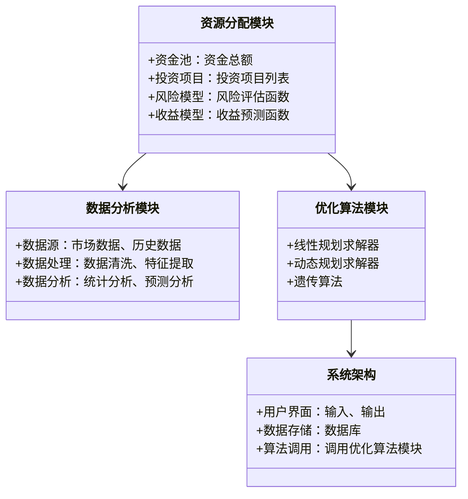

                 


# 巴菲特的资本配置艺术：数字化转型中的资源优化

> **关键词**：资本配置，巴菲特，数字化转型，资源优化，投资策略，优化算法，系统架构

> **摘要**：本文探讨了巴菲特的资本配置艺术在数字化转型中的应用，通过分析资源优化的核心要素、数字化工具的应用、优化算法的实现、系统架构的设计以及实际案例的分析，结合技术语言和专业术语，详细阐述了如何在数字化转型中优化资源配置，提升投资回报。

---

## 第一部分：资本配置的核心概念与理论基础

### 第1章：资本配置的核心概念与理论基础

#### 1.1 资本配置的定义与背景

**1.1.1 资本配置的定义**

资本配置是指将资金分配到不同的资产或项目中，以实现投资目标的过程。资本配置的核心在于如何在有限的资源中，最大化投资回报，降低风险。

**1.1.2 资本配置的历史发展**

资本配置的概念可以追溯到古典经济学时期，但真正的发展始于20世纪，随着投资组合理论的提出，资本配置逐渐成为现代金融学的核心内容。

**1.1.3 资本配置与投资回报的关系**

资本配置直接影响投资回报。合理的资本配置能够优化资产组合，降低风险，从而提高整体投资回报。

#### 1.2 巴菲特的资本配置理念

**1.2.1 巴菲特的投资哲学**

巴菲特的投资哲学强调长期价值投资，注重企业的内在价值，而非短期市场波动。他认为，资本配置应基于对企业基本面的深入分析。

**1.2.2 资本配置的长期视角**

巴菲特强调长期视角，认为资本配置不应过于频繁调整，而是应基于企业长期发展的战略进行配置。

**1.2.3 资本配置与企业价值的关系**

资本配置是企业价值的核心驱动因素之一。合理的资本配置能够提升企业的竞争力，优化资产使用效率，从而增加企业价值。

#### 1.3 资源优化的核心要素

**1.3.1 资源分配的基本原则**

资源优化的核心在于合理分配资源，使其在不同项目或资产之间实现最优配置。基本原则包括风险与收益的平衡、资源分配的效率最大化等。

**1.3.2 资源优化的数学模型**

资源优化可以通过数学模型来实现。例如，线性规划模型可以用于优化资本分配，最大化投资回报。

**1.3.3 资源优化的边界条件**

资源优化的边界条件包括市场环境、企业战略目标、资金规模等因素。这些条件影响资本配置的决策和优化结果。

---

## 第二部分：数字化转型中的资源优化策略

### 第2章：数字化转型与资源优化的结合

#### 2.1 数字化转型的背景与趋势

**2.1.1 数字化转型的定义**

数字化转型是指企业利用数字技术（如大数据、人工智能、云计算等）改变业务模式、流程、文化、战略和组织结构的过程。

**2.1.2 数字化转型对企业的影响**

数字化转型能够提升企业的效率、创新能力和竞争力。通过数字化技术，企业可以更高效地进行资源分配和优化。

**2.1.3 数字化转型中的资源分配挑战**

在数字化转型中，资源分配面临诸多挑战，如技术选择、成本控制、数据隐私等。如何在数字化转型中优化资源分配，是企业需要解决的关键问题。

#### 2.2 资源优化的数字化工具

**2.2.1 数据分析工具在资源优化中的应用**

数据分析工具（如Excel、Python、R）可以帮助企业进行数据挖掘、预测分析，从而优化资源分配。

**2.2.2 人工智能在资本配置中的作用**

人工智能技术可以用于预测市场趋势、评估投资项目风险，从而优化资本配置。

**2.2.3 数字化平台的构建与优化**

通过构建数字化平台，企业可以实现资源的集中管理、实时监控和动态调整，从而提高资源优化效率。

---

## 第三部分：资本配置的优化算法与数学模型

### 第3章：资本配置的优化算法

#### 3.1 线性规划模型

**3.1.1 线性规划的基本原理**

线性规划是一种优化技术，用于在满足约束条件的情况下，最大化或最小化目标函数。在资本配置中，线性规划可以用于优化资产分配。

**3.1.2 资本配置的线性规划模型构建**

假设企业有多个投资项目，每个项目有不同的收益率和风险。目标是将资金分配到这些项目中，以最大化总收益。

**3.1.3 线性规划的求解方法**

线性规划的求解方法包括单纯形法、内点法等。这些方法可以帮助企业找到最优的资本配置方案。

#### 3.2 动态规划模型

**3.2.1 动态规划的基本概念**

动态规划是一种解决多阶段决策问题的优化方法。在资本配置中，动态规划可以用于长期投资规划。

**3.2.2 资本配置的动态规划模型**

假设企业有多个投资阶段，每个阶段有不同的投资机会。动态规划可以帮助企业在每个阶段做出最优决策。

**3.2.3 动态规划在资源分配中的应用**

通过动态规划，企业可以实现长期投资的最优配置，避免短期决策的盲目性。

### 第4章：资本配置的数学模型与公式

#### 4.1 资本配置的数学模型

**4.1.1 投资组合优化的数学表达**

假设企业有n个投资项目，每个项目有收益率r_i和风险σ_i。目标是将资金x分配到这些项目中，以最大化总收益，同时满足风险约束。

**4.1.2 资本分配的数学公式**

总收益 = Σ(x_i * r_i)

总风险 = Σ(x_i * σ_i^2)

约束条件：Σ(x_i) = 1

**4.1.3 数学模型的验证与优化**

通过实际数据验证数学模型的准确性，并根据实际情况进行优化。

---

## 第四部分：系统架构设计与项目实战

### 第5章：系统架构设计与项目实战

#### 5.1 系统功能设计

**5.1.1 领域模型mermaid类图**



**5.1.2 系统架构mermaid架构图**


**5.1.3 系统接口设计**

系统接口包括数据接口、算法接口和用户界面接口。数据接口用于获取市场数据和历史数据；算法接口用于调用优化算法；用户界面接口用于与用户交互。

**5.1.4 系统交互mermaid序列图**

```mermaid
sequenceDiagram

    用户 --> 数据分析模块：请求数据
    数据分析模块 --> 数据存储：查询数据
    数据存储 --> 数据分析模块：返回数据
    数据分析模块 --> 优化算法模块：调用优化算法
    优化算法模块 --> 资源分配模块：返回优化结果
    资源分配模块 --> 用户：显示结果
```

#### 5.2 项目实战

**5.2.1 环境安装**

需要安装Python、NumPy、Pandas、SciPy等库。

**5.2.2 系统核心实现源代码**

以下是资本配置优化的Python代码示例：

```python
import numpy as np
from scipy.optimize import linprog

# 定义目标函数系数（负数表示最大化）
c = [-0.2, -0.3, -0.4]

# 定义约束条件矩阵
A = [
    [0.5, 0.3, 0.2],
    [0.1, 0.2, 0.3]
]

# 定义约束条件右侧
b = [0.6, 0.3]

# 定义变量的范围
x_bounds = [(0, None), (0, None), (0, None)]

# 使用线性规划求解器
result = linprog(c, A_ub=A, b_ub=b, bounds=x_bounds, method='highs')

# 输出结果
print(result.x)
```

**5.2.3 代码应用解读与分析**

上述代码使用线性规划模型优化资本配置。目标函数系数表示各投资项目的收益率，约束条件矩阵表示各项目的风险约束。通过线性规划求解器，找到最优的资本分配方案。

---

## 第五部分：最佳实践与小结

### 第6章：最佳实践与小结

#### 6.1 最佳实践

- **数据驱动决策**：利用数据分析工具和数学模型，实现数据驱动的资本配置决策。
- **技术与业务结合**：将数字化技术与企业业务深度结合，提升资源优化效率。
- **持续优化**：定期评估资本配置效果，根据市场变化和企业战略进行优化。

#### 6.2 小结

本文通过分析巴菲特的资本配置理论，结合数字化转型中的资源优化策略，详细阐述了资本配置的核心概念、优化算法、系统架构设计和项目实战。通过实际案例和代码示例，帮助读者理解如何在数字化转型中优化资源配置，提升投资回报。

---

## 作者

作者：AI天才研究院/AI Genius Institute & 禅与计算机程序设计艺术 /Zen And The Art of Computer Programming

---

**注**：本文为《巴菲特的资本配置艺术：数字化转型中的资源优化》的目录大纲，具体内容请参考正式出版物。

