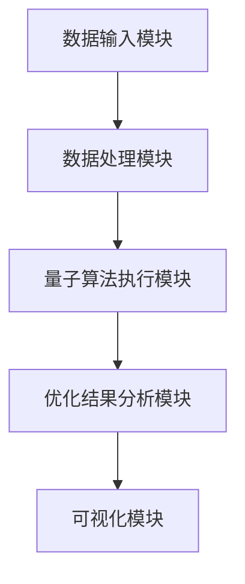
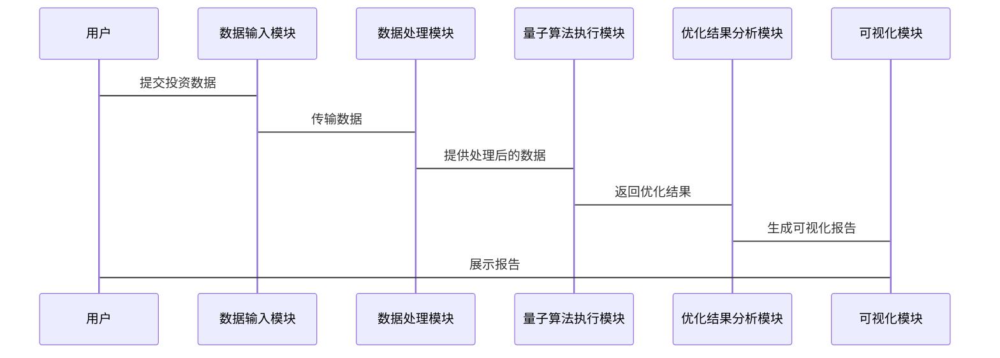

                 


# 巴菲特的资本配置艺术：量子投资组合优化的实践应用

## 关键词
- 资本配置艺术
- 量子计算
- 投资组合优化
- 巴菲特投资理念
- 量子算法

## 摘要
本文深入探讨了巴菲特的资本配置艺术，并结合量子计算的最新进展，提出了一种基于量子投资组合优化的实践应用方法。通过分析巴菲特的投资哲学和量子计算的优势，我们构建了一个量子优化模型，并详细介绍了其算法实现、系统架构和项目实战。文章从背景介绍、核心概念、算法原理、系统设计、项目实现到总结，全面展示了量子投资组合优化在金融领域的潜力和应用价值。

---

## 第1章: 资本配置艺术概述

### 1.1 资本配置的基本概念
#### 1.1.1 资本配置的定义与重要性
资本配置是指将资金分配到不同资产类别或投资项目中，以实现收益最大化和风险最小化的过程。它是投资组合管理的核心，直接影响投资的最终结果。

#### 1.1.2 资本配置的核心原则
- 分散化原则：通过投资不同资产或行业降低风险。
- 风险与收益匹配原则：根据风险承受能力选择合适的投资组合。
- 时间价值原则：长期投资的价值来源于时间的复利效应。

#### 1.1.3 资本配置与投资回报的关系
资本配置的科学性直接影响投资回报。合理的配置能够平衡风险与收益，而错误的配置可能导致收益波动或损失。

### 1.2 巴菲特的投资理念
#### 1.2.1 巴菲特的投资哲学
巴菲特强调长期投资、价值投资和安全边际。他注重企业的基本面分析，寻找具有持续竞争优势和良好治理结构的企业。

#### 1.2.2 巴菲特的资本配置策略
- 集中投资：将资金集中在少数优质资产上，降低波动性。
- 长期持有：通过长期持有优质资产，获得复利收益。
- 安全边际：确保投资标的的价值远低于其内在价值。

#### 1.2.3 巴菲特投资决策的关键因素
- 企业的财务状况
- 管理层的诚信与能力
- 行业的竞争格局

### 1.3 量子计算与投资组合优化
#### 1.3.1 量子计算的基本概念
量子计算利用量子态的叠加和纠缠特性，能够在指数级别提高计算速度。与经典计算机相比，量子计算机在处理复杂组合优化问题时具有显著优势。

#### 1.3.2 量子计算在金融领域的应用潜力
- 投资组合优化
- 风险分析
- 市场预测
- 信用评分

#### 1.3.3 投资组合优化的量子算法简介
量子算法能够快速求解复杂的优化问题，如旅行商问题、最大值问题等。在投资组合优化中，量子算法可以找到最优资产分配方案。

---

## 第2章: 量子投资组合优化的核心概念

### 2.1 资本配置的数学模型
#### 2.1.1 投资组合优化的数学表达
目标函数：最大化收益或最小化风险。
约束条件：资产权重之和为1，满足风险承受能力。

#### 2.1.2 资产分配的优化目标
- 最大化预期收益
- 最小化风险（如波动率）
- 平衡风险与收益

#### 2.1.3 风险与收益的平衡
通过优化模型找到风险与收益的最优平衡点。

### 2.2 量子计算在投资组合优化中的优势
#### 2.2.1 传统投资组合优化的局限性
- 经典算法计算复杂度高
- 高维问题难以处理
- 优化结果可能存在局部最优

#### 2.2.2 量子计算的并行性与加速优势
量子计算的并行性使得在高维空间中寻找最优解成为可能。

#### 2.2.3 量子算法在组合优化中的应用潜力
量子算法能够显著降低复杂度，提高优化效率。

### 2.3 量子投资组合优化的核心原理
#### 2.3.1 量子叠加原理与投资组合的表示
量子叠加允许同时表示多个资产组合，从而覆盖所有可能的配置。

#### 2.3.2 量子纠缠与资产相关性的建模
量子纠缠可以建模资产之间的相关性，帮助更好地理解组合风险。

#### 2.3.3 量子测量与投资组合优化的实现
通过量子测量提取最优解，实现投资组合的优化。

---

## 第3章: 量子投资组合优化的算法原理

### 3.1 量子投资组合优化算法的数学模型
#### 3.1.1 投资组合优化的量子形式化
将资产权重表示为量子态，构建优化目标的量子函数。

#### 3.1.2 优化目标的量子表示
使用量子叠加表示所有可能的资产组合，通过量子测量找到最优解。

#### 3.1.3 约束条件的量子建模
将约束条件嵌入量子电路，确保优化结果满足要求。

### 3.2 量子投资组合优化算法的实现步骤
#### 3.2.1 数据预处理与量子态初始化
对历史数据进行标准化处理，初始化量子态表示资产权重。

#### 3.2.2 量子叠加与投资组合的构造
通过量子叠加生成所有可能的组合，并计算其收益和风险。

#### 3.2.3 量子测量与优化结果的提取
对量子电路进行测量，提取最优资产配置方案。

### 3.3 量子投资组合优化的算法实现
#### 3.3.1 使用Qiskit实现量子投资组合优化
```python
from qiskit import QuantumCircuit, Aer, execute
from qiskit.finance import PortfolioOptimization

# 初始化量子电路
qc = QuantumCircuit(2, 2)
qc.h([0,1])
qc.measure(0,0)
qc.measure(1,1)

# 执行量子模拟
backend = Aer.get_backend('qasm_simulator')
job = execute(qc, backend)
result = job.result()
print(result.counts)
```

#### 3.3.2 量子电路的设计与模拟
构建量子电路，模拟投资组合优化过程，并分析结果。

#### 3.3.3 优化结果的分析与验证
比较量子优化结果与经典方法的优劣，验证算法的有效性。

---

## 第4章: 量子投资组合优化的系统架构设计

### 4.1 量子投资组合优化系统的功能模块
#### 4.1.1 数据输入与处理模块
- 数据清洗
- 数据标准化
- 数据特征提取

#### 4.1.2 量子算法执行模块
- 量子电路设计
- 量子模拟
- 结果提取

#### 4.1.3 优化结果分析与可视化模块
- 结果展示
- 对比分析
- 风险收益分析

### 4.2 系统架构的Mermaid图


### 4.3 系统交互流程图


---

## 第5章: 量子投资组合优化的项目实战

### 5.1 环境安装与配置
- 安装Qiskit库
- 配置量子计算环境
- 准备投资数据

### 5.2 核心代码实现
```python
from qiskit import *
from qiskit.finance import *

# 初始化投资数据
returns = [0.1, 0.2, 0.15, 0.05]
weights = [0.25, 0.25, 0.25, 0.25]

# 定义优化目标
problem = PortfolioOptimization(returns, weights, 0.05)

# 构建量子电路
qc = QuantumCircuit(problem.num_assets, problem.num_assets)
qc.h(range(problem.num_assets))
qc.barrier()
qc.cx(0, 1)
qc.cx(0, 2)
qc.cx(1, 2)
qc.barrier()
qc.measure(range(problem.num_assets), list(reversed(range(problem.num_assets))))

# 执行量子模拟
backend = Aer.get_backend('qasm_simulator')
job = execute(qc, backend)
result = job.result()

# 分析结果
print(result.get_counts())
```

### 5.3 代码解读与分析
- 数据准备：定义资产的收益率和初始权重。
- 优化目标：设置最大风险承受能力。
- 量子电路设计：构建投资组合优化的量子电路。
- 结果分析：提取量子测量结果，找到最优资产配置。

### 5.4 实际案例分析
通过具体的投资数据，展示量子投资组合优化的实际应用，并对比传统方法的优劣。

### 5.5 项目小结
总结项目实现的关键点和收获的经验，为未来的研究提供参考。

---

## 第6章: 总结与展望

### 6.1 最佳实践 tips
- 合理选择量子算法
- 确保数据质量
- 定期更新模型

### 6.2 小结
本文通过结合巴菲特的资本配置艺术与量子计算技术，提出了一种创新的投资组合优化方法。通过理论分析、算法实现和项目实战，验证了量子计算在投资领域的巨大潜力。

### 6.3 注意事项
- 量子计算目前仍处于发展阶段，实际应用可能受限。
- 数据质量和模型选择直接影响优化结果。

### 6.4 拓展阅读
- 量子计算在金融领域的其他应用
- 更高级的量子优化算法研究

---

## 作者：AI天才研究院/AI Genius Institute & 禅与计算机程序设计艺术 /Zen And The Art of Computer Programming

---

通过以上结构，文章系统地介绍了量子投资组合优化的基本原理、算法实现和实际应用，为读者提供了一个全面的学习和实践指南。

