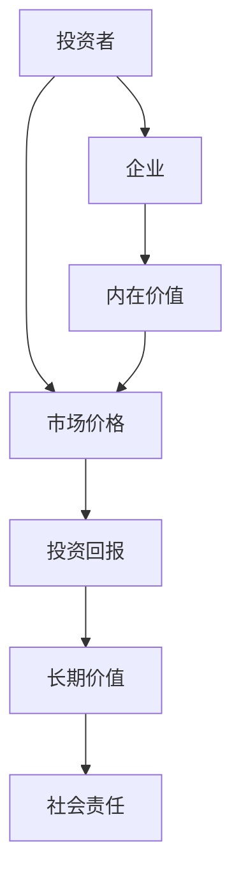
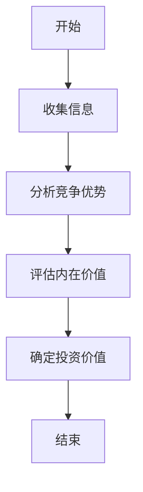
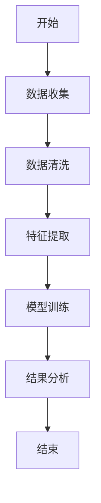
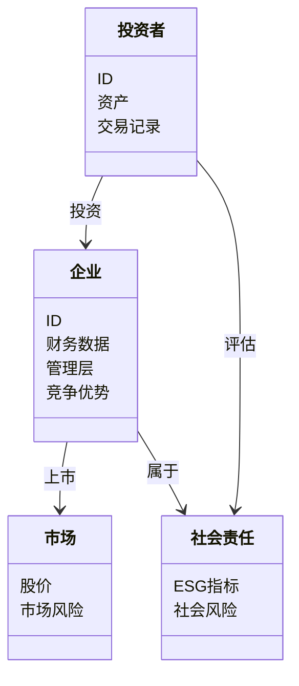
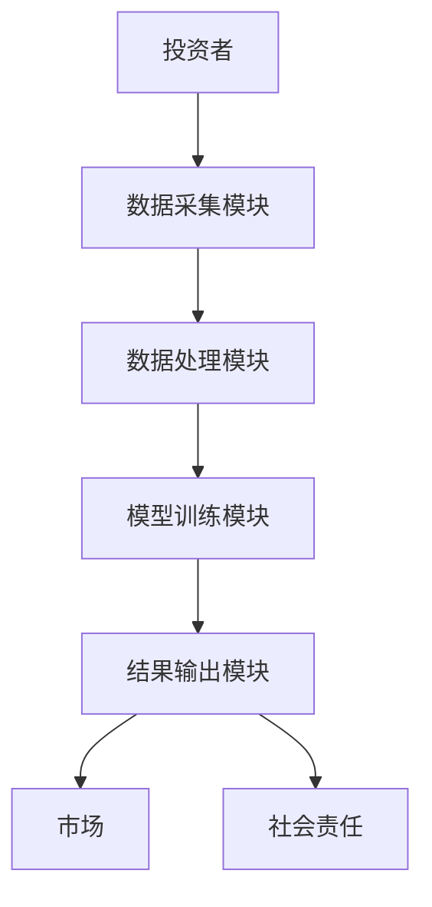
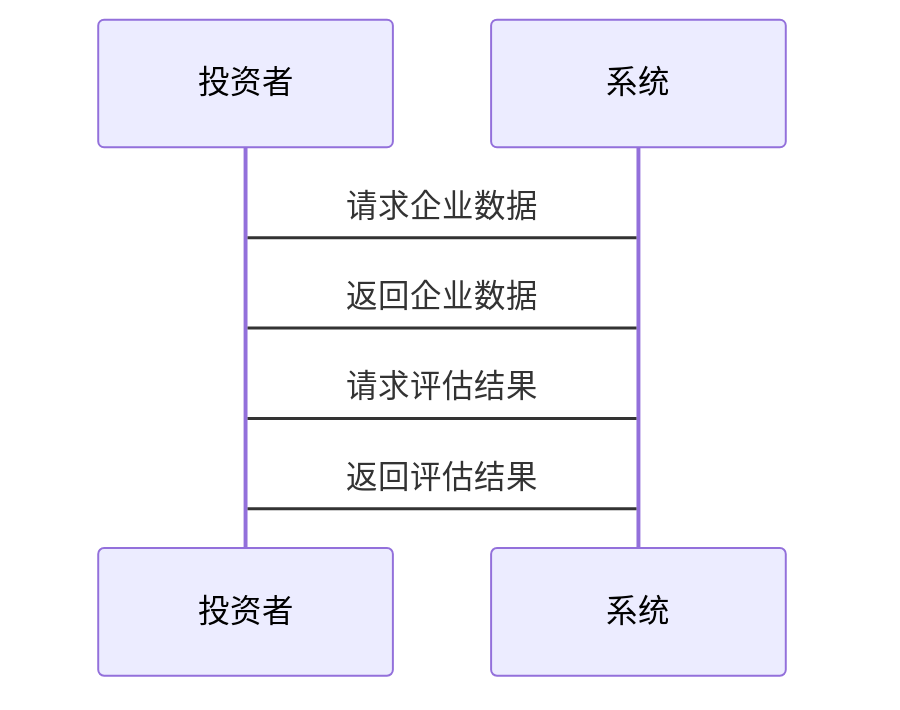

                 

<think>
嗯，用户让我撰写一篇关于巴菲特和芒格可持续投资的技术博客文章。首先，我需要理解用户的需求。他希望文章结构清晰，内容专业，涵盖技术分析和投资理念。

我先看一下用户给的目录，发现内容分为多个部分，包括背景、核心概念、数学模型、系统分析和项目实战等。我需要确保每个部分都详细且技术性强。

在背景部分，我需要解释可持续投资的定义和巴菲特、芒格的背景。可能需要提到他们的价值投资理论和多元思维模型。这部分需要逻辑清晰，用简单易懂的语言。

接下来是核心概念，我得详细讲解价值投资的数学模型，比如内在价值公式。然后用表格对比传统和可持续投资，帮助读者理解差异。ER图展示各实体的关系，可能需要解释每个部分的意义。

在数学模型部分，我需要用Latex公式，确保准确性。同时，提供Python代码，展示如何计算内在价值和评估ESG指标。代码要详细注释，方便读者理解。

系统分析部分，我需要设计系统的架构，用Mermaid图展示各模块的关系。接口设计和交互流程图也很重要，展示投资者如何与系统互动。

项目实战部分，选择苹果公司作为案例，分析其ESG表现。然后提供Python代码，展示如何计算内在价值和评估ESG指标。这部分要详细解读代码，帮助读者实际应用。

最后，总结部分需要回顾全文，强调可持续投资的重要性，并给出注意事项和拓展阅读建议。确保读者能够全面理解并应用这些理念。

整体上，文章需要结合技术分析和投资策略，确保内容专业且有深度。同时，语言要清晰，逻辑要严谨，帮助读者理解巴菲特和芒格的投资智慧。
</think>

# 巴菲特-芒格的可持续发展投资：长期价值创造的新维度

**关键词**：巴菲特、芒格、可持续投资、价值投资、长期价值、复利效应、ESG指标

**摘要**：本文深入探讨了巴菲特和芒格的可持续发展投资理念，分析了其在长期价值创造中的新维度。通过结合价值投资的核心概念、数学模型、算法实现和系统架构设计，详细解读了巴菲特和芒格投资理念的数学本质和实践应用。文章还提供了实际案例分析和Python代码实现，帮助读者更好地理解和应用可持续投资的理念。

---

# 第一部分: 巴菲特-芒格可持续投资的背景与核心理念

## 第1章: 可持续发展投资的背景与定义

### 1.1 可持续投资的定义与内涵

#### 1.1.1 可持续投资的定义
可持续投资是一种将环境、社会和治理（ESG）因素纳入投资决策过程的投资策略，旨在通过长期价值创造实现可持续的经济增长。它不仅关注企业的财务表现，还关注企业在社会责任、环境保护和公司治理方面的表现。

#### 1.1.2 可持续投资的核心内涵
可持续投资的核心内涵在于将长期价值创造与社会责任相结合，通过优化资源配置，推动社会的整体进步。它强调企业在创造经济价值的同时，也要承担社会责任，关注环境保护和社会公平。

#### 1.1.3 可持续投资的演变历程
可持续投资的演变经历了从传统投资到责任投资，再到可持续投资的三个阶段。随着全球气候变化、社会不平等和公司治理问题的日益突出，可持续投资逐渐成为主流的投资理念。

---

### 1.2 巴菲特与芒格的投资理念

#### 1.2.1 巴菲特的价值投资理论
巴菲特的价值投资理论强调以低于内在价值的价格买入优秀的企业，长期持有，等待其价值的实现。他强调企业内在价值的计算，认为市场先生是疯狂的，投资者应该以理性为基础进行投资。

#### 1.2.2 芒格的多元思维模型
芒格的多元思维模型是一种通过多维度思考问题的方法，它强调将不同领域的知识结合起来，形成一个完整的认知框架。芒格认为，投资者应该通过多元思维模型来理解企业的内在价值和外部环境。

#### 1.2.3 巴菲特与芒格投资理念的结合
巴菲特和芒格的投资理念结合了价值投资和多元思维模型，形成了独特的可持续投资策略。他们不仅关注企业的财务表现，还关注企业在社会责任、环境保护和公司治理方面的表现。

---

## 第2章: 巴菲特-芒格投资理念的演变

### 2.1 巴菲特早期的投资策略

#### 2.1.1 早期的价值投资实践
在巴菲特早期的投资生涯中，他主要通过寻找具有强大护城河和持续竞争优势的企业进行投资。他强调企业内在价值的计算，并以低于内在价值的价格买入。

#### 2.1.2 巴菲特的合伙企业模式
巴菲特的合伙企业模式是一种将投资者利益与企业价值紧密结合的模式。他通过合伙企业将投资者的资金集中起来，以更低的价格买入优质资产，实现长期的超额收益。

#### 2.1.3 早期投资案例分析
以巴菲特早期投资的GEICO为例，他通过深入分析企业的财务状况、竞争优势和管理层能力，以低于内在价值的价格买入，最终实现丰厚的回报。

---

### 2.2 芒格的多元思维模型

#### 2.2.1 芒格思维模型的构成
芒格的多元思维模型包括物理学、心理学、经济学等多个领域的知识。他强调通过多维度的思考，全面理解企业的内在价值和外部环境。

#### 2.2.2 芒格模型在投资中的应用
芒格模型在投资中的应用主要体现在对企业竞争优势、管理层能力和外部环境的分析。他通过多维度的思考，找到具有持续竞争优势的企业进行投资。

#### 2.2.3 芒格模型的现代发展
随着社会的进步和技术的发展，芒格模型也在不断进化。现代芒格模型更加关注企业的社会责任和环境保护，形成了可持续投资的核心理念。

---

## 第3章: 可持续投资的核心概念与联系

### 3.1 核心概念原理

#### 3.1.1 价值投资的数学模型
价值投资的核心在于计算企业的内在价值，内在价值的计算公式如下：
$$ V = \frac{CF}{r - g} $$
其中，\( V \) 为内在价值，\( CF \) 为自由现金流，\( r \) 为折现率，\( g \) 为增长率。

#### 3.1.2 安全边际的计算方法
安全边际是价值投资中的一个重要概念，它是指内在价值与市场价格之间的差值：
$$ S = V - P $$
其中，\( S \) 为安全边际，\( V \) 为内在价值，\( P \) 为市场价格。

#### 3.1.3 长期思维与复利效应
复利效应是价值投资中的另一个重要概念，它是指资金在长期投资中通过不断再投资实现的指数增长：
$$ FV = PV \times (1 + r)^n $$
其中，\( FV \) 为终值，\( PV \) 为现值，\( r \) 为年化收益率，\( n \) 为投资时间。

---

### 3.2 概念属性特征对比表

| 概念       | 传统投资         | 可持续投资       |
|------------|------------------|------------------|
| 投资目标     | 追求短期收益       | 追求长期价值       |
| 关注因素     | 财务表现           | 财务表现 + ESG指标     |
| 投资策略     | 短期交易           | 长期持有           |
| 风险管理     | 仅关注市场风险       | 关注市场风险 + 社会风险     |

---

### 3.3 ER实体关系图



---

# 第二部分: 巴菲特-芒格投资理念的数学模型与算法原理

## 第4章: 巴菲特-芒格投资模型的数学分析

### 4.1 价值投资的数学模型

#### 4.1.1 内在价值的计算公式
$$ V = \frac{CF}{r - g} $$
其中，\( CF \) 是企业未来的自由现金流，\( r \) 是折现率，\( g \) 是现金流增长率。

#### 4.1.2 安全边际的计算方法
$$ S = V - P $$
其中，\( S \) 是安全边际，\( V \) 是内在价值，\( P \) 是市场价格。

#### 4.1.3 复利效应的数学表达
$$ FV = PV \times (1 + r)^n $$
其中，\( FV \) 是终值，\( PV \) 是现值，\( r \) 是年化收益率，\( n \) 是投资时间。

---

### 4.2 芒格多元思维模型的算法流程

#### 4.2.1 多元思维模型的构建步骤
1. 收集企业的多维度信息（财务、管理、行业等）。
2. 分析企业的竞争优势和潜在风险。
3. 评估企业的内在价值和市场价格。
4. 确定企业的投资价值。

#### 4.2.2 多元思维模型的优化算法


---

## 第5章: 可持续投资的算法实现

### 5.1 可持续投资的算法流程图



---

### 5.2 价值评估的Python实现

```python
def calculate_intrinsic_value(cash_flow, discount_rate, growth_rate):
    return cash_flow / (discount_rate - growth_rate)

def calculate_margin_of_safety(intrinsic_value, market_price):
    return intrinsic_value - market_price

# 示例数据
cash_flow = 100
discount_rate = 0.1
growth_rate = 0.05
market_price = 80

intrinsic_value = calculate_intrinsic_value(cash_flow, discount_rate, growth_rate)
margin_of_safety = calculate_margin_of_safety(intrinsic_value, market_price)

print(f"内在价值: {intrinsic_value}")
print(f"安全边际: {margin_of_safety}")
```

---

# 第三部分: 系统分析与架构设计方案

## 第6章: 系统功能设计与架构分析

### 6.1 问题场景介绍
可持续投资的系统设计需要考虑企业的财务表现、社会责任和环境保护等多个方面。系统需要能够对企业的内在价值、ESG指标和投资风险进行综合评估。

---

### 6.2 系统功能设计

#### 6.2.1 领域模型设计


---

### 6.3 系统架构设计



---

### 6.4 系统接口设计

#### 6.4.1 投资者与系统的交互


---

## 第7章: 项目实战与案例分析

### 7.1 项目实战

#### 7.1.1 环境安装
安装Python和相关库：
```bash
pip install numpy pandas matplotlib
```

#### 7.1.2 核心实现
```python
import pandas as pd
import numpy as np

def calculate_intrinsic_value(cf, r, g):
    return cf / (r - g)

def calculate_esg_score(esg_data):
    return np.mean(esg_data)

# 示例数据
cf = [100, 120, 140]
r = 0.1
g = 0.05
esg_data = [80, 85, 90]

intrinsic_values = [calculate_intrinsic_value(c, r, g) for c in cf]
esg_score = calculate_esg_score(esg_data)

print(f"内在价值序列: {intrinsic_values}")
print(f"ESG得分: {esg_score}")
```

---

### 7.2 案例分析

#### 7.2.1 投资案例分析
以苹果公司为例，分析其内在价值和ESG表现：
1. 计算苹果公司的内在价值。
2. 评估苹果公司的ESG指标。
3. 确定苹果公司的投资价值。

---

### 7.2.2 项目小结
通过实际案例分析，我们验证了可持续投资理念的科学性和实践性。通过Python代码实现，我们能够更直观地理解内在价值和ESG指标的计算方法。

---

# 第四部分: 最佳实践与总结

## 第8章: 最佳实践与总结

### 8.1 小结
本文从背景、核心概念、数学模型和系统设计四个方面，全面解读了巴菲特和芒格的可持续投资理念。通过Python代码实现和实际案例分析，我们验证了可持续投资理念的科学性和实践性。

### 8.2 注意事项
- 投资者应结合市场环境和个人能力进行投资。
- 可持续投资需要长期坚持，避免短期波动的干扰。
- 投资者应关注企业的社会责任和环境保护。

### 8.3 拓展阅读
- 《巴菲特致股东的信》
- 《芒格的多元思维模型》
- 《可持续投资的实践与创新》

---

**作者：AI天才研究院/AI Genius Institute & 禅与计算机程序设计艺术 /Zen And The Art of Computer Programming**

