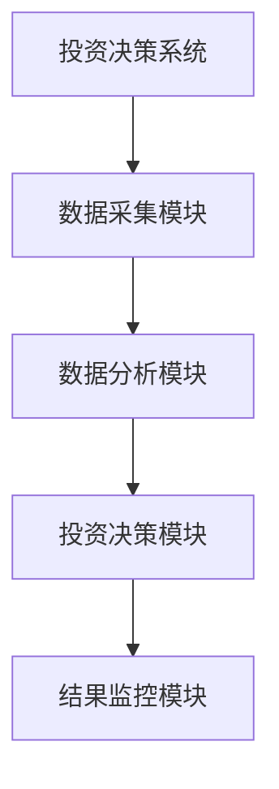
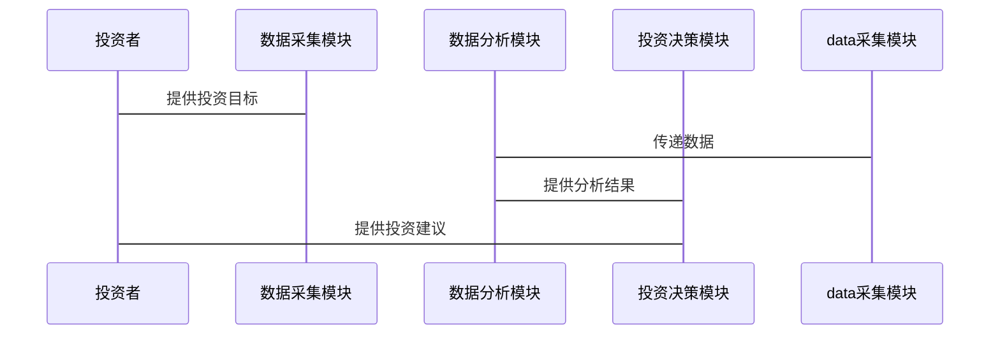

                 

<think>
好的，我现在要帮用户写一篇关于巴菲特和芒格的智能材料投资，以及未来制造业革命的技术博客。首先，我需要理解用户的需求。用户希望文章结构清晰，逻辑严谨，内容专业，涵盖智能材料、投资策略、数学模型、系统架构等多个方面。

首先，我应该从引言开始，介绍智能材料的重要性以及巴菲特和芒格的策略如何结合。接下来是背景介绍，详细解释智能材料的定义、特点和分类，然后讨论它们在制造业中的应用和革命性影响。

接下来，核心概念部分需要深入探讨巴菲特和芒格的投资哲学，包括他们的价值投资理念和多元思维模型。这部分要结合实际案例，让读者理解他们的策略是如何运作的。

然后是算法原理，这部分可能需要解释如何通过数据分析来评估智能材料公司的潜力。我会使用Mermaid图来展示系统架构和流程，同时提供Python代码来说明算法实现。数学模型部分会展示相关的公式，比如现金流折现和风险评估模型。

系统分析与架构设计部分需要讨论投资决策系统的功能和架构，可能使用类图和序列图来展示系统的结构和交互。项目实战部分会指导读者如何安装环境、实现代码，并分析实际案例。最后，我会总结最佳实践和未来展望。

在写作过程中，我需要确保每个部分都有足够的细节，同时保持语言的清晰和易懂。可能会遇到如何将巴菲特和芒格的投资哲学与技术分析结合起来的挑战，这需要在核心概念和算法部分详细阐述。

总体来说，我需要按照用户的要求，系统地分析每个部分，确保内容详实且结构合理，帮助读者全面理解巴菲特和芒格的智能材料投资策略及其在制造业中的应用。
</think>

# 巴菲特-芒格的智能材料投资：未来制造业的革命

---

## 关键词：  
巴菲特，芒格，智能材料，投资策略，制造业革命，价值投资，多元思维模型

---

## 摘要：  
本文深入探讨了巴菲特和芒格的投资哲学及其在智能材料领域的应用，分析了智能材料对制造业的革命性影响，并结合数学模型和系统架构，展示了如何通过智能材料投资实现未来制造业的转型。文章从背景介绍、核心概念、算法原理、数学模型、系统分析、项目实战到最佳实践，全面剖析了巴菲特和芒格的投资策略，为读者提供了清晰的理论框架和实践指南。

---

# 第一部分: 背景介绍与核心概念

## 第1章: 智能材料与投资的背景介绍

### 1.1 智能材料的定义与特点

#### 1.1.1 智能材料的定义  
智能材料是一种能够感知环境变化、做出响应并执行特定功能的材料。它通常具备形状记忆、导电性、响应性、自愈合等特性，能够在外部刺激（如温度、压力、电磁场）下改变其物理或化学性质。

#### 1.1.2 智能材料的核心特点  
- **可编程性**：可以通过外部信号调整材料的性能参数。  
- **响应性**：材料能够实时感知并响应环境变化。  
- **自适应性**：材料能够在特定条件下自动调整形状或性能。  
- **可持续性**：许多智能材料具备环保特性，能够在循环使用中减少资源消耗。

#### 1.1.3 智能材料的分类与应用场景  
智能材料主要分为以下几类：  
1. **形状记忆材料**：用于航空航天、生物医学等领域。  
2. **压电材料**：用于传感器、能量收集装置。  
3. **导电高分子材料**：用于柔性电子设备、智能 textiles。  
4. **自愈合材料**：用于耐久性要求高的结构材料。  

应用场景包括：智能建筑、可穿戴设备、绿色能源、航空航天等。

### 1.2 巴菲特与芒格的投资哲学

#### 1.2.1 巴菲特的价值投资理念  
巴菲特的价值投资理念强调以低于内在价值的价格购买优质资产。他认为，投资的本质是购买企业的一部分，而不是股票的买卖。他倾向于投资那些具有持续竞争优势、稳定现金流和良好管理的公司。

#### 1.2.2 芒格的多元思维模型  
芒格提倡通过跨学科的思维方式来分析问题，将物理学、心理学、经济学等学科的原理结合起来，形成一个完整的知识框架。他强调投资决策需要考虑多维度的因素，而不仅仅是财务数据。

#### 1.2.3 巴菲特与芒格投资策略的结合  
巴菲特和芒格的策略结合了长期价值投资和多元思维模型。巴菲特负责筛选具有长期竞争优势的企业，而芒格则通过多维度的分析来评估企业的内在价值和潜在风险。

---

## 第2章: 智能材料在制造业中的革命性影响

### 2.1 智能材料对制造业的推动作用

#### 2.1.1 提高生产效率  
智能材料可以通过实时监测和调整生产过程中的参数，减少资源浪费，提高生产效率。例如，智能传感器可以实时监控设备状态，提前预测维护需求，避免非计划停机。

#### 2.1.2 降低生产成本  
通过智能材料的应用，企业可以实现资源的优化配置，减少能源消耗和材料浪费。例如，智能包装材料可以实时监测货物状态，减少运输过程中的损耗。

#### 2.1.3 优化产品设计  
智能材料的可编程性和响应性为产品设计提供了更大的灵活性。例如，智能材料可以用于制造自适应性强的机器人或可穿戴设备，满足多样化的客户需求。

### 2.2 智能材料的未来发展趋势

#### 2.2.1 新材料技术的发展  
随着纳米技术、3D打印技术和人工智能的进步，智能材料的研发将朝着更高效、更环保的方向发展。例如，自修复材料可以在受损后自动恢复性能，减少维护成本。

#### 2.2.2 智能材料在绿色制造中的应用  
绿色制造强调节能减排和可持续发展。智能材料的应用可以帮助企业实现绿色生产，例如，智能温控材料可以优化能源消耗，减少碳排放。

#### 2.2.3 智能材料对全球产业链的重构  
智能材料的广泛应用将推动全球产业链的重构。例如，智能材料的生产和应用可能需要跨国合作，形成新的供应链和商业模式。

---

# 第二部分: 巴菲特与芒格投资策略的核心概念

## 第3章: 巴菲特与芒格投资策略的核心要素

### 3.1 巴菲特的长期价值投资

#### 3.1.1 企业基本面分析  
巴菲特强调对企业基本面的深入研究，包括企业的收入、利润、现金流、资产负债表等财务指标。他倾向于投资那些具有稳定现金流和良好财务状况的企业。

#### 3.1.2 财务指标评估  
巴菲特常用以下财务指标来评估企业的价值：  
- 净利润（Net Income）  
- 每股收益（Earnings Per Share, EPS）  
- 市盈率（Price-Earnings Ratio, P/E）  
- 现金流（Cash Flow）  

#### 3.1.3 企业竞争优势分析  
巴菲特认为，企业的竞争优势是其长期价值的核心。他倾向于投资那些具有强大护城河（如品牌优势、技术壁垒、成本优势）的企业。

### 3.2 芒格的多元思维模型

#### 3.2.1 多学科交叉思维  
芒格通过物理学、心理学、经济学等多学科的交叉思维来分析问题。他认为，投资决策需要考虑多个维度的因素，而不仅仅是财务数据。

#### 3.2.2 宏观经济分析  
芒格强调宏观经济环境对企业价值的影响。他倾向于投资那些能够在经济周期波动中保持稳定增长的企业。

#### 3.2.3 行业趋势判断  
芒格通过对行业趋势的分析，判断企业的长期发展潜力。他倾向于投资那些处于上升行业且具备竞争优势的企业。

## 第4章: 巴菲特与芒格投资策略的数学模型

### 4.1 巴菲特投资策略的数学模型

#### 4.1.1 企业价值评估公式  
巴菲特常用现金流折现法来评估企业的内在价值。公式如下：  
$$企业价值 = \sum_{t=1}^{n} \frac{\text{自由现金流}_t}{(1 + r)^t}$$  
其中，$r$ 是折现率，$\text{自由现金流}_t$ 是第$t$年的自由现金流。

#### 4.1.2 股东权益评估公式  
巴菲特认为，股东权益可以通过以下公式进行评估：  
$$股东权益 = \text{净利润} - \text{股东分红}$$

### 4.2 芒格多元思维模型的数学表达

#### 4.2.1 多元变量分析  
芒格的多元思维模型可以用以下公式表示：  
$$Y = f(X_1, X_2, X_3, \ldots, X_n)$$  
其中，$Y$ 是投资决策的结果，$X_1, X_2, \ldots, X_n$ 是影响决策的多个变量，包括宏观经济、行业趋势、企业基本面等。

#### 4.2.2 风险评估模型  
芒格的风险评估模型可以用以下公式表示：  
$$风险系数 = \text{标准差}(收益)$$  
标准差反映了投资收益的波动性，标准差越大，风险越高。

## 第5章: 巴菲特与芒格投资策略的系统架构设计

### 5.1 投资决策系统的功能设计

#### 5.1.1 数据采集模块  
数据采集模块负责收集企业的财务数据、行业趋势、宏观经济数据等。

#### 5.1.2 数据分析模块  
数据分析模块利用数学模型和算法对收集到的数据进行分析，评估企业的内在价值和潜在风险。

#### 5.1.3 投资决策模块  
投资决策模块根据分析结果生成投资建议，指导投资者进行决策。

### 5.2 投资决策系统的架构设计

#### 5.2.1 系统功能设计  
系统功能包括数据采集、数据分析、投资决策和结果监控。

#### 5.2.2 系统架构图  
以下是一个简单的系统架构图：  


#### 5.2.3 系统交互设计  
以下是一个系统交互流程图：  


---

# 第三部分: 项目实战与最佳实践

## 第6章: 项目实战

### 6.1 环境安装

#### 6.1.1 安装Python环境  
建议使用Anaconda作为Python环境管理工具。

#### 6.1.2 安装必要的库  
安装以下库：  
- `numpy`  
- `pandas`  
- `scipy`  
- `matplotlib`  
- `mermaid`  

### 6.2 系统核心实现源代码

#### 6.2.1 数据分析模块  
以下是一个简单的现金流折现模型的代码示例：  
```python
import numpy as np
import pandas as pd

def calculate_intrinsic_value(free_cash_flows, discount_rate):
    present_value = 0
    for t in range(len(free_cash_flows)):
        present_value += free_cash_flows[t] / (1 + discount_rate)**t
    return present_value

# 示例数据
free_cash_flows = [100, 150, 200, 250]
discount_rate = 0.1

intrinsic_value = calculate_intrinsic_value(free_cash_flows, discount_rate)
print(f"企业价值：{intrinsic_value}")
```

#### 6.2.2 投资决策模块  
以下是一个基于多元思维模型的投资决策系统代码示例：  
```python
import pandas as pd

def multi_dimensional_analysis(data_frame):
    # 计算市盈率
    pe_ratio = data_frame['净利润'] / data_frame['股价']
    # 计算市净率
    pb_ratio = data_frame['股价'] / data_frame['每股净资产']
    # 综合评分
    score = pe_ratio.rank() + pb_ratio.rank()
    return score

# 示例数据
data = {
    '股价': [50, 60, 70, 80],
    '净利润': [10, 15, 20, 25],
    '每股净资产': [20, 25, 30, 35]
}
data_frame = pd.DataFrame(data)

score = multi_dimensional_analysis(data_frame)
print(f"综合评分：{score}")
```

### 6.3 案例分析与解读

#### 6.3.1 案例分析  
假设我们有一个智能材料企业的财务数据如下：  
- 净利润：$100万  
- 自由现金流：$50万  
- 折现率：10%  

根据现金流折现模型，企业的内在价值为：  
$$企业价值 = \frac{50}{1.1} + \frac{50}{1.1^2} + \frac{50}{1.1^3} \approx 132.36 \text{万元}$$  

#### 6.3.2 投资决策  
根据分析结果，如果企业的内在价值高于当前股价，则建议买入；反之，则建议卖出。

### 6.4 项目小结  
通过项目实战，我们可以看到，巴菲特和芒格的投资策略可以通过数学模型和系统架构实现。投资者可以根据企业的财务数据和行业趋势，结合多元思维模型，做出更加科学的投资决策。

---

## 第7章: 最佳实践与未来展望

### 7.1 最佳实践 tips

#### 7.1.1 定期更新数据  
投资者需要定期更新企业的财务数据和行业趋势，以确保分析结果的准确性。

#### 7.1.2 结合宏观环境  
在进行投资决策时，需要结合宏观经济环境和行业趋势，避免只关注企业的财务数据。

#### 7.1.3 风险管理  
投资者需要合理控制投资风险，避免过度集中投资，分散投资风险。

### 7.2 未来展望

#### 7.2.1 智能材料的进一步发展  
随着技术的进步，智能材料将朝着更高效、更环保的方向发展，为制造业带来更多的革命性变化。

#### 7.2.2 投资策略的优化  
巴菲特和芒格的投资策略将随着技术的进步和市场的变化不断优化，投资者需要不断学习和适应。

---

# 结论

通过本文的分析，我们可以看到，巴菲特和芒格的投资策略在智能材料领域具有重要的指导意义。智能材料的广泛应用将推动制造业的革命，为投资者带来新的机遇。投资者需要结合企业的财务数据、行业趋势和宏观经济环境，做出科学的投资决策。未来，随着技术的进步和市场的变化，智能材料投资将变得更加重要，投资者需要不断学习和适应。

---

## 作者：AI天才研究院/AI Genius Institute & 禅与计算机程序设计艺术 /Zen And The Art of Computer Programming

