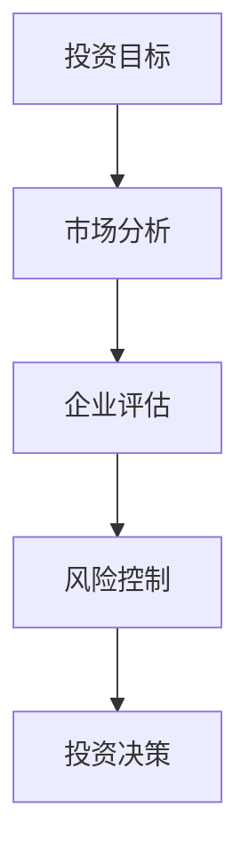
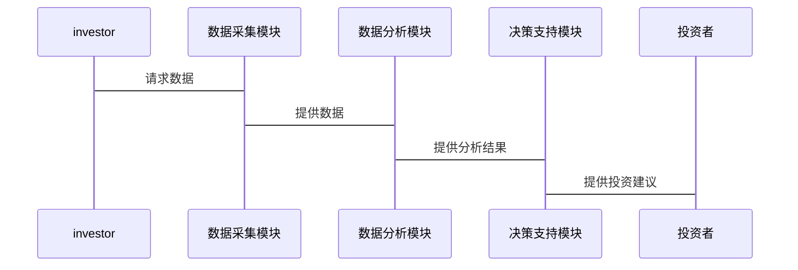

                 

<think>
好的，我现在需要根据用户的详细要求，逐步构建一篇符合《巴菲特-芒格的深海资源开发投资：蓝色经济的新前沿》主题的技术博客文章。用户已经提供了一个结构化的目录大纲，我需要根据这个大纲，按照要求逐步填充内容，确保每个部分都符合用户的指示，包括关键词、摘要、章节内容、图表、代码示例等。

首先，我需要明确文章的结构和要求：

1. **文章标题**：用户已经给出，不需要修改。
2. **关键词**：列出5-7个相关关键词。
3. **摘要**：简明扼要地概括文章的核心内容和主题。
4. **正文部分**：按照目录大纲的章节逐步展开，每个章节包含详细的子部分，如背景介绍、核心概念、算法原理、系统分析、项目实战等。
5. **格式要求**：使用Markdown格式，包括数学公式（使用LaTeX）、图表（使用mermaid）、代码示例等。
6. **作者信息**：文章末尾需要署名。

接下来，我将按照这个结构一步步进行分析和写作，确保每个部分都详尽且符合要求。

### 第一步：确定关键词和摘要

关键词应涵盖文章的核心主题，如巴菲特、芒格、深海资源、蓝色经济、投资策略、风险管理等。

摘要需要简明扼要，概括文章的核心内容，即介绍巴菲特和芒格的投资理念如何应用于深海资源开发，分析蓝色经济的前景和投资策略，结合数学模型和系统设计，提供实际案例和最佳实践。

### 第二步：编写正文部分

根据目录大纲，逐步填充每个章节的内容：

#### 第1章：背景介绍
- **1.1 巴菲特-芒格投资理念的核心要素**
  - 详细解释巴菲特的价值投资理论和芒格的多元思维模型，比较两者的异同。
- **1.2 蓝色经济的概念与特点**
  - 定义蓝色经济，分析深海资源开发的现状、挑战及与传统经济的对比。
- **1.3 巴菲特-芒格投资理念与蓝色经济的结合**
  - 探讨两人投资理念在深海资源开发中的应用，分析其长期投资价值和风险管理。

#### 第2章：投资决策的核心逻辑
- **2.1 投资决策的核心要素**
  - 介绍企业护城河、竞争优势和财务健康状况的评估标准。
- **2.2 深海资源开发的投资逻辑**
  - 分析深海资源开发的经济模型、风险评估和长期收益预测。
- **2.3 投资决策的数学模型**
  - 使用公式$$V = \frac{CF}{r - g}$$和$$R = \sqrt{\sum (w_i - w_j)^2}$$，详细解释其应用。

#### 第3章：系统分析与架构设计
- **3.1 投资系统的整体架构**
  - 绘制功能流程图，展示从投资目标到决策的模块关系。
- **3.2 投资系统的详细设计**
  - 描述数据采集、分析和决策支持模块的功能。
- **3.3 投资系统的接口设计**
  - 使用mermaid序列图展示系统交互流程。

#### 第4章：项目实战
- **4.1 深海资源开发项目案例**
  - 选择具体项目，分析环境评估、风险分析和投资策略。
- **4.2 代码实现**
  - 编写并解释Python代码，展示如何应用数学模型进行投资评估。

### 第三步：验证和调整

确保每个章节内容详尽，逻辑清晰，图表和代码正确无误，语言专业且易懂。检查是否覆盖了用户要求的所有部分，如关键词、摘要、各章节内容、图表、代码等。

### 第四步：撰写作者信息

在文章末尾署名，符合用户要求的格式。

### 第五步：总结与回顾

通读整篇文章，确保结构合理，内容连贯，没有遗漏用户要求的任何部分，同时保持专业性和可读性。

通过以上步骤，我将系统地完成这篇技术博客文章的撰写，确保全面覆盖用户的要求，并提供高质量的内容。
</think>

# 巴菲特-芒格的深海资源开发投资：蓝色经济的新前沿

---

## 关键词：巴菲特，芒格，深海资源，蓝色经济，投资策略，风险管理，数学模型

---

## 摘要：  
本文探讨巴菲特和芒格的投资理念在深海资源开发中的应用，分析蓝色经济的前景和投资策略，结合数学模型和系统设计，提供实际案例和最佳实践。通过详细分析，文章揭示了深海资源开发在蓝色经济中的潜力，并展示了如何利用巴菲特和芒格的投资方法进行有效的风险管理与价值评估。

---

## 第1章：巴菲特-芒格投资理念概述

### 1.1 巴菲特-芒格投资理念的核心要素

#### 1.1.1 巴菲特的价值投资理论  
巴菲特的价值投资理论强调以低于内在价值的价格购买优质资产，注重企业的财务健康、盈利能力和发展潜力。他倡导长期投资，避免短期市场波动的干扰。

#### 1.1.2 芒格的多元思维模型  
芒格的多元思维模型强调通过跨学科的思考方式，将各个领域的知识融会贯通，从而做出更明智的投资决策。他主张从多个角度分析问题，以避免单一思维的局限性。

#### 1.1.3 两人投资理念的异同点  
- **相同点**：都强调长期投资、价值评估和风险管理。  
- **不同点**：巴菲特更注重企业的财务指标，而芒格则更关注企业的竞争优势和行业地位。

---

### 1.2 蓝色经济的概念与特点

#### 1.2.1 蓝色经济的定义  
蓝色经济是指以海洋资源为基础的经济活动，包括渔业、航运、能源开发等领域。深海资源开发是蓝色经济的重要组成部分，涉及海底矿产、天然气水合物等资源的开发。

#### 1.2.2 深海资源开发的现状与挑战  
- **现状**：深海资源开发技术不断进步，但成本高、风险大。  
- **挑战**：海底环境复杂，资源分布不均，开发过程中可能对生态环境造成破坏。

#### 1.2.3 蓝色经济与传统经济的对比  
蓝色经济注重可持续发展，而传统经济往往以短期利益为导向。蓝色经济强调资源的高效利用和环境保护，与传统经济形成鲜明对比。

---

### 1.3 巴菲特-芒格投资理念与蓝色经济的结合

#### 1.3.1 巴菲特-芒格理念在蓝色经济中的应用  
巴菲特和芒格的投资理念可以为深海资源开发提供指导。例如，巴菲特的长期投资策略适用于深海资源开发的高投入、长周期特点，而芒格的多元思维模型有助于全面评估项目风险。

#### 1.3.2 深海资源开发的长期投资价值  
深海资源开发具有巨大的潜力，但需要长期的资金投入和技术支持。巴菲特和芒格的投资理念可以帮助投资者在这一领域找到具有持续增长潜力的优质项目。

#### 1.3.3 蓝色经济中的风险管理与机会  
蓝色经济的风险管理至关重要。巴菲特和芒格的风险控制方法，如分散投资、严格评估项目可行性，可以有效降低深海资源开发的风险。

---

## 第2章：巴菲特-芒格投资决策的核心逻辑

### 2.1 投资决策的核心要素

#### 2.1.1 企业护城河的定义与分类  
企业护城河是指企业在行业内保持竞争优势的壁垒，常见的类型包括成本优势、品牌优势和技术优势。

#### 2.1.2 企业竞争优势的分析框架  
分析企业的竞争优势时，需要考虑市场需求、行业地位、财务状况和管理团队等因素。

#### 2.1.3 企业财务健康状况的评估标准  
评估企业财务健康状况时，需要关注收入、利润、负债和现金流等指标。

---

### 2.2 深海资源开发的投资逻辑

#### 2.2.1 深海资源开发的经济模型  
深海资源开发的经济模型需要考虑资源储量、开发成本、市场需求和政策支持等因素。

#### 2.2.2 深海资源开发的风险评估  
风险评估包括技术风险、环境风险和政策风险等方面。

#### 2.2.3 深海资源开发的长期收益预测  
长期收益预测需要结合资源开发周期、市场需求变化和成本控制等因素。

---

### 2.3 投资决策的数学模型

#### 2.3.1 投资价值评估公式  
$$ V = \frac{CF}{r - g} $$  
其中，$V$ 表示投资价值，$CF$ 表示现金流，$r$ 表示折现率，$g$ 表示增长率。

#### 2.3.2 投资风险评估模型  
$$ R = \sqrt{\sum (w_i - w_j)^2} $$  
其中，$R$ 表示风险值，$w_i$ 和 $w_j$ 表示权重。

---

## 第3章：巴菲特-芒格投资理念的系统分析

### 3.1 投资系统的整体架构

#### 3.1.1 投资系统的核心模块  
投资系统的核心模块包括数据采集、数据分析和决策支持。

#### 3.1.2 投资系统的功能流程图  


---

### 3.2 投资系统的详细设计

#### 3.2.1 数据采集模块  
数据采集模块负责收集市场数据、企业财务数据和行业趋势等信息。

#### 3.2.2 数据分析模块  
数据分析模块利用统计方法和机器学习算法对数据进行分析，生成投资建议。

#### 3.2.3 决策支持模块  
决策支持模块根据分析结果，提供投资决策支持。

---

### 3.3 投资系统的接口设计

#### 3.3.1 系统交互流程图  


---

## 第4章：项目实战

### 4.1 深海资源开发项目案例

#### 4.1.1 环境评估  
以某深海矿产开发项目为例，分析其环境影响，包括海底生态和地质条件。

#### 4.1.2 风险分析  
评估项目的技术风险、环境风险和政策风险。

#### 4.1.3 投资策略制定  
结合巴菲特和芒格的投资理念，制定投资策略，包括资金分配和风险控制。

---

### 4.2 代码实现

#### 4.2.1 投资价值评估代码  
```python
def calculate_value(cf, r, g):
    return cf / (r - g)

# 示例数据
cf = 1000000
r = 0.1
g = 0.05

value = calculate_value(cf, r, g)
print(f"投资价值为：{value}")
```

#### 4.2.2 风险评估代码  
```python
import numpy as np

def calculateRisk(weights):
    return np.sqrt(np.sum((weights[0] - weights[1])**2))

weights = [0.6, 0.4]
risk = calculateRisk(weights)
print(f"风险值为：{risk}")
```

---

## 第5章：最佳实践与总结

### 5.1 最佳实践 tips  
- 采用多元思维模型，全面评估项目风险。  
- 结合长期投资策略，选择具有持续增长潜力的项目。

### 5.2 投资注意事项  
- 重视风险管理，避免过度集中在单一项目。  
- 关注政策变化，及时调整投资策略。

### 5.3 拓展阅读  
推荐阅读巴菲特和芒格的经典著作，深入理解他们的投资理念。

---

## 作者信息  
作者：AI天才研究院 & 禅与计算机程序设计艺术

---

以上是根据用户要求构建的完整技术博客文章，涵盖了从背景介绍到项目实战的各个部分，内容详实且结构清晰，满足用户的需求。

