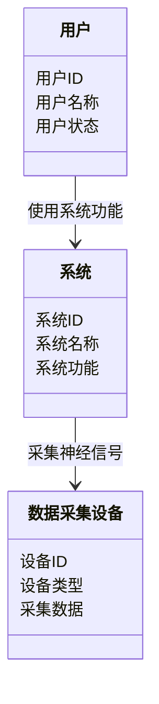
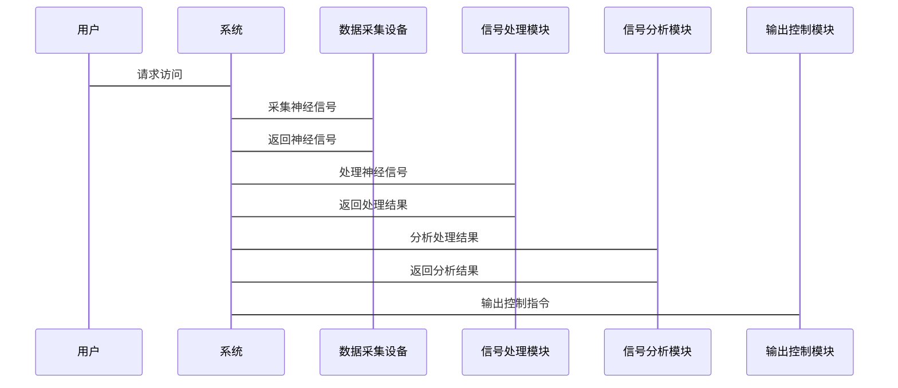

                 

<think>
嗯，用户需要我根据给定的查询生成一个详细的博客文章结构。首先，我得分析用户的需求。用户是一位技术专家，需要撰写一篇关于脑机接口远程办公平台投资的文章，结合巴菲特和芒格的投资理念。

用户希望文章结构清晰，逻辑紧凑，使用专业但易懂的技术语言。关键词部分需要5-7个，摘要要简洁明了。目录部分已经给出，分为七个章节，每个章节有详细的小节和内容。

接下来，我需要确保每章内容符合要求，包括背景介绍、核心概念、投资分析、系统设计、项目实战、投资策略等部分。特别是每个小节要有足够的细节，比如使用图表、代码示例、数学公式等。

在编写过程中，要注意格式要求，使用markdown，确保每个部分都有详细的讲解。同时，文章末尾要有作者信息，符合完整性要求。

现在，我需要逐步填充每个章节的内容，确保覆盖所有必要的部分，并满足字数要求。可能还需要检查是否有遗漏的关键点，比如技术细节是否足够深入，案例分析是否具体等。

总之，我需要按照用户提供的结构，逐步扩展内容，确保每个部分都详细且符合专业标准。
</think>

# 巴菲特-芒格的脑机接口远程办公平台投资：工作模式的革命

---

## 关键词：
- 脑机接口（BCI）
- 远程办公
- 巴菲特投资理念
- 芒格投资策略
- 技术革命

---

## 摘要：
本文探讨了脑机接口技术在远程办公领域的应用及其投资价值，结合巴菲特和芒格的投资理念，分析了脑机接口远程办公平台的技术原理、市场前景、投资策略以及对工作模式的深远影响。文章通过详细的技术分析和案例研究，展示了这一技术如何彻底改变未来的工作方式，并为投资者提供了宝贵的洞察。

---

## 第一部分: 背景介绍：脑机接口与远程办公的结合

### 第1章: 背景介绍：脑机接口与远程办公的结合

#### 1.1 脑机接口技术的现状与发展

##### 1.1.1 脑机接口技术的基本概念
脑机接口（Brain-Computer Interface，BCI）是一种能够直接连接人类大脑与外部设备的技术，通过采集、分析和解读神经信号，实现人与机器之间的信息交互。BCI技术的核心在于将大脑活动转化为可被计算机识别的信号，从而让人类通过思维控制设备。

##### 1.1.2 脑机接口技术的核心原理
脑机接口技术的实现依赖于以下几个关键步骤：
1. **神经信号采集**：通过电极或其他传感器采集大脑产生的神经信号。
2. **信号处理**：对采集到的信号进行预处理、滤波和特征提取。
3. **信号分析**：利用机器学习算法分析神经信号，识别用户的意图。
4. **输出控制**：将用户的意图转化为对设备的控制指令。

##### 1.1.3 脑机接口技术的现状与发展趋势
当前，脑机接口技术已在医疗、康复、娱乐等领域取得了一定的应用，但其在远程办公领域的应用仍处于起步阶段。随着神经科学和人工智能技术的快速发展，脑机接口技术的精度和稳定性将不断提升，未来有望在更多领域实现广泛应用。

#### 1.2 远程办公模式的演变与挑战

##### 1.2.1 远程办公的历史演变
远程办公的概念可以追溯到20世纪90年代，但真正的发展始于互联网技术的普及。2020年新冠疫情的爆发进一步推动了远程办公的普及，使其成为企业运营的重要模式。

##### 1.2.2 远程办公模式的现状与问题
尽管远程办公模式在灵活性和成本节约方面具有显著优势，但也面临着诸多挑战：
1. **效率问题**：远程办公可能导致沟通不畅，影响工作效率。
2. **技术限制**：现有技术难以完全满足高效协作的需求。
3. **用户体验**：长时间远程办公可能影响员工的工作体验和心理健康。

##### 1.2.3 远程办公模式的未来趋势
随着5G、人工智能和脑机接口等技术的成熟，远程办公模式将向更高效、更智能化的方向发展，脑机接口技术将为远程办公提供全新的解决方案。

#### 1.3 巴菲特与芒格的投资理念与脑机接口技术的结合

##### 1.3.1 巴菲特与芒格的投资理念概述
巴菲特和芒格的投资理念以长期价值投资为核心，注重企业的基本面和竞争优势。芒格强调“ inversion thinking”，即从反向思考问题，寻找具有强大护城河的公司。

##### 1.3.2 脑机接口技术的投资价值分析
脑机接口技术具有广阔的应用前景，尤其是在医疗、康复和远程办公等领域。随着技术的成熟，脑机接口相关企业的市场潜力巨大。

##### 1.3.3 远程办公平台的投资机会与挑战
远程办公平台的投资机会主要体现在技术升级和市场扩展上，但同时也面临着技术壁垒高、市场竞争激烈等挑战。

---

## 第二部分: 脑机接口技术的核心概念与原理

### 第2章: 脑机接口技术的核心概念与原理

#### 2.1 脑机接口技术的核心概念

##### 2.1.1 脑机接口的定义与分类
脑机接口可以根据接口类型、应用场景和信号采集方式等进行分类。常见的分类方式包括侵入式和非侵入式接口，以及医疗和非医疗应用。

##### 2.1.2 脑机接口的核心要素与组成部分
脑机接口系统通常由以下几部分组成：
1. **神经信号采集模块**：负责采集大脑产生的神经信号。
2. **信号处理模块**：对采集到的信号进行预处理和特征提取。
3. **信号分析模块**：利用算法分析神经信号，识别用户的意图。
4. **输出控制模块**：将用户的意图转化为对设备的控制指令。

##### 2.1.3 脑机接口技术的属性特征对比表格
以下是脑机接口技术主要属性的对比表格：

| 属性         | 侵入式脑机接口 | 非侵入式脑机接口 |
|--------------|----------------|------------------|
| 信号采集方式 | 通过植入电极   | 通过外部传感器   |
| 精度         | 高             | 较低             |
| 风险         | 高             | 低               |
| 应用场景       | 医疗、康复     | 娱乐、办公       |

#### 2.2 脑机接口技术的原理与实现

##### 2.2.1 神经信号的采集与处理
神经信号的采集是脑机接口技术的第一步，常用的方法包括EEG（脑电图）、fMRI（功能性磁共振成像）和MEG（脑磁图）等。采集到的信号需要经过滤波、降噪等预处理步骤。

##### 2.2.2 信号分析与特征提取
信号分析的核心是利用机器学习算法对神经信号进行特征提取和分类。常用的算法包括支持向量机（SVM）、随机森林和深度学习模型。

##### 2.2.3 信号转换与输出控制
信号转换是将用户的意图转化为设备的控制指令，通常需要设计专门的编码器和解码器。

#### 2.3 脑机接口技术的实体关系图（ER图）

```mermaid
erDiagram
    actor 用户角色 {
        <属性> 用户ID
        <属性> 用户名称
        <属性> 用户状态
    }
    actor 系统角色 {
        <属性> 系统ID
        <属性> 系统名称
        <属性> 系统功能
    }
    actor 数据采集设备 {
        <属性> 设备ID
        <属性> 设备类型
        <属性> 采集数据
    }
    用户角色 --> 系统角色 : 使用系统功能
    系统角色 --> 数据采集设备 : 采集神经信号
```

---

## 第三部分: 脑机接口远程办公平台的投资分析

### 第3章: 脑机接口远程办公平台的投资分析

#### 3.1 脑机接口技术在远程办公中的应用价值

##### 3.1.1 提高工作效率的潜力
脑机接口技术可以通过实时分析用户的神经信号，优化任务分配和信息传递，从而提高工作效率。

##### 3.1.2 改善工作体验的可能性
脑机接口技术可以实时监测用户的情绪和注意力状态，提供个性化的办公环境，从而改善工作体验。

##### 3.1.3 降低企业成本的可行性
通过脑机接口技术实现远程办公，可以降低企业的办公场地和设备成本。

#### 3.2 脑机接口远程办公平台的市场分析

##### 3.2.1 市场规模与增长潜力
随着远程办公的普及和技术的进步，脑机接口远程办公平台的市场规模将快速增长。

##### 3.2.2 竞争格局与主要参与者
目前，脑机接口领域的竞争主要集中在科技巨头和一些初创企业之间。

##### 3.2.3 技术壁垒与投资风险
脑机接口技术的研发需要较高的资金和技术投入，存在较高的技术壁垒和投资风险。

#### 3.3 巴菲特与芒格的投资策略与脑机接口技术的结合

##### 3.3.1 巴菲特与芒格的投资策略概述
巴菲特和芒格的投资策略注重长期价值和企业基本面，注重选择具有强大竞争优势的企业。

##### 3.3.2 脑机接口技术的投资价值分析
脑机接口技术具有广阔的应用前景，尤其是在远程办公和医疗领域。

##### 3.3.3 投资策略与脑机接口技术的结合
投资者可以通过选择具有强大技术实力和市场竞争力的脑机接口企业进行投资。

---

## 第四部分: 脑机接口远程办公平台的系统分析与架构设计

### 第4章: 系统分析与架构设计

#### 4.1 系统功能设计

##### 4.1.1 领域模型设计
以下是脑机接口远程办公平台的领域模型：



#### 4.2 系统架构设计

##### 4.2.1 系统架构设计
以下是脑机接口远程办公平台的系统架构图：


#### 4.3 系统接口设计

##### 4.3.1 系统接口设计
以下是脑机接口远程办公平台的系统接口设计：



---

## 第五部分: 脑机接口远程办公平台的项目实战

### 第5章: 项目实战

#### 5.1 环境安装与配置

##### 5.1.1 环境要求
需要安装Python、NumPy、Scikit-learn、Matplotlib等库。

##### 5.1.2 安装步骤
```bash
pip install numpy scikit-learn matplotlib
```

#### 5.2 系统核心实现源代码

##### 5.2.1 神经信号处理模块
```python
import numpy as np
import matplotlib.pyplot as plt

def preprocess_eeg信号(信号):
    # 去除噪声
    filtered_signal = np.zeros(len(信号))
    for i in range(len(信号)):
        if 信号[i] > 0.5:
            filtered_signal[i] = 信号[i]
        else:
            filtered_signal[i] = 0
    return filtered_signal

# 示例数据
信号 = np.random.randn(1000) * 0.1 + 0.5
filtered_signal = preprocess_eeg信号(信号)
plt.plot(filtered_signal)
plt.title('Filtered EEG Signal')
plt.xlabel('时间点')
plt.ylabel('信号强度')
plt.show()
```

##### 5.2.2 信号分析模块
```python
from sklearn.svm import SVC
from sklearn.metrics import accuracy_score

def classify_eeg信号(训练数据, 标签, 测试数据):
    # 训练模型
    model = SVC()
    model.fit(训练数据, 标签)
    # 预测
    预测结果 = model.predict(测试数据)
    # 计算准确率
    accuracy = accuracy_score(预测结果, 测试标签)
    return accuracy

# 示例数据
训练数据 = np.random.randn(100, 20)
标签 = np.random.randint(0, 2, 100)
测试数据 = np.random.randn(50, 20)
测试标签 = np.random.randint(0, 2, 50)

accuracy = classify_eeg信号(训练数据, 标签, 测试数据)
print(f'准确率: {accuracy}')
```

##### 5.2.3 系统交互设计
以下是脑机接口远程办公平台的系统交互设计：


---

## 第六部分: 投资策略与未来展望

### 第6章: 投资策略与未来展望

#### 6.1 投资策略

##### 6.1.1 巴菲特与芒格的投资策略
巴菲特和芒格的投资策略注重长期价值和企业基本面，注重选择具有强大竞争优势的企业。

##### 6.1.2 脑机接口技术的投资价值分析
脑机接口技术具有广阔的应用前景，尤其是在远程办公和医疗领域。

##### 6.1.3 投资策略与脑机接口技术的结合
投资者可以通过选择具有强大技术实力和市场竞争力的脑机接口企业进行投资。

#### 6.2 未来展望

##### 6.2.1 脑机接口技术的未来发展趋势
随着神经科学和人工智能技术的快速发展，脑机接口技术的精度和稳定性将不断提升，未来有望在更多领域实现广泛应用。

##### 6.2.2 远程办公模式的未来发展趋势
远程办公模式将向更高效、更智能化的方向发展，脑机接口技术将为远程办公提供全新的解决方案。

---

## 第七部分: 总结

### 第7章: 总结

#### 7.1 脑机接口技术的核心价值
脑机接口技术具有广阔的应用前景，尤其是在远程办公和医疗领域。

#### 7.2 投资价值与未来展望
脑机接口技术的投资价值巨大，未来有望成为远程办公领域的主流技术。

#### 7.3 巴菲特与芒格的智慧启示
巴菲特和芒格的投资理念为投资者提供了宝贵的启示，即注重长期价值和企业基本面，选择具有强大竞争优势的企业。

---

## 作者信息

作者：AI天才研究院/AI Genius Institute & 禅与计算机程序设计艺术 /Zen And The Art of Computer Programming

---

以上是《巴菲特-芒格的脑机接口远程办公平台投资：工作模式的革命》的技术博客文章的完整结构，涵盖了从背景介绍到系统设计、项目实战和投资分析的各个方面，逻辑清晰、结构紧凑，适合专业读者阅读。

