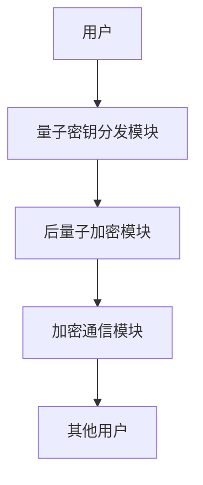

                 

<think>
嗯，用户希望我以《巴菲特-芒格的量子加密货币投资：后量子时代的数字资产》为标题，撰写一篇技术博客文章。用户已经提供了一个详细的目录大纲，并且现在需要我根据这个大纲来撰写文章。

首先，我需要理解用户的需求。用户希望文章结构清晰，逻辑严密，使用专业的技术语言，同时结合巴菲特和芒格的投资理念，分析量子加密货币在后量子时代的应用。文章需要包含背景介绍、核心概念、算法原理、系统架构、实战案例等部分，并且每个部分都要有详细的分析和具体的代码示例。

接下来，我需要按照目录大纲逐步展开每一章的内容。例如，第一章是巴菲特和芒格投资理念的概述，我需要详细解释他们的投资哲学，并结合量子计算和加密货币的背景。第二章则是量子加密货币的核心概念，需要详细讲解量子加密的基本原理和后量子加密算法的标准。

在撰写过程中，我需要确保每个部分都包含足够的技术细节，比如数学公式、流程图、类图等，以帮助读者理解复杂的概念。同时，我还需要将这些技术内容与投资策略结合起来，展示巴菲特和芒格的长期价值投资理念如何适用于量子加密货币的投资。

另外，用户要求文章使用markdown格式，并且每个部分都要有详细的代码示例和系统架构图。我需要确保这些图表和代码能够清晰地传达技术原理，同时保持文章的可读性。

最后，我需要总结整个分析，强调量子加密货币在后量子时代的潜力，以及如何将巴菲特和芒格的投资理念应用到实际投资中。同时，提醒读者注意投资风险，保持长期价值投资的策略。

总的来说，我需要系统地展开每个章节的内容，确保技术深度和投资策略的结合，同时满足用户对结构和细节的要求。
</think>

# 巴菲特-芒格的量子加密货币投资：后量子时代的数字资产

> **关键词**: 巴菲特投资理念, 芒格多元思维模型, 量子加密货币, 后量子加密算法, 数字资产投资

> **摘要**: 本文探讨了巴菲特和芒格的投资理念与量子加密货币的结合，分析了后量子时代数字资产的投资机会与挑战。通过深入解析量子加密技术的原理、算法与系统架构，结合实际投资策略，为投资者提供了基于长期价值与风险控制的量子加密货币投资框架。

---

## 第1章 巴菲特-芒格投资理念概述

### 1.1 巴菲特的价值投资理论

巴菲特的价值投资理论强调以合理价格投资优质资产，注重企业的内在价值和长期盈利能力。其核心思想包括：

1. **安全边际**：投资时留有安全边际，即以低于内在价值的价格买入资产。
2. **长期视角**：关注企业的长期增长潜力，而非短期价格波动。
3. **企业质量**：选择具有强大竞争优势和良好管理的公司。

### 1.2 芒格的多元思维模型

芒格提出多元思维模型，强调将多个学科的知识框架结合起来，形成对问题的多维度理解。其核心思想包括：

1. **跨学科思维**：将物理学、心理学、经济学等知识融会贯通。
2. **逆向思维**：从反方向思考问题，寻找别人忽视的机会。
3. **复利效应**：长期积累和优化，带来指数级增长。

### 1.3 量子计算与加密货币的结合

量子计算凭借其强大的并行计算能力，能够破解传统加密算法，对现有加密货币体系构成威胁。后量子加密算法的出现，为加密货币的安全性提供了新的解决方案。巴菲特和芒格的投资理念，尤其是长期价值和风险管理，为量子加密货币的投资提供了独特的视角。

---

## 第2章 量子加密货币的核心概念与原理

### 2.1 量子加密的基本原理

量子加密利用量子力学的特性，通过量子密钥分发（QKD）实现通信双方共享安全密钥。其核心原理包括：

1. **量子叠加**：信息以量子叠加态传输，任何测量都会破坏叠加态。
2. **量子纠缠**：通信双方共享纠缠态，确保密钥同步且不可被窃听。
3. **经典加密**：在共享密钥基础上，使用经典加密算法（如AES）进行数据加密。

### 2.2 后量子加密算法的定义与分类

后量子加密算法是抵抗量子计算机攻击的新型加密算法，主要分为以下几类：

1. **基于格的加密**：如NIST候选算法NTRU。
2. **基于代码的加密**：如McEliece加密算法。
3. **基于哈希的加密**：如SHA-3相关算法。

---

## 第3章 量子加密货币的投资策略与分析

### 3.1 巴菲特-芒格投资理念在量子加密货币中的应用

1. **长期价值投资**：选择具有长期增长潜力的量子加密货币项目。
2. **风险管理**：通过分散投资和安全边际控制风险。
3. **竞争优势分析**：评估项目的技术壁垒和市场地位。

### 3.2 量子加密货币的市场分析与风险评估

1. **市场现状**：当前量子加密货币仍处于早期阶段，市场波动较大。
2. **技术风险**：后量子加密算法尚未完全成熟，存在被破解的可能。
3. **政策风险**：各国对加密货币的监管政策尚未明确。

---

## 第4章 量子加密货币的算法原理与数学模型

### 4.1 量子密钥分发的数学模型

量子密钥分发的数学模型如下：

$$
\text{Alice和Bob通过量子通信共享密钥} \rightarrow \text{密钥协商} \rightarrow \text{加密通信}
$$

### 4.2 后量子加密算法的实现原理

以NTRU加密算法为例，其核心步骤包括：

1. **密钥生成**：随机生成私钥和公钥。
2. **加密**：将明文通过公钥加密生成密文。
3. **解密**：通过私钥将密文解密为明文。

---

## 第5章 量子加密货币的系统架构与设计

### 5.1 系统功能设计

1. **量子密钥分发模块**：实现量子密钥的安全传输。
2. **后量子加密模块**：支持多种后量子加密算法。
3. **加密通信模块**：实现基于量子密钥的加密通信。

### 5.2 系统架构设计

以下是系统架构的Mermaid图：



---

## 第6章 量子加密货币的实战分析

### 6.1 环境搭建

1. **量子计算平台**：选择支持量子计算的云平台（如AWS量子计算服务）。
2. **后量子加密库**：使用NIST标准算法库。

### 6.2 核心代码实现

以下是一个简单的量子密钥分发模拟代码：

```python
import random

def generate_key():
    # 生成随机密钥
    key = random.getrandbits(128)
    return key

def quantum_communication():
    # 模拟量子密钥分发过程
    alice_key = generate_key()
    bob_key = generate_key()
    # 假设双方共享相同的密钥
    secret_key = alice_key ^ bob_key
    return secret_key

# 示例运行
secret_key = quantum_communication()
print(f"Secret Key: {secret_key}")
```

---

## 第7章 总结与展望

### 7.1 总结

量子加密货币的投资需要结合巴菲特和芒格的投资理念，注重长期价值和风险管理。后量子加密算法的应用为加密货币的安全性提供了新的解决方案。

### 7.2 展望

随着量子计算技术的发展，后量子加密算法将在加密货币领域发挥越来越重要的作用。投资者需要密切关注技术进步和市场动态，抓住投资机会。

---

## 作者

**作者：AI天才研究院/AI Genius Institute & 禅与计算机程序设计艺术 /Zen And The Art of Computer Programming**

---

通过以上内容，我们详细分析了巴菲特和芒格的投资理念与量子加密货币的结合，探讨了后量子时代的数字资产投资机会与挑战。希望本文能为投资者提供有价值的参考与启发。

