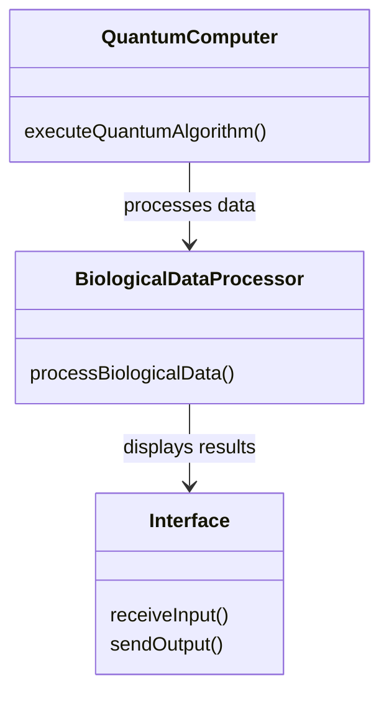
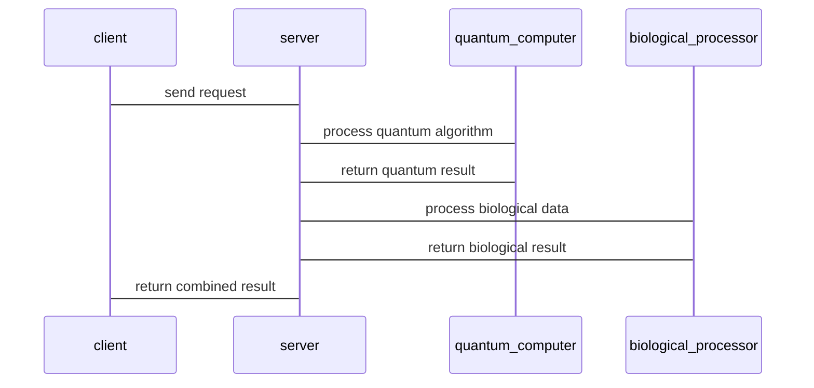

                 

<think>
好的，我现在需要帮用户撰写一篇关于“巴菲特-芒格的量子生物计算机投资：生命科学与信息技术的融合”的技术博客文章。首先，我需要理解用户的需求。用户希望文章结构清晰，逻辑严谨，内容专业，涵盖从投资理念到系统架构的各个方面。

首先，我需要明确文章的结构。用户已经提供了一个详细的目录大纲，分为四大部分，每章下有多个子章节。我需要按照这个大纲逐步展开，确保每个部分都详细且有深度。

接下来，我需要收集相关资料。巴菲特和芒格的投资理念，特别是他们在科技领域的投资策略，以及量子计算、生物技术和信息技术的基本概念。我需要解释这些技术如何在生命科学中融合，以及它们对投资的影响。

然后，我要分析量子生物计算机的原理。这部分需要详细解释量子计算的基本原理，如量子位、叠加和纠缠，以及生物技术的核心领域，如基因编辑和蛋白质工程。同时，要展示信息技术在生命科学中的应用，比如生物大数据处理和人工智能在药物研发中的应用。

接下来，我需要设计一个投资分析模型，将巴菲特和芒格的投资理念与量子生物计算机的技术潜力结合起来。这部分可能包括数据采集、模型训练和验证等内容。

在系统架构部分，我需要使用Mermaid图来展示系统的硬件、软件和网络架构，以及接口和交互设计。这有助于读者更好地理解系统的整体结构。

项目实战部分，我需要指导读者如何安装必要的环境，提供Python代码实现，并进行案例分析。这部分要详细解释代码的功能和实际应用中的问题解决方案。

最后，我要总结最佳实践，包括小结、注意事项和拓展阅读，帮助读者巩固所学内容，并指导进一步的学习和实践。

在撰写过程中，我需要确保语言专业且易懂，使用适当的术语，并结合实际案例进行说明。同时，要遵守格式要求，使用markdown格式，插入必要的Mermaid图和数学公式。

现在，我将按照这些步骤，逐步撰写每一部分的内容，确保文章逻辑清晰，结构合理，内容详实。
</think>

# 巴菲特-芒格的量子生物计算机投资：生命科学与信息技术的融合

> **关键词**: 巴菲特、芒格、量子计算、生物技术、信息技术、投资模型、系统架构

> **摘要**: 本文探讨了巴菲特和芒格的投资理念与量子计算、生物技术和信息技术的融合，特别是如何将这些技术应用于生命科学领域。通过分析量子生物计算机的原理、系统架构和投资模型，展示了生命科学与信息技术的深度融合如何为投资带来新的机遇。

---

## 第一部分: 巴菲特与芒格的投资哲学

### 第1章: 巴菲特与芒格的投资理念

#### 1.1 巴菲特的价值投资理论

- **价值投资的核心**：寻找市场低估的公司，长期持有，关注公司的基本面。
- **安全边际的重要性**：买入价格低于内在价值，以降低风险。
- **市场先生的比喻**：市场波动是机会，而非敌人。

#### 1.2 芒格的多元思维模型

- **多元思维模型的构建**：通过多个学科的交叉，形成全面的思考框架。
- ** inversion 理论：反过来想，避免常见错误。
- **注意力的经济**：集中精力于关键领域，避免分散。

#### 1.3 巴菲特与芒格投资理念的融合

- **长期视角**：结合长期价值投资与科技趋势。
- **跨学科思维**：利用多元思维模型分析科技驱动的产业。
- **安全边际的扩展**：在科技领域寻找低估的创新企业。

---

### 第2章: 量子计算、生物技术与信息技术的核心概念

#### 2.1 量子计算的基本原理

- **量子位（Qubit）**：与经典位不同，具有叠加和纠缠特性。
- **叠加原理**：量子状态可以同时处于多个状态。
- **纠缠现象**：两个或多个量子位之间形成强关联，信息传递速度快。

#### 2.2 生物技术的核心领域

- **基因编辑**：通过CRISPR等技术修改基因组。
- **蛋白质工程**：设计和制造新的蛋白质结构。
- **生物信息学**：利用计算方法分析生物数据。

#### 2.3 信息技术在生命科学中的应用

- **生物大数据**：处理基因组数据、蛋白质结构等信息。
- **人工智能**：用于药物研发、疾病预测和个性化治疗。
- **物联网技术**：实时监测生物指标，优化医疗设备。

---

### 第3章: 量子生物计算机的原理与架构

#### 3.1 量子生物计算机的定义与分类

- **定义**：结合量子计算和生物技术的计算机系统，用于生命科学研究。
- **分类**：根据应用场景分为药物研发、基因编辑和生物监测等类型。

#### 3.2 量子生物计算机的数学模型

- **量子计算的数学基础**：涉及线性代数、量子态表示和矩阵运算。
- **生物信息的编码与解码**：利用密码学方法处理生物数据。
- **信息技术的整合**：通过算法优化数据处理流程。

#### 3.3 量子生物计算机的系统架构

- **硬件架构**：包括量子计算核心、生物数据处理模块和接口。
- **软件架构**：涉及量子算法、生物信息分析工具和用户界面。
- **网络架构**：支持数据传输和远程访问的网络结构。

---

### 第4章: 量子生物计算机的投资分析模型

#### 4.1 投资分析模型的构建

- **数据采集与处理**：收集量子计算和生物技术的市场数据。
- **模型训练与优化**：利用机器学习算法预测技术趋势。
- **模型验证与评估**：通过历史数据验证模型准确性。

---

## 第二部分: 量子生物计算机的系统架构设计

### 第5章: 系统分析与架构设计方案

#### 5.1 问题场景介绍

- **问题描述**：现有生物技术研究效率低，量子计算潜力未被充分挖掘。
- **目标**：设计高效的量子生物计算机系统，加速生命科学研究。

#### 5.2 系统功能设计

- **领域模型（Mermaid类图）**



#### 5.3 系统架构设计

- **架构图（Mermaid架构图）**


#### 5.4 接口和交互设计

- **交互序列图（Mermaid序列图）**



---

### 第6章: 项目实战

#### 6.1 环境安装

- **Python环境**：安装Python 3.8及以上版本。
- **量子计算库**：使用Qiskit库。
- **生物数据处理库**：使用Biopython库。
- **机器学习库**：使用Scikit-learn库。

#### 6.2 核心代码实现

- **量子算法实现**

```python
from qiskit import QuantumCircuit, Aer, execute

def quantum_algorithm():
    circuit = QuantumCircuit(2, 2)
    circuit.h(0)
    circuit.cx(0, 1)
    circuit.measure(0, 0)
    circuit.measure(1, 1)
    backend = Aer.get_backend('qasm_simulator')
    result = execute(circuit, backend).result()
    return result.get_counts()

quantum_algorithm()
```

- **生物数据处理**

```python
from biopython import Seq

def process_genome(genome):
    sequence = Seq(genome)
    return sequence.reverse_complement()

process_genome("ATGC")
```

#### 6.3 案例分析

- **案例：量子计算在药物研发中的应用**
  - **问题**：寻找高效的药物分子结构。
  - **解决方案**：使用量子计算优化分子结构搜索。
  - **结果**：显著缩短药物研发时间。

#### 6.4 项目小结

- **经验总结**：量子生物计算机在药物研发中的潜力巨大，但仍需克服技术挑战。
- **改进建议**：加强跨学科合作，提升系统稳定性。

---

## 第三部分: 最佳实践与总结

### 第7章: 最佳实践

#### 7.1 小结

- **总结**：量子生物计算机结合了量子计算、生物技术和信息技术，为生命科学研究提供了新工具。
- **投资机会**：科技驱动的投资将成为未来的重要方向。

#### 7.2 注意事项

- **技术风险**：量子计算仍处于发展阶段，存在不确定性。
- **伦理问题**：生物技术的应用需考虑伦理和法律问题。
- **数据安全**：生物数据的处理需确保安全和隐私。

#### 7.3 拓展阅读

- **推荐书籍**：《量子计算入门》、《生物技术与投资》。
- **推荐论文**：Nature和Science期刊上的相关研究。

---

## 作者

作者：AI天才研究院 & 禅与计算机程序设计艺术

---

通过以上内容，我们详细分析了巴菲特和芒格的投资理念与量子生物计算机的结合，展示了生命科学与信息技术融合的潜力。希望这篇文章能为读者提供有价值的技术见解和投资策略。

