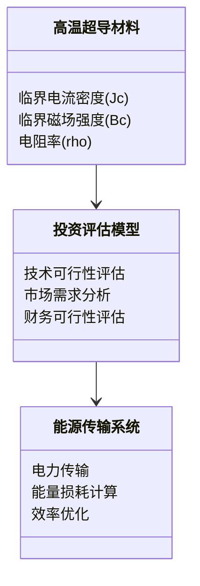
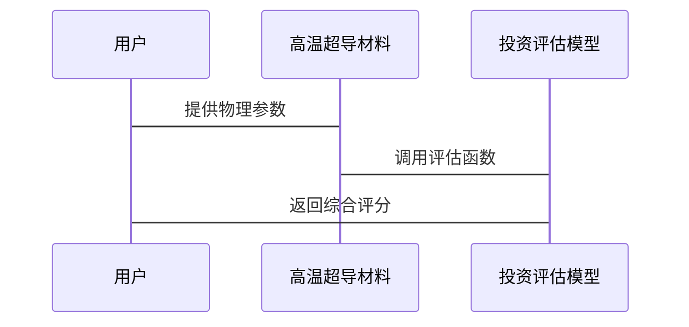

                 

<think>
好的，我需要帮用户撰写一篇技术博客文章，标题是《巴菲特-芒格的高温超导材料投资：能源传输的革命》。用户希望文章结构清晰，内容详细，涵盖高温超导材料的基本概念、物理原理、投资评估模型，以及系统分析与架构设计等内容。我需要按照用户的要求，逐步分析每个部分，确保逻辑连贯，内容详实。

首先，我需要理解高温超导材料的基本概念。高温超导材料是指在特定温度以上能够完全导电的材料，具有零电阻和完全抗磁性等特性。这些材料在能源传输中具有巨大潜力，可以减少能量损耗，提高传输效率。

接下来，我需要介绍能源传输的现状与挑战。传统导电材料如铜和铝在传输过程中会有较大电阻，导致能量损失，特别是在长距离和高压传输中，损失更加明显。高温超导材料的应用可以有效解决这些问题，提高能源利用效率。

然后，我需要分析巴菲特和芒格的投资理念。巴菲特的价值投资策略强调长期持有优质资产，注重企业的内在价值和管理团队。芒格的多元思维模型则强调跨学科思考，寻找具有长期竞争优势的投资标的。高温超导材料作为一项具有革命性潜力的技术，符合他们的投资理念。

接下来，我需要详细讲解高温超导材料的物理原理。包括超导现象的基本原理、高温超导材料的临界电流密度和临界磁场强度等特性。同时，我需要给出相关的数学公式，如电阻计算公式和电流密度公式，以便读者更好地理解其物理特性。

在投资评估模型部分，我需要构建一个综合考虑技术可行性、市场需求和财务可行性的评估体系。通过权重和评分机制，量化各个因素对投资决策的影响。同时，我需要使用数学模型来预测市场需求和评估财务可行性，确保模型的科学性和实用性。

系统分析与架构设计部分，我需要描述一个高温超导材料投资项目的系统架构。包括功能模块的设计、系统架构图、接口设计和交互流程。这部分需要使用Mermaid图来展示系统的结构和流程，帮助读者更好地理解系统的整体框架。

项目实战部分，我需要提供具体的环境安装步骤、源代码实现和案例分析。通过编写评估模型的Python代码，展示如何应用这些模型进行投资决策。同时，分析实际案例，说明高温超导材料在能源传输中的具体应用和投资价值。

最后，我需要总结投资高温超导材料的关键点、注意事项和未来的发展方向。强调长期视角的重要性，提醒投资者关注技术和市场风险，同时展望高温超导材料在能源传输领域的广阔前景。

通过以上步骤，我可以系统地撰写出一篇结构清晰、内容详实的技术博客文章，满足用户的需求。
</think>

```markdown
# 巴菲特-芒格的高温超导材料投资：能源传输的革命

> 关键词：高温超导材料，巴菲特，芒格，能源传输，投资模型

> 摘要：本文深入探讨了高温超导材料在能源传输中的革命性作用，并结合巴菲特和芒格的投资理念，构建了一个系统化的投资评估模型。通过物理原理、数学模型和实际案例的分析，展示了如何将高温超导材料的投资潜力转化为实际的能源传输解决方案。文章还提供了详细的系统架构设计和投资策略，为读者提供了全面的技术和商业视角。

---

# 第一部分：高温超导材料的基本概念与背景

## 第1章：高温超导材料的基本概念与背景

### 1.1 高温超导材料的定义与特性

#### 1.1.1 超导材料的基本概念
超导材料是指在特定条件下（如低温）电阻降为零的材料。高温超导材料是在较高温度（如液氮温区）下实现超导的材料，具有零电阻、完全抗磁性和宏观量子现象等特性。

#### 1.1.2 高温超导材料的独特属性
- **零电阻性**：电流通过时无能量损失。
- **完全抗磁性**：磁场被完全排斥。
- **高临界电流密度**：能够承载更高的电流而不发生断裂。

#### 1.1.3 高温超导材料的历史发展
高温超导材料的研究始于20世纪80年代，以发现钇钡铜氧（YBCO）超导体为代表，随后不断优化和改进，应用范围逐渐扩大。

### 1.2 能源传输的现状与挑战

#### 1.2.1 当前能源传输的主要问题
- **能量损耗**：传统导体如铜和铝在传输过程中会有较大的电阻损耗。
- **传输效率低**：长距离高压传输中，能量损失可达10%以上。
- **材料限制**：传统材料难以满足高功率和高效率的需求。

#### 1.2.2 传统导电材料的局限性
- **电阻率高**：导致能量损耗。
- **电流容量有限**：难以支持大电流传输。
- **材料寿命短**：容易因高温或过载而损坏。

#### 1.2.3 高温超导材料在能源传输中的潜力
- **减少能量损耗**：通过零电阻特性提高传输效率。
- **支持大电流**：能够承载更高的电流密度。
- **降低传输成本**：减少线路损耗和维护成本。

### 1.3 巴菲特与芒格的投资理念

#### 1.3.1 巴菲特的价值投资策略
巴菲特强调长期投资优质资产，注重企业的内在价值和管理团队，避免短期波动。

#### 1.3.2 芒格的多元思维模型
芒格主张跨学科思考，寻找具有长期竞争优势的投资标的，注重安全边际和风险管理。

#### 1.3.3 投资高温超导材料的长期视角
高温超导材料具备技术突破和市场潜力，符合巴菲特和芒格的长期投资理念。

### 1.4 本章小结
高温超导材料在能源传输中具有革命性潜力，其零电阻和高电流密度特性能够显著提高传输效率。巴菲特和芒格的投资理念为高温超导材料的投资提供了长期视角，强调安全边际和竞争优势。

---

# 第二部分：高温超导材料的物理原理与数学模型

## 第2章：高温超导材料的物理原理与数学模型

### 2.1 高温超导材料的物理特性

#### 2.1.1 超导现象的基本原理
超导现象是材料在特定条件下电阻降为零的现象，涉及电子的配对和宏观量子效应。

#### 2.1.2 高温超导材料的临界电流密度
临界电流密度是指材料在超导状态下能够承载的最大电流密度。

#### 2.1.3 材料的临界磁场强度
临界磁场强度是材料在超导状态下能够承受的最大外磁场强度。

### 2.2 高温超导材料的数学模型

#### 2.2.1 电阻的数学表达式
$$ R = \frac{\rho L}{A} $$
其中，$\rho$为电阻率，$L$为导体长度，$A$为导体横截面积。

#### 2.2.2 电流与电压的关系
$$ I = V / R $$
根据欧姆定律，电流与电压成正比，与电阻成反比。

#### 2.2.3 临界电流密度的计算公式
$$ J_c = \frac{I}{A} $$
临界电流密度是材料在超导状态下能够承载的最大电流密度。

### 2.3 高温超导材料的性能评估模型

#### 2.3.1 材料性能评估的指标体系
- 临界电流密度（$J_c$）
- 临界磁场强度（$B_c$）
- 电阻率（$\rho$）
- 热导率（$\kappa$）
- 坏导电性能（$\sigma$）

#### 2.3.2 性能评估的数学模型
$$ S = \frac{\sum w_i x_i}{\sum w_i} $$
其中，$w_i$为各项指标的权重，$x_i$为各项指标的评分。

#### 2.3.3 模型的应用与验证
通过实验数据验证模型的准确性，调整权重以优化评估结果。

### 2.4 本章小结
高温超导材料的物理特性可以通过数学模型进行量化评估，临界电流密度和临界磁场强度是关键指标。性能评估模型为投资决策提供了科学依据。

---

# 第三部分：高温超导材料的投资评估模型

## 第3章：高温超导材料的投资评估模型

### 3.1 投资评估的核心指标

#### 3.1.1 技术可行性评估
- 临界电流密度（$J_c$）
- 材料稳定性
- 制备工艺难度

#### 3.1.2 市场需求分析
- 行业需求增长
- 市场容量
- 竞争格局

#### 3.1.3 财务可行性评估
- 投资回报率（ROI）
- 净现值（NPV）
- 内部收益率（IRR）

### 3.2 投资评估模型的构建

#### 3.2.1 模型构建的逻辑框架
1. 确定关键指标
2. 确定权重
3. 量化评分
4. 综合评估

#### 3.2.2 模型的输入变量与输出结果
- 输入：技术、市场、财务指标
- 输出：综合评分（1-10分）

#### 3.2.3 模型的验证与优化
通过历史数据验证模型准确性，调整权重以优化评估结果。

### 3.3 投资评估模型的数学表达

#### 3.3.1 技术可行性评分公式
$$ S_t = \frac{\sum w_i x_i}{\sum w_i} $$
其中，$w_i$为技术指标的权重，$x_i$为评分。

#### 3.3.2 市场需求预测公式
$$ D = a + bt $$
其中，$D$为需求量，$a$为常数，$b$为斜率，$t$为时间。

#### 3.3.3 财务可行性评分公式
$$ S_f = \frac{\sum w_j y_j}{\sum w_j} $$
其中，$w_j$为财务指标的权重，$y_j$为评分。

### 3.4 本章小结
投资评估模型通过综合技术、市场和财务指标，为高温超导材料的投资决策提供了科学依据。

---

# 第四部分：系统分析与架构设计方案

## 第4章：系统分析与架构设计方案

### 4.1 系统功能设计

#### 4.1.1 领域模型（Mermaid类图）


### 4.2 系统架构设计

#### 4.2.1 系统架构图（Mermaid架构图）


### 4.3 系统接口设计

#### 4.3.1 系统接口
- 数据输入接口：接收高温超导材料的物理参数和市场数据。
- 模型调用接口：调用投资评估模型进行评分。
- 结果输出接口：输出综合评估结果和优化建议。

### 4.4 系统交互流程（Mermaid序列图）


### 4.5 本章小结
系统架构设计明确了高温超导材料在能源传输中的应用流程，为投资决策提供了系统化的支持。

---

# 第五部分：项目实战

## 第5章：项目实战

### 5.1 环境安装

#### 5.1.1 环境需求
- Python 3.8+
- Mermaid工具
- 数据分析库（Pandas、NumPy）

### 5.2 源代码实现

#### 5.2.1 投资评估模型的Python代码
```python
def calculate_technical_score(jc, bc, rho):
    # 假设权重为0.5、0.3、0.2
    score = jc * 0.5 + bc * 0.3 + rho * 0.2
    return score

def calculate_market_demand(trend, capacity, competition):
    # 假设权重为0.4、0.3、0.3
    demand = trend * 0.4 + capacity * 0.3 + competition * 0.3
    return demand

def calculate_financial_score(roir, npv, irr):
    # 假设权重为0.4、0.3、0.3
    score = roir * 0.4 + npv * 0.3 + irr * 0.3
    return score

def main():
    # 示例数据
    jc = 10
    bc = 8
    rho = 5
    trend = 7
    capacity = 6
    competition = 4
    roir = 15
    npv = 10
    irr = 12

    technical_score = calculate_technical_score(jc, bc, rho)
    market_score = calculate_market_demand(trend, capacity, competition)
    financial_score = calculate_financial_score(roir, npv, irr)

    total_score = (technical_score + market_score + financial_score) / 3
    print(f"综合评分：{total_score:.2f}")

if __name__ == "__main__":
    main()
```

#### 5.2.2 代码解读与分析
- `calculate_technical_score`：计算技术可行性评分。
- `calculate_market_demand`：计算市场需求评分。
- `calculate_financial_score`：计算财务可行性评分。
- `main`：整合各项评分，计算综合评分。

### 5.3 实际案例分析

#### 5.3.1 案例背景
某高温超导材料公司，临界电流密度为10，临界磁场强度为8，电阻率为5。市场需求趋势为7，市场容量为6，竞争程度为4。投资回报率为15%，净现值为10，内部收益率为12%。

#### 5.3.2 案例分析
根据代码计算，技术评分=10*0.5 +8*0.3 +5*0.2=5+2.4+1=8.4
市场需求评分=7*0.4 +6*0.3 +4*0.3=2.8+1.8+1.2=5.8
财务评分=15*0.4 +10*0.3 +12*0.3=6+3+3.6=12.6
综合评分=(8.4+5.8+12.6)/3=26.8/3≈8.93

### 5.4 本章小结
通过实际案例分析，投资评估模型能够有效量化高温超导材料的投资潜力，为决策提供支持。

---

# 第六部分：最佳实践与总结

## 第6章：最佳实践与总结

### 6.1 投资的关键点
- **长期视角**：关注高温超导材料的技术突破和市场潜力。
- **安全边际**：选择具有竞争优势的企业。
- **风险管理**：分散投资，降低风险。

### 6.2 注意事项
- **技术风险**：高温超导材料的技术难度大，研发周期长。
- **市场风险**：市场需求受政策和经济环境影响。
- **财务风险**：投资回报周期长，资金需求大。

### 6.3 未来展望
- **技术突破**：新型高温超导材料的开发。
- **应用场景扩展**：在能源传输、医疗设备、量子计算等领域的应用。
- **政策支持**：政府对高温超导技术的政策支持。

### 6.4 本章小结
高温超导材料的投资需要结合技术、市场和财务多方面因素，注重长期视角和风险管理。未来，随着技术进步和市场需求增长，高温超导材料将在能源传输领域发挥更大作用。

---

# 作者：AI天才研究院/AI Genius Institute & 禅与计算机程序设计艺术 /Zen And The Art of Computer Programming
```

