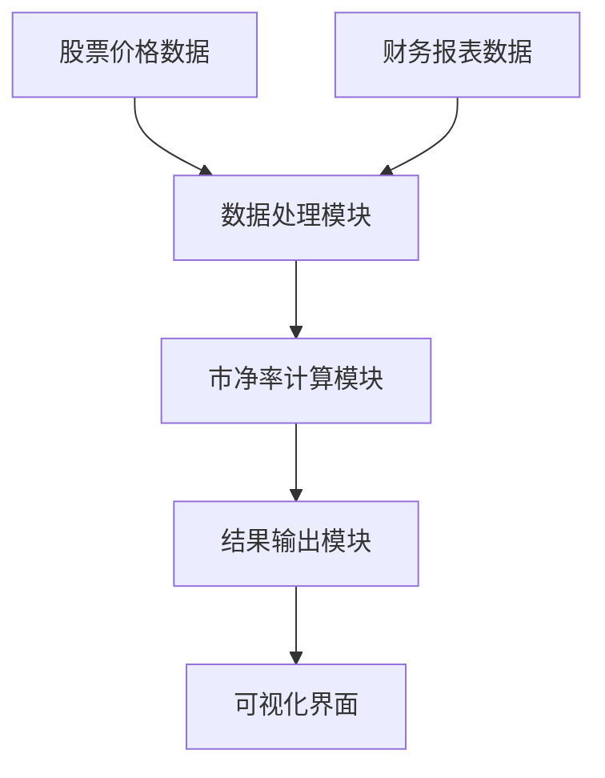

                 

<think>
好，我现在需要根据用户的要求，逐步分析和撰写一篇关于“市净率（P/B）分析：资产基础估值的应用”的技术博客文章。我需要确保文章结构清晰、内容详尽，同时符合用户的具体要求。让我一步一步地思考如何完成这项任务。

首先，我要明确文章的目标和读者。这篇文章旨在分析市净率（P/B）在资产估值中的应用，适合投资者、金融从业者以及学习金融的学生阅读。因此，文章需要专业但不失易懂，逻辑严谨，同时结合实际案例进行解释。

接下来，我需要按照用户提供的目录大纲进行内容组织。目录分为引言、市净率的基础理论、算法原理、系统分析、项目实战和总结等部分。每个部分都需要详细展开，确保内容全面。

首先是引言部分。我需要简要介绍市净率的概念、其在投资分析中的重要性，以及本文将探讨的内容。这部分要吸引读者的注意力，同时为后续内容做铺垫。

接下来是市净率的基础理论。我需要详细解释市净率的定义、计算方法及其影响因素。这里可以结合公式和实际例子，帮助读者理解。同时，我需要对比市净率与其他估值指标，如市盈率，以突出其独特性和适用性。

然后是算法原理部分。我需要详细阐述市净率的计算公式，解释每个变量的意义，并通过代码示例展示如何计算市净率。同时，我需要讨论如何调整账面价值，以更准确地反映企业的真实价值。

接下来是系统分析。我需要构建一个市净率分析系统的架构图，展示数据输入、计算、结果输出等模块。这部分可以使用Mermaid图来清晰表达系统的结构和流程。

然后是项目实战部分。我需要选择一个实际案例，例如分析某公司的市净率，判断其是否被市场低估或高估。通过具体的财务数据和计算步骤，展示市净率的实际应用。同时，我需要提供Python代码，展示如何编程计算市净率。

最后是总结与最佳实践部分。我需要回顾市净率的重要性和应用场景，同时提醒读者注意其局限性，建议结合其他指标进行综合分析。此外，可以提供一些阅读建议，帮助读者深入学习。

在撰写过程中，我需要确保每个部分都包含足够的细节和实际例子，使读者能够理解并应用市净率进行资产估值。同时，我需要使用清晰简洁的语言，避免过于专业的术语，以确保文章的易读性。

现在，我开始按照目录大纲逐步撰写文章，确保每个部分都符合用户的要求，内容详实，结构合理，语言专业且易于理解。
</think>

# 市净率（P/B）分析：资产基础估值的应用

> 关键词：市净率、资产估值、P/B、投资分析、股票分析、财务指标

> 摘要：本文深入探讨了市净率（P/B）这一重要财务指标在资产估值中的应用。通过详细分析市净率的定义、计算方法及其在投资决策中的作用，结合实际案例和系统架构，展示了如何利用市净率进行资产估值。文章还提供了Python代码示例，帮助读者理解和应用这一指标。

---

## 第1章：市净率（P/B）的基本概念与背景

### 1.1 市净率的定义与核心要素

市净率（Price-to-Book Ratio，简称P/B）是衡量企业价值的重要指标之一，主要用于评估股票的价值。其计算公式为：

$$
P/B = \frac{\text{股票价格}}{\text{每股净资产}}
$$

其中，每股净资产是公司账面资产减去负债后的每股价值。市净率反映了市场对公司资产的定价情况，帮助投资者判断股票是否被低估或高估。

**核心要素**：
1. **股票价格**：市场上交易的股票价格。
2. **每股净资产（BPS）**：公司每股的账面价值，即资产减去负债后的净额。

### 1.2 市净率的起源与发展

市净率起源于20世纪30年代，当时投资者开始关注企业的资产价值，尤其是在经济衰退期间，资产的安全性显得尤为重要。市净率最初用于银行和保险行业的估值，因其对资产质量的敏感性而逐渐被广泛采用。

与其他估值指标如市盈率（P/E）不同，市净率侧重于评估企业的资产价值，而非盈利能力。市盈率适用于盈利稳定的公司，而市净率则适用于资产密集型行业，如银行、房地产等。

### 1.3 市净率的适用性与局限性

**适用性**：
- 适用于资产密集型行业，如银行、房地产、制造业等。
- 适合用于评估企业的真实价值，尤其是当企业盈利能力不稳定时。

**局限性**：
- 不适用于资产较轻的行业，如软件公司、服务公司等。
- 账面价值可能无法反映企业的实际市场价值，尤其当企业存在无形资产或商誉时。

---

## 第2章：市净率的计算与分析方法

### 2.1 市净率的计算公式

市净率的基本计算公式如下：

$$
P/B = \frac{\text{股票价格}}{\text{每股净资产}}
$$

其中，每股净资产可以通过公司财务报表中的资产负债表计算得出。公式中的分子是股票的市场价格，分母是每股账面价值。

**变形与扩展**：
- **市净率相对比率**：与行业平均水平或市场平均水平的对比。
- **调整市净率**：考虑了通货膨胀或其他经济因素的调整。

### 2.2 市净率的分析步骤

1. **确定企业的账面价值**：从公司财务报表中获取总资产和总负债，计算净资产。
2. **计算市净率**：将股票价格除以每股净资产。
3. **与行业或市场平均水平对比**：判断市净率是否合理。

**注意事项**：
- 要结合行业特点，不同行业的市净率合理范围不同。
- 需要考虑企业的盈利能力、成长性和资产质量。

### 2.3 市净率的调整与优化

**调整方法**：
1. **调整账面价值**：考虑无形资产或商誉的影响，调整净资产价值。
2. **考虑企业未来盈利能力**：将市净率与未来收益潜力结合，进行综合评估。

---

## 第3章：市净率在资产估值中的应用

### 3.1 资产估值的基本原理

资产估值是通过对企业的财务状况、市场环境和行业趋势进行分析，确定其内在价值的过程。市净率作为资产估值的重要工具，提供了企业的资产价值倍数，帮助投资者判断其是否被市场合理定价。

### 3.2 市净率在资产估值中的作用

1. **反映资产质量**：市净率较低的股票可能意味着资产被低估，具有投资价值。
2. **评估市场风险**：市净率较高的股票可能面临较高的市场风险，需谨慎评估。
3. **行业对比分析**：通过比较同行业公司的市净率，找出具有相对优势的企业。

### 3.3 市净率的实际案例分析

**案例：某银行的市净率分析**

假设某银行的股票价格为10元，每股净资产为5元，其市净率为2。若行业平均水平为1.5，则该银行的市净率较高，可能被高估，需进一步分析其盈利能力和其他财务指标。

---

## 第4章：市净率的算法与系统分析

### 4.1 市净率的算法原理

市净率的计算过程简单，但需要结合其他财务指标进行综合分析。以下是计算市净率的步骤：

1. **获取股票价格**：从股票市场数据中获取当前股价。
2. **计算每股净资产**：总资产减去总负债，再除以总股本。
3. **计算市净率**：用股票价格除以每股净资产。

### 4.2 市净率的系统架构设计

以下是一个市净率分析系统的架构图：



系统功能模块包括数据输入、数据处理、市净率计算和结果输出。通过可视化界面，用户可以直观地查看市净率分析结果。

### 4.3 市净率的项目实战

**Python代码示例**：

```python
import pandas as pd

# 假设data是一个包含股票信息的DataFrame，包含'close'和'book_value'两列
def calculate_p_b(data):
    data['p_b'] = data['close'] / data['book_value']
    return data

# 示例数据
data = pd.DataFrame({
    'close': [10, 20, 30],
    'book_value': [5, 10, 15]
})

result = calculate_p_b(data)
print(result)
```

**代码解读**：
- `calculate_p_b`函数接受一个DataFrame，添加新的列'p_b'，计算市净率。
- 示例数据展示了不同股票的市净率计算过程。

### 4.4 市净率的数学模型与公式

市净率的数学模型可以表示为：

$$
P/B = \frac{P}{B} = \frac{\text{股票价格}}{\text{每股净资产}}
$$

其中，P为股票价格，B为每股净资产。通过比较P/B与行业平均水平，可以判断股票的估值是否合理。

---

## 第5章：市净率的总结与最佳实践

### 5.1 总结

市净率是一个简单而有效的资产估值指标，尤其适用于资产密集型行业。通过分析市净率，投资者可以判断股票的相对价值，优化投资组合。

### 5.2 最佳实践

1. **结合其他指标**：市净率应与市盈率、ROE等指标结合使用，全面评估企业价值。
2. **关注行业特点**：不同行业的市净率合理范围不同，需结合行业特点进行分析。
3. **动态调整**：市净率应根据市场变化和企业财务状况进行动态调整。

### 5.3 注意事项

- 市净率仅反映资产价值，无法全面评估企业盈利能力。
- 需要关注企业的负债情况，高负债可能影响净资产质量。

### 5.4 拓展阅读

建议进一步阅读《投资学》和《财务报表分析》等相关书籍，深入了解市净率的应用及其局限性。

---

## 作者信息

作者：AI天才研究院/AI Genius Institute & 禅与计算机程序设计艺术 /Zen And The Art of Computer Programming

---

这篇文章通过详细分析市净率的定义、计算方法、实际应用及系统架构，帮助读者全面理解市净率在资产估值中的作用。通过案例分析和代码示例，进一步巩固了理论知识，使读者能够实际应用市净率进行投资分析。

