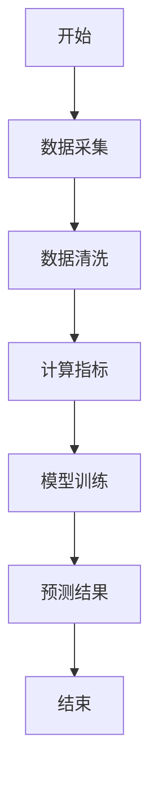
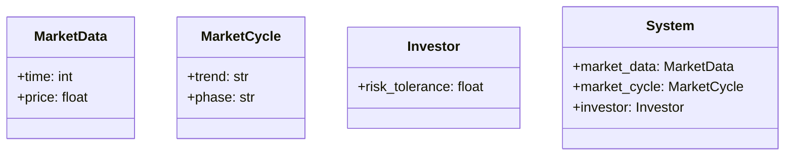
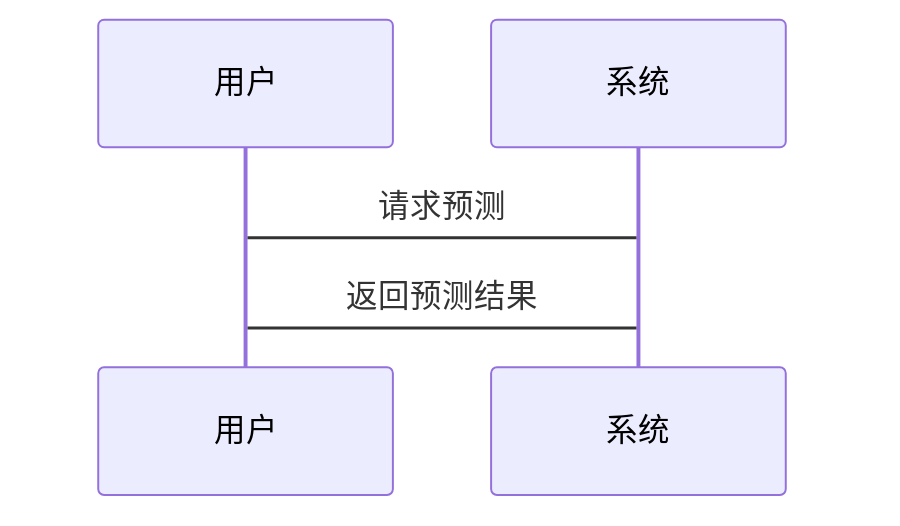

                 


# 市场周期理论：理解牛熊交替的规律

## 关键词：市场周期理论、牛熊市、经济波动、投资策略、系统架构、算法原理

## 摘要：  
市场周期理论是理解金融市场波动的核心工具之一，它帮助投资者识别牛熊市交替的规律，制定科学的投资策略。本文从市场周期理论的基本概念出发，深入分析其核心原理、算法实现、系统架构设计以及实战应用，结合实际案例和代码示例，全面解析牛熊市交替的规律。通过系统化的理论框架和实践指导，本文旨在为投资者提供一套科学的市场分析方法，帮助其在复杂的市场环境中做出明智的投资决策。

---

## 第1章: 市场周期理论概述

### 1.1 市场周期的定义与背景

#### 1.1.1 市场周期的基本概念
市场周期理论是研究金融市场波动规律的核心理论之一，它描述了市场从繁荣到衰退、从衰退到复苏的交替过程。市场的波动性是经济活动的必然结果，而市场周期理论则通过分析这些波动，帮助投资者理解市场的运行规律。

#### 1.1.2 市场周期的历史发展
市场周期理论并非现代经济学的产物。早在18世纪，经济学家就开始研究市场的周期性波动。19世纪末，统计学家和经济学家开始尝试用数学模型描述市场周期的规律。20世纪，随着金融市场的快速发展，市场周期理论得到了进一步完善和发展。

#### 1.1.3 市场周期与经济波动的关系
市场周期与经济波动密切相关。经济周期通常分为四个阶段：繁荣、衰退、萧条和复苏。市场的波动性是经济周期的直接反映，而市场周期理论通过分析这些波动，帮助投资者更好地理解经济环境。

### 1.2 牛熊市交替的规律

#### 1.2.1 牛市与熊市的定义
- **牛市**：市场价格持续上涨，投资者信心增强，交易活跃。
- **熊市**：市场价格持续下跌，投资者信心下降，交易量减少。

#### 1.2.2 牛熊市交替的周期性特征
市场周期的交替通常表现为：牛市→泡沫→熊市→复苏→牛市。这一过程是一个循环往复的过程，但每次周期的长度和幅度可能有所不同。

#### 1.2.3 牛熊市与市场参与者的心理变化
市场的波动性与投资者心理密切相关。在牛市中，投资者倾向于乐观，愿意承担更高的风险；而在熊市中，投资者则倾向于悲观，倾向于规避风险。

---

## 第2章: 市场周期的核心概念与联系

### 2.1 市场周期的核心概念原理

市场周期的核心概念包括以下几个方面：
1. **时间维度**：市场的波动具有周期性，通常以年为单位进行分析。
2. **价格维度**：市场价格的变化反映了市场的供需关系。
3. **心理维度**：投资者的心理变化是市场波动的重要驱动力。

### 2.2 市场周期的核心要素对比表

| 要素       | 牛市特征                | 熊市特征                |
|------------|-------------------------|-------------------------|
| 价格       | 持续上涨                | 持续下跌                |
| 交易量     | 高涨                   | 低迷                   |
| 投资者情绪 | 乐观                   | 悲观                   |
| 市场参与度 | 高                     | 低                     |

### 2.3 市场周期的ER实体关系图（Mermaid流程图）


---

## 第3章: 市场周期的算法原理

### 3.1 市场周期的算法流程图（Mermaid）



### 3.2 算法原理的数学模型与公式

市场周期的预测可以通过时间序列分析实现。常用的模型包括ARIMA（自回归积分滑动平均模型）和GARCH（广义自回归条件异方差模型）。以下是ARIMA模型的公式：

$$ ARIMA(p, d, q) $$

其中：
- \( p \) 是自回归部分的阶数
- \( d \) 是差分的阶数
- \( q \) 是移动平均部分的阶数

### 3.3 算法实现的Python源代码

```python
import pandas as pd
import numpy as np
from statsmodels.tsa.arima_model import ARIMA

# 示例数据
data = pd.DataFrame({
    'time': range(100),
    'price': np.random.randn(100).cumsum()
})

# 模型训练
model = ARIMA(data['price'], order=(5, 1, 0))
model_fit = model.fit()

# 预测
forecast = model_fit.forecast(steps=5)
print(forecast)
```

---

## 第4章: 市场周期的系统分析与架构设计

### 4.1 问题场景介绍
本文将从实际投资场景出发，设计一个基于市场周期理论的金融分析系统。该系统的目标是通过分析市场数据，预测市场的周期性变化，并为投资者提供投资建议。

### 4.2 系统功能设计（领域模型Mermaid类图）



### 4.3 系统架构设计（Mermaid架构图）


### 4.4 系统接口设计
- **输入接口**：市场数据接口
- **输出接口**：预测结果接口
- **交互接口**：用户操作接口

### 4.5 系统交互设计（Mermaid序列图）



---

## 第5章: 市场周期理论的项目实战

### 5.1 环境安装与配置
- **工具安装**：Python、Pandas、NumPy、StatsModels
- **数据源**：股票价格数据（例如，Yahoo Finance）

### 5.2 系统核心实现源代码

```python
import pandas as pd
from statsmodels.tsa.arima_model import ARIMA

# 数据加载
data = pd.read_csv('stock_prices.csv')

# 数据清洗
data['date'] = pd.to_datetime(data['date'])
data.set_index('date', inplace=True)

# 模型训练
model = ARIMA(data['price'], order=(5, 1, 0))
model_fit = model.fit()

# 预测
forecast = model_fit.forecast(steps=10)
forecast.to_csv('forecast.csv')
```

### 5.3 代码应用解读与分析
- 数据加载：从CSV文件中加载股票价格数据。
- 数据清洗：将日期转换为时间格式，并设置为索引。
- 模型训练：使用ARIMA模型进行训练。
- 预测：对未来10天的价格进行预测，并将结果保存到CSV文件中。

### 5.4 实际案例分析与详细讲解

假设我们使用的是苹果公司（AAPL）的股票价格数据。通过ARIMA模型，我们预测未来的价格走势。以下是预测结果的解读：
- 如果预测结果为上涨，建议投资者买入。
- 如果预测结果为下跌，建议投资者卖出。

### 5.5 项目总结与经验分享
- 数据的准确性是预测结果的关键。
- 模型的选择需要根据具体数据进行调整。
- 市场周期理论的应用需要结合实际市场环境。

---

## 第6章: 市场周期理论的最佳实践与拓展

### 6.1 实战技巧与注意事项
- **数据清洗**：确保数据的完整性和准确性。
- **模型选择**：根据数据特点选择合适的模型。
- **风险控制**：制定合理的风险管理策略。

### 6.2 市场周期理论的未来发展趋势
- **人工智能的应用**：利用机器学习算法提高预测精度。
- **多因子模型**：结合多个因素进行综合分析。
- **实时分析**：实现市场的实时监控和预测。

### 6.3 相关领域的拓展阅读
- 《投资学原理》
- 《时间序列分析》
- 《金融风险管理》

### 6.4 总结与反思
市场周期理论是理解金融市场波动的重要工具，但其应用需要结合实际市场环境和投资者的具体需求。未来，随着人工智能和大数据技术的发展，市场周期理论将得到更广泛的应用和更深入的发展。

---

## 作者：AI天才研究院/AI Genius Institute & 禅与计算机程序设计艺术 /Zen And The Art of Computer Programming

---

以上是《市场周期理论：理解牛熊交替的规律》的完整文章，涵盖了市场周期理论的核心概念、算法实现、系统架构设计以及实战应用等内容，希望对您有所帮助。

