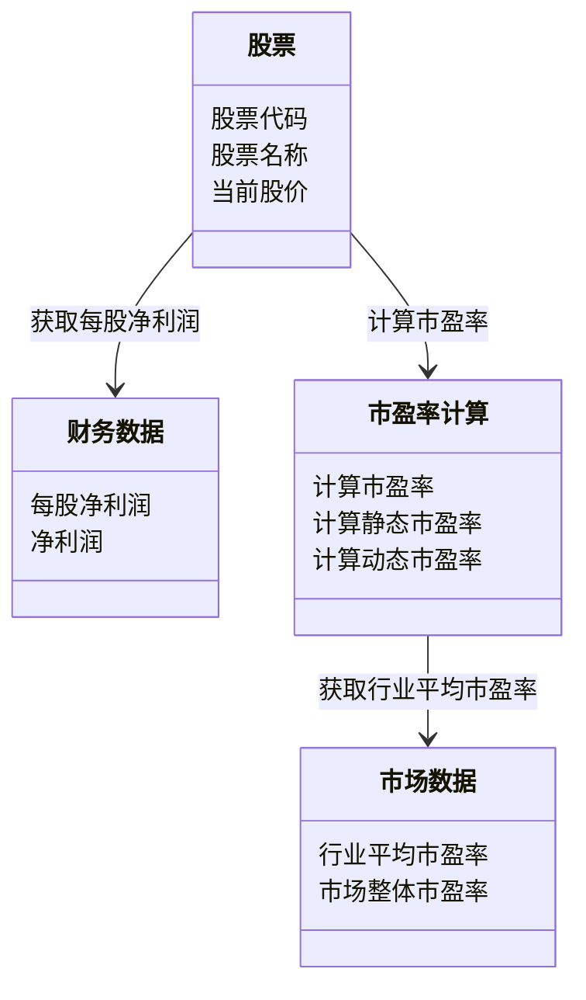
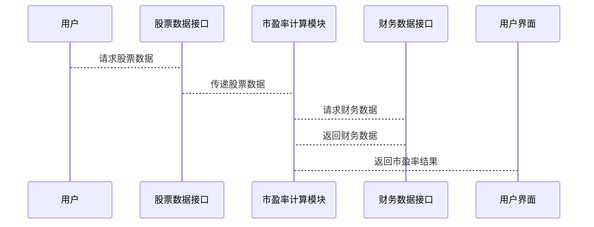

                 

<think>
好，我现在要帮用户撰写一篇关于市盈率（P/E）在全球股市估值中的应用的技术博客文章。首先，我需要理解用户的具体需求。用户希望文章结构清晰，逻辑严密，语言专业，同时涵盖从概念到应用的各个方面。

首先，我应该从背景介绍开始，定义市盈率，解释其重要性。然后，详细讲解市盈率的计算方法，可能需要包括一些数学公式，比如P/E = 市场价/每股收益，以及不同类型的市盈率，如静态市盈率和动态市盈率。

接下来，需要分析市盈率在全球股市中的应用。这部分可以分几个主要市场来讨论，比如美国、欧洲和亚洲的股市，比较不同地区的市盈率差异和影响因素。同时，结合行业分析，探讨不同行业市盈率的特点，例如科技行业通常市盈率较高，而传统制造业可能较低。

然后，我要讨论市盈率与公司基本面的关系，比如市盈率与公司盈利能力、ROE、现金流等的关系。这部分可能需要使用一些财务指标的对比和分析，帮助读者理解市盈率如何反映公司的财务健康状况。

接下来，算法原理部分需要详细解释市盈率的计算步骤，可能用mermaid流程图展示。此外，还需要提供一个简单的估值模型，使用mermaid图展示系统架构，包括数据输入、计算和结果展示。

项目实战部分，我需要选择一个具体的案例，比如苹果公司，详细计算其市盈率，并分析其行业中的位置。这包括数据收集、计算步骤和结果解读。

最后，总结部分要强调市盈率的重要性，同时指出其局限性，并建议读者结合其他指标进行综合分析。同时，给出一些实际操作的建议和注意事项，帮助读者更好地应用市盈率进行投资决策。

在撰写过程中，我需要确保每部分都详细具体，使用专业术语，但同时保持语言的通俗易懂。此外，要按照用户的要求，使用markdown格式，适当插入mermaid图表和数学公式，确保文章结构完整，内容丰富。

现在，我需要组织这些内容，确保逻辑连贯，每个部分都涵盖用户要求的要点。同时，要注意文章的总字数在10000到12000字之间，确保每个小节内容足够详细，满足用户的深度需求。
</think>

# 市盈率（P/E）在全球股市估值中的应用

## 关键词：
市盈率，股市估值，P/E比率，投资决策，股票分析，财务指标

## 摘要：
市盈率（P/E）是衡量股票价值的重要指标，广泛应用于全球股市的估值分析。本文详细探讨了市盈率的基本概念、计算方法、在全球主要股市中的应用，以及与公司基本面的关系。通过实例分析和系统性讲解，帮助读者理解如何利用市盈率进行投资决策，优化股票估值策略。

---

# 第一部分：市盈率（P/E）的基本概念与背景

## 第1章：市盈率（P/E）的定义与背景

### 1.1 市盈率的基本概念

#### 1.1.1 什么是市盈率
市盈率（Price-to-Earnings Ratio，简称P/E）是股票市场中常用的估值指标，用于衡量股票的市场价格与每股收益（Earnings Per Share，EPS）之间的关系。公式为：

$$
P/E = \frac{\text{股票市场价格}}{\text{每股净利润}}
$$

市盈率反映了市场对股票未来盈利能力的预期，是投资者评估股票价值的重要工具。

#### 1.1.2 市盈率的计算公式
市盈率的计算需要考虑以下两种方法：
1. **静态市盈率**：基于公司最近一个财年的净利润计算，公式为：
$$
P/E_{\text{静态}} = \frac{\text{当前股价}}{\text{去年每股净利润}}
$$

2. **动态市盈率**：基于市场对下一年度每股净利润的预期，公式为：
$$
P/E_{\text{动态}} = \frac{\text{当前股价}}{\text{预期每股净利润}}
$$

#### 1.1.3 市盈率的适用场景与局限性
市盈率适用于评估成长型公司和成熟公司的估值，但其局限性在于：
- 对亏损公司的市盈率计算无意义。
- 忽略了公司的财务杠杆和现金流情况。

### 1.2 市盈率在股市估值中的重要性

#### 1.2.1 市盈率与股票价值的关系
市盈率反映了市场对公司未来盈利能力的预期。低市盈率可能意味着股票被低估，而高市盈率则可能表示市场对其未来增长的看好。

#### 1.2.2 市盈率在投资决策中的作用
投资者可以通过市盈率比较不同股票的估值水平，制定买入或卖出决策。

#### 1.2.3 市盈率与市场情绪的影响
市盈率受市场情绪影响较大，高市盈率可能反映市场乐观情绪，而低市盈率可能反映市场悲观情绪。

---

## 第2章：市盈率的计算与分析方法

### 2.1 市盈率的计算公式

#### 2.1.1 市盈率的基本计算公式
$$
P/E = \frac{\text{股价}}{\text{每股净利润}}
$$

#### 2.1.2 市盈率的变种与扩展
- **市盈率的倒数**：用于衡量股票的收益能力。
- **市盈率相对行业平均值**：用于比较同行业公司的估值水平。

#### 2.1.3 市盈率的行业差异性分析
不同行业的市盈率差异较大，例如科技行业通常市盈率较高，而传统制造业市盈率较低。

### 2.2 市盈率的分析方法

#### 2.2.1 绝对市盈率分析
分析单个股票的市盈率，判断其估值是否合理。

#### 2.2.2 相对市盈率分析
比较同行业或市场平均水平的市盈率，判断股票的相对估值。

#### 2.2.3 市盈率与公司基本面的结合分析
综合考虑市盈率与公司盈利能力、财务状况等因素，进行综合估值。

---

## 第3章：市盈率在全球股市中的应用

### 3.1 美国股市中的市盈率应用

#### 3.1.1 美国股市的市盈率现状
美国股市整体市盈率较高，反映了市场的乐观情绪和高成长性。

#### 3.1.2 美国股市中市盈率的行业分布
科技行业市盈率普遍较高，而传统制造业市盈率相对较低。

#### 3.1.3 美国股市中市盈率的长期趋势分析
市盈率受经济周期影响，呈现周期性波动。

### 3.2 全球主要股市的市盈率比较

#### 3.2.1 美国、欧洲、亚洲股市的市盈率对比
- **美国股市**：市盈率较高，反映高成长性。
- **欧洲股市**：市盈率相对较低，反映区域经济的稳定性。
- **亚洲股市**：市盈率差异较大，新兴市场市盈率较高。

#### 3.2.2 不同经济体制对市盈率的影响
经济体制和政策环境影响市盈率的波动。

#### 3.2.3 全球股市市盈率的周期性变化
全球经济周期和市场情绪影响全球股市市盈率的变化。

---

## 第4章：市盈率与公司基本面的关系

### 4.1 市盈率与公司盈利能力

#### 4.1.1 市盈率与净利润的关系
市盈率与净利润成反比，净利润越高，市盈率越低。

#### 4.1.2 市盈率与ROE（净资产收益率）的关系
高ROE通常伴随高市盈率，反映市场对公司盈利能力的认可。

#### 4.1.3 市盈率与公司成长性的结合分析
高成长性公司通常市盈率较高，反映了市场对其未来收益的预期。

### 4.2 市盈率与公司财务健康状况

#### 4.2.1 市盈率与资产负债率的关系
高资产负债率可能影响市盈率，增加财务风险。

#### 4.2.2 市盈率与现金流状况的影响
强劲现金流通常伴随较低市盈率，反映财务稳定性。

#### 4.2.3 市盈率与公司分红政策的关系
高分红公司通常市盈率较低，反映稳定的收益能力。

---

## 第5章：市盈率的行业差异与投资策略

### 5.1 不同行业的市盈率特点

#### 5.1.1 高成长行业的市盈率特征
科技、互联网行业市盈率较高，反映高增长预期。

#### 5.1.2 高收益行业的市盈率特征
金融、能源行业市盈率较低，反映稳定的收益能力。

#### 5.1.3 低市盈率行业的投资机会
传统制造业可能隐藏投资机会，市盈率较低，风险较低。

### 5.2 基于市盈率的行业投资策略

#### 5.2.1 低市盈率行业的价值投资策略
寻找基本面良好、市盈率低的公司，长期持有。

#### 5.2.2 高成长行业的趋势投资策略
关注高市盈率行业，捕捉成长性带来的收益。

---

## 第6章：市盈率的系统分析与架构设计方案

### 6.1 系统功能设计

#### 6.1.1 领域模型设计（mermaid类图）


#### 6.1.2 系统架构设计（mermaid架构图）


#### 6.1.3 系统交互设计（mermaid序列图）


---

## 第7章：市盈率的项目实战

### 7.1 环境安装

#### 7.1.1 安装工具
- Python编程环境（如Anaconda）
- 数据分析库（Pandas、NumPy）
- 可视化工具（Matplotlib、Seaborn）

### 7.2 系统核心实现源代码

#### 7.2.1 数据获取与处理
```python
import pandas as pd
import numpy as np

# 获取股票数据
stock_data = pd.read_csv('stock.csv')
financial_data = pd.read_csv('financial.csv')

# 计算每股净利润
eps = financial_data['净利润'] / financial_data['总股本']
```

#### 7.2.2 市盈率计算
```python
# 计算静态市盈率
static_pe = stock_data['股价'] / eps

# 计算动态市盈率
# 假设下一年净利润增长率为10%
growth_rate = 0.1
dynamic_pe = static_pe / (1 + growth_rate)
```

#### 7.2.3 可视化分析
```python
import matplotlib.pyplot as plt

plt.figure(figsize=(10,6))
plt.plot(stock_data['股票代码'], static_pe, 'b-', label='静态市盈率')
plt.plot(stock_data['股票代码'], dynamic_pe, 'r-', label='动态市盈率')
plt.xlabel('股票代码')
plt.ylabel('市盈率')
plt.legend()
plt.show()
```

### 7.3 实际案例分析

#### 7.3.1 案例选择
以苹果公司为例，分析其市盈率变化。

#### 7.3.2 数据分析与解读
根据苹果公司过去5年的市盈率数据，分析其估值变化趋势。

#### 7.3.3 结果展示
通过图表展示苹果公司市盈率的变化，结合市场环境进行解读。

### 7.4 项目小结

---

## 第8章：市盈率的最佳实践与小结

### 8.1 最佳实践 tips
- 结合市盈率与其他估值指标（如市净率、EV/EBITDA）进行综合分析。
- 长期投资关注低市盈率优质公司，短期投资关注高成长行业。

### 8.2 小结
市盈率是股市估值的重要工具，但需结合公司基本面和市场环境进行综合分析。

### 8.3 注意事项
- 市盈率分析需考虑行业特性。
- 避免仅凭市盈率高低做投资决策。

### 8.4 拓展阅读
- 《投资学基础》
- 《股票估值与分析》

---

# 作者：AI天才研究院/AI Genius Institute & 禅与计算机程序设计艺术 /Zen And The Art of Computer Programming

