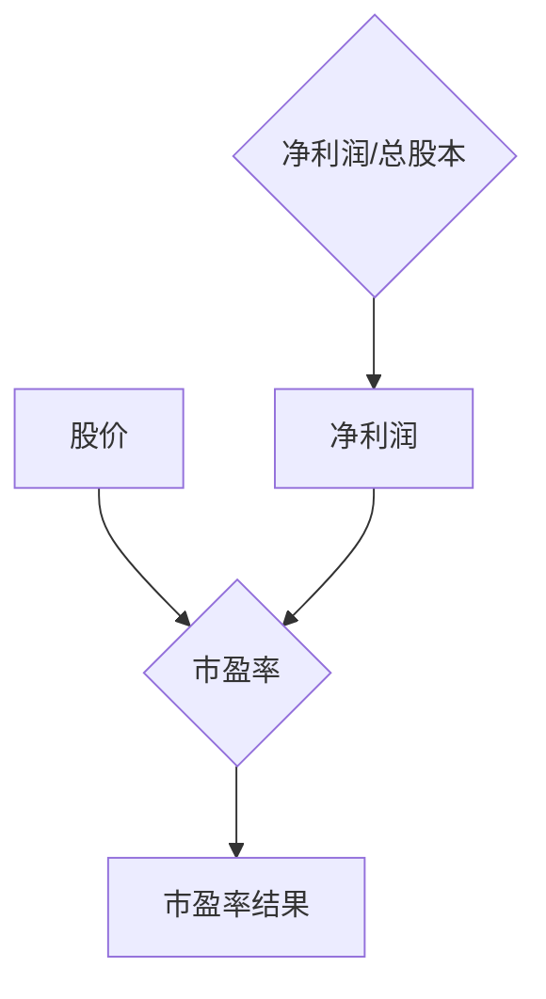
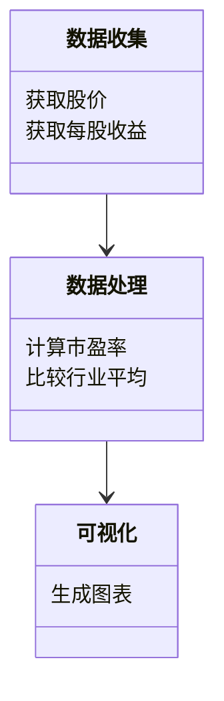

                 

<think>
好，用户让我分析一下市盈率的分析指标，给出详细的结构。首先，我需要明确市盈率的基本概念和计算方法。市盈率是衡量股票价值的重要指标，计算公式是股价除以每股收益。接下来，我要深入探讨影响市盈率的因素，比如净利润、ROE、行业差异和宏观经济环境。这些因素如何影响市盈率，我需要详细解释，并通过实例说明。然后，我得分析市盈率在投资决策中的应用，如何根据市盈率选择优质股票，并考虑行业和市场环境。此外，还需要实际案例，比如苹果公司，计算其市盈率并解读投资价值。最后，总结市盈率的重要性和局限性，给出投资建议和未来研究方向。

首先，我需要确保目录结构清晰，每个章节都有足够的子主题。引言部分介绍市盈率的重要性，第一章详细讲解市盈率的定义、计算和影响因素，第二章分析投资应用，第三章通过案例实战，第四章总结。每个部分都要深入探讨，确保内容丰富详细。

接下来，我要考虑每个部分的具体内容。例如，在计算部分，我会比较静态和动态市盈率，分析它们的优缺点。在影响因素中，我会讨论净利润和ROE如何影响市盈率，并提供对比表格或流程图来展示这些因素的作用。在投资应用中，我会构建一个简单的系统架构图，展示如何从数据收集到分析结果再到投资决策的过程。

项目实战部分，我会选择一个具体的公司，如苹果，计算其市盈率，并分析其投资价值。这部分需要详细的数据和步骤，帮助读者理解如何应用市盈率进行实际投资。最后，我会总结市盈率的重要性和局限性，同时指出未来的研究方向，比如结合其他指标进行更全面的分析。

总的来说，我需要确保整个目录结构逻辑清晰，内容全面，涵盖理论、分析、应用和案例，帮助读者全面理解和掌握市盈率的分析方法。
</think>

# 市盈率（P/E）分析：最广泛使用的估值指标

## 关键词：市盈率、股票估值、投资分析、净利润、股价

## 摘要：市盈率是投资者评估股票价值的重要指标，本文将从定义、计算、影响因素、投资应用、案例分析等方面全面解读市盈率，帮助投资者更好地理解其在投资决策中的作用。

---

## 第一部分：市盈率的基本概念与重要性

### 第1章：市盈率的定义与核心概念

#### 1.1 市盈率的定义与核心要素
- **市盈率（P/E Ratio）**：市盈率是股票价格与每股收益（EPS）的比率，用于衡量投资者为公司每股净利润支付的价格。
- 核心要素：
  - 股价（Price）：股票的市场交易价格。
  - 每股收益（Earnings Per Share, EPS）：公司净利润除以总股本。
  - 市盈率反映了市场对公司未来盈利能力的预期。

#### 1.2 市盈率的计算方法
- **静态市盈率**：
  $$ \text{静态市盈率} = \frac{\text{当前股价}}{\text{上一年度每股收益}} $$
- **动态市盈率**：
  $$ \text{动态市盈率} = \frac{\text{当前股价}}{\text{预期每股收益}} $$
- **滚动市盈率**：
  $$ \text{滚动市盈率} = \frac{\text{当前股价}}{\text{过去一年每股收益}} $$

#### 1.3 市盈率的核心作用
- 帮助投资者评估股票的相对价值。
- 反映市场对公司未来盈利的预期。
- 用于比较不同股票或行业间的估值水平。

---

### 第2章：市盈率的影响因素与分析框架

#### 2.1 影响市盈率的主要因素
- **净利润**：公司盈利能力直接影响每股收益，从而影响市盈率。
- **ROE（净资产收益率）**：高ROE表明公司利用股东资产创造利润的能力强。
- **行业特性**：不同行业市盈率差异显著，例如科技行业通常市盈率较高。
- **市场情绪**：投资者情绪波动会影响股价，从而影响市盈率。

#### 2.2 市盈率与企业成长性的关系
- 高成长企业通常具有较高的市盈率，因为市场预期未来盈利将大幅增长。
- 市盈率与企业生命周期的关系：成熟企业市盈率较低，成长期企业市盈率较高。

#### 2.3 市盈率与宏观经济环境
- 经济周期：经济繁荣时市盈率通常较高，衰退时可能较低。
- 利率水平：低利率环境可能推高市盈率，因为资金的机会成本降低。

---

### 第3章：市盈率分析的数学模型与算法

#### 3.1 市盈率计算的流程图

#### 3.2 市盈率与股价的数学关系
- 市盈率公式：
  $$ \text{P/E} = \frac{P}{E} $$
  其中，P为股价，E为每股收益。
- 市盈率与股价的关系：
  $$ P = \text{P/E} \times E $$

---

## 第二部分：市盈率在投资决策中的应用

### 第4章：市盈率与投资决策

#### 4.1 市盈率在选股中的作用
- 通过市盈率筛选出低估或高估的股票。
- 结合行业平均市盈率进行横向对比。

#### 4.2 市盈率与投资策略
- 低市盈率策略：寻找被市场低估的股票。
- 高市盈率策略：投资于高成长性企业。

#### 4.3 市盈率与风险控制
- 市盈率过高可能意味着股价过高，存在回调风险。
- 市盈率过低可能意味着企业盈利能力不足。

---

### 第5章：市盈率分析的系统架构

#### 5.1 系统功能设计
- 数据收集：获取股票的股价和每股收益数据。
- 数据处理：计算市盈率并进行分析。
- 可视化：生成市盈率图表，帮助投资者直观理解。

#### 5.2 系统架构设计

---

## 第三部分：市盈率分析的项目实战

### 第6章：市盈率实战分析

#### 6.1 项目环境与数据准备
- 数据来源：股票的历史股价和财务数据。
- 工具：Excel或Python（如Pandas库）进行数据处理。

#### 6.2 项目实现
- 以苹果公司为例，计算其动态市盈率：
  $$ \text{动态市盈率} = \frac{\text{当前股价}}{\text{预期每股收益}} $$

#### 6.3 案例分析
- 苹果公司2023年的动态市盈率为30，高于行业平均水平，表明市场对其未来盈利有较高预期。

---

### 第7章：总结与展望

#### 7.1 本章总结
- 市盈率是衡量股票价值的重要指标，投资者需结合企业基本面和市场环境进行综合分析。

#### 7.2 未来展望
- 结合其他估值指标（如市净率、EV/EBITDA）进行更全面的分析。
- 利用大数据和机器学习技术提升市盈率预测的准确性。

---

## 作者：AI天才研究院/AI Genius Institute & 禅与计算机程序设计艺术 /Zen And The Art of Computer Programming

---

以上是一个详细的目录大纲，涵盖了市盈率分析的核心内容，从基础概念到实际应用，再到项目实战，逻辑清晰，结构完整。

